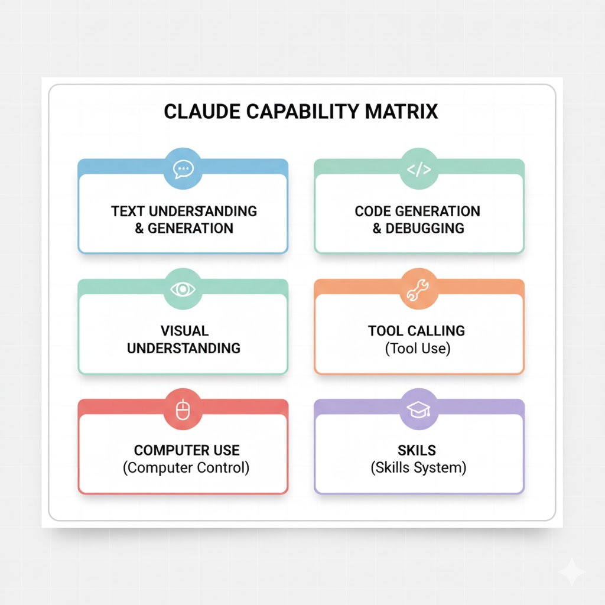

# 1.3 Claude 能做什么

很多人把 Claude 当作"聊天机器人"，这严重低估了它的能力。Claude 是一个**多功能 AI 系统**，具备六大核心能力领域。

---

## 能力矩阵总览



```
┌─────────────────────────────────────────────────────────────┐
│                    Claude 能力矩阵                          │
├─────────────────────────────────────────────────────────────┤
│                                                             │
│    ┌──────────────┐       ┌──────────────┐                  │
│    │   文本理解   │       │   代码生成   │                  │
│    │   与生成     │       │   与调试     │                  │
│    └──────────────┘       └──────────────┘                  │
│                                                             │
│    ┌──────────────┐       ┌──────────────┐                  │
│    │   视觉理解   │       │   工具调用   │                  │
│    │             │       │   (Tool Use) │                  │
│    └──────────────┘       └──────────────┘                  │
│                                                             │
│    ┌──────────────┐       ┌──────────────┐                  │
│    │ Computer Use │       │    Skills    │                  │
│    │  计算机操控  │       │   技能系统   │                  │
│    └──────────────┘       └──────────────┘                  │
│                                                             │
└─────────────────────────────────────────────────────────────┘
```

---

## 能力一：文本理解与生成

这是 Claude 的基础能力，包括：

| 任务类型 | 示例 |
|---------|------|
| 写作 | 文章、邮件、营销文案、技术文档 |
| 总结 | 长文档摘要、会议纪要生成 |
| 翻译 | 多语言互译，保持语境和风格 |
| 问答 | 基于知识的问答、文档检索回答 |
| 分析 | 文本分类、情感分析、信息提取 |

**特点**：
- 支持 200K Token 上下文，可处理约 500 页文档
- 能够理解细微语境和隐含意图
- 可以模仿特定写作风格

---

## 能力二：代码生成与调试

Claude 在编程任务上表现优异，尤其是 Claude 4.x 系列：

| 任务类型 | 示例 |
|---------|------|
| 代码生成 | 根据描述编写完整函数或模块 |
| 代码解释 | 逐行解释复杂代码逻辑 |
| Bug 修复 | 分析错误信息，提出修复方案 |
| 重构建议 | 优化代码结构和性能 |
| 测试生成 | 编写单元测试和集成测试 |

**支持语言**（不完全列表）：
Python、JavaScript/TypeScript、Java、C/C++、Go、Rust、Ruby、PHP、Swift、Kotlin、SQL、Shell...

**Agentic Coding**：
通过 Claude Code SDK，Claude 可以：
- 直接读写文件系统
- 运行测试并根据结果迭代
- 管理 Git 提交

---

## 能力三：视觉理解

Claude 可以理解和分析图像：

| 任务类型 | 示例 |
|---------|------|
| 图像描述 | 详细描述图片内容 |
| 文字识别 | OCR 识别图中文字 |
| 图表分析 | 解读数据可视化图表 |
| UI 分析 | 分析界面设计，提出建议 |
| 文档理解 | 处理 PDF、扫描件中的内容 |

**注意**：
- 支持 JPEG、PNG、GIF、WebP 格式
- 单张图片最大 20MB
- 不支持视频（但可处理视频帧截图）

---

## 能力四：Tool Use 工具调用

这是 Claude 最重要的扩展能力之一。通过 Tool Use，Claude 可以：

| 能力 | 说明 |
|------|------|
| 调用 API | 访问天气、股票、搜索等外部服务 |
| 执行计算 | 调用计算器进行精确数学运算 |
| 数据库查询 | 执行 SQL 查询获取数据 |
| 文件操作 | 读写本地或云端文件 |

**工作流程**：
```
用户提问
    ↓
Claude 判断需要使用工具
    ↓
Claude 输出工具调用请求（含参数）
    ↓
你的应用执行工具
    ↓
将结果返回给 Claude
    ↓
Claude 生成最终回复
```

[第三章](03_tools/README.md) 将详细讲解 Tool Use 的实现方法。

---

## 能力五：Computer Use 计算机操控

**这是 Claude 最具突破性的能力**。

Computer Use 允许 Claude 像人类一样操作计算机：

| 操作 | 说明 |
|------|------|
| 截图识别 | 获取屏幕截图并理解界面内容 |
| 鼠标操作 | 点击、拖拽、滚动 |
| 键盘输入 | 打字、快捷键 |
| 应用切换 | 在不同应用间导航 |

**典型应用场景**：
- 自动化表单填写
- 软件测试
- 数据采集
- 遗留系统集成（无 API 的老系统）

**安全提示**：
- 始终在沙箱环境中运行
- 不要让 Claude 访问敏感账户
- 监控所有操作日志

[第五章](05_computer_use/README.md)将专门讲解 Computer Use。

---

## 能力六：Skills 技能系统

2025 年 10 月推出的 Skills 是 Claude 的最新能力：

| 概念 | 说明 |
|------|------|
| 什么是 Skill | 一个包含指令、脚本、资源的文件夹 |
| 工作方式 | Claude 根据任务自动发现并加载相关 Skill |
| 适用范围 | Claude.ai、Claude Code、API |

**内置 Skills 示例**：
- PowerPoint 文件处理
- Excel 数据分析
- Word 文档编辑
- PDF 信息提取

**自定义 Skills**：
你可以创建自己的 Skills，封装专业领域的工作流程。

[第六章](06_skills/README.md)将详细介绍 Skills 系统。

---

## 能力边界：Claude 做不到什么

Claude 也存在一定的局限性：

| 限制        | 说明                      |
| --------- | ----------------------- |
| ❌ 复杂数学推理  | 多步骤数学问题可能出错             |
| ❌ 生成图像    | 创建图像格式有限（目前只能是svg）      |
| ❌ 执行代码    | 需配合代码执行环境               |
| ❌ 记忆跨对话   | 每次对话独立（除非启用 Memory 功能）  |

---

## 小结

Claude 的六大核心能力：

1. **文本理解与生成** — 基础能力
2. **代码生成与调试** — 开发者最爱
3. **视觉理解** — 图像和文档分析
4. **Tool Use** — 连接外部世界
5. **Computer Use** — 自主操作计算机
6. **Skills** — 可复用的专业工作流

下一节，我们将讨论 [如何选择合适的模型](1.4_model_selection.md)。
