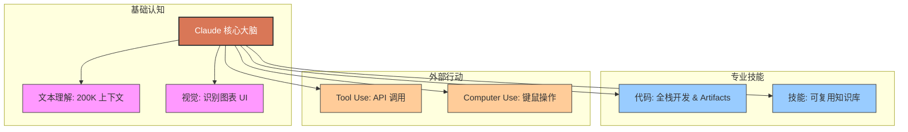

## 1.3 Claude 能做什么：六大核心能力

很多人初次接触 AI 时，往往只把它们当作聊天机器人。这就像是买了一台超级计算机却只用它来玩扫雷。Claude 不仅仅是一个会说话的程序，它是一个**多模态的智能代理系统 (Multimodal Intelligent Agent)**。

在 2025 年的视⻆下，Claude 的能力版图可以概括为六大核心支柱。

### 1.3.1 文本理解与生成 (Text Capabilities)

这是 Claude 的基本功，但它不仅限于“写文章”。

*   **长文档分析 (Long-context Understanding)**：
    凭借 200K 甚至更大的上下文窗口，Claude 可以“一口气”读完几百页的财报、法律文书或技术白皮书。它不仅能总结摘要，还能进行跨段落的逻辑推理。
    > *示例*：上传 10 份竞品的年报，让 Claude 生成一份横向对比的财务分析表格。
*   **细微语境捕捉 (Nuance)**：
    Claude 以“文笔细腻”著称。它能精准捕捉文字背后的情感色彩、讽刺意味或文化隐喻。这使得它在文学创作、公关稿撰写和情感陪伴场景下表现优异。
*   **多语言翻译**：
    它不是简单的词对词翻译，而是基于语义的“本地化”。它能处理日语的敬语、中文的成语以及编程领域的专业术语。

### 1.3.2 代码生成与工程 (Coding & Engineering)

对于开发者来说，Claude 3.5 Sonnet 及后续版本已经是公认的 **Best Coding LLM**。

*   **全栈开发**：从 React 前端组件到 Python 后端 API，再到 Dockerfile 和 Kubernetes 配置，Claude 能编写可运行的完整代码片段。
*   **遗留代码重构**：扔给它一段没有注释、变量名混乱的 10 年前的 Java 代码，它可以分析逻辑、添加注释，并将其重构为现代的 Kotlin 语法。
*   **Artifacts 实时预览**：
    这是 Claude 最具杀伤力的特性。当要求“写一个贪吃蛇游戏”或“画一个销售漏斗图”时，它生成的 HTML/JS 代码会直接在侧边栏渲染成可交互的应用。无需复制粘贴代码到本地运行，所见即所得。

### 1.3.3 视觉与多模态 (Vision)

Claude 拥有极强的“眼睛”。

*   **图表转数据**：上传一张复杂的柱状图或销售仪表盘截图，Claude 可以直接将其转化为 JSON 数据或 Markdown 表格。
*   **UI/UX 设计辅助**：给它看一张手绘的网页草图，它可以直接生成对应的 HTML/Tailwind CSS 代码。
*   **视觉问答**：拍一张冰箱里食材的照片，问它“今晚能做什么菜？”，或者拍一张报错的电脑屏幕，问它“这是什么错误？”。

### 1.3.4 工具使用 (Tool Use / Function Calling)

这是 Claude 走出“聊天框”，连接现实世界的桥梁。
这一点在[第三章](../03_tools/README.md)有详细讲解，这里简要概述：

通过 Tool Use，Claude 可以：
*   **实时联网**：调用 Google Search API 获取今日新闻。
*   **操作业务系统**：连接 CRM 查询客户资料，连接 Jira 创建工单。
*   **精准计算**：遇到复杂数学题，自动调用 Python 代码进行计算，而不是瞎猜。

### 1.3.5 计算机使用 (Computer Use)

这被认为是 **Agentic AI (代理式 AI)** 的终极形态之一。

在 2024 年底，Anthropic 赋予了 Claude 直接控制鼠标和键盘的能力。
*   **工作原理**：Claude 像人类一样“看”屏幕截图，计算出“应该点击坐标 (x, y)”，并发送指令给虚拟桌面。
*   **应用场景**：
    *   **在旧软件上工作**：很多企业内部系统没有 API，只有古老的 Windows 界面。Claude 可以像人一样点击菜单、输入数据、导出报表。
    *   **跨应用工作流**：从 Excel 复制数据 -> 打开浏览器 -> 登录后台 -> 填表提交。这种跨越多个 GUI 软件的流程，以前很难自动化，现在 Claude 可以轻松搞定。

### 1.3.6 技能系统 (Skills)

Skills 是 Claude 生态的最新拼图。它解决的是“复用性”问题。

如果你教会了 Claude “如何撰写符合公司规范的周报”，由于 Context 会重置，下次还得重教一遍。
**Skills** 允许你将这套指令（Prompt + 相关资料 + 示例）打包成一个“技能包”。
*   当在 Claude.ai 或企业版中使用时，系统会根据请求自动挂载相关的 Skill。
*   这相当于给 Claude 安装了“插件”，让它瞬间变成“资深法务”、“专业会计”或“Python 专家”。

---

### 1.3.7 能力分布雷达图

为了更直观地展示，请看 Claude 的能力图谱：

### 1.3.8 边界：Claude 做不到什么？

诚实是 Claude 的核心价值观之一。了解它的局限同样重要：
*   **它没有长期记忆**：除非使用专门的 Memory 功能或外挂数据库，否则它记不住历史对话内容。
*   **它不会主动行动**：Claude 本质上是被动的。若不发消息，它永远不会主动发送早安（除非写了一个定时脚本去 Trigger 它）。
*   **它是概率模型**：在极少数情况下，它仍可能产生幻觉（Hallucination）。对于医疗、法律建议，务必进行人工核实。

---

了解了 Claude 的强大能力，可能会产生“选择困难症”：这么多模型，该用哪一个？Opus 虽好，但会不会太贵？

➡️ [如何选择合适的模型](1.4_model_selection.md)
