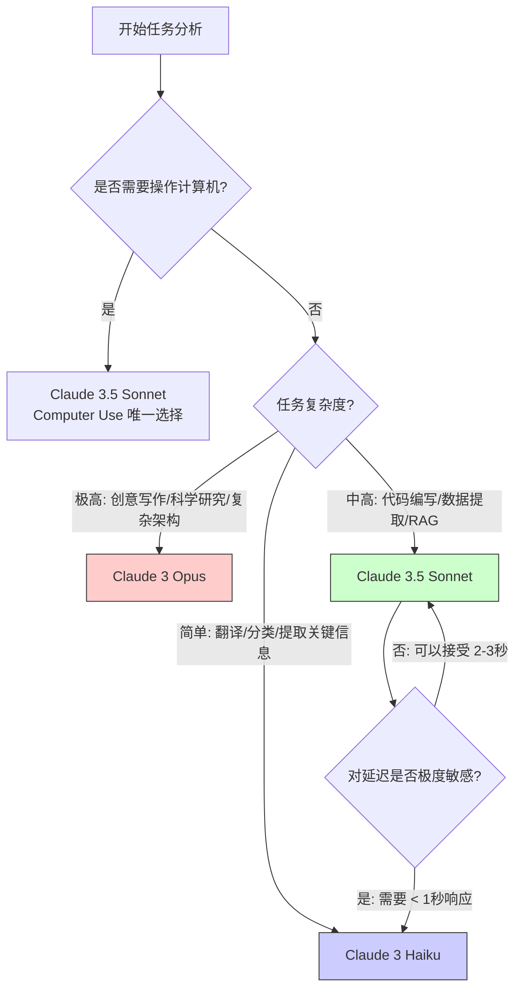

## 1.4 如何选择合适的模型：决策框架

在实际的工程落地中，**“用哪个模型”** 往往是开发者面临的第一个难题。
选大了，钱包受不了；选小了，用户体验受不了。

本章将提供一套系统的决策框架，帮助在 **智能 (Intelligence)**、**延迟 (Latency)** 和 **成本 (Cost)** 这个“不可能三角”中找到最优解。

### 1.4.1 核心决策树 (The Decision Tree)

在做决定之前，请先回答以下三个问题：
1.  **任务有多难？** (需要复杂推理吗？)
2.  **用户能等多久？** (是实时对话还是后台批处理？)
3.  **预算有多少？** (是一次性的 demo 还是千万级日活的产品？)

基于这三个维度，可以画出一棵决策树：



### 1.4.2 详细选型指南

#### 默认首选：Claude 3.5 Sonnet
若不知如何选择，**首选它**。
*   **理由**：它是目前的“版本答案”。在编码能力、逻辑推理和视觉理解上，它甚至超越了上一代旗舰 Opus，但价格便宜得多，速度也快得多。
*   **最佳场景**：
    *   **代码助手**：IDE 插件、代码补全、重构。
    *   **复杂的 RAG 系统**：阅读这一大段检索到的文档并回答问题。
    *   **多步 Agent**：规划任务、调用工具。
    *   **数据分析**：处理 Excel 表格、分析图表。

#### 成本杀手：Claude 3 Haiku
不可小觑。Haiku 是目前市场上性价比最高的模型之一。
*   **理由**：它极其便宜，且速度极快。它的智能程度完全足以应付 80% 的“脏活累活”。
*   **最佳场景**：
    *   **内容审核**：判断用户输入是否违规。
    *   **意图识别 (Router)**：作为网关，判断用户是想“查天气”还是“写诗”，然后分发给不同的模型。
    *   **海量文档处理**：比如你要从 10 万份 PDF 中提取“发票金额”，用 Opus 可能会破产，用 Haiku 则毫无压力。
    *   **实时翻译**：即时通讯软件中的即时翻译。

#### 艺术与深思：Claude 3 Opus
虽然 3.5 Sonnet 在很多理科任务上超越了它，但在某些“文科”领域，Opus 依然是王者。
*   **理由**：Opus 的输出往往更详尽、更富有哲理、修辞更优美。它的“幻觉”率也是最低的。
*   **最佳场景**：
    *   **创意写作**：小说、剧本、营销软文。
    *   **极度复杂的逻辑**：如果 Sonnet 在某个数学证明或逻辑推理上反复出错，请尝试 Opus。
    *   **可以慢慢等的任务**：不需要实时反馈的离线报告生成。

### 1.4.3 成本经济学 (Token Economics)

以下算一笔账。假设应用每天有 1,000 个用户，每个用户进行 10 轮对话，每轮消耗 1,000 Tokens (输入+输出)。
日总量 = 1kw Tokens。

| 模型 | 日成本估算 (USD) | 性能评价 |
| :--- | :--- | :--- |
| **Haiku** | ~$0.5 | 极快，不够聪明 |
| **Opus** | ~$30.0 | 极慢，极聪明 |
| **Sonnet** | ~$5.0 | 又快又聪明 |

*注：以上仅为粗略估算，未考虑 Input/Output 价格差异。*

**结论**：哪怕 Sonnet 比 Haiku 贵 10 倍，如果它能将用户留存率提高 5%，这 $4.5 的差价也是值得的。但如果业务规模扩大到 100 万用户，Haiku 的成本优势就变成了巨大的利润空间。

### 1.4.4 高级架构：混合路由 (LLM Routing)

成熟的 AI 应用不会只吊死在一棵树上。最佳实践是构建一个 **Model Router**。

#### 架构图

```
用户请求："给我写首关于春天的诗"
       ↓
[Router (由 Haiku 驱动)]
   │ 思考：这是创意写作任务
   │ 决策：转发给 Opus
   ↓
[Claude 3 Opus] 进行创作
   ↓
返回结果
```

#### 路由策略示例
1.  **难度分级**：如果 Prompt包含关键词 "复杂"、"架构"、"分析"，路由到 Sonnet/Opus；如果包含 "总结"、"提取"、"分类"，路由到 Haiku。
2.  **降级策略 (Fallback)**：优先尝试 Sonnet，如果 API 超时或报错，自动降级到 Haiku 以保证服务可用性。
3.  **VIP 策略**：免费用户使用 Haiku，付费会员使用 Sonnet/Opus。

### 1.4.5 迁移指南

随着 Anthropic 快速迭代，每隔几个月就会有新模型 (如 3.5, 4.0)。
*   **不要硬编码模型名称**：在代码中定义常量 `CURRENT_MODEL = "claude-3-5-sonnet-20240620"`，方便一键升级。
*   **建立评估集 (Evals)**：在切换模型前，务必跑一遍你的核心业务测试用例。新模型虽然通常更强，但可能会改变输出格式（比如 JSON 的空格处理），导致代码崩溃。

---

恭喜！已完成了第一章的学习，对 Claude 的身世、能力和选型有了全方位的认知。
现在，进入实战的核心——如何跟这位高智商的 AI 说话？

➡️ [第二章：提示工程核心技术](../02_prompt/README.md)
