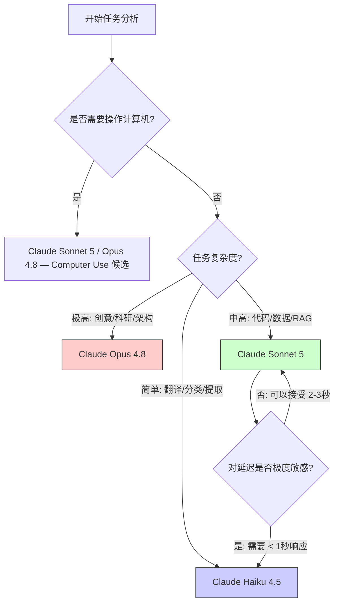
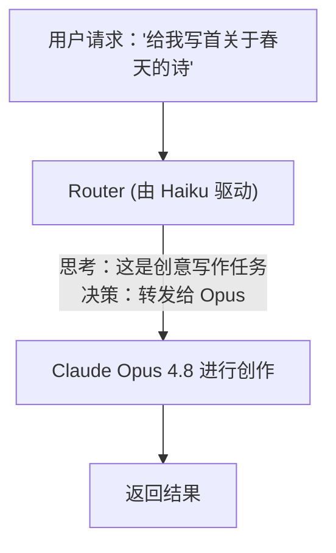

## 1.4 如何选择合适的模型：决策框架

在实际的工程落地中，**“用哪个模型”** 往往是开发者面临的第一个难题。
选大了，钱包受不了；选小了，用户体验受不了。

本章将提供一套系统的决策框架，帮助在 **智能 (Intelligence)**、**延迟 (Latency)** 和 **成本 (Cost)** 这个“不可能三角”中找到最优解。

### 1.4.1 核心决策树

在做决定之前，请先回答以下三个问题：
1.  **任务有多难？** (需要复杂推理吗？)
2.  **用户能等多久？** (是实时对话还是后台批处理？)
3.  **预算有多少？** (是一次性的 demo 还是百万级日活的产品？)

基于这三个维度，可以画出一棵决策树：


```mermaid
graph TD
    Start["开始任务分析"] --> Q1{"是否需要操作计算机?"}
    Q1 -- "是" --> OpCS["Claude Sonnet 5 / Opus 4.8 — Computer Use 候选"]
    Q1 -- "否" --> Q2{"任务复杂度?"}

    Q2 -- "极高: 创意/科研/架构" --> Opus["Claude Opus 4.8"]
    Q2 -- "中高: 代码/数据/RAG" --> Sonnet["Claude Sonnet 5"]
    Q2 -- "简单: 翻译/分类/提取" --> Haiku["Claude Haiku 4.5"]

    Sonnet --> Q3{"对延迟是否极度敏感?"}
    Q3 -- "是: 需要 < 1秒响应" --> Haiku
    Q3 -- "否: 可以接受 2-3秒" --> Sonnet

    style Opus fill:#ffcccc,stroke:#333
    style Sonnet fill:#ccffcc,stroke:#333
    style Haiku fill:#ccccff,stroke:#333
```

### 1.4.2 详细选型指南

#### 新项目首评：Claude Sonnet 5

新项目应先在自己的业务评测集上测试 **Claude Sonnet 5**；既有 Sonnet 4.6 系统则保留稳定基线，完成灰度评测后再迁移，并保留回退路径。
*   **理由**：Anthropic 将 Sonnet 5 定义为 Sonnet 4.6 的直接升级目标；标准单价同为 $3/$15，且 2026-08-31 前为 $2/$10 介绍价。Sonnet 5 默认启用 Adaptive Thinking，并使用新 tokenizer，同一文本约增加 30% token，因此上线前必须重跑 token 计数、成本、延迟和截断回归。
*   **最佳场景**：
    *   **代码助手**：IDE 插件、代码补全、重构。
    *   **复杂的 RAG 系统**：阅读这一大段检索到的文档并回答问题。
    *   **多步 Agent**：规划任务、调用工具。
    *   **数据分析**：处理 Excel 表格、分析图表。

#### 成本杀手：Claude Haiku 4.5

不可小觑。Haiku 是目前市场上性价比最高的模型之一。
*   **理由**：它极其便宜，且速度极快。它的智能程度完全足以应付 80% 的“脏活累活”。
*   **最佳场景**：
    *   **内容审核**：判断用户输入是否违规。
    *   **意图识别 (Router)**：作为网关，判断用户是想“查天气”还是“写诗”，然后分发给不同的模型。
    *   **海量文档处理**：比如你要从 10 万份 PDF 中提取“发票金额”，用 Opus 可能会破产，用 Haiku 则毫无压力。
    *   **实时翻译**：即时通讯软件中的即时翻译。

#### 艺术与深思：Claude Opus 4.8

Opus 4.8 是当前 Opus 档旗舰；Fable 5 已恢复全球访问。极复杂任务应通过自己的评测在两者间路由，并显式处理 Fable 的分类器拒绝。
*   **理由**：Opus 4.8 是当前最强的 Opus 型号，适合最困难的 Agentic 编码、复杂数学推导和逻辑推理。其输出往往详尽且富有洞察力；迁移或上线时仍应以官方模型页的价格、上下文窗口和可用区为准。
*   **最佳场景**：
    *   **创意写作**：小说、剧本、营销软文。
    *   **极度复杂的逻辑**：如果 Sonnet 在某个数学证明或逻辑推理上反复出错，请尝试 Opus。
    *   **可以慢慢等的任务**：不需要实时反馈的离线报告生成。

### 1.4.3 成本经济学

以下算一笔账。假设应用每天有 100 个用户，每个用户进行 10 轮对话，每轮消耗 1,000 Tokens (输入+输出)。
日总量 = 100 万 (1M) Tokens。
下面先按 **80% 输入 / 20% 输出** 估算，便于做粗略预算。

*   **极高复杂度的推理/长文写作**：选择 **Claude Opus 4.8**。
*   **Computer Use（屏幕观察与 GUI 操作）**：新项目评测 **Claude Sonnet 5** 或 **Claude Opus 4.8**，并为外部副作用动作设置人工确认；既有 Sonnet 4.6 链路在灰度迁移期间可保留为回退。
*   **企业级 Agent 路由分发中心**：选择 **Claude Haiku 4.5**。

| 模型 | 日成本估算 (USD) | 性能评价 |
| :--- | :--- | :--- |
| **Claude Haiku 4.5** | ~$1.8 | 极快，性价比高 |
| **Claude Sonnet 5** | ~$3.6 | 介绍价下的通用候选 |
| **Claude Opus 4.8** | ~$9.0 | 极度聪明，工程能力最强 |

*注：Sonnet 5 行按 2026-08-31 前 $2/$10 介绍价计算，之后按 $3/$15 标准价约为 $5.4/日。表中 1M token 必须是各模型重新计数后的真实用量；Sonnet 5 新 tokenizer 对同一文本约增加 30% token，不能直接复用 Sonnet 4.6 的 token 数。输出占比更高时，成本还会继续上升。*

**结论**：在上述假设下，Sonnet 5 介绍价比 Haiku 每日多约 $1.8，标准价阶段多约 $3.6。是否值得应由业务评测中的质量、延迟和单位成功任务成本决定，不能用未经验证的留存率假设替代。

### 1.4.4 高级架构：混合路由

成熟的 AI 应用不会只吊死在一棵树上。最佳实践是构建一个 **Model Router**。

#### 架构图


```mermaid
graph TD
    User["用户请求：'给我写首关于春天的诗'"] --> Router["Router (由 Haiku 驱动)"]
    Router -- "思考：这是创意写作任务<br>决策：转发给 Opus" --> Worker["Claude Opus 4.8 进行创作"]
    Worker --> Result["返回结果"]
```

#### 路由策略示例

1.  **难度分级**：如果 Prompt包含关键词 “复杂”、“架构”、“分析”，路由到 Sonnet/Opus；如果包含 “总结”、“提取”、“分类”，路由到 Haiku。
2.  **降级策略 (Fallback)**：优先尝试 Sonnet，如果 API 超时或报错，自动降级到 Haiku 以保证服务可用性。
3.  **VIP 策略**：免费用户使用 Haiku，付费会员使用 Sonnet/Opus。

### 1.4.5 迁移指南

随着 Anthropic 快速迭代，每隔几个月就会有新模型 (如 3.5, 4.0)。
*   **不要硬编码模型名称**：
```python
# 推荐实践：提取常量
MODEL_CHEAP = "claude-haiku-4-5-20251001" # 便宜型号用于大批量简单任务
MODEL_BALANCED = "claude-sonnet-5"  # 新项目先评测的通用型号
MODEL_BALANCED_LEGACY = "claude-sonnet-4-6"  # 仅供既有系统灰度迁移与回退
MODEL_SOTA = "claude-opus-4-8"  # 当前可用的 Opus 档旗舰（2026-05 发布，$5/$25）
MODEL_FABLE = "claude-fable-5"  # 2026-07-01 恢复全球访问；启用前仍核验

# 调用演示
response = client.messages.create(
    model=MODEL_BALANCED,
    max_tokens=1024,
    messages=[
        {"role": "user", "content": "你好，请介绍一下你自己。"}
    ]
)
```

*   **建立评估集 (Evals)**：新项目先评测 Sonnet 5；既有 Sonnet 4.6 系统按迁移清单灰度升级，并保留回退。切换前必须重跑核心业务测试、token 计数、成本和截断用例；同时移除手动 Extended Thinking 配置与非默认 sampling 参数，避免 Sonnet 5 返回 400。

---

恭喜！已完成了第一章的学习，对 Claude 的身世、能力和选型有了全方位的认知。
现在，进入实战的核心——如何跟这位高智商的 AI 说话？

➡️ [第二章：提示工程核心技术](../02_prompt/README.md)
