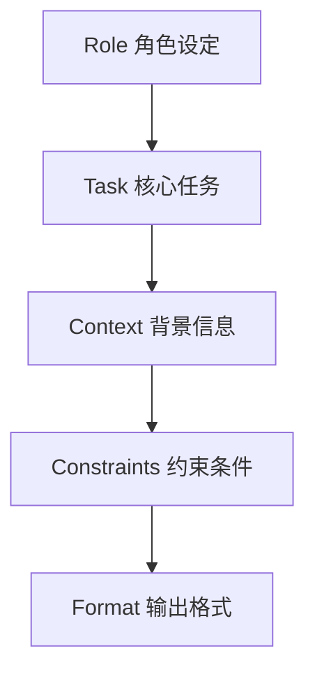

## 2.1 提示词基础：清晰、直接、具体

提示词（Prompt）不仅仅是给 AI 的“问题”，更是对任务的**规格说明书**。在与 Claude 这样的 LLM 交互时，实际上是在编程——只不过用的是自然语言。

提示词的质量直接决定了输出的上限。一个平庸的提示词只能得到平庸的回复，而一个精心设计的提示词可以解锁专家的智慧。

核心心法只有六个字：**清晰 (Clear)、直接 (Direct)、具体 (Specific)**。

### 2.1.1 原则一：清晰 (Clear) —— 消除歧义

Claude 无法读心。它只能处理输入的信息。如果指令有歧义，Claude 会尝试基于概率“猜”意图，而这种猜测往往是错的。

#### 避免模糊代词
*   **Bad**: "帮我分析一下**这个**。"
    *Claude 困惑：是分析上面的代码？还是上周的文件？还是这句话本身？*
*   **Good**: "请分析**下方的 Python 代码片段**，重点关注其时间复杂度。"

#### 明确动词含义
“分析”、“处理”、“优化”这些词太宽泛了。
*   **Bad**: "优化这段文案。"
*   **Good**: "请**缩短**这段文案，使其更具**紧迫感**，并在结尾添加一个明确的 **Call to Action (行动号召)**。"

### 2.1.2 原则二：直接 (Direct) —— 肯定胜于否定

人类大脑和 AI 模型处理否定指令（Negative Constraints）时都比较费劲。告诉 Claude **想要什么**，比告诉它 **不想要什么** 更有效。

#### 正向指令
LLM 的注意力机制更容易聚焦在出现的词汇上。当你一直强调“不要写红色”时，“红色”这个词反而占据了模型的注意力。

*   **Bad**: "写一首诗，不要太悲伤，不要用古英语，别太长。"
    *(模型可能还是会写出带点忧郁色彩的句子)*
*   **Good**: "写一首**欢快、积极**的现代诗，长度控制在 **8 行以内**。"

#### 角色赋予 (Role Prompting)
“直接”还意味着直接设定场景。
*   **Bad**: "我想问一些法律问题。"
*   **Good**: "你现在是一位**拥有 20 年经验的知识产权律师**。请基于中国现行法律回答我的问题。"

### 2.1.3 原则三：具体 (Specific) —— 定义成功

如果把 Claude 比作一个极其聪明但不懂业务的新员工，需要通过“具体”来填补它与业务之间的 Context Gap（语境鸿沟）。

#### 补充背景信息 (Context)
*   **Bad**: "给客户写封道歉信。"
*   **Good**: "请给 **VIP 客户王先生** 写封道歉信。原因是我们因**物流积压**导致他的订单（编号123）**延误了 3 天**。我们愿意提供 **50元优惠券** 作为补偿。"

#### 规定输出格式 (Output Format)
这是最容易被忽略的一点。如果不指定格式，Claude 可能会写一大段废话。

*   **Bad**: "找出文章里的公司名。"
*   **Good**: "请提取文章中所有提及的公司名称，并以 **CSV 格式**输出，表头为：`公司名, 所在行业, 提及次数`。"

### 2.1.4 万能提示词结构：The Anatomy of a Prompt

经过大量测试，总结出了一个高成功率的 Prompt 结构。建议将此作为默认模板。




#### 完整示例：代码审查

```markdown
<!-- 1. 角色设定 -->
你是一位资深的 Python 后端工程师，专注于代码性能优化和安全性。

<!-- 2. 背景信息 -->
下面这段代码是一个简单的用户登录验证函数，将用于高并发的生产环境。

<!-- 3. 核心任务 -->
请审查这段代码，指出潜在的问题。

<!-- 4. 约束条件 -->
- 重点关注 SQL 注入风险和密码哈希处理。
- 不用关注变量命名风格。
- 解释必须简洁，直击要害。

<!-- 5. 输出格式 -->
请按以下 JSON 格式输出结果：
{
  "issues": [
    {"severity": "High/Medium/Low", "description": "...", "fix": "..."}
  ]
}

<!-- 6. 输入数据 -->
代码如下：
def login(user, pwd):
    sql = f"SELECT * FROM users WHERE name='{user}' AND pass='{pwd}'"
    return execute(sql)
```

### 2.1.5 提示词迭代 (Refinement)

没有人能一次写出完美的 Prompt。Prompt Engineering 本质上是一个**迭代**的过程。

#### 迭代循环
1.  **Draft**: 写初稿。
2.  **Test**: 发送给 Claude。
3.  **Evaluate**: 检查结果。哪里没做好？
    *   *太长了？* -> 添加长度约束。
    *   *语气不对？* -> 调整 Tone 描述。
    *   *格式乱了？* -> 强化 Format 指令。
4.  **Refine**: 修改 Prompt 并重试。

#### 常见错误修正表

| 这里有问题 | 修正策略 |
| :--- | :--- |
| Claude 产生了幻觉 | 要求引用原文：`请仅基于我提供的上下文回答，不要发散。` |
| Claude 逻辑混乱 | 引入思维链：`在回答前，请先一步步思考(Let's think step by step)。` |
| Claude 忽略了某条指令 | 将该指令前置，或使用大写加粗强调：`**重要：必须使用 Markdown 表格**` |
| 回复不够专业 | 提供少样本（Few-Shot）示例（见 2.4 节）。 |

---

掌握了这三原则，就已经超越了 80% 的用户。但遇到复杂的长指令时，仅仅依靠自然语言堆砌容易让 Claude “混淆”。需要一种更结构化的表达方式。

这就要轮到 XML 标签登场了。

➡️ [使用 XML 结构化提示词](2.2_xml.md)
