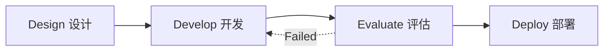

## 2.7 提示词优化与调试：工程学视角

提示工程（Prompt Engineering）不仅仅是“文字艺术”，更是一门 **工程学**。
如果想要构建可靠的 AI 应用，就不能止步于“试了几次感觉不错”，而必须建立一套科学的开发、测试和优化流程。

### 2.7.1 提示工程生命周期 (Lifecycle)



#### 设计 (Design)
*   明确业务目标：是想让它写诗，还是想提取 JSON？
*   识别边界：什么情况下它应该拒绝回答？

#### 开发 (Develop)
*   利用 Metaprompting（元提示）：让 Claude 帮忙写 Prompt。
*   构建初始版本：包含 Role, Context, XML Tags, Few-Shot。

#### 评估 (Evaluation) - 最关键的一步
*   **Golden Dataset**: 准备至少 20-50 个真实的测试用例（包含简单、困难、恶意输入）。
*   **Metric**: 定义什么是“好”。是 JSON 格式正确？还是情感分析准确？

#### 部署 (Deploy)
*   监控生产环境的日志，收集失败案例加入 Golden Dataset，进入下一轮迭代。

### 2.7.2 工具化调试

#### The Workbench (Anthropic Console)
Anthropic 官方控制台提供了一个强大的 Workbench。
*   **Evaluate 功能**: 可以一键运行多个测试用例，并在侧边栏对比输出。
*   **Prompt Generator**: 一个内置的“提示词生成器”。只需输入“帮我写个邮件分类器”，它会自动生成包含 XML 标签、思维链的高级 Prompt。

#### 常见的调试模式

| 症状 | 诊断 | 处方 |
| :--- | :--- | :--- |
| **啰嗦、废话多** | 模型过于礼貌 | 增加 `<constraints>`, 使用 Prefill 截断, 或 Few-Shot 展示短回复。 |
| **格式错误 (Bad JSON)** | 模型未理解语法 | 增加 `<output_format>`, 检查是否转义错误, 使用 Prefill `{`。 |
| **幻觉 (Hallucination)** | 知识缺失 | 明确 `<knowledge_base>`, 要求“引用原文”，甚至让它说“不知道”。 |
| **逻辑错误** | 任务太难 | 引入 CoT (`<thinking>`), 或拆分为多个 Prompt (Chaining)。 |

### 2.7.3 高级策略：Prompt Chaining (提示链)

当一个任务过于复杂，即使加上 CoT 也容易出错时，应该将其**拆解**。

**场景**：写一篇基于 5 份财报的深度分析文章。
*   **Single Prompt**: "读这5份文件，写分析。" -> *结果：内容肤浅，遗漏细节。*
*   **Prompt Chaining**:
    1.  **Step 1**: "读财报 A，提取关键财务数据。" -> *Output A*
    2.  **Step 2**: "读财报 B，提取关键财务数据。" -> *Output B*
    3.  ...
    4.  **Step 6**: "基于 Output A-E，写一篇对比分析文章。"

**优点**：
*   更清晰的上下文。
*   每一步都可以单独调试。
*   突破 Context Window 限制。

### 2.7.4 让 AI 帮你写 AI (Metaprompting)

不要从零开始写 Prompt。Anthropic 提供了一个官方的元提示词（Metaprompt），这是一个长达几千字的超级 Prompt，专门用来生成 Prompt。

**流程**：
1.  复制官方 Metaprompt 到 Claude。
2.  输入简短需求：“我想做一个代码审查助手。”
3.  Claude 会输出一个包含 System Prompt, XML tags, Variable slots 的完美 Prompt 模板。
4.  在此基础上微调。

> *Tips: 在 Anthropic Console 中点击 "Generate a prompt" 按钮就是在调用这个功能。*

### 2.7.5 建立你的评估库 (Evals)

在工程中，**没有测试就没有重构**。
应该建立一个自动化测试脚本（使用 Python/Node.js）：

```python
test_cases = [
    {"input": "...", "expected": "...", "assert": "contains_json"},
    {"input": "...", "expected": "...", "assert": "length < 100"},
]

for case in test_cases:
    output = call_claude(prompt, case['input'])
    score = evaluate(output, case['expected'])
    print(f"Case {case['id']}: score={score}")
```

这不仅能帮忙量化 Prompt 的质量，还能在未来模型升级（如从 Sonnet 3.5 升级到 4.0）时，确保业务逻辑没有 regression（回退）。

---

### 2.7.6 小结

提示工程不是玄学，它是**实验科学**。
*   **Iterate**: 永远不要指望第一版 Prompt 就是完美的。
*   **Measure**: 建立测试集，用数据说话。
*   **Structure**: 始终使用结构化（XML）和模块化思维。

至此，已经掌握了驾驭 Claude 的核心语言艺术。
但 Claude 能做的远不止“聊天”。在下一章，将赋予它“双手”，让它通过 **Tool Use** 连接真实的数字世界。

➡️ [第三章：Tool Use 工具调用](../03_tools/README.md)
