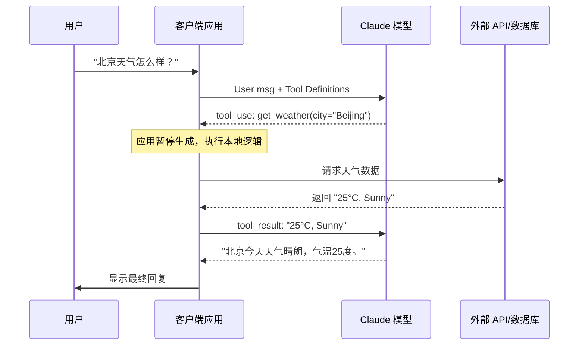

## 3.1 工具概述与工作原理

### 3.1.1 什么是工具使用 (Tool Use)？

在大型语言模型（LLM）的发展历程中，“工具使用”（Tool Use，又称 Function Calling）是一个里程碑式的飞跃。它标志着 AI 模型从单纯的“文本生成器”进化为能够与其环境交互的“智能代理”（Agent）。

简单来说，**工具使用**是指 Claude 等模型能够理解开发者定义的外部函数或 API，并在对话过程中根据用户的需求，自主判断、决策并生成调用这些工具所需的参数（通常是 JSON 格式）。

**核心概念**：
*   **并非模型直接执行**：重要的是要理解，Claude 本身并不直接运行代码或访问互联网（除非使用特定的服务端工具）。当你定义一个工具（例如 `get_weather`）时，Claude 只是输出了“我想要调用 `get_weather`，参数是 `city='Beijing'`”这样的指令。
*   **执行在客户端**：实际的 API 调用、数据库查询或代码执行，是由应用程序（客户端）在接收到 Claude 的指令后完成的。
*   **闭环交互**：应用程序执行完工具后，将结果（例如“北京气温 25度”）再次发送给 Claude，Claude 结合这个结果生成最终回复。

这种能力让 Claude 拥有了“双手”和“眼睛”，可以连接每一个 API，从简单的计算器到复杂的企业级 ERP 系统。

### 3.1.2 为什么需要工具？

虽然 Claude 拥有海量的训练数据和强大的逻辑推理能力，但作为预训练模型，它存在几个天然的局限性，而工具正是为了解决这些问题而生：

#### 突破知识截止日期
模型的知识受限于其训练数据的截止时间。它无法通过自身知道“此时此刻”的股价、天气或最新的体育比分。通过连接 **搜索工具** 或 **实时数据 API**，Claude 可以获取最新的动态信息。

#### 访问私有数据
Claude 无法访问个人文件、公司数据库或 CRM 系统。通过定义 **数据检索工具**，可以安全地赋予 Claude 访问特定私有数据的权限，使其成为专属的业务助手。

#### 执行实际操作
仅靠生成文本无法改变现实世界。Claude 不能直接发送邮件、购买商品或重启服务器。通过 **API 集成工具**，Claude 可以代表用户执行确切的操作，实现真正的自动化。

#### 增强计算与逻辑准确性
虽然 LLM 擅长逻辑推理，但在复杂的数学计算或精确的字符串处理上可能会出错。通过调用 **Python 解释器** 或 **计算器工具**，可以将这些精确任务外包给程序代码，确保准确率。

### 3.1.3 工具分类详解

根据工具的定义位置、执行载体及隐私边界，Claude 的工具体系主要分为两大类：

#### 客户端工具 (Client-side Tools)
这是最常见、最灵活的工具类型，运行在开发者本地，也是大多数开发者主要使用的模式。

*   **定义者**：开发者。
*   **执行者**：开发者的应用程序代码。
*   **数据流**：数据在服务器和 Claude API 之间流转。
*   **特点**：
    *   **高度定制**：可以将任何 Python、Node.js 函数或 REST API 封装为工具。
    *   **隐私安全**：具体的业务逻辑和数据库连接完全运行在受控环境中，Claude 此时仅充当自然语言到 API 参数的转换器。
    *   **示例**：`query_database`（查询内部 SQL）、`send_slack_message`（发送消息）、`control_smart_light`（控制智能家居）。

#### 服务端工具 (Server-side Tools)
这部分工具运行在 Anthropic 的云端环境中，旨在提供开箱即用的高级能力。

*   **定义者**：Anthropic。
*   **执行者**：Anthropic 的服务器。
*   **特点**：
    *   **零代码集成**：只需在 API 请求中声明启用，无需编写执行逻辑。
    *   **特定场景优化**：针对通用高频需求（如搜索、代码执行）进行了深度优化。
*   **注意**：Anthropic 正在逐步推出更多服务端工具，但在构建自定义 Agent 时，客户端工具依然是核心。

> 此外，还有一类特殊的 **“Anthropic 定义的客户端工具”**（如 Computer Use 和 Text Editor）。这类工具的 Schema（输入输出格式）由 Anthropic 统一标准，以便模型经过专门训练能更好地使用它们，但其具体的执行环境（如虚拟机、浏览器）仍然由开发者在客户端提供。

### 3.1.4 核心工作流程 (The Tool Use Loop)

理解“请求-决策-执行-反馈”的循环是掌握 Agent 开发的关键。这是一个典型的 **ReAct** (Reasoning + Acting) 模式。

#### 交互步骤

1.  **定义与声明 (Define)**
    开发者在 API 请求的 `tools` 参数中提供可用的工具列表（包含名称、描述、参数 Schema）。
2.  **用户提问 (Prompt)**
    用户发送消息，例如“帮我查一下查理公司的销售额”。
3.  **模型决策 (Reasoning)**
    Claude 分析用户意图，结合工具定义，判断是否需要使用工具。如果需要，它会生成一个 `tool_use` 内容块（包含工具名和参数，如 `{"company": "Charlie"}`）。
    *此时模型会暂停生成，等待外部输入。*
4.  **客户端执行 (Execution)**
    代码捕获到 `stop_reason="tool_use"`，解析模型返回的 JSON 参数，并在本地执行对应的 SQL 查询函数。
5.  **结果回传 (Feedback)**
    代码将查询结果（如“$50,000”）封装在一个 `tool_result` 消息块中，发送回 Claude。
6.  **最终生成 (Response)**
    Claude 接收到工具结果，将其融入上下文中，生成最终给用户的自然语言回复：“查理公司的销售额为 50,000 美元。”

#### 示例流程图

### 3.1.5 典型应用场景

工具使用将 Claude 的应用范围从“咨询对话”扩展到了“业务自动化”。

| 场景类别 | 具体示例 | 描述 |
| :--- | :--- | :--- |
| **外部信息获取** | 天气、股票、汇率查询 | 连接实时数据源，打破训练数据限制。 |
| **办公自动化** | 日历管理、邮件发送 | "帮我约明天下午3点和张总的会议"，自动检查冲突并发送邀请。 |
| **数据分析助手** | SQL 生成与查询 | 自然语言转 SQL，执行查询并解释数据报表。 |
| **客户服务 Agent** | 订单查询、退款处理 | 根据订单号查询物流状态，并根据政策自动发起退款流程。 |
| **代码与工程** | 代码解释器、Git 操作 | 自动编写代码、运行测试、提交代码库。 |
| **多模态操作** | 计算机使用 (Computer Use) | 像人一样操控鼠标键盘，操作无法通过 API 访问的旧版 GUI 软件。 |

### 3.1.6 计费与 Token 消耗

在设计 Agent 时，必须考虑 Token 成本，因为工具定义和交互会显著增加 Context 长度。

#### 成本构成
1.  **工具定义 (Definition Overhead)**：
    所有的工具描述（Name, Description, Input Schema）都会作为 System Prompt 的一部分发送给模型。拥有几十个复杂工具的定义可能会占用数千 Token。
    *优化建议：仅发送当前场景必要的工具，或使用动态检索机制加载工具子集。*

2.  **思维链与决策 (Chain of Thought)**：
    为了准确使用工具，Claude 通常会进行内部推理（CoT），这增加了输出 Token 的数量。

3.  **多轮交互 (Multi-turn Overhead)**：
    工具使用涉及“请求-执行-结果”的往返。每一轮对话历史（包括工具调用的具体的 JSON 参数和返回的详细结果）都需要保留在上下文中，随对话深度增加，Token 消耗呈线性甚至更高增长。

#### 延迟考量
除了 Token 成本，工具使用引入了**网络往返 (Network Round-trips)**。一次简单的问答可能变成三次网络请求（LLM 决策 -> 工具执行 -> LLM 总结）。开发者需要优化本地工具的执行速度，并考虑流式输出（Streaming）来提升用户感知的响应速度。

### 3.1.7 安全与最佳实践

赋予 AI 执行操作的能力伴随着风险。

*   **人机回环 (Human-in-the-loop)**：对于高风险操作（如删除文件、转账、发送批量邮件），务必在 Tool 执行前加入人工确认步骤。
*   **最小权限原则 (Least Privilege)**：工具只能访问其任务必需的数据。不要把 `rm -rf /` 封装成工具。
*   **清晰的描述**：Claude 依靠工具的 `description` 字段来理解何时以及如何使用工具。编写详尽、无歧义的文档字符串（Docstrings）是提高成功率的各种最佳实践之首。

---

我们将从定义工具的基础结构开始，深入学习如何构建强大的 Agent。

➡️ [工具定义详解](3.2_schema.md)
