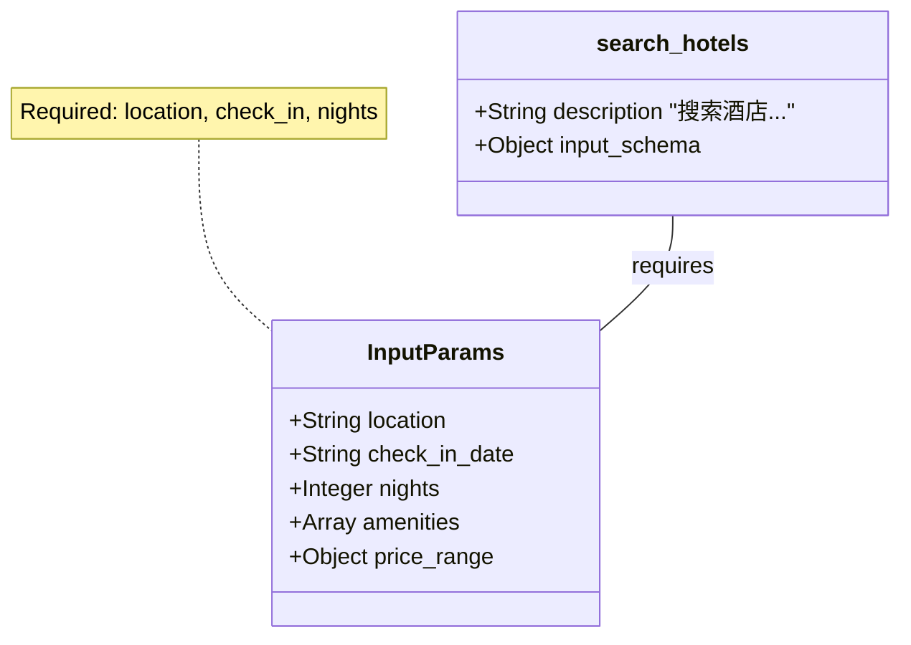

## 3.2 定义工具 Schema

### 3.2.1 什么是工具 Schema？

在与 Claude 进行工具集成时，并非直接上传代码函数，而是提供一份 **Schema**（结构定义）。这份 Schema 就像是一份“说明书”，告诉 Claude：这里有一个工具，它的名字叫什么，用来做什么，以及使用时需要按照什么样的格式提供参数。

Claude 严格支持 **JSON Schema** 标准（一种用于描述 JSON 数据结构的规范）。这意味着利用 JSON Schema 的强大表达能力，定义从简单的字符串到复杂的嵌套对象等各种参数类型。

### 3.2.2 工具定义的三大支柱

一个标准的工具定义（Tool Definition）由三个核心字段（名称、描述和参数结构）构成。每一个字段都直接影响模型的判断准确性和 Token 消耗。

#### Name (名称)
工具的唯一标识符。
*   **格式限制**：必须匹配正则 `^[a-zA-Z0-9_-]{1,64}$`。通常推荐使用 `snake_case`（蛇形命名法），如 `get_stock_price`。
*   **最佳实践**：名称本身应具有语义。Claude 会关注工具名称。例如 `search_database` 比 `tool_a` 更能引导模型正确使用。

#### Description (描述) —— 提示工程的战场
这是工具定义中最重要的部分。许多开发者低估了 `description` 的作用。实际上，这里的文本会作为系统提示词（System Prompt）的一部分输入给模型。

**编写高质量描述的技巧**：
*   **明确“何时”使用**：不要只写“获取天气”，而要写“当用户询问实时天气情况或气温时，使用此工具”。
*   **提供相关上下文**：如果工具返回的数据有特定格式（如 CSV 或 JSON），可以在描述中提及，以便 Claude 做好解析准备。
*   **示例增强**（Few-shot）：对于复杂工具，可以在描述中简要包含一个参数示例。

#### Input Schema (参数结构)
定义了工具接受的参数格式。这是一个标准的 JSON Schema 对象。
*   **`type`**: 通常为 `object`。
*   **`properties`**: 定义各个参数字段。
*   **`required`**: 一个数组，列出必须提供的字段名。Claude 会努力确保生成的 JSON 包含这些字段。

### 3.2.3 完整示例解析

下面的示例展示了一个用于“查询酒店”的工具定义，包含了多种参数类型。

```json
{
  "name": "search_hotels",
  "description": "根据目的地、日期和价格范围搜索酒店。当用户计划旅行或寻找住宿时使用。",
  "input_schema": {
    "type": "object",
    "properties": {
      "location": {
        "type": "string",
        "description": "目的地城市或地标，如 'Paris' 或 'Eiffel Tower'"
      },
      "check_in_date": {
        "type": "string",
        "format": "date",
        "description": "入住日期，格式 YYYY-MM-DD"
      },
      "nights": {
        "type": "integer",
        "minimum": 1,
        "maximum": 30,
        "description": "入住晚数"
      },
      "amenities": {
        "type": "array",
        "items": {
          "type": "string",
          "enum": ["wifi", "pool", "gym", "breakfast"]
        },
        "description": "所需的设施列表"
      },
      "price_range": {
        "type": "object",
        "properties": {
          "min": {"type": "number"},
          "max": {"type": "number"}
        },
        "description": "价格区间（每晚）"
      }
    },
    "required": ["location", "check_in_date", "nights"]
  }
}
```

#### 结构可视化 (Mermaid)

将上述 Schema 结构化为一个类图，有助于理解 Claude 是如何看待这个工具的。



**图 1：工具定义类图**
这个类图直观地展示了 `search_hotels` 工具的数据结构。Claude 将其视为一个主对象（Function），它依赖于一个参数对象（InputParams）。其中 `InputParams` 包含了所有必要的字段及其类型约束。这种可视化的理解有助于开发者在设计复杂参数时保持逻辑清晰。

### 3.2.4 高级参数技巧

让 Claude 更稳定地工作的关键，在于通过 Schema **限制生成空间**。

#### 枚举 (Enum) —— 抗幻觉神器
如果一个字段只有固定的几个有效值（如状态、类型、模式），**务必使用 `enum`**。
*   **Bad**: `"type": "string", "description": "排序方式"` (模型可能生成 "desc", "descending", "down" 等)
*   **Good**: `"type": "string", "enum": ["asc", "desc"]`

#### 验证信息 (Format & Descriptions)
虽然 JSON Schema 支持 `format: email` 或 `pattern`（正则），但 LLM 并不总是完美遵循这些隐式约束。
**建议**：将格式要求显式写在 `description` 中。
*   `"description": "用户邮箱，必须是有效的 email 格式"`
*   `"description": "日期，严格遵循 YYYY-MM-DD 格式"`

### 3.2.5 开发实战：使用 Pydantic 生成 Schema

在 Python 开发中，手动编写冗长的 JSON 往往容易出错。推荐使用 `Pydantic` 库来定义数据模型，并自动生成 Schema。

```python
from pydantic import BaseModel, Field
from typing import List, Optional

class HotelSearch(BaseModel):
    location: str = Field(..., description="目的地城市")
    nights: int = Field(1, ge=1, le=30, description="入住晚数")
    amenities: List[str] = Field(default_factory=list, description="设施列表")
    
#自动生成 Claude 兼容的 Schema
schema = HotelSearch.model_json_schema()
# 注意：生成的 schema 可能包含 'title' 等额外字段，Claude API 通常会忽略，但最好清理一下。
```

### 3.2.6 常见陷阱与调试

在定义工具时，开发者常犯以下错误：

1.  **参数过多且非必填**：如果一个工具包含 20 个参数且大部分是可选的，Claude 往往会感到困惑，不知道该填哪些。**策略**：拆分为多个专注的小工具，或者将可选参数合并为一个 `options` 对象。
2.  **不仅是 JSON 类型**：不要把所有东西都定义为 `string`。如果你需要数字，就用 `integer` 或 `number`；如果需要布尔开关，就用 `boolean`。这能减少后续代码转换的工作量。
3.  **忽略错误处理**：即使定义了 Schema，Claude 仍极小概率会生成不符合 Schema 的 JSON（尽管 Claude 3 在这方面非常强）。代码必须具备 `try-catch` 机制，在 JSON 解析失败时给 Claude 返回明确的错误信息（Tool Result），让它可以纠正并重试。

### 3.2.7 Token 消耗警示

需注意，**整个 Schema 定义都会被计入 Input Tokens**。
如果定义了 50 个工具，每个都有详细的描述和复杂的参数，这可能消耗数千 Token，不仅增加成本，还可能挤占模型对用户问题的注意力（Attention）。

*   **动态工具加载**：如果在某些对话分支中只需要特定工具，可以动态修改 API 请求中的 `tools` 列表，只发送当下相关的工具。

---

完成工具定义后，接下来将探讨 Claude 在调用工具后，该如何处理返回的结果。

➡️ [处理工具调用结果](3.3_results.md)
