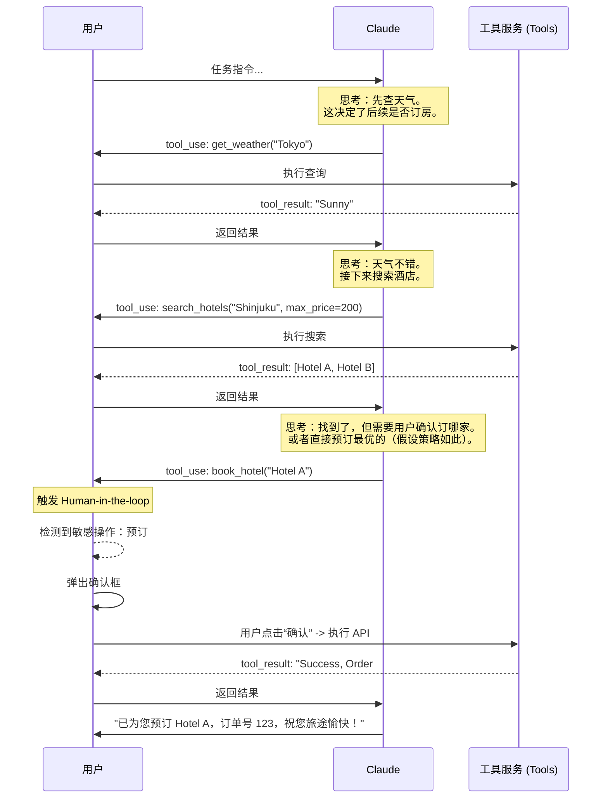

## 3.4 Agent 编排模式与复杂流程

### 3.4.1 为什么需要编排 (Orchestration)？

单个工具调用只是原子操作。真实世界的业务场景往往是错综复杂的。
当用户说“帮我策划一次去日本的旅行，并预订性价比最高的酒店”时，这不仅是一个简单的查询，而是一个需要拆解、规划、执行和验证的**工作流**。

**编排**是指协调模型与多个工具之间交互的逻辑，确保任务能够按照正确的依赖关系和逻辑顺序高效完成。Claude 强大的推理能力使其天然适合作为这种编排的“大脑”。

### 3.4.2 核心编排模式

#### 顺序链 (Sequential Chain)
这是最常见的模式，后续步骤依赖于前一步骤的输出。

*   **场景**：用户想查询某位员工的最近订单。
*   **逻辑**：
    1.  `get_employee_id(name="Alice")` -> 返回 "ID_999"
    2.  `get_orders(employee_id="ID_999")` -> 返回订单列表
*   **实现**：Claude 会自动识别这种依赖。它会先调用第一个工具，等待结果返回后，再利用结果中的 ID 发起第二次调用。无需硬编码这种顺序，只需提供这两个工具，Claude 的逻辑推理会自动完成“填空”。

#### 并行执行 (Parallel Execution / Fan-out)
当多个子任务之间没有依赖关系时，并行执行可以极大降低延迟。

*   **场景**：用户问“比较一下 iPhone 17 和 Pixel 10 的价格”。
*   **逻辑**：Claude 会在一次响应中同时发出两个 `tool_use` 请求：
    1.  `search_product("iPhone 17")`
    2.  `search_product("Pixel 10")`
*   **优势**：利用 `asyncio` 等异步机制，应用程序可以同时发起网络请求，总耗时取决于最慢的那个请求，而不是两者之和。

#### 路由与分发 (Routing)
对于拥有成百上千个工具的巨型系统，直接把所有工具塞给模型是不现实的。

*   **分类器模式**：
    1.  **第一步**：使用一个轻量级 Prompt（或微调模型）判断用户意图类别（如“售后”、“销售”、“技术支持”）。
    2.  **第二步**：根据类别加载对应的 10 个工具，而非全部 100 个。
    3.  **第三步**：让主力模型（如 Claude 3.5 Sonnet）进行具体的工具调用。

#### 规划—执行 (Plan-and-Execute)
对于需要长视距推理的复杂任务，简单的 ReAct 循环可能会陷入局部最优或死循环。这种模式要求 Model 先生成完整的计划，再逐一执行。

*   **场景**：写一个贪吃蛇游戏。
*   **逻辑**：
    1.  **Plan**: Claude 先列出步骤：1.设计游戏循环 2.处理用户输入 3.绘制图形 4.整合测试。
    2.  **Execute**: 按照列表顺序，一次只专注执行一个子任务。
    3.  **Replanning**: 如果执行中发现计划不可行（如库版本冲突），则更新剩余的计划。
*   **优势**：通过“三思而后行”，减少了盲目试错的 Token 消耗，提高了复杂任务的成功率。

### 3.4.3 复杂工作流：深入 ReAct 循环

Claude 处理复杂任务的核心机制是 **ReAct (Reasoning + Acting)** 循环。

1.  **Thought (思考)**：模型分析当前状态，制定下一步计划。
    *   *Claude: "用户想订酒店，但我还不知道他的预算，我需要先问用户。或者如果用户已提供预算，我应该调用搜索工具。"*
2.  **Action (行动)**：生成工具调用指令。
3.  **Observation (观察)**：获取工具执行结果。
4.  **Repeat (循环)**：基于新获得的信息（观察），重新思考，直到任务完成。

**自我修正**：如果工具报错（例如“无此相关记录”），Claude 会根据错误信息调整搜索关键词并重试。这种“韧性”是 Agent 区别于传统脚本的关键。

### 3.4.4 人机协作模式 (Human-in-the-loop)

在涉及资金、隐私或产生副作用的操作中，**完全自动化是危险的**。需要在编排中插入“人工确认”环节。

#### 交互流程设计：
1.  **User**: "给张总转账 1000 元。"
2.  **Claude**: 调用 `propose_transfer(amount=1000, recipient="Zhang")`。
3.  **App**: 拦截此工具调用。**不直接执行转账逻辑**。
4.  **App**: 向用户展示 UI 弹窗：“Claude 想要发起一笔转账，是否批准？”
5.  **User**: 点击“批准”。
6.  **App**: 这里才真正执行转账 API，并将结果 `{"status": "success"}` 作为 `tool_result` 返回给 Claude。
7.  **Claude**: "转账已成功。"

这种模式既利用了 AI 的意图理解，又保留了人类的最终决定权。

### 3.4.5 案例分析：全自动旅行策划师

以下通过一个 Mermaid 时序图，展示一个整合了顺序、并行和人机协作的完整案例。

任务：**“查一下东京明天的天气，如果没有雨，就帮我订一家靠近新宿站的酒店，预算200刀以内。”**

### 3.4.6 状态管理与上下文清洗

在多轮编排中，Context Window 很容易被填满。

*   **滑动窗口**：仅保留最近的 N 轮对话。但要注意不要切断正在进行的 `tool_use` -> `tool_result` 配对。
*   **状态外置**：不要让 Claude 记所有东西。
    *   *Bad*: 让 Claude 记住用户的购物车清单。
    *   *Good*: 购物车数据存数据库，Claude 只通过 `get_cart()` 查看，通过 `add_to_cart()` 修改。

---

对于更复杂的自动化需求，甚至可以让 Claude 自己写代码来解决问题。

➡️ [程序化执行与代码解释器](3.5_programmatic.md)
