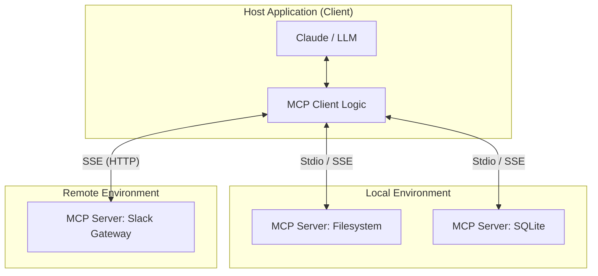

## 4.2 MCP 架构与核心概念

MCP 并不仅仅是一个简单的 API 定义，它是一套完整的分布式系统协议。要熟练使用 MCP，需要深入理解其架构组件及通信机制。

### 4.2.1 系统架构图谱

MCP 采用经典的 **Client-Server (C/S)** 架构，但在 AI 上下文中，角色的定义略有特殊。

#### MCP Client (Host)
**Client 是发起方**。通常是 Claude Desktop App、IDE (如 Cursor) 或用户编写的 AI Agent。
*   **职责**：负责管理与 Server 的连接、将用户的自然语言意图转化为 MCP 请求、并将 Server 返回的结果展示给用户或喂给 LLM。
*   *注意：LLM (模型) 本身不是 Client，裹着 LLM 的应用程序才是 Client。*

#### MCP Server
**Server 是能力提供方**。它是一个独立的轻量级进程。
*   **职责**：暴露资源（数据）、工具（功能）和提示词（模板）。它不负责“思考”，只负责“执行”和“提供数据”。
*   **特性**：Server 通常专注于单一领域（如只处理 Git，或只处理 PostgreSQL）。

### 4.2.2 三大核心原语 (The Three Pillars)

MCP 协议定义了三种主要的能力交互方式。

#### Resources (资源) —— "读取 Context"
资源是数据的抽象。这就好比是给 AI 提供了一个“只读文件系统”。
*   **类比**：`GET` 请求或文件读取。
*   **URI 寻址**：每个资源都有唯一的 URI。例如 `file:///home/user/notes.txt` 或 `postgres://db/users/schema`。
*   **用途**：让 Claude 读取大型文件的内容、数据库的 Schema 或实时的系统日志，而无需将它们全部复制到 Prompt 中。
*   **实时性**：资源支持订阅（Subscriptions）。当日志文件更新时，Server 可以主动推送新内容给 Claude。

#### Tools (工具) —— "执行 Action"
工具是可执行的函数。这与 Claude API 中的 Tool Use 完全一致，但通过 MCP 进行了封装。
*   **类比**：`POST` 请求或函数调用。
*   **结构**：包含 `name`, `description`, `input_schema`。
*   **用途**：创建文件、提交 Git Commit、发送 Slack 消息。
*   **流程**：Claude 发起 `tools/call` -> Server 执行逻辑 -> Server 返回 `content` (Text/Image) -> Claude 继续对话。

#### Prompts (提示词) —— "预设模版"
这是 MCP 独有的概念。它允许 Server 向 Client 注册可复用的提示词模板。
*   **类比**：Slash Command (斜杠命令)。
*   **用途**：Server 可以自带专家经验。
    *   例如 `mcp-server-git` 可以自带一个名为 `analyze-commit` 的 Prompt。
    *   用户只需在 Claude 界面输入 `/analyze-commit`。
    *   Server 就会把当前 Git 仓库的 diff 和相关的 System Prompt 组装好发给 Claude。

### 4.2.3 通信与传输层 (Transports)

MCP 协议基于 **JSON-RPC 2.0**，这意味着它是无状态的请求/响应模型。底层传输层主要有两种实现：

#### Stdio Transport (标准输入输出)
*   **最常用**。Client 作为父进程，启动 Server 作为子进程。
*   **通信**：通过 `stdin` 和 `stdout` 交换 JSON 消息。
*   **优点**：零网络开销，极其安全（Server 仅在本地运行，不暴露端口），部署简单（无需配置 IP/Port）。
*   **场景**：本地文件操作、本地数据库连接。

#### SSE Transport (Server-Sent Events)
*   基于 HTTP 的长连接。
*   **通信**：客户端发起 HTTP POST 发送请求，通过 EventSource 接收推送。
*   **优点**：支持远程连接，可以部署在 Docker 或云服务器中。
*   **场景**：企业内部的共享微服务（如连接公司内网 Jira 的 MCP Server）。

### 4.2.4 初始化握手

当 Claude Desktop 启动时，会发生以下过程：

1.  **Spawn**: 根据配置文件启动所有 `mcp-server` 进程。
2.  **Initialize**: Client 发送 `initialize` 请求，告知自己的版本和能力。
3.  **Negotiate**: Server 返回 `server_info` 和它支持的能力（如是否支持资源订阅）。
4.  **List**: Client 自动请求 `tools/list`, `resources/list`, `prompts/list` 来构建能力清单。

这一过程对用户完全透明。用户看到的只是 Claude 突然“学会”了操作数据库。

---

理论知识已经具备，现在动手实战。我们将配置 Claude Desktop 来连接一个本地的 SQLite 数据库。

➡️ [配置与实战指南](4.3_config.md)
