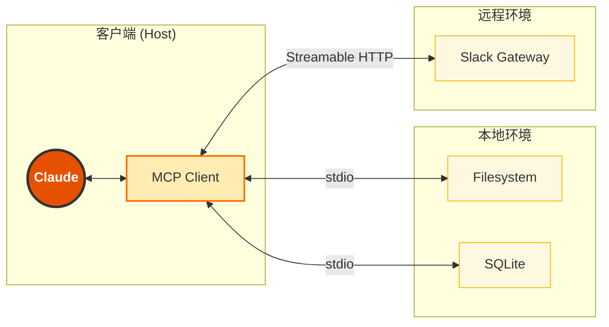

## 4.2 MCP 架构与核心概念

MCP 并不仅仅是一个简单的 API 定义，它是一套面向工具、资源与提示模板的应用层协议。要熟练使用 MCP，需要理解其架构组件、能力边界与通信机制。

### 4.2.1 系统架构图谱

MCP 采用经典的 **Client-Server (C/S)** 架构，但在 AI 场景里，角色定义略有特殊。


```mermaid
graph LR
    classDef core fill:#E65100,stroke:#333,stroke-width:3px,color:white,font-weight:bold;
    classDef branch fill:#FFECB3,stroke:#FF6F00,stroke-width:2px,color:#333;
    classDef node fill:#FFF8E1,stroke:#FFB300,stroke-width:1px,color:#333;

    subgraph HostApp["客户端 (Host)"]
        AI(("Claude")):::core <--> ClientLogic["MCP Client"]:::branch
    end

    subgraph LocalEnv["本地环境"]
        ClientLogic <-->|"stdio"| S1["Filesystem"]:::node
        ClientLogic <-->|"stdio"| S2["SQLite"]:::node
    end

    subgraph RemoteEnv["远程环境"]
        ClientLogic <-->|"Streamable HTTP"| S3["Slack Gateway"]:::node
    end
```

#### MCP Client

**Client 是发起方**。通常是 Claude Desktop、IDE、终端代理或其他 AI 宿主程序。
*   **职责**：管理与 Server 的连接、把用户意图转成 MCP 请求、并将 Server 的结果呈现给用户或喂给模型。
*   *注意：LLM 本身不是 Client；包裹 LLM 的宿主应用才是 Client。*

#### MCP Server

**Server 是能力提供方**。它通常是一个独立进程或独立服务。
*   **职责**：暴露资源（数据）、工具（功能）和提示词（模板）。
*   **特性**：一般专注于单一领域，如 Git、PostgreSQL、文件系统或企业内部系统。

### 4.2.2 三大核心原语

MCP 协议定义了三种主要能力。

#### 资源 —— “读取 Context”

资源是数据的抽象。
*   **类比**：`GET` 请求或文件读取。
*   **URI 寻址**：每个资源都有唯一 URI，例如 `file:///home/user/notes.txt` 或 `postgres://db/users/schema`。
*   **用途**：让 Claude 读取大文件、数据库 schema 或运行日志，而不必把全部内容塞进 prompt。
*   **补充**：不同实现可能支持订阅或增量刷新，但应以具体 Server 的能力声明为准。

#### 工具 —— “执行 Action”

工具是可执行的函数。
*   **类比**：`POST` 请求或函数调用。
*   **结构**：通常包含 `name`、`description`、`inputSchema` 等元数据。
*   **用途**：创建文件、执行查询、发送消息、触发工作流。
*   **流程**：Client 发起 `tools/call`，Server 执行逻辑并返回结果内容。

#### 提示词 —— “预设模板”

这是 MCP 相对有特色的一类能力，允许 Server 暴露可复用的提示模板。
*   **类比**：Slash Command（斜杠命令）或参数化 Prompt 模板。
*   **用途**：把某个领域里的标准分析过程沉淀为可复用入口。
*   **例子**：Git Server 可以提供一个 “分析当前 diff” 的提示模板，宿主应用把上下文采集和模板拼装标准化后，再交给模型执行。

### 4.2.3 通信与传输层

MCP 在消息层通常使用 **JSON-RPC 2.0**。在传输层，MCP 规范定义了 `stdio` 和 `Streamable HTTP` 两种标准传输方式，同时不同的客户端实现可能支持额外的传输选项。

#### `stdio`：本地进程通信

*   **最常用**：Client 作为父进程启动 Server 子进程。
*   **通信**：通过 `stdin` / `stdout` 交换 JSON-RPC 消息。
*   **优点**：部署简单、不暴露网络端口、适合本地工具。
*   **场景**：文件系统、本地数据库、本机开发工具。

#### `Streamable HTTP`：远程服务主流方案

*   **当前远程连接的推荐方案**。
*   **通信**：基于 HTTP 传输 JSON-RPC 消息，支持流式返回、会话恢复 token 和重试逻辑。
*   **优点**：适合容器部署、内网服务、云端网关，支持断线重连。
*   **场景**：团队共享服务、企业内部系统、需要远程认证的工具网关。

#### `SSE`：历史双向实现

*   **早期远程方案**：下行使用 Server-Sent Events，上行使用独立的 HTTP POST。
*   **定位**：在当前生态中属于历史兼容实现，新项目应优先使用 Streamable HTTP。
*   **仍可用**：部分已有 Server 仍采用此方案，Client 通常向后兼容。

#### `WebSocket`：低延迟选项（非 MCP 标准）

*   **注意**：WebSocket 传输并非 MCP 规范的一部分，而是某些客户端（如 Claude Code）的扩展实现。
*   **直连模式**：直接 JSON 消息传递，延迟最低。
*   **场景**：实时协作、需要双向高频通信的工具。
*   **兼容性**：使用前需确认 Server 端是否支持此协议。

> **提示**：选择传输方式时，优先使用 MCP 标准定义的 `stdio`（本地）或 `Streamable HTTP`（远程），以确保最大兼容性。仅在明确需要低延迟且 Server 端支持时考虑 WebSocket。

```json
{
  "transport": {
    "type": "streamable_http",
    "url": "https://mcp-server.company.com/mcp"
  }
}
```

#### MCP 服务器去重机制

当多个配置源（项目级、用户级、企业级）声明了 MCP Server 时，Claude Code 通过**连接签名**（启动命令或 URL）而非名称进行去重。这意味着即使两个配置用了不同的名称，只要启动命令或 URL 相同，系统只会建立一个连接。反过来，同名但参数不同的 Server 会被视为不同的连接。

#### Deferred Tools：按需加载工具 Schema

面对大规模工具库时，MCP 采用了一种重要的优化策略——**延迟加载（Deferred Tools）**：

1. 初始化时，Client 只获取工具的**名称列表**（通过 `deferred_tools_delta` 元数据）
2. 完整的工具 Schema（参数定义、描述等）**不会预先加载**
3. 当模型需要使用某个工具时，通过 `ToolSearch` 机制按需获取完整定义

这种设计的好处是显著减少了初始 prompt 的 token 占用。如果一个 MCP Server 暴露了 50 个工具，但当前任务只需要其中 2 个，预加载全部 Schema 会浪费大量上下文空间。Deferred Tools 让“工具发现”和“工具使用”解耦，实现了更高效的上下文利用。

> 这也解释了为什么有时 Claude 会先调用 `ToolSearch` 再调用实际工具——它需要先获取工具的完整参数定义。

### 4.2.4 MCP 认证与交互

随着 MCP 被用于企业系统和远程服务，认证与用户确认变得至关重要。

#### OAuth 2.1

对于远程 MCP Server，常见做法是由宿主应用或网关接入 **OAuth 2.1** 流程。

**工程上要把握两个原则：**

*   认证配置的具体字段由所用宿主、SDK 或 Server 实现决定，并不意味着 MCP 核心协议强制规定了某一套环境变量名。
*   写文档时应重点解释“为什么需要 OAuth、典型会话长什么样”，避免把某个私有实现的配置项写成协议标准。

#### Elicitation / 用户确认

在需要额外输入或确认的场景中，远程端与宿主端可能发生交互式确认，例如：

*   请求额外权限；
*   询问是否继续敏感操作；
*   补充缺失参数。

这类能力说明 MCP 并不总是单向“调用工具 -> 返回结果”，而是可以承载更复杂的人机协作流程。

### 4.2.5 初始化握手

当支持 MCP 的宿主应用启动并连接某个 Server 时，通常会发生以下过程：

1.  **启动或连接**：启动本地 `mcp-server` 进程，或连接远程服务。
2.  **Initialize**：Client 发送 `initialize` 请求，声明自己的协议版本与能力。
3.  **Negotiate**：Server 返回自身信息和支持的能力。
4.  **List**：Client 视需要请求 `tools/list`、`resources/list`、`prompts/list` 构建能力目录。
5.  **Auth / Consent**：若远程服务需要认证或用户确认，会在此阶段或首次调用时完成。

这一过程对用户通常是透明的。用户看到的只是 Claude “学会”了访问数据库、文件系统或企业服务。

### 4.2.6 配置层级与企业管控

> **来源说明**：本节描述的配置优先级和企业管控行为基于 Claude Code CLI 的实现（社区逆向分析，HitCC 项目）。其他 MCP 客户端的配置机制可能不同。

MCP 在 Claude Code 中的配置解析遵循多层优先级机制，从高到低依次为：

| 优先级 | 配置来源 | 说明 |
| :--- | :--- | :--- |
| 1 | 项目级 `.mcp.json` | 项目目录下的本地配置 |
| 2 | 用户级配置 | `~/.claude/` 下的个人配置 |
| 3 | 本地动态配置 | 运行时动态添加的 Server |
| 4 | 企业级配置 | 组织管理员统一下发 |
| 5 | claudeai 内置配置 | Anthropic 预置的默认 Server |

#### 企业管控约束

在企业环境中，MCP 配置不是简单的合并——**企业级配置会施加策略约束**：

*   当企业 MCP 配置存在时，用户**无法**使用 `--strict-mcp-config` 标志
*   用户**无法**通过命令行动态添加新的 MCP Server
*   企业管理员可以锁定允许使用的 Server 列表

这意味着 MCP 在企业部署中是一个**策略管控系统**，而非简单的配置文件合并。管理员可以确保所有用户只连接到经过审批的工具服务。

#### MCP 指令的动态性

MCP Server 可能在运行中动态更新其工具描述和指令内容。因此，客户端通常需要在每轮对话时重新获取最新的 MCP 指令，以确保模型看到的工具描述始终是最新的。

#### Resource 的使用方式

MCP Resource 的内容在被获取后，会直接出现在对话上下文中（而非保持为引用）。这意味着大型资源会直接占用上下文窗口空间，使用时需要注意资源大小的管理。

---

理论知识已经具备，现在动手实战。我们将配置 Claude Desktop 来连接一个本地的 SQLite 数据库。

➡️ [配置与实战指南](4.3_config.md)
