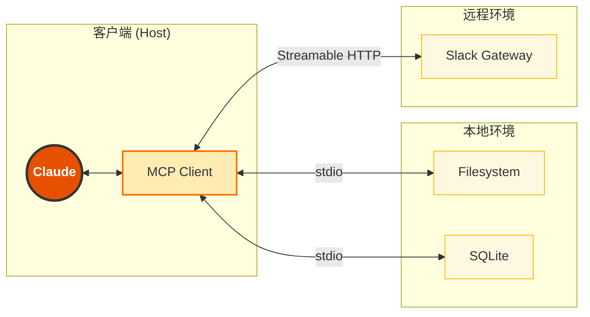

## 4.2 MCP 架构与核心概念

MCP 并不仅仅是一个简单的 API 定义，它是一套面向工具、资源与提示模板的应用层协议。要熟练使用 MCP，需要理解其架构组件、能力边界与通信机制。

### 4.2.1 系统架构图谱

MCP 采用经典的 **Client-Server (C/S)** 架构，但在 AI 场景里，角色定义略有特殊。


```mermaid
graph LR
    classDef core fill:#E65100,stroke:#333,stroke-width:3px,color:white,font-weight:bold;
    classDef branch fill:#FFECB3,stroke:#FF6F00,stroke-width:2px,color:#333;
    classDef node fill:#FFF8E1,stroke:#FFB300,stroke-width:1px,color:#333;

    subgraph HostApp["客户端 (Host)"]
        AI(("Claude")):::core <--> ClientLogic["MCP Client"]:::branch
    end

    subgraph LocalEnv["本地环境"]
        ClientLogic <-->|"stdio"| S1["Filesystem"]:::node
        ClientLogic <-->|"stdio"| S2["SQLite"]:::node
    end

    subgraph RemoteEnv["远程环境"]
        ClientLogic <-->|"Streamable HTTP"| S3["Slack Gateway"]:::node
    end
```

#### MCP Client

**Client 是发起方**。通常是 Claude Desktop、IDE、终端代理或其他 AI 宿主程序。
*   **职责**：管理与 Server 的连接、把用户意图转成 MCP 请求、并将 Server 的结果呈现给用户或喂给模型。
*   *注意：LLM 本身不是 Client；包裹 LLM 的宿主应用才是 Client。*

#### MCP Server

**Server 是能力提供方**。它通常是一个独立进程或独立服务。
*   **职责**：暴露资源（数据）、工具（功能）和提示词（模板）。
*   **特性**：一般专注于单一领域，如 Git、PostgreSQL、文件系统或企业内部系统。

### 4.2.2 三大核心原语

MCP 协议定义了三种主要能力。

#### 资源 —— “读取 Context”

资源是数据的抽象。
*   **类比**：`GET` 请求或文件读取。
*   **URI 寻址**：每个资源都有唯一 URI，例如 `file:///home/user/notes.txt` 或 `postgres://db/users/schema`。
*   **用途**：让 Claude 读取大文件、数据库 schema 或运行日志，而不必把全部内容塞进 prompt。
*   **补充**：不同实现可能支持订阅或增量刷新，但应以具体 Server 的能力声明为准。

#### 工具 —— “执行 Action”

工具是可执行的函数。
*   **类比**：`POST` 请求或函数调用。
*   **结构**：通常包含 `name`、`description`、`inputSchema` 等元数据。
*   **用途**：创建文件、执行查询、发送消息、触发工作流。
*   **流程**：Client 发起 `tools/call`，Server 执行逻辑并返回结果内容。

#### 提示词 —— “预设模板”

这是 MCP 相对有特色的一类能力，允许 Server 暴露可复用的提示模板。
*   **类比**：Slash Command（斜杠命令）或参数化 Prompt 模板。
*   **用途**：把某个领域里的标准分析过程沉淀为可复用入口。
*   **例子**：Git Server 可以提供一个 “分析当前 diff” 的提示模板，宿主应用把上下文采集和模板拼装标准化后，再交给模型执行。

### 4.2.3 通信与传输层

MCP 在消息层通常使用 **JSON-RPC 2.0**。在传输层，当前工程上应优先按下面的分类理解：

#### `stdio`

*   **最常用**：Client 作为父进程启动 Server 子进程。
*   **通信**：通过 `stdin` / `stdout` 交换 JSON 消息。
*   **优点**：部署简单、不暴露网络端口、适合本地工具。
*   **场景**：文件系统、本地数据库、本机开发工具。

#### `Streamable HTTP`

*   **当前远程连接的主流方案**。
*   **通信**：基于 HTTP 传输 JSON-RPC 消息，并支持流式返回与更灵活的交互模式。
*   **优点**：适合部署在容器、内网服务、云端网关之后。
*   **场景**：团队共享服务、企业内部系统、需要远程认证的工具网关。

#### 关于 SSE 的位置

很多早期文章会把 **SSE** 当成第三种独立 transport 来介绍。更准确的说法是：

*   旧版生态里确实存在 `HTTP + SSE` 的实现；
*   但在当前文档和实现里，工程上应优先使用 `Streamable HTTP`；
*   因此，SSE 更适合被视为**历史兼容实现或流式传输机制的一部分**，而不是与 `stdio`、`Streamable HTTP` 并列的长期首选 transport。

```json
{
  "transport": {
    "type": "streamable_http",
    "url": "https://mcp-server.company.com/mcp"
  }
}
```

### 4.2.4 MCP 认证与交互

随着 MCP 被用于企业系统和远程服务，认证与用户确认变得至关重要。

#### OAuth 2.1

对于远程 MCP Server，常见做法是由宿主应用或网关接入 **OAuth 2.1** 流程。

**工程上要把握两个原则：**

*   认证配置的具体字段由所用宿主、SDK 或 Server 实现决定，并不意味着 MCP 核心协议强制规定了某一套环境变量名。
*   写文档时应重点解释“为什么需要 OAuth、典型会话长什么样”，避免把某个私有实现的配置项写成协议标准。

#### Elicitation / 用户确认

在需要额外输入或确认的场景中，远程端与宿主端可能发生交互式确认，例如：

*   请求额外权限；
*   询问是否继续敏感操作；
*   补充缺失参数。

这类能力说明 MCP 并不总是单向“调用工具 -> 返回结果”，而是可以承载更复杂的人机协作流程。

### 4.2.5 初始化握手

当支持 MCP 的宿主应用启动并连接某个 Server 时，通常会发生以下过程：

1.  **启动或连接**：启动本地 `mcp-server` 进程，或连接远程服务。
2.  **Initialize**：Client 发送 `initialize` 请求，声明自己的协议版本与能力。
3.  **Negotiate**：Server 返回自身信息和支持的能力。
4.  **List**：Client 视需要请求 `tools/list`、`resources/list`、`prompts/list` 构建能力目录。
5.  **Auth / Consent**：若远程服务需要认证或用户确认，会在此阶段或首次调用时完成。

这一过程对用户通常是透明的。用户看到的只是 Claude “学会”了访问数据库、文件系统或企业服务。

---

理论知识已经具备，现在动手实战。我们将配置 Claude Desktop 来连接一个本地的 SQLite 数据库。

➡️ [配置与实战指南](4.3_config.md)
