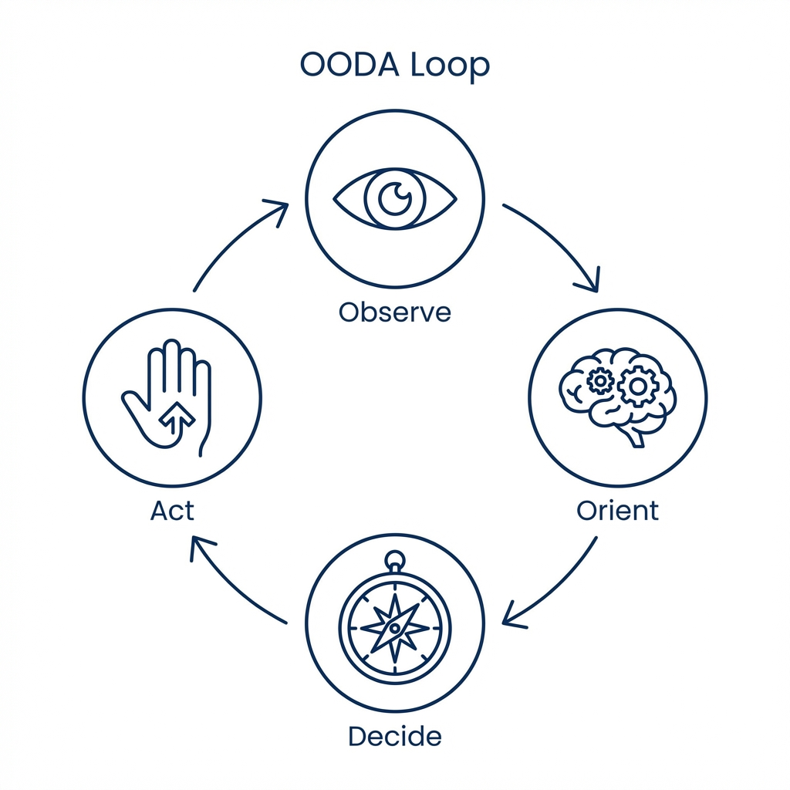
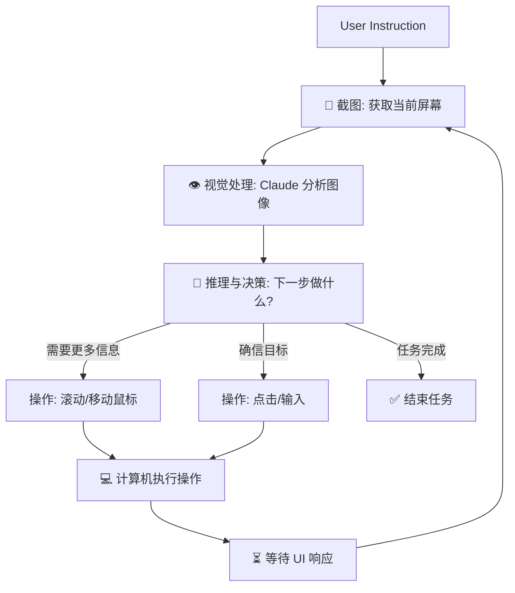

## 5.2 工作原理：截图、识别、行动 (The Agent Loop)

Computer Use 的核心不是魔法，而是一个高速运转的 **Agentic Loop (代理循环)**。
理解这个循环，对于调试 Agent 的行为和优化性能至关重要。

### 5.2.1 核心循环图解

这是一个典型的 **OODA 循环** (Observe-Orient-Decide-Act)。

**图 1：Computer Use OODA 循环**
这张概念图展示了 Claude 与计算机交互的高层逻辑。左侧是“大脑”（Claude 模型），右侧是“环境”（计算机界面）。两者通过“截图”（Vision）和“行动”（Action）连接。模型不断观察屏幕状态，形成认知，做出决策，然后施加影响，形成闭环。

**图 2：详细执行流程图**
上方流程图详细拆解了每一步的技术实现：
1.  **输入**：始于用户的自然语言指令。
2.  **感知**：获取屏幕截图，这是 AI 的“眼睛”。
3.  **决策**：Claude 分析图像内容（如识别按钮位置），结合任务目标，决定下一步行动。
4.  **执行**：如果需要更多信息（如找不到目标），可能会执行滚动操作；如果确定目标，则执行点击或输入。
5.  **反馈**：执行后系统会等待 UI 响应（如页面跳转），然后再次截图，开始下一轮循环。

每一轮循环，Claude 都必须重新评估整个局势。

### 5.2.2 三大核心工具

在 Computer Use 模式下，Claude 会自动获得三个特定的工具定义。无需自行编写工具实现，Anthropic 提供了参考实现，但需理解其作用。

#### `computer` (计算机控制)
这是最核心的工具，用于执行键鼠操作。
*   **输入参数**:
    *   `action`: 动作类型 (`key`, `type`, `mouse_move`, `left_click`, `left_click_drag`, `right_click`, `middle_click`, `double_click`, `screenshot`, `cursor_position`).
    *   `coordinate`: `[x, y]` 坐标（可选）。
    *   `text`: 要输入的文本（可选）。
*   **特性**: Claude 经过特殊训练，能够理解 1920x1080 (或其他分辨率) 的像素坐标系。

#### `str_replace_editor` (文本编辑器)
虽然 Claude 可以通过 GUI 打开记事本打字，但这很慢且容易出错。
这个工具允许 Claude 直接以编程方式读写文件。这对于编写代码、修改配置文件非常高效。
*   **功能**: view (查看), create (创建), str_replace (替换), insert (插入), undo_edit (撤销)。

#### `bash` (命令行)
对于安装软件、运行脚本、Git 操作，GUI 往往不如 CLI 高效。
Claude 可以在终端中执行命令，并获取 stdout/stderr。

### 5.2.3 详细交互流程示例

以下通过一个任务来透视这个过程：**"去 Google Images 搜索'可爱猫咪'并保存第一张图。"**

#### Turn 1: 观察与规划
*   **State**: 屏幕显示空白桌面。
*   **User**: "去 Google Images..."
*   **Claude Thinking**: "我需要先打开浏览器。"
*   **Claude Action**: `computer(action="left_click", coordinate=[50, 800])` (假设这是 Chrome 图标位置)

#### Turn 2: 等待与输入
*   **State**: Chrome 窗口正在打开，可能还在加载。
*   **Claude Thinking**: "浏览器打开了，我需要点击地址栏。"
*   **Claude Action**: `computer(action="type", text="images.google.com")` + `computer(action="key", text="Return")`

#### Turn 3: 视觉搜索
*   **State**: Google 图片首页已加载。
*   **Claude Thinking**: "看到了搜索框。我需要输入关键词。"
*   **Claude Action**: `computer(action="legacy_click", coordinate=[...])` + `computer(action="type", text="cute cats")` + `key("Return")`

#### Turn 4: 精准定位
*   **State**: 满屏猫咪图。
*   **Claude Thinking**: "我要保存第一张。我需要右键点击它。"
*   **Claude Action**: `computer(action="right_click", coordinate=[200, 300])`

#### Turn 5: 菜单导航
*   **State**: 右键菜单弹出。
*   **Claude Thinking**: "看到了 'Save Image As...' 选项 text。我需要点击它。"
*   **Claude Action**: `computer(action="left_click", coordinate=[220, 350])`

... (后续步骤：输入文件名，点击保存按钮)

### 5.2.4 视觉提示工程 (Visual Prompt Engineering)

在 Computer Use 中，Context 不仅是文本，更是**像素**。
截图的质量直接影响 Claude 的智商。

#### 分辨率权衡
*   **高分辨率**: 细节清晰，但 Token 消耗巨大，且增加延迟。
*   **低分辨率**: 速度快，但小字看不清，容易误点。
*   **推荐**: 1024x768 或 1280x800 是目前的最佳平衡点。Anthropic 模型在训练时对这些标准分辨率有优化。

#### 像素坐标系 (Pixel Coords)
Claude 在输出坐标时，是基于它看到的图片分辨率。如果截图经过了缩放（Scaling），必须在执行点击前，将 Claude 返回的坐标**映射**回真实的屏幕坐标。

### 5.2.5 Token 消耗警示

Computer Use 是 Token 吞噬兽。
*   **一张截图**：约需 1,000 - 3,000 Tokens (取决于分辨率和压缩)。
*   **单次任务**：简单的“订机票”流程可能包含 50 个步骤，消耗 100k+ Tokens。
*   **成本控制**：
    *   不要每一步都截图。如果确定连续操作（如输入文字后按回车），可以在一次 API 调用中返回多个 actions，减少截图次数。
    *   使用 `beta` 标志开启 Prompt Caching。

---

理解原理后，接下来需要搭建一个安全的环境。毕竟，避免误操作导致数据丢失至关重要。

➡️ [环境配置：Docker 安全沙箱](5.3_env.md)
