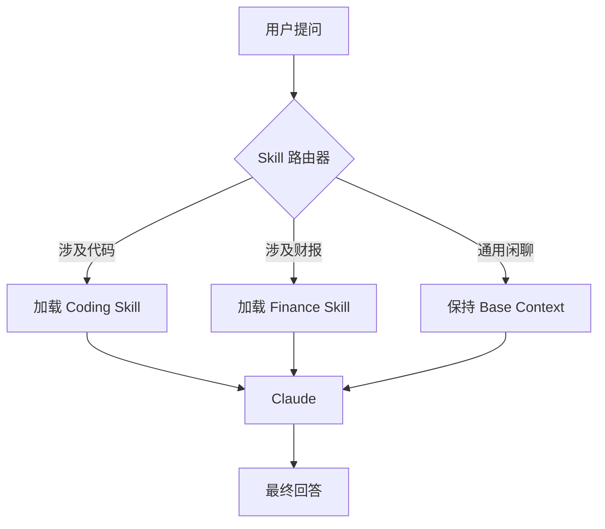

## 6.1 什么是 Claude Skills：AI 的“职业技能书”

在 RPG 游戏中，一个角色即使等级很高（基础模型智力高），如果不学习具体的“技能书”（Skills），也无法施展特定的魔法。
Claude 也是如此。虽然基础模型（Base Model）通晓天文地理，但在某些高度专业化、流程化的任务上，它需要**Skills**。

### 6.1.1 核心范式转变：从 Prompt Engineering 到 Context Engineering

此时我们需要引入一个更深层的概念：**上下文工程 (Context Engineering)**。

传统的 *Prompt Engineering* 关注如何通过话术让 AI "听懂指令"。
而 *Context Engineering* 将模型的有限上下文窗口（Context Window）视为一种**稀缺的计算资源**。

*   **信噪比 (Signal-to-Noise Ratio)**: 每一个 Token 都应该提供有效信息。Skills 的本质就是为了最大化特定任务下的信噪比。
*   **渐进式披露 (Progressive Disclosure)**: 不要一次性把整本百科全书塞给 Claude。Skills 允许我们根据任务进展，**Just-In-Time (JIT)** 地动态加载所需的上下文片段。

**Skills 是 Anthropic 为 Claude 设计的一种模块化、可复用且符合 Context Engineering 原则的专业知识与能力封装。**

### 6.1.2 Skills vs Prompts vs Tools

很容易混淆这三个概念，需要理清它们的关系：

| 概念                | 类比                   | 作用             | Context Engineering 视角 |
| :---------------- | :------------------- | :------------- | :--------------------- |
| **System Prompt** | **人设** (Personality) | 决定整体风格和边界      | 全局静态上下文 (Static Context) |
| **Tools (MCP)**   | **手/口** (Apparatus)  | 连接外部系统执行操作     | 动态执行能力 (Capabilities) |
| **Skills**        | **专业能力** (Expertise) | 封装特定任务的最佳实践和流程 | **高密度、模块化的动态上下文包** |

**Skill = Specialized System Prompt + Domain Knowledge (Documents) + Specific Tools**

例如，一个 **"Data Analyst Skill"** 可能包含：
1.  **Prompt**: "你是一个严谨的数据分析师，分析时必须先做数据清洗..."
2.  **Tools**: `pandas` (Python 库) 或 `excel_parser`。
3.  **Knowledge**: 统计学公式手册。

### 6.1.3 为什么需要 Skills？

#### 降低 Prompt 工程门槛
普通用户不需要知道如何写复杂的 Prompt 来让 Claude 变成一个好的文案，他们只需要加载 `Copywriter Skill`。

#### 上下文优化
如果把所有规则都写在 System Prompt 里，上下文窗口很快就爆了。
Skills 采用**动态加载**机制。只有当 Claude 识别到当前任务需要（比如用户在问法律问题）时，才会将 `Legal Skill` 注入到上下文中。

#### 团队标准化
企业可以定义一套标准的 `Code Review Skill`，分发给所有员工。这样无论谁在用 Claude，生成的代码审查意见都是符合公司规范的。

### 6.1.4 Skills 的运作机制

Skills 的核心思想是**按需增强 (On-Demand Augmentation)**。

当在 Claude Desktop 或企业版中使用 Skills 时，系统会在后台：
1.  语义分析你的意图。
2.  检索最相关的 Skill 包。
3.  将 Skill 中的各类资源（Prompt, Tools, Docs）动态拼接到当前的 Context 中。
4.  执行任务。

### 6.1.5 应用场景举例

*   **HR 招聘助手**: 加载 `Resume Screener Skill`，包含简历评分标准和面试题库。
*   **合规审核员**: 加载 `Compliance Skill`，包含行业法规文档，专门用于审核合同风险。
*   **全栈开发者**: 组合 `Frontend Skill` (React/CSS) 和 `Backend Skill` (Go/SQL)。

---

理解了 Skills 的概念，接下来看看一个标准的 Skill 到底长什么样？它的内部文件结构是如何组织的？以及如何使用 **BDI 模型** 来构建高级认知 Skill。

➡️ [Skills 的结构与组成](6.2_structure.md)
