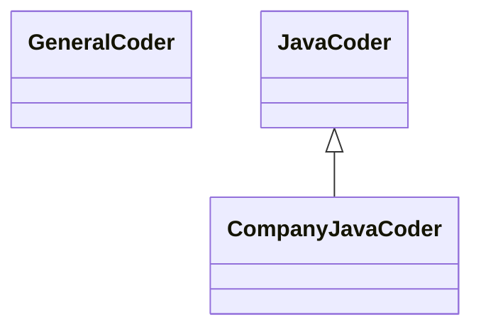

## 6.2 Skills 的结构与组成

一个 Skill 不仅仅是一段文字，它是一个**工程化的软件包**。类似于程序员熟悉的 npm 包或 Python Wheel。
了解其内部结构，是创建自定义 Skill 的第一步。

### 6.2.1 标准文件目录结构

一个典型的 Skill 包（文件夹）结构如下：

```text
my-awesome-skill/
├── manifest.json        # 元数据：名称、版本、依赖
├── skill.md             # 核心指令 (System Prompt)
├── docs/                # 领域知识文档 (RAG Source)
│   ├── guidelines.pdf
│   └── api_specs.md
├── tools/               # 专用工具定义 (MCP)
│   ├── calculator.py
│   └── search.ts
└── examples/            # Few-shot 示例库
    ├── input_1.txt
    └── output_1.txt
```

#### `manifest.json`
定义 Skill 的基本信息，帮助 Router 识别它。

```json
{
  "name": "enterprise-java-expert",
  "version": "1.0.0",
  "description": "Expert in Java Spring Boot development.",
  "triggers": ["java", "spring boot", "jvm", "memory leak"]
}
```

#### `skill.md`
这是 Skill 的灵魂。它包含特定于该领域的 System Prompt。

```markdown
# Role
你是一位拥有 10 年经验的 Java 架构师。

# Guidelines
1. 始终使用 Java 17+ 特性。
2. 优先通过 Stream API 处理集合。
3. 如果看到 `System.out.println`，必须警告用户改用 `Slf4j`。
```

#### `docs/` (知识库) 与 `tools/`
存放该领域的“教科书”与专用工具脚本（MCP）。

### 6.2.2 核心要素设计原则

设计 Skill 时，要遵循 **"高内聚，低耦合"** 的原则。
*   **专注单一领域**: 不要尝试做一个 `Everything Skill`。
*   **隐性经验显性化**: 将大神的直觉转化为具体的指导原则。

### 6.2.3 高级认知模式：BDI 模型

在构建复杂的 Agent Skill 时，仅仅给指令是不够的。我们需要建立 Agent 的**心智模型**。
参考 **BDI (Beliefs-Desires-Intentions)** 理论，我们可以在 `skill.md` 中使用 XML 标签显式定义认知状态。

```xml
<cognitive_model>
    <beliefs>
        <!-- Agent 对世界的基本认知 -->
        <belief>代码质量比开发速度更重要。</belief>
        <belief>用户通常不清楚所有的安全隐患，需要我主动指出。</belief>
        <belief>未经测试的代码是不可信的。</belief>
    </beliefs>

    <desires>
        <!-- Agent 的长远目标 -->
        <desire>编写出鲁棒、可维护、符合 SOLID 原则的系统。</desire>
        <desire>帮助用户提升编程水平，而不仅仅是给出答案。</desire>
    </desires>

    <intentions>
        <!-- Agent 在当前交互中的意图 -->
        <intention>在给出代码前，先分析现有架构的潜在风险。</intention>
        <intention>如果发现用户的需求有逻辑漏洞，必须通过提问来澄清。</intention>
    </intentions>
</cognitive_model>
```

**为什么 BDI 有用？**
在长对话中，Agent 容易迷失（Recall Loss）。通过在 System Prompt 中植入 BDI 结构，我们通过 XML 标签为 Agent 提供了一个**“道德指南针”和“决策树”**。
*   当 Agent 面临两难选择（不仅要快，还要好）时，它会查阅 `<beliefs>` 来做权衡。
*   这比单纯的自然语言指令（"Be professional"）提供更强的约束力。

### 6.2.4 继承与组合

Skill 支持类似面向对象编程的**继承**关系。



*   **GeneralCoder**: 包含通用的编程原则（DRY, SOLID）。
*   **JavaCoder**: 继承通用原则，增加 Java 特有的语法规范。
*   **CompanyJavaCoder**: 继承 Java 规范，增加公司内部特定的库使用规则。

这种分层结构极大地提高了 Skill 的维护效率，实现了 Prompt 片段的复用。

---

了解 Skill 的组装结构后，在实际使用中，很多时候无需重复造轮子，因为官方已经内置了许多强大的 Skills。

➡️ [使用内置 Skills](6.3_builtin.md)
