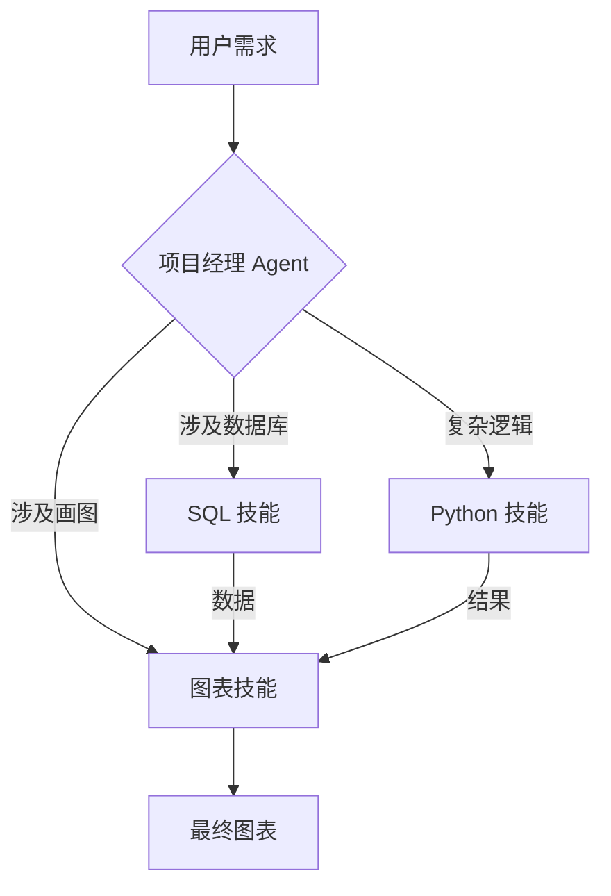

## 6.5 Skills 组合与高级用法

在单一 Skill 之外，真正的魔法发生在**组合**之中。
就像一个足球队不能只有前锋一样，处理复杂的业务流程（Business Process）往往需要多个不同领域的 Skill 互相配合。

### 6.5.1 Skill Chaining

最简单的组合方式是串行调用。
一个 Skill 的输出，成为下一个 Skill 的输入。

**案例：从构思到发布文章**

1.  **Step 1: Research Skill**
    *   *Input*: "帮我研究一下最新的 AI Agent 趋势。"
    *   *Action*: 联网搜索，阅读白皮书，总结要点。
    *   *Output*: 一份结构化的研究简报。
2.  **Step 2: Copywriting Skill**
    *   *Input*: (主要基于 Step 1 的简报) "把这份简报写成一篇通俗易懂的公众号文章。"
    *   *Action*: 运用 Storytelling 技巧，调整语气，起标题。
    *   *Output*: 文章草稿。
3.  **Step 3: Compliance Skill**
    *   *Input*: 文章草稿。
    *   *Action*: 检查是否违反广告法，是否有虚假宣传。
    *   *Output*: 修改后的合规文章。

这种链式结构可以通过 Workflow 引擎（如 LangChain 或 Claude 自带的 Agent 模式）自动化实现。

### 6.5.2 Dynamic Routing

在更高级的系统中，Router 是智能的。它像一个项目经理，动态决定要把任务派给谁。

**实战场景：智能客服**
*   用户问：“我的包裹丢了，怎么赔付？”
    *   Router 识别意图 -> 激活 `Refund Policy Skill`。
*   用户接着问：“那我现在账户里还有多少钱？”
    *   Router 识别意图 -> 切换到 `Account Info Skill` (调用 MCP 查询余额)。

### 6.5.3 Skill Conflict

当两个 Skill 的指令冲突时怎么办？
*   Skill A (Creative): "尽可能发挥想象力，不受拘束。"
*   Skill B (Legal): "严谨，字斟句酌，不要过度承诺。"

**解决方案：优先级 (Priority Weights)**
在 `manifest.json` 中可以定义优先级。通常 **Legal/Security Skill** 的优先级最高，它们充当“守门员”的角色。
即：Create (Skill A) -> Review (Skill B) -> Output。

### 6.5.4 团队协作与共享

在企业内部，Skills 应该像代码库一样被管理。

#### Skill Registry
建立一个公司内部的 `git` 仓库 `internal-skills`。
*   `/marketing/social-media-expert`
*   `/engineering/python-guru`
*   `/hr/policy-qa`

#### 版本控制
Skill 也会迭代。
*   v1.0: 只能写 Java 8 代码。
*   v2.0: 升级到 Java 17，增加了 Spring Boot 3 的支持。
确保 Router 能够锁定版本（Pinning），防止 Skill 升级导致原有业务逻辑崩溃。

### 6.5.5 跨平台一致性

理想的 Skill 定义应该是平台无关的。
无论是在 **Claude Desktop App**，还是在 CLI 工具 **Claude Code**，甚至是集成了 Claude API 的 **Slack Bot** 中，同一个 Skill 应该表现出相同的行为。

这要求在编写 Skill 时，尽量使用标准的 Markdown 和 JSON Schema，避免依赖特定客户端的黑魔法特性。

---

通过前面的学习，Claude 已经从最初的对话助手，进化为能够熟练操作工具（Tools & MCP）、感知视觉环境（Computer Use），并拥有特定垂直领域专长（Skills）的智能体。

现在的 Claude，已经不是一个简单的 chatbot，而是一个**全副武装的智能体 (Agent)**。

但所有的这些技术，最终都要回归到一个最本质的用途——**写代码**。因为代码是构建数字世界的基石，也是 AI 发挥生产力杠杆作用最大的领域。

下一章将进入深水区，探讨 Claude 在软件工程领域的终极形态。

➡️ [第七章：Agentic Coding 智能编程](../07_coding/README.md)
