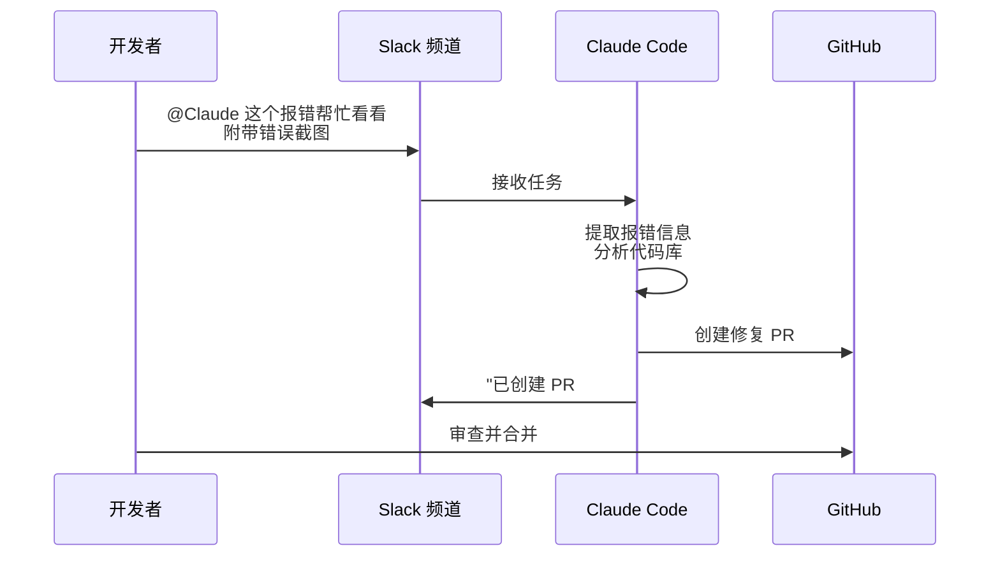

## 7.6 Claude Code 高阶特性与多端生态

Claude Code 诞生之初就被定义为一个可以无处不在的 AI 智能助理。它不仅局限于开发者的终端 CLI 和 IDE，还能扩展到完整的开发工作流与跨平台的交互中。

### 7.6.1 多端无缝衔接

Claude Code 的能力不仅存在于本地 CLI 中，通过同一底层引擎的互联，可以实现多种场景的无缝切换。

#### IDE 深度集成

原生的 Claude Code 扩展支持主流 IDE 和编辑器：

| 编辑器 | 集成方式 | 核心功能 |
| :--- | :--- | :--- |
| **VS Code** | 官方扩展 | 内联 Diff、终端集成、代码操作 |
| **Cursor** | 原生支持 | Composer、自动索引、Tab 补全 |
| **Windsurf** | 原生支持 | Cascade 工作流、多文件编辑 |
| **JetBrains** | 官方插件 | IntelliJ、PyCharm、WebStorm 等全系列 |

在 IDE 中，Claude Code 可以直接读取项目上下文、展示内联的差异比对（Inline Diff），并在编辑器内完成代码修改与审查，无需切换到终端。

#### Desktop 与 Web 协同

通过 **Desktop App**（桌面版应用），可以在可视化界面中管理多条并行任务工作流：

- **多任务视图**：同时观察多个任务的进度和 Diff
- **后台执行**：长耗时任务（如大规模重构）可在后台持续运行
- **实时日志**：查看每个子任务的输出和状态

通过 **Web 版**（`claude.ai/code`）或 **iOS App**，即使不在开发环境旁，也可以远程下发任务：

```text
# 在手机上发起任务
"请审查 main 分支最近 3 天的所有 commit，检查是否有安全隐患，生成报告到 reviews/ 目录。"
```

任务会在云端的沙箱环境中执行，完成后通过通知推送结果。

#### Slack 集成

将 Claude Code 集成到 Slack 后，团队协作效率大幅提升。典型工作流如下：



这种模式特别适合非紧急的 Bug 修复和日常维护任务，极大地压缩了从"发现问题"到"提交修复"的周期。

### 7.6.2 超越终端：跨端传送

Claude Code 支持跨客户端的上下文传送，允许在不同端之间无缝切换。

#### `/teleport` 命令

在终端中执行 `/teleport`，可以接管当前正在 Web 或移动端执行的长耗时任务：

```bash
> /teleport
# 列出所有活跃的远程任务
# 选择要接管的任务，上下文自动同步到本地终端
```

#### `/desktop` 命令

反过来，当终端中的调试陷入死胡同时，可以将当前上下文推送到桌面客户端的可视化环境：

```bash
> /desktop
# 上下文自动同步到 Desktop App
# 在可视化界面中查看文件树、Diff 和执行历史
```

这种随境切换的能力，让开发者在"终端高效操作"和"可视化全局审视"之间自由切换。

### 7.6.3 多智能体协作

当工程任务庞大（如整体迁移框架、全局修改底层数据库驱动等）时，单线程的进程容易在漫长的修改中陷入上下文过载或错误循环。

#### Sub-Agents 并行执行

Claude Code 的 **Sub-Agents（子代理）** 机制允许主代理将大型任务拆分为多个独立子任务：

```text
主代理 (Lead Agent)
├── 子代理 A: 重构 src/auth/ 模块 → 独立分支
├── 子代理 B: 重构 src/api/ 模块 → 独立分支
└── 子代理 C: 更新所有测试文件 → 独立分支
```

每个子代理在独立的上下文中工作，避免了单一上下文窗口的容量限制。主代理负责统筹进度、审阅各子代理的成果，并最终合并结果。

#### Agent SDK 定制

对于更加专业的定制化工作流，可以使用 Anthropic 发布的原生 **Agent SDK** 构建专属的调度代理：

```python
from anthropic_claude_code import ClaudeCode

claude = ClaudeCode()

# 定义并行子任务
tasks = [
    {"task": "重构 auth 模块", "working_directory": "./src/auth"},
    {"task": "重构 api 模块", "working_directory": "./src/api"},
    {"task": "更新测试套件", "working_directory": "./tests"},
]

# 并行执行
results = claude.run_parallel(tasks, allowed_tools=["read_file", "write_file"])
```

这种多智能体并行模式，将传统的线性开发流程升级为高度并行的"团队协作"模式，特别适合大规模代码迁移和架构重构。

---

从命令行起步，一路连通各端工具栈与生态整合，Claude Code 已经从一个终端工具进化为覆盖开发全流程的编程基础设施。
