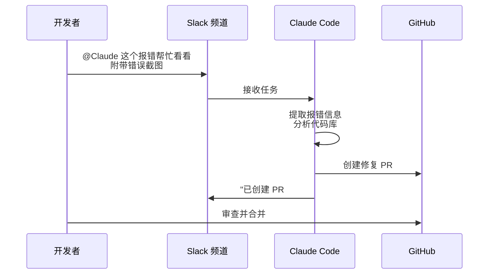

## 7.6 Claude Code 高阶特性与多端生态

Claude Code 诞生之初就被定义为一个可以无处不在的 AI 智能助理。它不仅局限于开发者的终端 CLI 和 IDE，还能扩展到完整的开发工作流与跨平台的交互中。

### 7.6.1 多端无缝衔接

Claude Code 的能力不仅存在于本地 CLI 中，通过同一底层引擎的互联，可以实现多种场景的无缝切换。

#### IDE 深度集成

原生的 Claude Code 扩展支持主流 IDE 和编辑器：

| 编辑器 | 集成方式 | 核心功能 |
| :--- | :--- | :--- |
| **VS Code** | 官方扩展 | 内联 Diff、终端集成、代码操作 |
| **Cursor** | 原生支持 | Composer、自动索引、Tab 补全 |
| **Windsurf** | 原生支持 | Cascade 工作流、多文件编辑 |
| **JetBrains** | 官方插件 | IntelliJ、PyCharm、WebStorm 等全系列 |

在 IDE 中，Claude Code 可以直接读取项目上下文、展示内联的差异比对（Inline Diff），并在编辑器内完成代码修改与审查，无需切换到终端。

#### Desktop 与 Web 协同

通过 **Desktop App**（桌面版应用），可以在可视化界面中管理多条并行任务工作流：

- **多任务视图**：同时观察多个任务的进度和 Diff
- **后台执行**：长耗时任务（如大规模重构）可在后台持续运行
- **实时日志**：查看每个子任务的输出和状态

通过 **Web 版**（`claude.ai/code`）或 **iOS App**，即使不在开发环境旁，也可以远程下发任务：

```text
# 在手机上发起任务
"请审查 main 分支最近 3 天的所有 commit，检查是否有安全隐患，生成报告到 reviews/ 目录。"
```

任务会在云端的沙箱环境中执行，完成后通过通知推送结果。

#### Slack 集成

将 Claude Code 集成到 Slack 后，团队协作效率大幅提升。典型工作流如下：



这种模式特别适合非紧急的 Bug 修复和日常维护任务，极大地压缩了从“发现问题”到“提交修复”的周期。

### 7.6.2 跨端继续当前会话

Claude Code 的多端协同需要区分”已经公开发布的能力”和”设想中的能力”。官方文档已经明确公开的能力主要有：

- **`/desktop`**：将当前会话继续到 Claude Code Desktop App。该命令只在 macOS 和 Windows 上可见。
- **`/remote-control`**：让当前 CLI 会话可从 `claude.ai` 远程接管或继续。
- **`/remote-env`**：配置 Web 端会话启动时使用的默认远程环境。

```bash
> /desktop

# 在桌面应用中继续当前会话

> /remote-control

# 允许从 claude.ai 远程控制当前 CLI 会话
```

像 `/teleport` 这类没有出现在官方命令列表里的名字，不应该写成可直接执行的命令，更不应该和已经正式支持的 `/desktop` 混在同一组“实验性功能”里。

### 7.6.3 高效工作流实践

Claude Code 的深度用户在实践中总结出了一套显著提升效率的工作方法论，核心理念是 **”80% 规划 + 20% 执行”**——与传统开发中 80% 写代码、20% 做计划的比例恰好相反。

#### plan.md 驱动开发

这套方法的核心是 **plan.md 文件**。每当有新想法、新 Bug 或新需求时，第一步不是写代码，而是生成一份结构化的计划文件。计划文件包含问题描述、方案选择、需修改的文件列表和带复选框的验收标准。

计划文件的真正价值在于它是 **跨会话的持久化检查点**。当上下文丢失（窗口关闭、上下文膨胀等）时，只需开一个新会话，指向已有的 plan.md，即可从断点继续。计划就是能扛过一切的检查点。

社区中流行的 Compound Engineering 插件提供了 `/ce:plan` 和 `/ce:work` 命令来实现这一工作流：`/ce:plan` 并行启动多个 research agent（一个分析代码库、一个搜索历史经验、一个调研外部最佳实践），汇总后写出结构化计划；`/ce:work` 接过计划并逐步实现，运行测试，勾选验收标准。

#### 并行会话

高效用户通常同时运行 **4-6 个 Claude Code 会话**，每个会话处理不同任务——一个在写计划、一个在执行另一个计划、一个在做技术调研、一个在修 Bug。这要求 Claude Code 能自主运行而不频繁请求权限确认，否则无法在多个窗口间来回切换。

#### 语音驱动开发

语音转 LLM 与传统语音输入有本质区别：转录不需要完美，因为 Claude Code 理解上下文，能猜出麦克风听错了什么。可以含糊不清、话说到一半、重新组织句子。Monologue 和 WhisperFlow 等工具可以将语音直接输入到当前聚焦的应用中，配合编辑器的自动保存功能，实现类 Google Docs 的实时协作体验——说话即编程。

#### 关键配置

三个显著提升体验的配置：

**1. 跳过权限确认**（`~/.claude/settings.json`）：

```json
{
  "permissions": {
    "allow": ["Bash", "Read", "Write", "Edit", "Glob", "Grep"],
    "defaultMode": "bypassPermissions"
  },
  "skipDangerousModePermissionPrompt": true
}
```

**2. 任务完成提示音**（Stop hooks）：

```json
{
  "hooks": {
    "Stop": [
      {
        "hooks": [
          {
            "type": "command",
            "command": "afplay /System/Library/Sounds/Blow.aiff"
          }
        ]
      }
    ]
  }
}
```

同时跑多个会话时，听到声音就知道哪个完成了。

**3. 编辑器自动保存**（如 Zed 的 500ms 间隔配置，详见 7.4.3 节）。

#### 非代码场景

这套工作流不限于编程。例如，开着会议录音工具（如 Granola），会后把完整的九十分钟会议记录（包括闲聊）粘贴到 Claude Code 中生成产品提案——Claude 会自动忽略关于餐厅的聊天，只提取产品相关的讨论，并交叉参照代码库和历史战略文档。战略文档、竞品分析、文章写作都可以用同样的“说、计划、迭代”循环。

对于需要随时远程操作的场景，可以在 Mac Mini 上部署 Claude Code，通过 Telegram 从手机发送任务指令；或者在飞机上通过 tmux 连接远程机器，即使 WiFi 中断 20 分钟，重连后会话依然在原处继续。

### 7.6.4 多智能体协作

当工程任务庞大时，Claude Code 的核心能力是把问题拆成多个角色清晰的子任务，而不是依赖某个神秘的“一键多代理”命令。

#### Sub-Agents 并行执行

Claude Code 的 **Sub-Agents（子代理）** 更接近“独立上下文窗口下的分工协作”：

```text
Lead Agent
├── Reviewer: 审查回归风险与缺失测试
├── Implementer: 负责局部代码修改
└── Writer: 更新迁移说明或文档
```

这里要注意：**默认是上下文隔离，不是仓库隔离**。如果你需要真正的文件级或工作树级隔离，应显式启用对应策略，而不是默认假设“每个子代理天然在独立分支里工作”。

#### 自定义 Agents 的正确入口

当前官方入口是：

- 用 **`/agents`** 查看和管理 agent 配置
- 在项目内通过 `.claude/agents/` 维护专用 agent 角色

如果你需要 DAG、依赖关系、重试策略、统一观测面板这类更复杂的编排，那通常应该在你自己的应用层完成，而不是伪造一个并不存在的 `/execute-agents --agents-config ...` 或 `/run-team ...` 命令。

#### Agent SDK 的边界

这里还要和官方 SDK 边界分清楚。当前 Anthropic 公开的 Python Agent SDK / Claude Code SDK 入口是 `claude_agent_sdk`，而不是 `from anthropic.agent import Agent` 这一套接口。像 `Agent()`、`AgentTeam`、`run_parallel()` 这样的写法，如果被写成“可直接运行的官方 API”，会误导读者复制后立刻报错。

### 7.6.5 Hooks 系统深度指南

Claude Code Hooks 采用的是**事件驱动配置**，不是上一版书稿里那种 `command_hooks / prompt_hooks / agent_hooks` 的自定义 schema。当前官方文档的核心模式是：

1. 先按事件名分组
2. 再用 `matcher` 匹配工具或场景
3. 最后在 `hooks` 数组里配置处理器

常见事件包括：

- `SessionStart`
- `UserPromptSubmit`
- `PreToolUse`
- `PostToolUse`
- `Notification`
- `Stop`
- `SubagentStop`

下面这个示例更接近官方 hooks reference 的真实形态：

```json
{
  "hooks": {
    "PreToolUse": [
      {
        "matcher": "Bash",
        "hooks": [
          {
            "type": "command",
            "command": "\"$CLAUDE_PROJECT_DIR\"/.claude/hooks/check-safe-bash.sh"
          }
        ]
      }
    ],
    "PostToolUse": [
      {
        "matcher": "Write|Edit",
        "hooks": [
          {
            "type": "command",
            "command": "\"$CLAUDE_PROJECT_DIR\"/.claude/hooks/run-tests-async.sh",
            "async": true,
            "timeout": 300
          }
        ]
      }
    ]
  }
}
```

这套结构的几个重点是：

- **事件先行**：例如 `PreToolUse` / `PostToolUse`
- **`matcher` 精准匹配**：决定命中哪些工具
- **`hooks` 数组**：每个事件可挂多个处理器
- **异步限制**：`async: true` 只适用于 `type: "command"` 的 hook

#### 一个现实的 Hooks 场景

如果希望 Claude 在写完文件后异步跑测试，而不是阻塞当前会话，可以这样理解：

```bash
# .claude/hooks/run-tests-async.sh
npm test -- --runInBand
```

```json
{
  "hooks": {
    "PostToolUse": [
      {
        "matcher": "Write|Edit",
        "hooks": [
          {
            "type": "command",
            "command": "\"$CLAUDE_PROJECT_DIR\"/.claude/hooks/run-tests-async.sh",
            "async": true,
            "timeout": 300
          }
        ]
      }
    ]
  }
}
```

#### 调试 Hooks

如果 hooks 没有按预期触发，可以：

- 运行 `claude --debug`
- 使用 `/hooks` 查看当前配置
- 检查 `matcher` 是否命中目标工具

### 7.6.6 Memory 与长会话治理

Claude Code 的长会话治理更适合围绕两个官方入口理解：

- **`CLAUDE.md` / `/memory`**：管理项目或用户级长期记忆
- **`/compact`**：压缩当前会话上下文，降低上下文膨胀

```bash
> /memory

# 查看或编辑当前项目的记忆文件

> /compact

# 压缩当前会话上下文
```

这里同样要避免把并不存在的 `/settings memory.strategy ...` 或一串未公开的 `/compact --strategy ...` 选项写成既成事实。长期记忆和压缩能力应该以当前官方 Memory / Commands 文档为准。

#### 长会话治理的实战原则

1. 把稳定规则写进 `CLAUDE.md`，不要每轮重复塞进 prompt。
2. 对临时调试日志、长错误栈、重复 diff 及时做 `/compact`。
3. 团队协作时，把共享约束写进仓库内的记忆文件，而不是只留在个人会话里。

#### Memory 系统的内部限制

**来源说明**：以下内容基于社区对 Claude Code 源代码的逆向分析。具体限制参数可能随版本更新而调整。

`/memory` 命令将用户标记的经验保存到 `MEMORY.md` 文件中。这个文件有严格的容量限制：

- **行数上限**：200 行
- **大小上限**：25 KB

当 Memory 文件增长到接近上限时，系统会自动触发截断逻辑——删除最早的条目来为新内容腾出空间。这意味着：

1. 高频使用 Memory 的用户可能会发现早期保存的内容被静默覆盖
2. 重要的长期规则应写入 `CLAUDE.md` 而非依赖 Memory 系统
3. Memory 更适合存储“近期学到的经验”，而非“永久性项目规则”

#### 环境变量与调试模式

介绍几个有用但文档较少的环境变量：

| 环境变量 | 作用 |
| :--- | :--- |
| `CLAUDE_CODE_MAX_RETRIES` | 设置 API 调用最大重试次数（默认 10） |
| `CLAUDE_CODE_DISABLE_CLAUDE_MDS` | 禁用所有 CLAUDE.md 文件的加载（调试用） |

`--bare` 模式是另一个调试利器——它跳过所有 CLAUDE.md 和 Memory 的加载，让 Claude Code 以“裸机”状态运行，适合排查配置冲突问题。

### 7.6.7 Agent Loop 内部机制

> **来源说明**：本节内容基于社区对 Claude Code 源代码的逆向分析（HitCC 项目，CC BY 4.0），旨在帮助用户理解异常行为的成因。具体实现细节可能随版本更新而变化。

理解 Claude Code 的 Agent Loop 内部工作方式，有助于排查异常行为和优化使用体验。

#### 自动压缩（Compaction）机制

很多用户以为上下文压缩只能通过 `/compact` 手动触发（参见 7.6.6 节），但实际上 Claude Code 还内置了**自动压缩**机制：

*   当 token 限制被触及时，系统会**自动触发**压缩
*   支持多种压缩策略：增量压缩、选择性丢弃、全局摘要等
*   内置保护机制防止压缩操作本身失控（例如反复触发压缩-恢复循环）

这意味着即使你从不手动执行 `/compact`，长会话也不会因为上下文溢出而直接崩溃——系统会尝试自动恢复。

#### 错误重试与故障回退

模型响应通过流式传输逐步返回。当流式传输出现异常时，系统会自动切换到同步回退模式并重试。最大重试次数可通过 `CLAUDE_CODE_MAX_RETRIES` 环境变量配置（默认 10 次）。

常见的错误恢复策略包括：

| 错误场景 | 用户可观察到的行为 |
| :--- | :--- |
| 认证过期 | 自动重新认证或提示重新登录 |
| 速率限制 | 自动退避等待后重试 |
| 上下文超长 | 自动触发压缩后重试 |

#### 会话持久化

Claude Code 的会话记录不是简单的聊天历史，而是带有上下文元数据的**事件日志**。每条记录不仅包含消息内容，还携带工具调用元数据和状态变更信息。这也是 `--resume` 能够还原完整工作场景（而非仅恢复对话文本）的技术基础。

空会话不会创建持久化文件（惰性写入），只有产生真实数据后才写入磁盘。

### 7.6.8 上下文与记忆的工程最佳实践

Claude Code 的记忆层级设计遵循“分层防御”原则——每一层都被设计来防止更昂贵的下一层被触发，形成一个渐进式、成本优化的系统。Claude Code 采用的 7 层递进式记忆架构的详细说明，参见第 8 章 8.3.4 节。

**工程细节**：
- **GrowthBook 远程功能标志**：运行时控制任何子系统，无需部署即可回滚
- **锁文件互斥**：PID+时间戳，陈旧检测，崩溃恢复
- **3-失败断路器**：重复失败自动熔断，带状态重置机制
- **MEMORY.md 索引限制**：最多 200 行或 25KB，单条条目约 150 字节

最佳实践：
1. 频繁、短期的工作流依赖内存分层的第 1-2 层（工具结果存储 + 微压缩），成本极低
2. 长运行会话在自动摘要注入时立即进行手动 `/compact`，避免进入完整压缩阶段
3. 项目级规则永远写入 `CLAUDE.md`，而非依赖 Memory 文件（容量有限）
4. 关键的临时记忆在会话结束时显式标记用于持久化提取

### 7.6.9 沙箱化与安全隔离

随着 Claude Code 的能力提升，对安全性的关注也随之增加。Anthropic 在 2025 年 10 月推出了 Claude Code 的沙箱化特性，让 Agent 能够在隔离的执行环境中安全地运行代码。

**沙箱化的核心价值**

在没有沙箱之前，Claude Code 采用基于权限的模型：默认为只读，任何修改或执行操作都需要用户确认。虽然安全，但反复的确认会导致“审批疲劳”，用户可能不再仔细检查每个权限请求。

沙箱化解决了这个问题的根本：通过在操作系统级别强制执行边界，Claude Code 可以在无需权限提示的情况下更自主地工作。

**两个沙箱维度**

Anthropic 的沙箱采用了两个正交的维度来确保安全性：

1. **文件系统隔离**

限制 Claude Code 能访问和修改的目录范围：
- Claude Code 可以读写当前工作目录及其子目录
- Claude Code 无法修改系统文件或工作目录外的文件
- 防止的威胁场景：即使被提示注入攻击破坏，Claude Code 也无法修改 SSH 密钥、系统配置等敏感文件

2. **网络隔离**

限制 Claude Code 的外向网络连接：
- 所有网络通信都必须通过代理服务器
- 代理服务器维护了“允许列表”，只允许连接到特定的域名/主机
- 任何尝试连接到未审批的地址，用户都会收到通知并能够授权或拒绝
- 防止的威胁场景：被破坏的 Claude Code 无法泄露本地文件到攻击者的服务器

**技术实现：操作系统级别的强制**

关键点是：沙箱不是由 Claude Code 应用层实现的，而是由操作系统原语强制的。

- **Linux 系统**：使用 `bubblewrap`（Flatpak 项目的沙箱化工具）
- **macOS 系统**：使用 `seatbelt`（Apple 的强制访问控制框架）

这意味着即使 Claude Code 的代码被破坏或被注入恶意指令，OS 内核仍然会强制执行隔离边界。这是一个深度防御策略。

**Claude Code on the Web：云端沙箱**

2025 年底，Anthropic 还发布了“Claude Code on the Web”——在云端浏览器中运行 Claude Code。这种情况下的沙箱化特别重要，因为：

- 每个用户会话在隔离的云端容器中运行
- Claude Code 有完整的文件系统和 bash 访问权限，但仅限于这个容器
- **Git 认证处理特别注意**：Claude Code 永远看不到真实的 Git 凭证

Git 安全设计：
- Claude Code 的所有 Git 命令都经过代理服务
- 代理层验证 git 凭证是否有效，检查命令是否试图推送到错误的分支
- 只有被验证的操作才会使用真实的 GitHub/GitLab 凭证
- 如果 Claude Code 被破坏，也无法接触到实际的 token 或密钥

这确保了即使在云端，用户的开发环境也是安全的。

**启用沙箱化：`/sandbox` 命令**

在 Claude Code 中，可以使用 `/sandbox` 命令来配置沙箱：

```bash
/sandbox

# 这会打开沙箱配置界面，你可以：
# 1. 指定哪些目录 Claude Code 可以访问
# 2. 配置允许的网络目标（默认只允许必要的服务）
# 3. 查看当前的隔离规则
```

**最佳实践**

1. **对生产环境启用沙箱**：任何与生产代码交互的 Claude Code 会话都应该启用沙箱
2. **审慎配置文件系统范围**：给予最小必要的文件访问权限（如只允许项目目录，不允许主目录）
3. **监视网络访问**：定期检查“要求用户审批”的网络请求，了解 Claude Code 在尝试连接哪些地址
4. **结合版本控制**：沙箱化与 Git 的集成使得意外修改很难被推送到远程，提供了额外的安全层

---

*融入自 Anthropic 的《Beyond permission prompts: making Claude Code more secure and autonomous》中关于沙箱化机制的设计与实现*

---

### 7.6.10 综合案例：长时间开发会话的记忆管理

一个典型的多日开发会话中，记忆系统如何协作：

**第 1 天**：多次 Git diff、构建输出填充工具结果。第 1-2 层自动冻结和清理，用户无感知。
**第 2-3 天**：会话达到 80K tokens。用户在第 3 层自动触发时看到摘要注入（~2-3 条新笔记），成本低。
**第 4 天**：如果仍未 `/compact`，达到 150K tokens。第 4 层开始：draft thinking 生成 9 段摘要（成本 ~1/3 正常调用），旧消息组被替换为摘要。
**任务完成**：第 5 层提取所有”新发现的代码模式”到 MEMORY.md，供后续会话使用。
**一周后**：足够的会话积累触发第 6 层梦想整合，相似的”修复策略”和”代码模式”被自动合并，冗余的会话摘要被清理。

这种设计的妙处在于：用户无需理解分层细节，系统自动选择最便宜的保存方式。同时，如果有任何层失控（如梦想 Agent 陷入循环），锁文件和断路器会在 3 次失败后自动停止。

---

从命令行起步，通过 Hooks、Sub-Agents、Memory 和 `/compact`，Claude Code 已经覆盖了现代智能开发工作流里的大多数高频场景。真正重要的不是记住一串”看起来很酷”的命令名，而是分清楚哪些是官方已发布能力，哪些只是架构设想。
