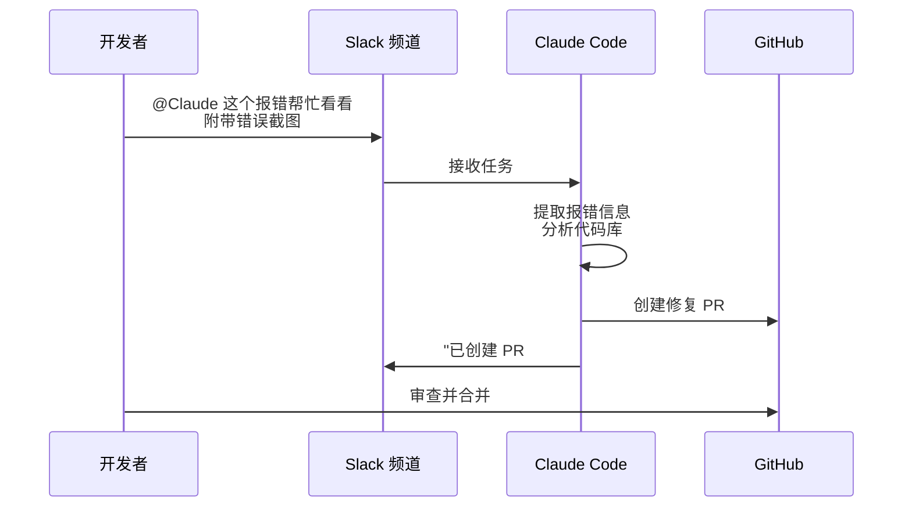

## 7.6 Claude Code 高阶特性与多端生态

Claude Code 诞生之初就被定义为一个可以无处不在的 AI 智能助理。它不仅局限于开发者的终端 CLI 和 IDE，还能扩展到完整的开发工作流与跨平台的交互中。

### 7.6.1 多端无缝衔接

Claude Code 的能力不仅存在于本地 CLI 中，通过同一底层引擎的互联，可以实现多种场景的无缝切换。

#### IDE 深度集成

原生的 Claude Code 扩展支持主流 IDE 和编辑器：

| 编辑器 | 集成方式 | 核心功能 |
| :--- | :--- | :--- |
| **VS Code** | 官方扩展 | 内联 Diff、终端集成、代码操作 |
| **Cursor** | 原生支持 | Composer、自动索引、Tab 补全 |
| **Windsurf** | 原生支持 | Cascade 工作流、多文件编辑 |
| **JetBrains** | 官方插件 | IntelliJ、PyCharm、WebStorm 等全系列 |

在 IDE 中，Claude Code 可以直接读取项目上下文、展示内联的差异比对（Inline Diff），并在编辑器内完成代码修改与审查，无需切换到终端。

#### Desktop 与 Web 协同

通过 **Desktop App**（桌面版应用），可以在可视化界面中管理多条并行任务工作流：

- **多任务视图**：同时观察多个任务的进度和 Diff
- **后台执行**：长耗时任务（如大规模重构）可在后台持续运行
- **实时日志**：查看每个子任务的输出和状态

通过 **Web 版**（`claude.ai/code`）或 **iOS App**，即使不在开发环境旁，也可以远程下发任务：

```text

# 在手机上发起任务
"请审查 main 分支最近 3 天的所有 commit，检查是否有安全隐患，生成报告到 reviews/ 目录。"
```

任务会在云端的沙箱环境中执行，完成后通过通知推送结果。

#### Slack 集成

将 Claude Code 集成到 Slack 后，团队协作效率大幅提升。典型工作流如下：



这种模式特别适合非紧急的 Bug 修复和日常维护任务，极大地压缩了从“发现问题”到“提交修复”的周期。

### 7.6.2 跨端继续当前会话

Claude Code 的多端协同需要区分“已经公开发布的能力”和“设想中的能力”。截至 2026 年 3 月，官方文档已经明确公开的能力主要有：

- **`/desktop`**：将当前会话继续到 Claude Code Desktop App。该命令只在 macOS 和 Windows 上可见。
- **`/remote-control`**：让当前 CLI 会话可从 `claude.ai` 远程接管或继续。
- **`/remote-env`**：配置 Web 端会话启动时使用的默认远程环境。

```bash
> /desktop

# 在桌面应用中继续当前会话

> /remote-control

# 允许从 claude.ai 远程控制当前 CLI 会话
```

像 `/teleport` 这类没有出现在官方命令列表里的名字，不应该写成可直接执行的命令，更不应该和已经正式支持的 `/desktop` 混在同一组“实验性功能”里。

### 7.6.3 多智能体协作

当工程任务庞大时，Claude Code 的核心能力是把问题拆成多个角色清晰的子任务，而不是依赖某个神秘的“一键多代理”命令。

#### Sub-Agents 并行执行

Claude Code 的 **Sub-Agents（子代理）** 更接近“独立上下文窗口下的分工协作”：

```text
Lead Agent
├── Reviewer: 审查回归风险与缺失测试
├── Implementer: 负责局部代码修改
└── Writer: 更新迁移说明或文档
```

这里要注意：**默认是上下文隔离，不是仓库隔离**。如果你需要真正的文件级或工作树级隔离，应显式启用对应策略，而不是默认假设“每个子代理天然在独立分支里工作”。

#### 自定义 Agents 的正确入口

当前官方入口是：

- 用 **`/agents`** 查看和管理 agent 配置
- 在项目内通过 `.claude/agents/` 维护专用 agent 角色

如果你需要 DAG、依赖关系、重试策略、统一观测面板这类更复杂的编排，那通常应该在你自己的应用层完成，而不是伪造一个并不存在的 `/execute-agents --agents-config ...` 或 `/run-team ...` 命令。

#### Agent SDK 的边界

这里还要和官方 SDK 边界分清楚。当前 Anthropic 公开的 Python Agent SDK / Claude Code SDK 入口是 `claude_agent_sdk`，而不是 `from anthropic.agent import Agent` 这一套接口。像 `Agent()`、`AgentTeam`、`run_parallel()` 这样的写法，如果被写成“可直接运行的官方 API”，会误导读者复制后立刻报错。

### 7.6.4 Hooks 系统深度指南

Claude Code Hooks 采用的是**事件驱动配置**，不是上一版书稿里那种 `command_hooks / prompt_hooks / agent_hooks` 的自定义 schema。当前官方文档的核心模式是：

1. 先按事件名分组
2. 再用 `matcher` 匹配工具或场景
3. 最后在 `hooks` 数组里配置处理器

常见事件包括：

- `SessionStart`
- `UserPromptSubmit`
- `PreToolUse`
- `PostToolUse`
- `Notification`
- `Stop`
- `SubagentStop`

下面这个示例更接近 2026 年 3 月官方 hooks reference 的真实形态：

```json
{
  "hooks": {
    "PreToolUse": [
      {
        "matcher": "Bash",
        "hooks": [
          {
            "type": "command",
            "command": "\"$CLAUDE_PROJECT_DIR\"/.claude/hooks/check-safe-bash.sh"
          }
        ]
      }
    ],
    "PostToolUse": [
      {
        "matcher": "Write|Edit",
        "hooks": [
          {
            "type": "command",
            "command": "\"$CLAUDE_PROJECT_DIR\"/.claude/hooks/run-tests-async.sh",
            "async": true,
            "timeout": 300
          }
        ]
      }
    ]
  }
}
```

这套结构的几个重点是：

- **事件先行**：例如 `PreToolUse` / `PostToolUse`
- **`matcher` 精准匹配**：决定命中哪些工具
- **`hooks` 数组**：每个事件可挂多个处理器
- **异步限制**：`async: true` 只适用于 `type: "command"` 的 hook

#### 一个现实的 Hooks 场景

如果希望 Claude 在写完文件后异步跑测试，而不是阻塞当前会话，可以这样理解：

```bash

# .claude/hooks/run-tests-async.sh
npm test -- --runInBand
```

```json
{
  "hooks": {
    "PostToolUse": [
      {
        "matcher": "Write|Edit",
        "hooks": [
          {
            "type": "command",
            "command": "\"$CLAUDE_PROJECT_DIR\"/.claude/hooks/run-tests-async.sh",
            "async": true,
            "timeout": 300
          }
        ]
      }
    ]
  }
}
```

#### 调试 Hooks

如果 hooks 没有按预期触发，可以：

- 运行 `claude --debug`
- 使用 `/hooks` 查看当前配置
- 检查 `matcher` 是否命中目标工具

### 7.6.5 Memory 与长会话治理

Claude Code 的长会话治理更适合围绕两个官方入口理解：

- **`CLAUDE.md` / `/memory`**：管理项目或用户级长期记忆
- **`/compact`**：压缩当前会话上下文，降低上下文膨胀

```bash
> /memory

# 查看或编辑当前项目的记忆文件

> /compact

# 压缩当前会话上下文
```

这里同样要避免把并不存在的 `/settings memory.strategy ...` 或一串未公开的 `/compact --strategy ...` 选项写成既成事实。长期记忆和压缩能力应该以当前官方 Memory / Commands 文档为准。

#### 长会话治理的实战原则

1. 把稳定规则写进 `CLAUDE.md`，不要每轮重复塞进 prompt。
2. 对临时调试日志、长错误栈、重复 diff 及时做 `/compact`。
3. 团队协作时，把共享约束写进仓库内的记忆文件，而不是只留在个人会话里。

---

从命令行起步，通过 Hooks、Sub-Agents、Memory 和 `/compact`，Claude Code 已经覆盖了现代智能开发工作流里的大多数高频场景。真正重要的不是记住一串“看起来很酷”的命令名，而是分清楚哪些是官方已发布能力，哪些只是架构设想。
