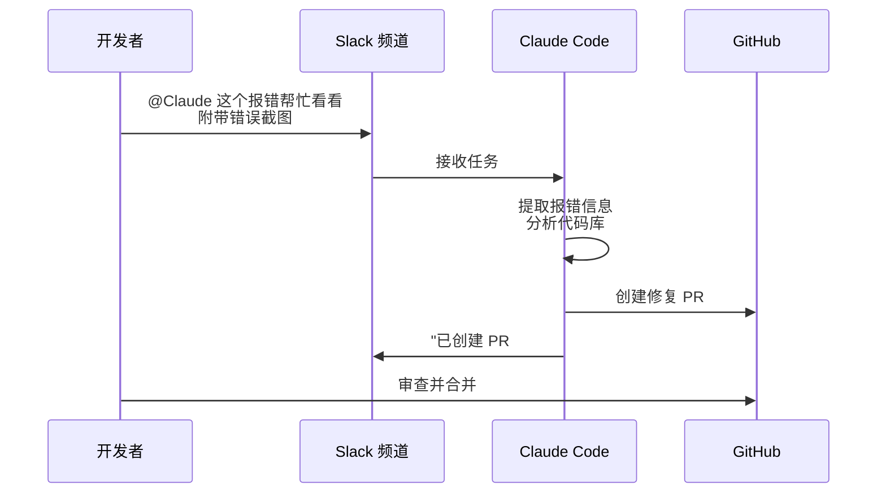

## 7.6 Claude Code 高阶特性与多端生态

Claude Code 诞生之初就被定义为一个可以无处不在的 AI 智能助理。它不仅局限于开发者的终端 CLI 和 IDE，还能扩展到完整的开发工作流与跨平台的交互中。

### 7.6.1 多端无缝衔接

Claude Code 的能力不仅存在于本地 CLI 中，通过同一底层引擎的互联，可以实现多种场景的无缝切换。

#### IDE 深度集成

原生的 Claude Code 扩展支持主流 IDE 和编辑器：

| 编辑器 | 集成方式 | 核心功能 |
| :--- | :--- | :--- |
| **VS Code** | 官方扩展 | 内联 Diff、终端集成、代码操作 |
| **Cursor** | 原生支持 | Composer、自动索引、Tab 补全 |
| **Windsurf** | 原生支持 | Cascade 工作流、多文件编辑 |
| **JetBrains** | 官方插件 | IntelliJ、PyCharm、WebStorm 等全系列 |

在 IDE 中，Claude Code 可以直接读取项目上下文、展示内联的差异比对（Inline Diff），并在编辑器内完成代码修改与审查，无需切换到终端。

#### Desktop 与 Web 协同

通过 **Desktop App**（桌面版应用），可以在可视化界面中管理多条并行任务工作流：

- **多任务视图**：同时观察多个任务的进度和 Diff
- **后台执行**：长耗时任务（如大规模重构）可在后台持续运行
- **实时日志**：查看每个子任务的输出和状态

通过 **Web 版**（`claude.ai/code`）或 **iOS App**，即使不在开发环境旁，也可以远程下发任务：

```text
# 在手机上发起任务
"请审查 main 分支最近 3 天的所有 commit，检查是否有安全隐患，生成报告到 reviews/ 目录。"
```

任务会在云端的沙箱环境中执行，完成后通过通知推送结果。

#### Slack 集成

将 Claude Code 集成到 Slack 后，团队协作效率大幅提升。典型工作流如下：



这种模式特别适合非紧急的 Bug 修复和日常维护任务，极大地压缩了从“发现问题”到“提交修复”的周期。

### 7.6.2 超越终端：跨端传送

Claude Code 支持跨客户端的上下文传送，允许在不同端之间无缝切换。

#### `/teleport` 命令

在终端中执行 `/teleport`，可以接管当前正在 Web 或移动端执行的长耗时任务：

```bash
> /teleport
# 列出所有活跃的远程任务
# 选择要接管的任务，上下文自动同步到本地终端
```

#### `/desktop` 命令

反过来，当终端中的调试陷入死胡同时，可以将当前上下文推送到桌面客户端的可视化环境：

```bash
> /desktop
# 上下文自动同步到 Desktop App
# 在可视化界面中查看文件树、Diff 和执行历史
```

这种随境切换的能力，让开发者在“终端高效操作”和“可视化全局审视”之间自由切换。

### 7.6.3 多智能体协作

当工程任务庞大（如整体迁移框架、全局修改底层数据库驱动等）时，单线程的进程容易在漫长的修改中陷入上下文过载或错误循环。

#### Sub-Agents 并行执行

Claude Code 的 **Sub-Agents（子代理）** 机制允许主代理将大型任务拆分为多个独立子任务：

```text
主代理 (Lead Agent)
├── 子代理 A: 重构 src/auth/ 模块 → 独立分支
├── 子代理 B: 重构 src/api/ 模块 → 独立分支
└── 子代理 C: 更新所有测试文件 → 独立分支
```

每个子代理在独立的上下文中工作，避免了单一上下文窗口的容量限制。主代理负责统筹进度、审阅各子代理的成果，并最终合并结果。

#### Agent SDK 定制

对于更加专业的定制化工作流，可以使用 Anthropic 发布的原生 **Agent SDK** 构建专属的调度代理：

```python
from anthropic_claude_code import ClaudeCode

claude = ClaudeCode()

# 定义并行子任务
tasks = [
    {"task": "重构 auth 模块", "working_directory": "./src/auth"},
    {"task": "重构 api 模块", "working_directory": "./src/api"},
    {"task": "更新测试套件", "working_directory": "./tests"},
]

# 并行执行
results = claude.run_parallel(tasks, allowed_tools=["read_file", "write_file"])
```

这种多智能体并行模式，将传统的线性开发流程升级为高度并行的“团队协作”模式，特别适合大规模代码迁移和架构重构。

### 7.6.4 Hooks 系统深度指南

Claude Code 2026 版引入了强大的 Hooks 系统，允许开发者在关键时刻注入自定义逻辑，从而实现工作流的深度定制。Hooks 系统包含三大类型：**Command Hooks**（命令钩子）、**Prompt Hooks**（提示词钩子）和 **Agent Hooks**（代理钩子）。

#### Command Hooks（命令钩子）

Command Hooks 在特定 Claude Code 命令执行前后触发。支持三种触发点：`PreToolUse`（工具调用前）、`PostToolUse`（工具调用后）和 `Notification`（通知事件）。

**标准的 .claude/settings.json 配置**

```json
{
  "hooks": {
    "command_hooks": {
      "before_refactor": {
        "type": "PreToolUse",
        "actions": [
          {
            "type": "backup",
            "scope": "src/",
            "description": "在重构前备份代码"
          },
          {
            "type": "log",
            "message": "Starting refactoring task",
            "level": "info"
          }
        ]
      },
      "after_refactor": {
        "type": "PostToolUse",
        "actions": [
          {
            "type": "run_command",
            "command": "npm test -- --suite unit",
            "description": "重构后运行测试"
          },
          {
            "type": "notification",
            "target": "slack",
            "channel": "#dev",
            "message": "Refactoring task completed successfully"
          }
        ]
      },
      "before_commit": {
        "type": "PreToolUse",
        "actions": [
          {
            "type": "run_command",
            "command": "npm run lint -- --fix",
            "description": "提交前格式化代码"
          }
        ]
      }
    }
  }
}
```

**Command Hook 使用示例**

```bash
# 执行重构，自动触发 hooks
> /refactor src/auth --strategy modern-design

# 执行流程：
# 1. before_refactor hooks 执行
#    └─ 创建 src/ 的备份
#    └─ 记录日志
# 2. 执行实际的重构任务
# 3. after_refactor hooks 执行
#    └─ 运行单元测试
#    └─ 发送 Slack 通知
```

#### Prompt Hooks（提示词钩子）

Prompt Hooks 允许在发送 prompt 到 Claude 前动态修改或增强 prompt。这些钩子可以自动注入项目上下文、代码示例和风格指南。

**在 .claude/settings.json 中配置 Prompt Hooks**

```json
{
  "hooks": {
    "prompt_hooks": {
      "enhance_system": {
        "type": "system_prompt_modifier",
        "enabled": true,
        "actions": [
          {
            "action": "inject_context",
            "template": "Additional Context:\\n- Project: {project_name}\\n- Language: {primary_language}\\n- Date: {timestamp}",
            "priority": "high"
          },
          {
            "action": "inject_examples",
            "source": ".claude/refactor_examples.md",
            "when": "task == 'refactor'"
          },
          {
            "action": "append_guidelines",
            "file": ".claude/code_style_guide.md",
            "priority": "normal"
          }
        ]
      },
      "user_message_enrichment": {
        "type": "user_message_modifier",
        "enabled": true,
        "actions": [
          {
            "action": "auto_format_code",
            "languages": ["python", "typescript", "javascript"]
          }
        ]
      }
    }
  }
}
```

**Prompt Hook 实现示例**

```python
# .claude/prompt_hooks.py
def enhance_system_prompt(system_prompt: str, context: dict) -> str:
    """
    增强系统提示词
    在每次 API 调用前被触发
    """
    project_name = context.get("project_name", "Unknown")
    language = context.get("language", "Python")

    enhancement = f"""
Additional Context:
- Project: {project_name}
- Primary Language: {language}
- Date: {context.get("date")}
- Node Version: {context.get("node_version")}

Code Style Requirements:
- Follow PEP 8 for Python code
- Use type hints consistently
- Write descriptive docstrings
- Include error handling
"""

    return system_prompt + "\n" + enhancement


def inject_examples(messages: list, context: dict) -> list:
    """
    为 prompt 注入相关的代码示例
    """
    if context.get("task") == "refactor":
        examples = _load_refactor_examples(context.get("language"))
        # 在消息中添加示例
        messages[0]["content"] += f"\n\nExamples:\n{examples}"

    return messages
```

**使用 Prompt Hooks 的优势**

```
┌─────────────────────────────────────┐
│ 原始 Prompt                         │
│ "重构这个函数为更现代的风格"        │
└──────────────────┬──────────────────┘
                   │
                   ▼ (Prompt Hook 应用)
┌─────────────────────────────────────┐
│ 增强后的 Prompt                     │
│ "重构这个函数为更现代的风格         │
│                                     │
│ 项目背景：Web Framework             │
│ 代码风格：PEP 8 + Type hints         │
│ 上下文示例：[示例代码...]           │
│ 相关文档链接：[...]                 │
└─────────────────────────────────────┘
```

#### Agent Hooks（代理钩子）

Agent Hooks 在 Sub-Agents 执行时被触发，用于监控、日志和协调。它们允许拦截代理的决策过程。

**在 .claude/settings.json 中配置 Agent Hooks**

```json
{
  "hooks": {
    "agent_hooks": {
      "on_agent_start": {
        "type": "agent_lifecycle",
        "event": "start",
        "actions": [
          {
            "action": "log",
            "level": "info",
            "message": "Agent {agent_id} starting task: {task}"
          },
          {
            "action": "emit_event",
            "event_type": "agent_started",
            "include_context": true
          }
        ]
      },
      "on_agent_decision": {
        "type": "agent_decision_interceptor",
        "enabled": true,
        "rules": [
          {
            "rule": "block_dangerous_tools",
            "dangerous_tools": ["delete_all", "drop_database", "format_disk"],
            "action": "reject_with_reason"
          },
          {
            "rule": "log_resource_intensive",
            "patterns": ["deploy.*", "backup.*"],
            "action": "log_and_allow"
          }
        ]
      },
      "on_agent_complete": {
        "type": "agent_lifecycle",
        "event": "complete",
        "actions": [
          {
            "action": "log",
            "level": "info",
            "message": "Agent {agent_id} completed in {duration_ms}ms"
          },
          {
            "action": "custom_logging",
            "handler": "log_agent_metrics"
          }
        ]
      },
      "on_agent_error": {
        "type": "agent_lifecycle",
        "event": "error",
        "actions": [
          {
            "action": "log",
            "level": "error",
            "message": "Agent {agent_id} failed: {error}"
          },
          {
            "action": "retry",
            "max_retries": 3,
            "backoff_strategy": "exponential"
          }
        ]
      }
    }
  }
}
```

**Agent Hook 实现示例**

```python
# .claude/agent_hooks.py
import json
from datetime import datetime

class AgentHookManager:
    """代理钩子管理器"""

    def on_agent_start(self, agent_id: str, task: str, context: dict):
        """Sub-Agent 开始执行前"""
        log_entry = {
            "timestamp": datetime.now().isoformat(),
            "event": "agent_start",
            "agent_id": agent_id,
            "task": task,
            "context": context
        }
        print(f"[AGENT START] {agent_id}: {task}")
        self._append_to_log(log_entry)

    def on_agent_checkpoint(self, agent_id: str, progress: float, state: dict):
        """Sub-Agent 执行到检查点时"""
        log_entry = {
            "timestamp": datetime.now().isoformat(),
            "event": "agent_checkpoint",
            "agent_id": agent_id,
            "progress": progress,
            "state": state
        }
        print(f"[AGENT PROGRESS] {agent_id}: {progress*100:.0f}%")
        self._append_to_log(log_entry)

    def on_agent_complete(self, agent_id: str, result: dict, duration_ms: int):
        """Sub-Agent 执行完成时"""
        log_entry = {
            "timestamp": datetime.now().isoformat(),
            "event": "agent_complete",
            "agent_id": agent_id,
            "result": result,
            "duration_ms": duration_ms
        }
        print(f"[AGENT COMPLETE] {agent_id}: {duration_ms}ms")
        self._append_to_log(log_entry)

    def on_agent_error(self, agent_id: str, error: str, retry_count: int):
        """Sub-Agent 执行出错时"""
        log_entry = {
            "timestamp": datetime.now().isoformat(),
            "event": "agent_error",
            "agent_id": agent_id,
            "error": error,
            "retry_count": retry_count
        }
        print(f"[AGENT ERROR] {agent_id}: {error} (retry {retry_count})")
        self._append_to_log(log_entry)

    def on_agent_decision(self, agent_id: str, tool_name: str, args: dict) -> bool:
        """
        在代理决策执行前拦截
        返回 True 允许执行，False 拒绝执行
        """
        dangerous_tools = ["delete_all", "drop_database", "format_disk"]
        if tool_name in dangerous_tools:
            print(f"[BLOCKED] Agent {agent_id} attempted dangerous tool: {tool_name}")
            return False
        return True

    def _append_to_log(self, entry: dict):
        """将日志条目追加到文件"""
        with open(".claude/agent_execution.log", "a") as f:
            f.write(json.dumps(entry) + "\n")
```

#### Hooks 实战示例：Auto-Format on Save

常见需求：每当开发者运行 `/commit` 命令前，自动格式化代码。

```json
{
  "hooks": {
    "command_hooks": {
      "before_commit": {
        "type": "PreToolUse",
        "actions": [
          {
            "type": "run_command",
            "command": "npm run format && npm run lint --fix",
            "timeout_seconds": 30,
            "description": "Auto-format code before commit"
          }
        ]
      }
    }
  }
}
```

执行：
```bash
> /commit -m "Add new feature"
# 自动执行 hooks：
# → Running npm run format...
# → Running npm run lint --fix...
# → Formatting complete! Proceeding with commit...
```

#### Hooks 实战示例：Block Dangerous Commands

防止意外删除生产数据：

```json
{
  "hooks": {
    "agent_hooks": {
      "on_agent_decision": {
        "type": "agent_decision_interceptor",
        "rules": [
          {
            "rule": "require_confirmation_for_destructive",
            "patterns": ["delete.*production", "drop.*table", "truncate.*"],
            "action": "require_user_approval",
            "message": "This is a destructive operation. Type 'yes' to confirm."
          }
        ]
      }
    }
  }
}
```

#### Hooks 实战示例：Custom Logging 与监控

为每个任务记录详细的执行指标：

```python
# .claude/custom_hooks.py
import time
import json
from datetime import datetime

def log_task_metrics(task_name: str, duration_ms: int, tokens_used: int, status: str):
    """
    记录任务执行的关键指标
    """
    metrics = {
        "timestamp": datetime.now().isoformat(),
        "task": task_name,
        "duration_ms": duration_ms,
        "tokens_used": tokens_used,
        "status": status,
        "tokens_per_second": tokens_used / (duration_ms / 1000) if duration_ms > 0 else 0
    }

    # 写入 metrics 文件供分析
    with open(".claude/metrics.jsonl", "a") as f:
        f.write(json.dumps(metrics) + "\n")

    # 如果任务耗时过长，发出警告
    if duration_ms > 60000:  # 超过 1 分钟
        print(f"⚠️ WARNING: Task '{task_name}' took {duration_ms/1000:.1f}s")
```

### 7.6.5 自定义 Sub-Agents

2026 年更新支持通过 JSON 配置创建高度定制化的 Sub-Agents。

#### 使用 --agents 标志

```bash
# 创建复杂的 Sub-Agent 编排
> /execute-agents --agents-config agents.json --max-parallel 4
```

**agents.json 配置文件**

```json
{
  "team": {
    "name": "MigrationTeam",
    "lead_agent": "orchestrator",
    "parallel_limit": 4
  },
  "agents": [
    {
      "id": "orchestrator",
      "role": "lead",
      "model": "claude-opus-4-6-20251101",
      "task": "Coordinate and oversee the entire migration",
      "responsibilities": [
        "Break down the migration into sub-tasks",
        "Assign tasks to worker agents",
        "Monitor progress and handle conflicts",
        "Merge results and validate output"
      ]
    },
    {
      "id": "db_migration",
      "role": "worker",
      "model": "claude-sonnet-4-5-20250929",
      "task": "Migrate database schema and data",
      "scope": {
        "files": ["src/database/**"],
        "max_tokens": 50000
      },
      "dependencies": [],
      "error_handling": {
        "retry": 3,
        "strategy": "exponential_backoff"
      }
    },
    {
      "id": "api_migration",
      "role": "worker",
      "model": "claude-sonnet-4-5-20250929",
      "task": "Update API endpoints and types",
      "scope": {
        "files": ["src/api/**"],
        "max_tokens": 50000
      },
      "dependencies": [],
      "error_handling": {
        "retry": 3,
        "strategy": "exponential_backoff"
      }
    },
    {
      "id": "test_update",
      "role": "worker",
      "model": "claude-haiku-4-5-20251001",
      "task": "Update and fix all tests",
      "scope": {
        "files": ["tests/**"],
        "max_tokens": 30000
      },
      "dependencies": ["db_migration", "api_migration"],
      "error_handling": {
        "retry": 2,
        "strategy": "linear_backoff"
      }
    },
    {
      "id": "docs_update",
      "role": "worker",
      "model": "claude-haiku-4-5-20251001",
      "task": "Update documentation",
      "scope": {
        "files": ["docs/**", "README.md"],
        "max_tokens": 20000
      },
      "dependencies": ["db_migration", "api_migration"],
      "error_handling": {
        "retry": 1
      }
    }
  ],
  "execution": {
    "mode": "dag",
    "timeout_minutes": 120,
    "validation": {
      "run_tests": true,
      "lint": true,
      "type_check": true
    }
  }
}
```

#### 执行流程可视化

```
┌──────────────────────────────────────────────────────────┐
│                   Orchestrator Agent                      │
│            (决策和协调，使用 Opus 4.6)                   │
└──────────────────────┬─────────────────────────────────┘
                       │
          ┌────────────┼────────────┐
          │            │            │
    ┌─────▼───┐  ┌─────▼───┐  ┌────▼──────┐
    │    DB   │  │   API   │  │   Docs    │
    │Migration│  │Migration│  │  Update   │
    │ (Sonnet)│  │ (Sonnet)│  │ (Haiku)   │
    └────┬────┘  └────┬────┘  └────┬──────┘
         │            │             │
         └────────────┼─────────────┘
                      │
            ┌─────────▼─────────┐
            │   Test Update     │
            │   (Haiku)         │
            │ (依赖其他 agent)  │
            └───────────────────┘
```

### 7.6.6 Agent Teams 工作流

Agent Teams 是一个高级功能，允许多个专业化的 agents 组成一个虚拟开发团队。

#### Team 定义

```python
# team_config.py
from anthropic_claude_code import Team, Agent, Skill

# 定义团队
migration_team = Team(
    name="DatabaseMigrationTeam",
    description="A team specialized in database schema and code migration"
)

# 定义 Agent 1：架构师（分析和规划）
architect = Agent(
    id="architect",
    name="DB Architect",
    model="claude-opus-4-6-20251101",
    skills=[
        Skill.code_analysis,
        Skill.database_design,
        Skill.architecture_planning
    ],
    system_prompt="""You are a database architect. Your role is to:
1. Analyze the current database schema
2. Identify migration paths
3. Plan the migration strategy
4. Validate the new schema design""",
)

# 定义 Agent 2：实施者（执行迁移）
implementer = Agent(
    id="implementer",
    name="Migration Engineer",
    model="claude-sonnet-4-5-20250929",
    skills=[
        Skill.code_writing,
        Skill.database_operations,
        Skill.error_handling
    ],
    system_prompt="""You are a migration engineer. Your role is to:
1. Write migration scripts
2. Execute schema changes
3. Handle edge cases and rollback
4. Test data integrity""",
)

# 定义 Agent 3：验证者（QA）
validator = Agent(
    id="validator",
    name="QA Specialist",
    model="claude-haiku-4-5-20251001",
    skills=[
        Skill.testing,
        Skill.validation,
        Skill.regression_testing
    ],
    system_prompt="""You are a QA specialist. Your role is to:
1. Write comprehensive tests
2. Validate migration correctness
3. Perform regression testing
4. Report issues""",
)

# 添加 agents 到团队
migration_team.add_agent(architect)
migration_team.add_agent(implementer)
migration_team.add_agent(validator)

# 定义团队工作流
migration_team.define_workflow([
    {
        "stage": "analysis",
        "agent": architect,
        "task": "Analyze current schema and plan migration"
    },
    {
        "stage": "implementation",
        "agent": implementer,
        "task": "Execute the migration based on architect's plan",
        "depends_on": ["analysis"]
    },
    {
        "stage": "validation",
        "agent": validator,
        "task": "Validate the migration and run tests",
        "depends_on": ["implementation"]
    }
])
```

#### 执行 Teams

```bash
# 在命令行中执行完整的 team workflow
> /run-team migration_team

# 输出示例：
# [ARCHITECT] Analyzing schema...
# ├─ Found 15 tables
# ├─ Identified 8 foreign keys
# └─ Migration strategy: Expand-Contract pattern (safe)
#
# [IMPLEMENTER] Executing migration...
# ├─ Phase 1: Add new columns (2/2) ✓
# ├─ Phase 2: Copy data (15/15 tables) ✓
# └─ Phase 3: Cleanup (8/8 foreign keys) ✓
#
# [VALIDATOR] Running tests...
# ├─ Unit tests: 247/247 ✓
# ├─ Integration tests: 58/58 ✓
# └─ Performance tests: 12/12 ✓
#
# Migration complete! Total time: 8m 42s
```

### 7.6.7 Auto-Memory 特性

Auto-Memory 是一个自动化的上下文记忆系统，可以跨任务保持状态。

#### 启用 Auto-Memory

```bash
# 启用自动记忆（默认开启）
> /settings memory.enabled true

# 配置记忆策略
> /settings memory.strategy "adaptive"
> /settings memory.max_entries 500
> /settings memory.retention_days 30
```

#### Auto-Memory 工作原理

```
任务 1 (重构认证模块)
├─ 学到：认证系统的依赖关系
├─ 学到：常见的验证模式
└─ 保存到内存

      ↓ (跨任务上下文转移)

任务 2 (更新 API 端点)
├─ 回忆：认证系统的结构
├─ 回忆：常见的验证模式
├─ 应用之前学到的知识
└─ 生成更准确的代码
```

**Auto-Memory 内容示例**

```json
{
  "memory_entries": [
    {
      "id": "mem_001",
      "timestamp": "2026-03-01T10:30:00Z",
      "type": "architecture",
      "content": "The authentication system uses JWT tokens with 24h expiry. Refresh tokens are stored in Redis with 7d TTL.",
      "source_task": "refactor_auth_module",
      "relevance_score": 0.95,
      "last_accessed": "2026-03-02T14:15:00Z"
    },
    {
      "id": "mem_002",
      "timestamp": "2026-03-01T11:00:00Z",
      "type": "codepattern",
      "content": "Error handling in API routes should use the ErrorHandler middleware from src/middleware/error.ts",
      "source_task": "refactor_auth_module",
      "relevance_score": 0.88,
      "last_accessed": "2026-03-02T14:15:00Z"
    }
  ],
  "total_tokens_saved": 15000,
  "compression_ratio": 0.65
}
```

### 7.6.8 /compact 命令与内存管理

在长时间的会话中，上下文可能会变得臃肿。`/compact` 命令优化内存使用。

```bash
# 压缩当前会话上下文
> /compact

# 输出：
# Compacting context...
# ├─ Original context: 150K tokens
# ├─ Removing redundant information
# ├─ Preserving essential state
# └─ Compressed context: 45K tokens (70% reduction)
#
# Memory freed: 105K tokens
# Auto-memory summary created: 8 key insights preserved
```

**/compact 选项**

```bash
# 激进压缩（可能丢失细节）
> /compact --strategy aggressive

# 保守压缩（保留所有重要信息）
> /compact --strategy conservative

# 压缩并将摘要导出到文件
> /compact --export-summary session_summary.md

# 保留特定信息
> /compact --preserve test_results,error_logs
```

#### 长会话内存管理最佳实践

```python
# 在长时间开发过程中的检查点
async def development_checkpoint(session: Session):
    """
    在重要检查点处理内存
    """

    # 定期压缩
    if session.context_tokens > 100000:
        await session.compact(strategy="conservative")

    # 导出进度
    await session.export_summary("progress.md")

    # 清理临时文件
    await session.cleanup_temp_files()

    # 重置某些上下文
    await session.reset_context(
        keep=["architecture", "decisions", "error_patterns"],
        discard=["debug_logs", "temporary_branches"]
    )
```

---

从命令行起步，通过 Hooks、Sub-Agents、Agent Teams，再到 Auto-Memory，Claude Code 已经进化为一个功能完整的智能开发平台。结合 /compact 和内存管理，即使是最复杂的项目也能高效处理。
