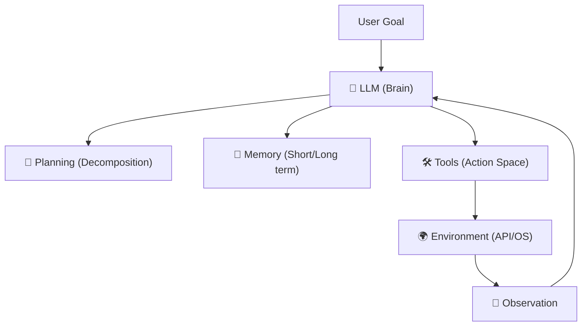

## 8.1 什么是 Agent：从聊天到行动

2023 年被称为 "Year of the Chatbot"（聊天机器人元年），而 2025 年则是 "Year of the Agent"（智能体元年）。
为什么有这个转变？因为人们不再满足于让 AI 只会**说话**，而是要求它能够**做事**。

### 8.1.1 Agent vs. Chatbot

| 维度 | Chatbot (如 ChatGPT 网页版) | Agent (如 Claude Agent) |
| :--- | :--- | :--- |
| **交互模式** | 被动响应 (Reactive) | 主动执行 (Proactive) |
| **核心循环** | User Input -> Model -> Output | **Output** -> **Action** -> **Observation** -> **Loop** |
| **能力边界** | 受限于训练数据 | 通过 Tool Use 无限扩展 |
| **状态管理** | 依赖短期 Context Window | 依赖 Long-term Memory & External DB |

简单来说，**Agent = LLM + Memory + Planning + Tools**。

### 8.1.2 核心组件解构

一个现代 AI Agent 的架构通常包含四个重要组件：

#### Brain
这是控制中心。本书专注于 **Claude 4.5 Sonnet / Opus** 作为大脑。
Claude 的强项在于推理能力（Reasoning），这对于 Agent 面对未知错误时的自我修正至关重要。

#### Planning
人类在执行复杂任务时会先列清单。AI 也是如此。
*   **Decomposition**: 将 "写一个游戏" 拆解为 "设计角色", "编写逻辑", "调试" 三个子任务。
*   **Reflection**: 做完一步后，反思 "我做得对吗？"。

#### Memory
*   **Short-term**: 当前的 Context Window (200k tokens)。
*   **Long-term**: 向量数据库 (Vector DB) 或外部文件系统，用于存储长期的交互记录。

#### Tools
通过 [MCP (Model Context Protocol)](../04_mcp/README.md) 调动不同能力和工具，就是 Agent 的四肢。

### 8.1.3 为什么 Claude 是构建 Agent 的最佳选择？

在众多 LLM 中，Claude 被公认为最适合做 Agent 的模型（"The Agentic Model"），原因有三：

1.  **Tool Use 准确率高**：在 [Berkeley Function Calling Leaderboard](https://gorilla.cs.berkeley.edu/leaderboard.html) 上长期霸榜。它极少出现参数填错或幻觉调用。
2.  **超长 Context (200k)**：Agent 在运行过程中会产生大量的日志和中间状态。Claude 的超长上下文容量能容纳更长的执行历史，减少 "灾难性遗忘"。
3.  **安全性 (Safety)**：[Constitutional AI](../11_safety/11.1_cai.md) 使得 Claude 在面对危险指令（如 "删除所有服务器"）时，有内置的道德刹车，这对于拥有执行权的 Agent 来说是生死攸关的。

### 8.1.4 Agent 的自动化等级

就像自动驾驶分 L1-L5 一样，Agent 也有分级：

*   **L1 - Copilot**: 人类指挥一步，AI 走一步。（"帮我重构这个函数"）
*   **L2 - Router**: AI 识别意图，分发给特定工具。（"帮我查天气" -> 调用 Weather API）
*   **L3 - Generalist**: AI 自主拆解任务，并在遇到困难时重试。（"帮我写一个贪吃蛇游戏并运行"）
*   **L4 - Autonomous**: 长期运行，无需人类干预。（"每周五自动爬取竞品价格，生成报告发送给 CEO"）

本章将重点探讨如何构建 **L3 和 L4 级别** 的 Agent。

---

构建 Agent 类似于搭建积木。虽然组件是一样的，但搭建方式（设计模式）决定了它是摇摇欲坠还是坚若磐石。
接下来将探讨业界最流行的几种 Agent 设计模式。

➡️ [Agent 设计模式：ReAct 与 Plan-and-Solve](8.2_patterns.md)
