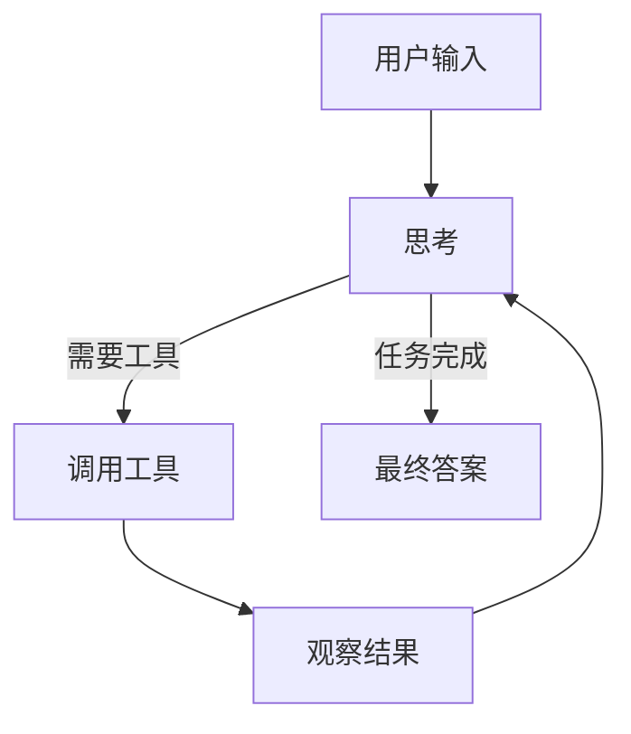
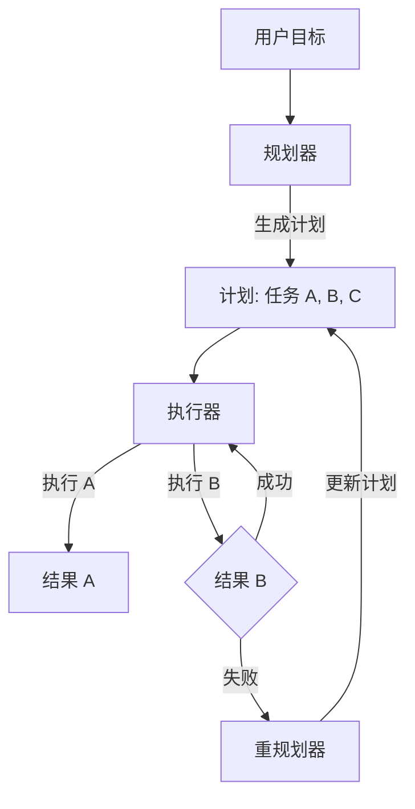
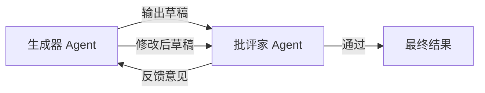

## 8.2 Agent 设计模式

在软件工程中，有单例模式、工厂模式。在 Agent 工程中，也有经过验证的设计模式。
选择正确的模式，往往比单纯优化 Prompt 更有效。

### 8.2.0 五大核心模式概览

根据 Anthropic 的工程实践，Agent 设计模式并非越复杂越好。大多数生产环境的应用都主要由以下五种基础构建块组成：

1.  **Prompt Chaining (链式工作流)**: 最简单直观。将一个任务拆解为线性步骤，上一步的输出作为下一步的输入 (A -> B -> C)。
2.  **Routing (路由)**: 根据输入分类，将请求分流给最适合的下游处理单元。(详见 8.2.4)
3.  **Parallelization (并行)**: 同时运行多个独立的子任务，最后聚合结果。适用于可以"分而治之"的场景。
4.  **Orchestrator-Workers (指挥家-工人类)**: 有一个中央大脑负责动态规划和分配，子任务由专门的 Worker 完成。(详见 8.2.2)
5.  **Evaluator-Optimizer (评估-优化)**: 生成后由另一个角色评审并改进，循环提升质量。(详见 8.2.3)

---

### 8.2.1 ReAct

这是最经典、也是最基础的 Agent 模式。
核心思想是：**行动之前先思考，行动之后看结果。**

#### 工作原理
ReAct 是一个 `while` 循环：
1.  **Thought**: 我现在需要做什么？
2.  **Action**: 调用工具。
3.  **Observation**: 看到工具返回的结果。
4.  **Repeat**: 基于结果，进行下一轮思考。



#### 示例 Prompt Template

在实际应用中，我们通常会将下面这样一个完整的“问答过程”作为**少样本 (Few-Shot)** 放入 System Prompt 中。模型会学习这种格式，并在遇到新问题时模仿这一过程。

*注：在实际推理中，`Observation` 行是由程序执行工具后自动填入的，而不是模型生成的。*

```text
Question: Apple 公司的 CEO 现在是谁？他的年龄的 0.5 倍是多少？

Thought 1: 我需要先查 Apple CEO 是谁。
Action 1: Search["Apple CEO"]
Observation 1: Tim Cook.

Thought 2: 我现在需要查 Tim Cook 的年龄。
Action 2: Search["Tim Cook age"]
Observation 2: 63 years old.

Thought 3: 我需要计算 63 * 0.5。
Action 3: Calculator[63 * 0.5]
Observation 3: 31.5.

Thought 4: 我已经有了最终答案。
Final Answer: 31.5.
```

#### 优缺点
*   **优点**: 灵活，能解决未知问题，容错率高。
*   **缺点**: 容易陷入死循环，Token 消耗大，可能会"跑题"。

### 8.2.2 Plan-and-Solve

对于特别复杂的任务（如写一本 200 页的书），由于 ReAct 视野太窄（只看下一步），容易迷失方向。
Plan-and-Solve 要求 Agent **先写大纲，再一次性执行**。

#### 工作流程
1.  **Planner**: 专门负责把大目标拆解为子任务列表 `[Task A, Task B, Task C]`。
2.  **Executor**: 依次执行 Task A -> Task B -> Task C。
3.  **Replanner** (可选): 发现 Task B 失败了，重新调整剩余计划。



#### 适用场景
*   代码生成（先设计接口，再写实现）。
*   长篇写作（先写提纲，再写章节）。

### 8.2.3 Reflection

这是一种通过引入**自我批评**来提升质量的模式。
许多时候，Agent 的第一直觉是错的。如果让它“再检查一遍”，它就能自己发现错误。

#### 流程图解


#### 实战应用：Reflexion
在编程任务中，如果单元测试失败了：
1.  **System**: 测试失败，错误信息是 `IndexError`。
2.  **Reflexion**: "我之前假设列表不为空，但实际上它可能是空的。我需要在代码里加一个检查。"
3.  **Retry**: 生成修复后的代码。

### 8.2.4 Routing

当系统拥有成百上千个工具时，如果全部塞给一个 Agent，它会通过不了。
路由模式引入了一个轻量级的 **Router**（通常是一个分类器或小模型）。

#### 架构
*   User Input: "我要退货。"
*   **Router**: 识别意图 -> `CustomerService_Agent`。
*   User Input: "这首歌叫什么？"
*   **Router**: 识别意图 -> `Music_Agent`。

这其实就是第六章讲的 [**Skill Routing**](../06_skills/6.5_combination.md) 的架构层面实现。

### 8.2.5 Tool Use vs. RAG 混合模式

最强大的 Agent 往往同时具备这两种能力：
*   **RAG (Retrieval)**: 用于获取知识（"公司的请假制度是什么？"）。
*   **Tool Use**: 用于执行操作（"帮我提交请假条"）。

**最佳实践**：把 RAG 当作一种 Tool。
定义一个 `search_knowledge_base(query)` 工具。Agent 会自己决定是去搜文档，还是去调 API。

---

无论选择哪种模式，Agent 在长时间运行中面临的最大挑战都是：**记不住事**。
上下文窗口 (Context Window) 再大也是有限的。需要给 Agent 装备外挂海马体。

➡️ [记忆系统：Long-term Memory](8.3_memory.md)
