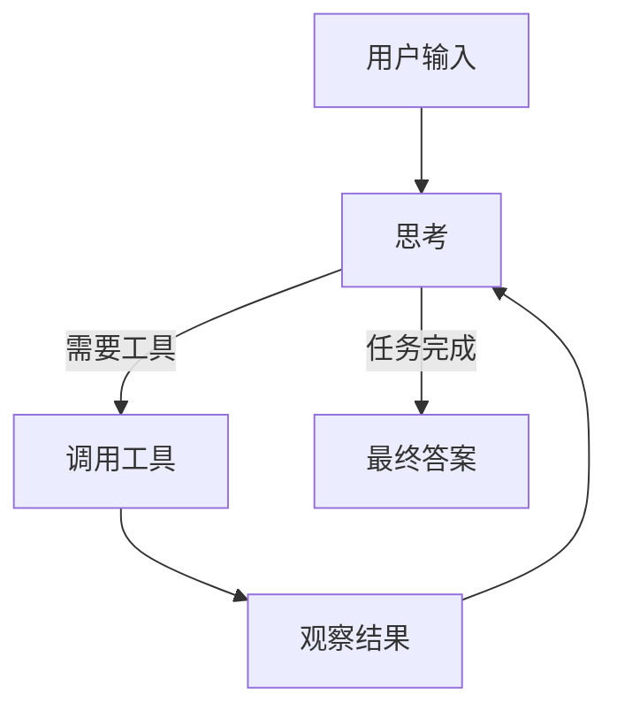
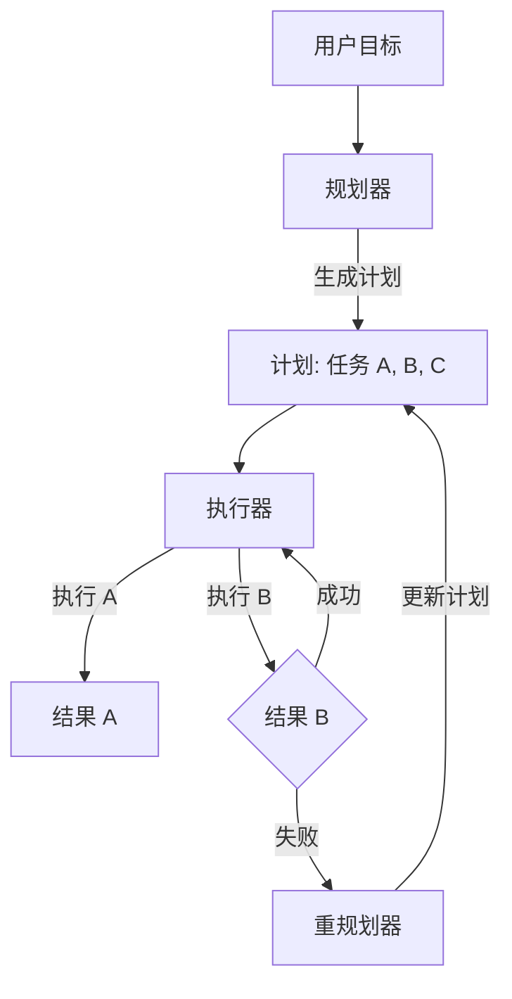
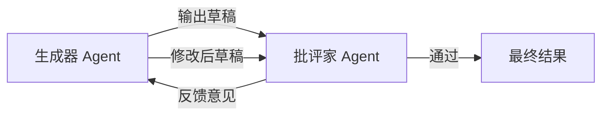

## 8.2 Agent 设计模式

在软件工程中，有单例模式、工厂模式。在 Agent 工程中，也有经过验证的设计模式。
选择正确的模式，往往比单纯优化 Prompt 更有效。

### 8.2.0 五大核心模式概览

根据 Anthropic 的工程实践，Agent 设计模式并非越复杂越好。大多数生产环境的应用都主要由以下五种基础构建块组成：

1.  **Prompt Chaining (链式工作流)**: 最简单直观。将一个任务拆解为线性步骤，上一步的输出作为下一步的输入 (A -> B -> C)。
2.  **Routing (路由)**: 根据输入分类，将请求分流给最适合的下游处理单元。(详见 8.2.4)
3.  **Parallelization (并行)**: 同时运行多个独立的子任务，最后聚合结果。适用于可以“分而治之”的场景。
4.  **Orchestrator-Workers (指挥家-工人类)**: 有一个中央大脑负责动态规划和分配，子任务由专门的 Worker 完成。(详见 8.2.2)
5.  **Evaluator-Optimizer (评估-优化)**: 生成后由另一个角色评审并改进，循环提升质量。(详见 8.2.3)

---

### 8.2.1 ReAct

这是最经典、也是最基础的 Agent 模式。
核心思想是：**行动之前先思考，行动之后看结果。**

#### 工作原理

ReAct 是一个 `while` 循环：
1.  **Thought**: 我现在需要做什么？
2.  **Action**: 调用工具。
3.  **Observation**: 看到工具返回的结果。
4.  **Repeat**: 基于结果，进行下一轮思考。


```mermaid
graph TD
    Input["用户输入"] --> Thought["思考"]
    Thought -->|"需要工具"| Action["调用工具"]
    Action --> Obs["观察结果"]
    Obs --> Thought
    Thought -->|"任务完成"| Finish["最终答案"]
```

#### 示例 Prompt Template

在实际应用中，我们通常会将下面这样一个完整的“问答过程”作为 **少样本 (Few-Shot)** 放入 System Prompt 中。模型会学习这种格式，并在遇到新问题时模仿这一过程。

*注：在实际推理中，`Observation` 行是由程序执行工具后自动填入的，而不是模型生成的。*

```text
Question: Apple 公司的 CEO 现在是谁？他的年龄的 0.5 倍是多少？

Thought 1: 我需要先查 Apple CEO 是谁。
Action 1: Search["Apple CEO"]
Observation 1: Tim Cook.

Thought 2: 我现在需要查 Tim Cook 的年龄。
Action 2: Search["Tim Cook age"]
Observation 2: 63 years old.

Thought 3: 我需要计算 63 * 0.5。
Action 3: Calculator[63 * 0.5]
Observation 3: 31.5.

Thought 4: 我已经有了最终答案。
Final Answer: 31.5.
```

#### 优缺点

*   **优点**: 灵活，能解决未知问题，容错率高。
*   **缺点**: 容易陷入死循环，Token 消耗大，可能会“跑题”。

### 8.2.2 Plan-and-Solve

对于特别复杂的任务（如写一本 200 页的书），由于 ReAct 视野太窄（只看下一步），容易迷失方向。
Plan-and-Solve 要求 Agent **先写大纲，再一次性执行**。

#### 工作流程

1.  **Planner**: 专门负责把大目标拆解为子任务列表 `[Task A, Task B, Task C]`。
2.  **Executor**: 依次执行 Task A -> Task B -> Task C。
3.  **Replanner** (可选): 发现 Task B 失败了，重新调整剩余计划。


```mermaid
graph TD
    Goal["用户目标"] --> Planner["规划器"]
    Planner -->|"生成计划"| Plan["计划: 任务 A, B, C"]
    Plan --> Executor["执行器"]
    Executor -->|"执行 A"| ResultA["结果 A"]
    Executor -->|"执行 B"| ResultB{"结果 B"}
    ResultB -->|"成功"| Executor
    ResultB -->|"失败"| Replanner["重规划器"]
    Replanner -->|"更新计划"| Plan
```

#### 适用场景

*   代码生成（先设计接口，再写实现）。
*   长篇写作（先写提纲，再写章节）。

#### ReAct vs. Plan-and-Execute

这两种模式最容易被混淆，但它们解决的问题不同：

| 维度 | ReAct | Plan-and-Execute |
|------|-------|------------------|
| **规划方式** | 动态、逐步规划 | 静态、先整体规划 |
| **执行节奏** | 边想边做，实时调整 | 先列计划，再逐步执行 |
| **适用任务** | 环境不确定、需要临场纠偏 | 步骤明确、跨度较长的任务 |
| **容错方式** | 基于 Observation 即时修正 | 失败后局部重规划或整体重排 |
| **典型风险** | 容易跑偏、循环、成本上升 | 计划过时、对环境变化反应慢 |

一个好记的判断标准是：

- **不知道下一步会看到什么**：优先 ReAct
- **知道大致要做哪几步**：优先 Plan-and-Execute

例如“排查线上故障”更像 ReAct，因为每一步都要根据新证据决定方向；“重构支付模块并补测试”更像 Plan-and-Execute，因为整体步骤相对稳定。

#### Claude Code 的实践演进

Claude Code 团队在落地 Plan-and-Solve 模式时经历了显著的演进。最初，团队为 Agent 提供了一个简单的 `TodoWrite` 工具，用于维护待办事项列表。但实践中发现了严重问题：模型经常“忘记”列表中的条目，需要在系统提示词中反复添加提醒（如“记得更新你的 Todo 列表”）。

随着模型能力的提升（如 Opus 4.5），这些过多的提醒反而成了限制——更强的模型已经不需要如此密集的指导，过度的指令反而会干扰其自主判断。

最终，团队用更成熟的 **Task 系统**替代了简单的 Todo 列表。新系统的核心改进包括：

*   **依赖关系**：任务之间可以定义先后依赖（Task B 依赖 Task A 的输出），而非简单的线性列表。
*   **跨代理共享**：Task 可以在主代理和多个子代理之间共享，使计划不再是单个 Agent 的私有笔记，而是团队协作的“共享白板”。

这一演进说明：Plan-and-Solve 模式的关键不仅在于“有计划”，更在于**计划的表示方式要匹配任务的复杂度**。

#### 混合模式：先规划，再局部 ReAct

工程上这两种模式并不是互斥的。更常见的成熟方案是：

1. 先用 Planner 生成全局任务树
2. 再让 Executor 在每个子任务内部运行局部 ReAct 循环
3. 遇到明显阻塞时才请求 Replanner 调整剩余计划

这种做法同时保留了：

- 全局上的结构感
- 局部上的灵活性
- 对长任务更好的可控性

如果直接全程 ReAct，长任务容易迷路；如果全程死板按计划执行，又很容易在环境变化时崩掉。混合模式往往是更接近真实生产的折中方案。

### 8.2.3 Reflection

这是一种通过引入 **自我批评** 来提升质量的模式。
许多时候，Agent 的第一直觉是错的。如果让它“再检查一遍”，它就能自己发现错误。

#### 流程图解


```mermaid
graph LR
    Generator["生成器 Agent"] -->|"输出草稿"| Critic["批评家 Agent"]
    Critic -->|"反馈意见"| Generator
    Generator -->|"修改后草稿"| Critic
    Critic -->|"通过"| Final["最终结果"]
```

#### 实战应用：Reflexion

在编程任务中，如果单元测试失败了：
1.  **System**: 测试失败，错误信息是 `IndexError`。
2.  **Reflexion**: “我之前假设列表不为空，但实际上它可能是空的。我需要在代码里加一个检查。”
3.  **Retry**: 生成修复后的代码。

### 8.2.4 Routing

当系统拥有成百上千个工具时，如果全部塞给一个 Agent，它会通过不了。
路由模式引入了一个轻量级的 **Router**（通常是一个分类器或小模型）。

#### 架构

*   User Input: “我要退货。”
*   **Router**: 识别意图 -> `CustomerService_Agent`。
*   User Input: “这首歌叫什么？”
*   **Router**: 识别意图 -> `Music_Agent`。

这其实就是[**第六章**](../06_skills/README.md)讲的 [**Skill Routing**](../06_skills/6.5_combination.md) 的架构层面实现。

### 8.2.5 Tool Use vs. RAG 混合模式

最强大的 Agent 往往同时具备这两种能力：
*   **RAG (Retrieval)**: 用于获取知识（“公司的请假制度是什么？”）。
*   **Tool Use**: 用于执行操作（“帮我提交请假条”）。

**最佳实践**：把 RAG 当作一种 Tool。
定义一个 `search_knowledge_base(query)` 工具。Agent 会自己决定是去搜文档，还是去调 API。

### 8.2.6 长任务 Agent：Harness 设计最佳实践

在生产环境中构建能够自主运行数小时甚至数天的长任务 Agent（如自动化编程、大规模数据处理等），仅有上述设计模式还不够。需要搭建一套完整的运行框架（Harness）来确保任务可持续、可监测、可回滚。Anthropic 的工程团队总结了一系列经过验证的最佳实践。

#### 双层架构：Initializer + Executor

对于涉及环境搭建的长任务，推荐采用两层 Agent 协作：

1. **Initializer Agent**：一次性运行，负责环境检查、依赖安装、初始配置
2. **Executor Agent**：反复迭代，负责实际的增量工作，每次只完成一个功能单元

这样做的优势是：将"环保险"的初始化工作与"容易失败"的核心业务分离，提高整体稳定性。

#### 结构化进度跟踪：JSON Checklist

**不要用 Markdown 列表记录进度**——改用 JSON 格式的功能清单。Anthropic 的实践中，一个 200+ 条功能的项目使用以下结构：

```json
{
  "features": [
    {
      "id": "feature_001",
      "description": "端到端：用户注册流程",
      "passes": false,
      "lastChecked": "2026-03-28T09:00:00Z",
      "notes": "前端表单已完成，后端邮件验证待实现"
    },
    {
      "id": "feature_002",
      "description": "端到端：支付流程集成 Stripe",
      "passes": false,
      "notes": ""
    }
  ]
}
```

**关键原则**：
- 所有条目初始化为 `false`，Agent **只能修改 `passes` 字段**
- **禁止删除或编辑已有条目**（即使发现不需要也只在 `notes` 中标记）
- 200+ 条目的细粒度描述比 5 个宽泛目标更有效

为什么 JSON 优于 Markdown？因为模型对 JSON 结构的遵守度显著更高，能更好地维持"只改某些字段"的约束。

#### 单功能增量开发

Agent 容易因贪心而失败。最佳实践是：

1. **单次迭代只做一个功能**（对应清单中的一个 `feature`）
2. 完成后：
   - 运行端到端测试（通常是浏览器自动化）验证该功能
   - 若通过，标记 `passes: true`
   - 若失败，Agent 自我修复，重新测试，直到通过
3. **提交 Git Commit** 记录这个功能的完成
4. **继续下一个功能**

这种模式避免了"大一统开发"导致的难以定位问题。

#### 使用浏览器端到端测试作为验证环

定义清晰的端到端测试流程（可以是 Playwright、Selenium 或 Puppeteer 脚本）。Agent 每完成一个功能就自动：

1. 启动浏览器，访问应用
2. 按照预定义的用户路径操作（如"填表 -> 提交 -> 检查确认信息"）
3. 验证结果是否符合预期
4. 记录测试结果到清单

这样的测试不仅验证了功能，还给 Agent 真实的反馈，而不是代码级别的"测试通过"。

#### 会话开头的历史回顾与基线测试

长任务的 Agent 往往分散在多个会话中运行。**每个新会话启动时**：

1. **读取进度清单**，了解前一个会话完成了哪些功能
2. **基线测试**：重新验证已标记为 `passes: true` 的功能是否仍然工作
   - 目的是捕捉后续开发可能引入的回归 (Regression)
   - 如发现回归，立即修复并更新清单

这有点像单元测试中的"冒烟测试"，但针对整个已完成的功能集合。

#### 参考资源

参考 Anthropic 工程博客 *Effective Harnesses for Long-Running Agents*（2026），该文详细阐述了上述实践在生产级编程 Agent 中的应用。

---

无论选择哪种模式，Agent 在长时间运行中面临的最大挑战都是：**记不住事**。
上下文窗口 (Context Window) 再大也是有限的。需要给 Agent 装备外挂海马体。

➡️ [记忆系统：Long-term Memory](8.3_memory.md)
