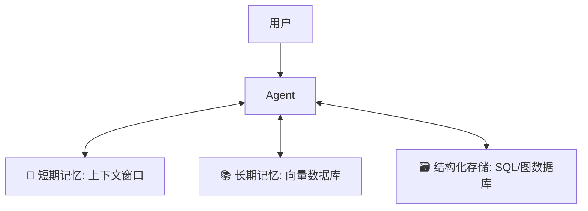

## 8.3 上下文管理与记忆

人类的大脑有短时记忆（工作记忆）和长时记忆（经验知识）。
一个高可用的 Agent 也需要这两层记忆结构。只依赖单一的上下文窗口往往是难维护且昂贵。

### 8.3.1 记忆的分层架构


**图 1: Agent 记忆分层架构示意图**

正如上图所示，一个完整的记忆系统并非单体，而是由不同介质、不同访问速度的存储层组成的混合体。这就好比计算机有寄存器（极快但极小）、内存（快且适中）和硬盘（慢但海量）。

在 Claude Agent 的设计中，我们通常将记忆分为以下三个层级，分别对应不同的应用场景：

#### Working Memory
*   **介质**: 模型的 Context Window (Prompt)。
*   **内容**: 当前正在进行的对话、最近几步的思考过程 (CoT)、临时变量。
*   **特点**: 速度快，但容量有限，掉电（会话结束）即失。

#### Episodic Memory
*   **介质**: 向量数据库 (Vector DB)。
*   **内容**: 过去发生过的类似事件、历史对话记录。
*   **实现**: RAG (Retrieval-Augmented Generation)。当用户问起“上周我们讨论了什么方案”时，Top-k 检索相关的历史片段注入 Context。

#### Semantic Memory
*   **介质**: 外部知识文档、结构化数据库。
*   **内容**: 公司的 SOP、产品手册、Fact Facts。

### 8.3.2 突破上下文窗口 (Context) 限制的技术

#### Context Caching
Claude 3.5 引入的 **Prompt Caching** 功能是降低 Agent 成本的神器。
*   **原理**: 由于 Agent 的 System Prompt 和 RAG 文档在多轮对话中是不变的，Anthropic 允许将这些静态部分（Prefix）缓存起来。
*   **收益**: Input Token 成本最高可降低 **90%**，首字延迟 (TTFT) 降低 **80%**。
*   **用法**: 在发送请求时，通过 `beta` header 标记哪些 block 需要缓存。

#### Memory Tool
除了隐式的 RAG，还可以给 Agent 一个显式的“记事本工具”。

**Tool Definition**:
```json
{
  "name": "manage_memory",
  "description": "Store important facts about the user.",
  "parameters": {
    "action": "save | read | delete",
    "key": "user_preference",
    "value": "prefers dark mode"
  }
}
```

**Workflow**:
1.  User: "以后生成的代码都用 Python。"
2.  Agent Call: `manage_memory(action="save", key="coding_lang", value="Python")`.
3.  (Three days later) User: "写个脚本。"
4.  Agent Call: `manage_memory(action="read", key="coding_lang")` -> "Python".

#### Context Compression
当对话轮数（Turns）超过 50 轮时，直接截断会导致丢失早期目标。
**Summarization Strategy**:
*   每隔 10 轮对话，触发一个 Summary Agent。
*   将前 10 轮对话压缩成一段 200 字的摘要。
*   将这段摘要作为新的 System Prompt 的一部分，替换掉原始的历史记录。

### 8.3.3 记忆的生命周期管理

就像人类会遗忘一样，Agent 的记忆也需要 GC (Garbage Collection)。

*   **TTL (Time-To-Live)**: 对于短期的任务状态，设置 24 小时过期。
*   **Relevance Scoring**: 检索记忆时，结合“语义相似度 + 时间衰减因子”。越近的记忆权重越高。
*   **Privacy Purge**: 提供“忘记我”功能，允许用户删除特定 Key 的记忆（符合 GDPR）。

---

有了记忆，Agent 就能处理长周期的任务了。但如果任务本身极其困难（比如证明黎曼猜想，或者规划某国登月工程），不仅需要记忆，还需要更长时间的**深度思考**。

➡️ [Extended Thinking 扩展思考模式](8.4_extended_thinking.md)
