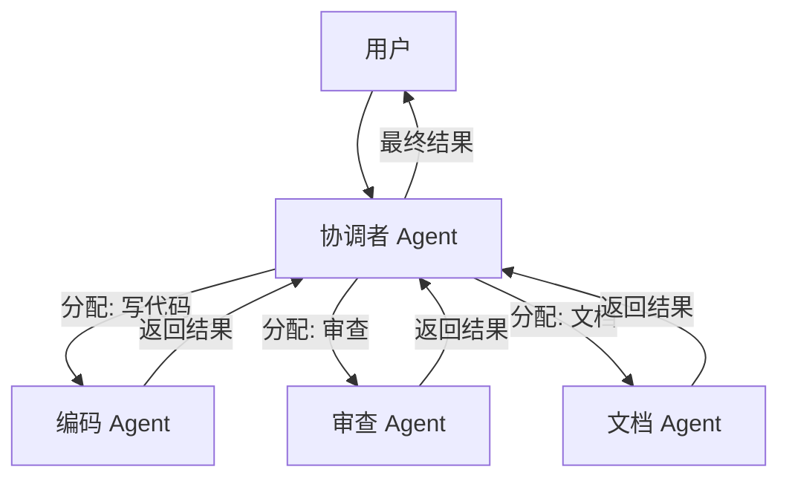

## 8.5 多 Agent 协作

当任务复杂度超过单个 Context Window 的承载极限，或者需要极其专业的不同领域知识时，单个 Agent 就显得力不从心。
这时，需要 **Multi-Agent Systems (MAS)**。

### 8.5.1 协作模式

#### Hierarchical
这是最常见、最可控的模式。
*   **Boss (Orchestrator)**: 负责拆解任务，分发工单，验收成果。
*   **Worker A (Coder)**: 负责编写代码。
*   **Worker B (Reviewer)**: 负责审查代码。
*   **Worker C (Writer)**: 负责撰写文档。


**优点**: 逻辑清晰，死循环风险低。
**缺点**: Boss 容易成为瓶颈（Context 爆炸）。

#### Joint Chat
所有 Agent 都在同一个聊天室里，都能看到彼此的消息。
*   **共享上下文 (Shared Context)**: 每个人都知道发生了什么。
*   **发言轮转 (Turn-taking)**: 需要一种机制决定下一个谁发言（轮询，或者由 LLM 决定）。

**优点**: 信息同步快，适合头脑风暴。
**缺点**: 容易吵架（模型互相纠正），Context 消耗极快。

#### Handoff
常见于客户服务。
*   Level 1 Agent: "您好，有什么可以帮您？" -> 用户: "我要退款。"
*   Level 1 Agent: "好的，转接给退款专员。" -> **Handoff** -> Level 2 Finance Agent。
*   Level 2 Agent: 拥有 Level 1 传来的 Summary，继续服务。

### 8.5.2 人工参与决策

在 MAS 中，人类本质上也是一个特殊的 Agent。
*   **Tool**: `ask_human(question)`。
*   当 Agent 们吵得不可开交，或者 Boss 无法判断 Worker 的结果是否合格时，调用 `ask_human`。
*   人类介入，给出裁决，系统继续运行。

### 8.5.3 实现框架：Swarm & LangGraph

虽然可以手写 `while` 循环来调度，但使用成熟的框架会更高效。

#### LangGraph
基于**图论 (Graph)** 的编排框架。
每一个 Agent 是图中的一个 Node，连线（Edge）代表状态流转的条件。
非常适合构建复杂的、有状态的、循环的工作流。

```python
from langgraph.graph import StateGraph, END
from typing import TypedDict, Literal

# 定义共享状态
class AgentState(TypedDict):
    task: str
    code: str
    review: str
    status: Literal["pending", "approved", "rejected"]

# 定义各个 Agent 节点
def coder_agent(state: AgentState) -> AgentState:
    # Coder 根据任务生成代码
    code = llm.invoke(f"Write code for: {state['task']}")
    return {"code": code, "status": "pending"}

def reviewer_agent(state: AgentState) -> AgentState:
    # Reviewer 审查代码
    review = llm.invoke(f"Review this code:\n{state['code']}")
    status = "approved" if "LGTM" in review else "rejected"
    return {"review": review, "status": status}

# 定义路由逻辑
def should_continue(state: AgentState) -> str:
    if state["status"] == "approved":
        return "end"
    return "revise"  # 被拒绝则返回修改

# 构建工作流图
workflow = StateGraph(AgentState)
workflow.add_node("coder", coder_agent)
workflow.add_node("reviewer", reviewer_agent)

workflow.set_entry_point("coder")
workflow.add_edge("coder", "reviewer")
workflow.add_conditional_edges("reviewer", should_continue, {
    "end": END,
    "revise": "coder"  # 循环回 coder 修改
})

# 编译并运行
app = workflow.compile()
result = app.invoke({"task": "实现一个快速排序算法"})
```

#### OpenAI Swarm
一种轻量级的 Handoff 模式实现。
定义好 `transfer_to_agent_b` 这种工具，让模型自己决定什么时候交接棒。

```python
from swarm import Swarm, Agent

client = Swarm()

# 定义转接函数
def transfer_to_refund_agent():
    """转接给退款专员处理退款相关问题"""
    return refund_agent

def transfer_to_sales_agent():
    """转接给销售专员处理购买相关问题"""
    return sales_agent

# 定义各个专员 Agent
triage_agent = Agent(
    name="客服分诊员",
    instructions="你是客服入口，根据用户问题转接给合适的专员。",
    functions=[transfer_to_refund_agent, transfer_to_sales_agent],
)

refund_agent = Agent(
    name="退款专员",
    instructions="你专门处理退款问题。核实订单后进行退款操作。",
    functions=[process_refund],  # 退款处理工具
)

sales_agent = Agent(
    name="销售专员", 
    instructions="你专门处理购买咨询和下单问题。",
    functions=[check_inventory, create_order],
)

# 运行对话，Swarm 自动处理 Agent 之间的交接
response = client.run(
    agent=triage_agent,
    messages=[{"role": "user", "content": "我想退掉昨天买的耳机"}]
)
# triage_agent 会自动调用 transfer_to_refund_agent()
# 然后 refund_agent 接管对话
```

### 8.5.4 最佳实践：如何避免"三个和尚没水喝"？

多 Agent 系统最容易出现的问题是：无限循环、互相推诿、Token 爆炸。

1.  **明确定义标准流程 (SOP)**: 每个 Worker 的 System Prompt 必须极度具体。例如："你是 Python 专家，只写 Python，不要写 Shell。"
2.  **共享状态数据库**: 不要把所有信息都放在 Prompt 里传递。使用 Redis 或文件系统作为 Agent 之间的"共享白板"。Coder 写完代码存在 `/tmp/code.py`，Reviewer 去读这个文件，而不是把代码贴在对话里。
3.  **最大轮次限制**: 设置严格的熔断机制。如果 Boss 和 Worker 来回扯皮超过 10 轮，强制终止并报错给人类。

---

至此，读者已经完成了 Agent 架构设计的学习。现在不仅拥有最强的大脑（Claude），敏捷的身手（Tools），还有了指挥千军万马的能力（Multi-Agent）。

下一章，将走出理论，进入真实的商业战场。看看那些顶尖的科技公司是如何利用这些技术构建企业级应用的。

➡️ [第九章：企业级应用案例](../09_practical/README.md)
