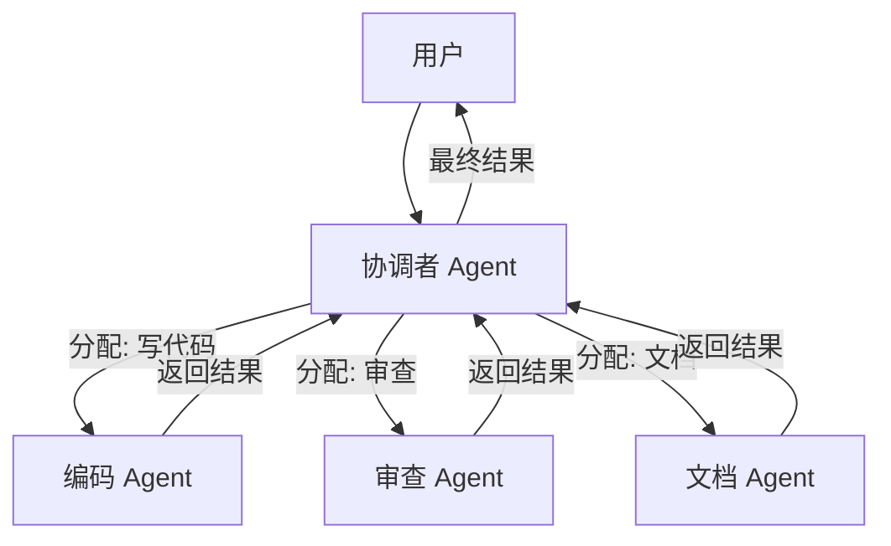

## 8.5 多 Agent 协作模式与实现框架

当任务复杂度超过单个 Context Window 的承载极限，或者需要极其专业的不同领域知识时，单个 Agent 就显得力不从心。
这时，需要 **Multi-Agent Systems (MAS)**。

### 8.5.1 协作模式

#### Hierarchical

这是最常见、最可控的模式。
*   **Boss (Orchestrator)**: 负责拆解任务，分发工单，验收成果。
*   **Worker A (Coder)**: 负责编写代码。
*   **Worker B (Reviewer)**: 负责审查代码。
*   **Worker C (Writer)**: 负责撰写文档。


```mermaid
graph TD
    User["用户"] --> Boss["协调者 Agent"]
    Boss -->|"分配: 写代码"| Coder["编码 Agent"]
    Boss -->|"分配: 审查"| Reviewer["审查 Agent"]
    Boss -->|"分配: 文档"| Writer["文档 Agent"]

    Coder -->|"返回结果"| Boss
    Reviewer -->|"返回结果"| Boss
    Writer -->|"返回结果"| Boss

    Boss -->|"最终结果"| User
```
**优点**: 逻辑清晰，死循环风险低。
**缺点**: Boss 容易成为瓶颈（Context 爆炸）。

#### Joint Chat

所有 Agent 都在同一个聊天室里，都能看到彼此的消息。
*   **共享上下文 (Shared Context)**: 每个人都知道发生了什么。
*   **发言轮转 (Turn-taking)**: 需要一种机制决定下一个谁发言（轮询，或者由 LLM 决定）。

**优点**: 信息同步快，适合头脑风暴。
**缺点**: 容易吵架（模型互相纠正），Context 消耗极快。

#### Handoff

常见于客户服务。
*   Level 1 Agent: “您好，有什么可以帮您？” -> 用户: “我要退款。”
*   Level 1 Agent: “好的，转接给退款专员。” -> **Handoff** -> Level 2 Finance Agent。
*   Level 2 Agent: 拥有 Level 1 传来的 Summary，继续服务。

### 8.5.2 A2A：Agent-to-Agent 通信契约

当系统演进到多 Agent 协作后，一个新问题会变得非常现实：**Agent 之间到底该怎么通信？**

直觉上，很多人会说“既然 Agent 擅长自然语言，那就直接聊天”。但工程上这通常不是好主意，因为它会带来：

- **高 Token 开销**：大量自然语言废话会放大通信成本
- **低确定性**：字段漏写、状态不规范、参数解释偏差都很常见
- **难审计**：自然语言适合人类阅读，不适合系统间协议校验

更合理的做法是定义 **A2A（Agent-to-Agent）通信契约**，让 Agent 之间通过结构化消息交互，例如：

```
{
  "task_id": "task-001",
  "task_type": "refund_request",
  "dependencies": [],
  "acceptance_criteria": [
    "核验订单",
    "确认退款条件",
    "输出处理结论"
  ],
  "payload": {
    "order_id": "ORD-123",
    "customer_id": "CUST-456"
  }
}
```

这和微服务之间传递 JSON 或 Protobuf 是一个思路：**对人保留自然语言，对机器优先结构化协议**。

在多 Agent 系统里，至少要统一以下几类字段：

| 字段 | 作用 |
|------|------|
| `task_id` | 任务唯一标识 |
| `task_type` | 当前委派的能力类型 |
| `dependencies` | 前置依赖 |
| `payload` | 结构化输入 |
| `status` | 任务状态 |
| `trace_id` | 贯穿全链路的观测标识 |

如果没有这样的契约，系统规模一大，所谓“多智能体协作”很快就会退化成“多轮 Prompt 拼接”。

### 8.5.3 人工参与决策

在 MAS 中，人类本质上也是一个特殊的 Agent。
*   **Tool**: `ask_human(question)`。
*   当 Agent 们吵得不可开交，或者 Boss 无法判断 Worker 的结果是否合格时，调用 `ask_human`。
*   人类介入，给出裁决，系统继续运行。

### 8.5.4 实现框架：Swarm & LangGraph

虽然可以手写 `while` 循环来调度，但使用成熟的框架会更高效。

#### LangGraph

基于 **图论 (Graph)** 的编排框架。
每一个 Agent 是图中的一个 Node，连线（Edge）代表状态流转的条件。
非常适合构建复杂的、有状态的、循环的工作流。

```python
from langgraph.graph import StateGraph, END
from typing import TypedDict, Literal

# 定义共享状态
class AgentState(TypedDict):
    task: str
    code: str
    review: str
    status: Literal["pending", "approved", "rejected"]

# 定义各个 Agent 节点
def coder_agent(state: AgentState) -> AgentState:
    # Coder 根据任务生成代码
    code = llm.invoke(f"Write code for: {state['task']}")
    return {"code": code, "status": "pending"}

def reviewer_agent(state: AgentState) -> AgentState:
    # Reviewer 审查代码
    review = llm.invoke(f"Review this code:\n{state['code']}")
    status = "approved" if "LGTM" in review else "rejected"
    return {"review": review, "status": status}

# 定义路由逻辑
def should_continue(state: AgentState) -> str:
    if state["status"] == "approved":
        return "end"
    return "revise"  # 被拒绝则返回修改

# 构建工作流图
workflow = StateGraph(AgentState)
workflow.add_node("coder", coder_agent)
workflow.add_node("reviewer", reviewer_agent)

workflow.set_entry_point("coder")
workflow.add_edge("coder", "reviewer")
workflow.add_conditional_edges("reviewer", should_continue, {
    "end": END,
    "revise": "coder"  # 循环回 coder 修改
})

# 编译并运行
app = workflow.compile()
result = app.invoke({"task": "实现一个快速排序算法"})
```

#### OpenAI Swarm

一种轻量级的 Handoff 模式实现。
定义好 `transfer_to_agent_b` 这种工具，让模型自己决定什么时候交接棒。

```python
from swarm import Swarm, Agent

client = Swarm()

# 定义转接函数
def transfer_to_refund_agent():
    """转接给退款专员处理退款相关问题"""
    return refund_agent

def transfer_to_sales_agent():
    """转接给销售专员处理购买相关问题"""
    return sales_agent

# 定义各个专员 Agent
triage_agent = Agent(
    name="客服分诊员",
    instructions="你是客服入口，根据用户问题转接给合适的专员。",
    functions=[transfer_to_refund_agent, transfer_to_sales_agent],
)

refund_agent = Agent(
    name="退款专员",
    instructions="你专门处理退款问题。核实订单后进行退款操作。",
    functions=[process_refund],  # 退款处理工具
)

sales_agent = Agent(
    name="销售专员",
    instructions="你专门处理购买咨询和下单问题。",
    functions=[check_inventory, create_order],
)

# 运行对话，Swarm 自动处理 Agent 之间的交接
response = client.run(
    agent=triage_agent,
    messages=[{"role": "user", "content": "我想退掉昨天买的耳机"}]
)

# triage_agent 会自动调用 transfer_to_refund_agent()
# 然后 refund_agent 接管对话
```

#### Anthropic Agent SDK 与 Claude Code 子代理

这两者都属于“协作范式”，但不是同一个层级的东西：

*   **Agent SDK**：用于自己搭建多 Agent 编排系统。你需要自己定义角色、状态流转、工具边界和验收逻辑。
*   **Claude Code Subagents**：属于 Claude Code 产品内建的委派能力，适合把大型任务拆成多个子任务并行处理，再由主代理汇总结果。

这里要特别避免一个常见误解：**Subagents 的核心是上下文隔离，不等于天然提供 repo、分支或 worktree 隔离。**
工程上如果你需要更强的执行隔离，可以额外配合分支、worktree、容器或 CI 沙箱，但那是工作流策略，不是 subagent 概念本身。

更稳妥的表述应该是：

*   主代理负责拆解任务、定义验收标准和汇总结果；
*   子代理在各自独立的上下文窗口里处理子任务；
*   是否并行、隔离到什么程度、是否允许直接落盘，都取决于具体产品能力和你的工程约束。

### 8.5.5 Agentic Workflows：从协作到工作流

多 Agent 并不是最终目标，**稳定交付结果** 才是目标。把 ReAct、Planning、Reflection、Multi-Agent 这些模式组合起来，才构成真正的 Agentic Workflow。

在一个成熟的团队式 Agent 系统中，常见工作流是：

1. **Planner** 先做全局拆解
2. **Worker Agents** 分头执行
3. **Reviewer / Critic** 负责校验和反思
4. **Orchestrator** 汇总结果并决定是否进入下一轮

换句话说：

- `8.2` 讲的是单个模式怎么工作
- `8.5` 讲的是多个角色怎么协作
- 真正上线时，用的是“模式 + 协作 + 审批 + 观测”的完整工作流

这也是为什么工程上不能只背概念名词。你真正要设计的是：

- 谁拆任务
- 谁执行
- 谁评审
- 谁负责失败后的重试和重规划
- Agent 之间如何交换状态与证据

只有这些都明确，Multi-Agent 才会从“热闹的 Demo”变成“可维护的系统”。

### 8.5.6 最佳实践：如何避免”三个和尚没水喝”？

多 Agent 系统最容易出现的问题是：无限循环、互相推诿、Token 爆炸。

1.  **明确定义标准流程 (SOP)**: 每个 Worker 的 System Prompt 必须极度具体。例如：”你是 Python 专家，只写 Python，不要写 Shell。”
2.  **共享状态数据库**: 不要把所有信息都放在 Prompt 里传递。使用 Redis 或文件系统作为 Agent 之间的”共享白板”。Coder 写完代码存在 `/tmp/code.py`，Reviewer 去读这个文件，而不是把代码贴在对话里。
3.  **最大轮次限制**: 设置严格的熔断机制。如果 Boss 和 Worker 来回扯皮超过 10 轮，强制终止并报错给人类。

### 8.5.7 案例研究：Claude Code 的多智能体编排

Claude Code 作为生产级编程助手，内置了完整的多智能体协调框架。理解其设计有助于构建可靠的 Multi-Agent 系统。

#### 协调模式激活

多智能体模式通过环境变量激活：

```bash
export CLAUDE_CODE_COORDINATOR_MODE=1
claude
```

启用后，Claude Code 会自动进入 **协调模式**，将复杂任务分解给专用子代理。

#### 四阶段工作流

协调模式采用 **严格的四阶段流程**：

1. **Research 阶段**（可并行）
   - 代理遍历代码库，收集上下文
   - 分析项目结构、依赖、测试框架
   - 多个研究智能体可并行运行

2. **Synthesis 阶段**（必须串行）
   - 汇聚所有研究成果
   - 生成统一的执行计划
   - **关键约束**：此阶段必须串行以确保计划一致性

3. **Implementation 阶段**（可并行）
   - 根据计划分派任务给 Worker 代理
   - 每个 Worker 独立处理子任务
   - 可并行执行多个实现任务

4. **Verification 阶段**（可并行）
   - 独立的审查代理验证成果
   - 运行测试、进行代码审查
   - 多个验证代理可并行检查

```
User Request
    ↓
┌─────────────────┐
│ Research (并行)  │ → Agent A 分析文件
│                 │ → Agent B 分析依赖
│                 │ → Agent C 分析配置
└────────┬────────┘
         ↓
┌─────────────────────────────────┐
│ Synthesis (串行，关键点)        │
│ Coordinator 生成执行计划          │
└────────┬────────────────────────┘
         ↓
┌──────────────────┐
│ Implementation   │ → Coder A 写代码
│ (并行)           │ → Coder B 配置
│                 │ → Coder C 文档
└────────┬────────┘
         ↓
┌──────────────────┐
│ Verification     │ → Reviewer A 代码审查
│ (并行)           │ → Reviewer B 运行测试
└──────────────────┘
         ↓
    返回结果
```

#### 7 种任务类型

Claude Code 定义了 7 种任务类型，每种有独特的前缀 ID：

| 前缀 | 任务类型 | 执行位置 | 示例 |
| :--- | :--- | :--- | :--- |
| `b_` | local_bash | 本地终端 | `b_run_tests` |
| `a_` | local_agent | 本地进程 | `a_code_analysis` |
| `r_` | remote_agent | 远程服务 | `r_api_check` |
| `t_` | tool_use | 工具调用 | `t_read_file` |
| `c_` | coordinator | 协调任务 | `c_plan_task` |
| `s_` | synthesis | 信息综合 | `s_merge_results` |
| `v_` | verification | 验证任务 | `v_review_code` |

任务 ID 包含完整的元数据：

```
b_12345_run_tests__dependencies=a_67890,t_33333__timeout=300
└─ 前缀  └─ 任务ID └─ 操作 └─ 依赖  └─ 超时（秒）
```

#### Agent Swarms：进程内协作

**进程内（In-Process）**：使用 JavaScript 的 `AsyncLocalStorage` 实现轻量级团队成员：

```javascript
// 在同一进程内管理多个逻辑上独立的代理
import { AsyncLocalStorage } from 'async_hooks';

const agentContext = new AsyncLocalStorage();

class AgentSwarm {
  async executeCoordinated(task) {
    // 为每个代理创建独立的上下文
    return Promise.all([
      this.runAgent('researcher', { task }),
      this.runAgent('implementer', { task }),
      this.runAgent('reviewer', { task })
    ]);
  }

  async runAgent(role, context) {
    return agentContext.run(context, async () => {
      // 每个代理看到自己的上下文，无需显式参数传递
      const myContext = agentContext.getStore();
      return await this.agentLogic[role](myContext);
    });
  }
}
```

**跨进程（Cross-Process）**：通过 `tmux` 或 `iTerm2` 面板的原生分割实现：

```bash
# tmux 协调
tmux new-session -d -s work -x 200 -y 50
tmux send-keys -t work “# Researcher starts here” Enter
tmux split-window -t work -h “# Implementer starts here”
tmux split-window -t work:0.1 -v “# Reviewer starts here”
# 三个代理在同一个会话的三个面板中运行
```

#### 多智能体通信协议

Agent 之间通过 **XML 任务通知消息** 和 **共享文件系统** 通信：

```xml
<task-notification>
  <task-id>a_12345_analyze_codebase</task-id>
  <initiator>coordinator</initiator>
  <status>pending</status>
  <priority>high</priority>
  <deadline>2026-03-31T15:30:00Z</deadline>
  <payload>
    <repository>/path/to/repo</repository>
    <focus>dependencies</focus>
  </payload>
  <result-location>/tmp/claude-code-work/results/a_12345.json</result-location>
</task-notification>
```

共享文件系统结构：

```
/tmp/claude-code-work/
├── tasks/              # 任务定义
│   ├── a_12345.json
│   └── b_12346.json
├── results/            # 任务结果
│   ├── a_12345_result.json
│   └── b_12346_result.json
├── context/            # 共享上下文
│   ├── codebase.json
│   └── requirements.json
└── logs/              # 协调日志
    └── coordination.log
```

#### 协调系统提示词关键摘录

Coordinator Agent 的 System Prompt 包含这些核心指令：

```
# 协调原则

## 并行性作为超能力
- Research 和 Implementation 可以并行运行
- 最大化利用 Token 预算的并行处理能力
- 但 Synthesis 必须串行以保证计划一致

## 拒绝懒惰委派
- 不要简单地把整个任务转发给一个 Worker
- 必须执行前置分析（Research）
- 必须定义明确的验收标准（Acceptance Criteria）
- 必须验证成果（Verification）

## 任务分解模板
每次分派任务时，强制遵循此模板：
{
  “task_id”: “...”,
  “task_type”: “...”,
  “dependencies”: [“task_ids”],
  “acceptance_criteria”: [
    “标准 1”,
    “标准 2”
  ],
  “resources”: {
    “memory”: “2GB”,
    “timeout”: “300s”
  }
}
```

---

至此，读者已经完成了 Agent 架构设计的学习。现在不仅拥有最强的大脑（Claude），敏捷的身手（Tools），还有了指挥千军万马的能力（Multi-Agent）。

下一章，将走出理论，进入真实的商业战场。看看那些顶尖的科技公司是如何利用这些技术构建企业级应用的。

➡️ [第九章：企业级应用案例](../09_practical/README.md)
