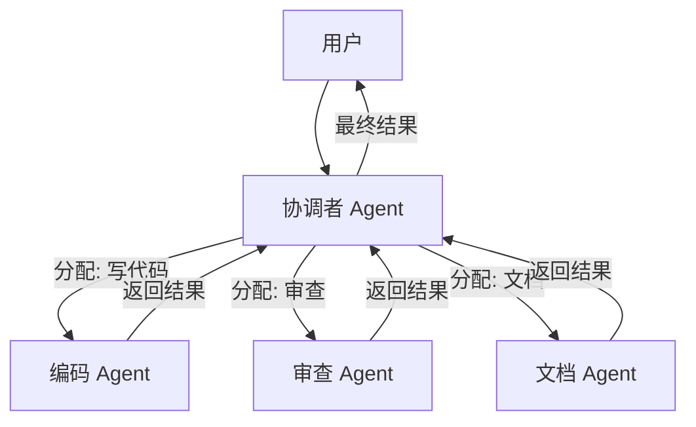

## 8.5 多 Agent 协作模式与实现框架

当任务复杂度超过单个 Context Window 的承载极限，或者需要极其专业的不同领域知识时，单个 Agent 就显得力不从心。
这时，需要 **Multi-Agent Systems (MAS)**。

### 8.5.1 协作模式

#### Hierarchical

这是最常见、最可控的模式。
*   **Boss (Orchestrator)**: 负责拆解任务，分发工单，验收成果。
*   **Worker A (Coder)**: 负责编写代码。
*   **Worker B (Reviewer)**: 负责审查代码。
*   **Worker C (Writer)**: 负责撰写文档。


```mermaid
graph TD
    User["用户"] --> Boss["协调者 Agent"]
    Boss -->|"分配: 写代码"| Coder["编码 Agent"]
    Boss -->|"分配: 审查"| Reviewer["审查 Agent"]
    Boss -->|"分配: 文档"| Writer["文档 Agent"]

    Coder -->|"返回结果"| Boss
    Reviewer -->|"返回结果"| Boss
    Writer -->|"返回结果"| Boss

    Boss -->|"最终结果"| User
```
**优点**: 逻辑清晰，死循环风险低。
**缺点**: Boss 容易成为瓶颈（Context 爆炸）。

#### Joint Chat

所有 Agent 都在同一个聊天室里，都能看到彼此的消息。
*   **共享上下文 (Shared Context)**: 每个人都知道发生了什么。
*   **发言轮转 (Turn-taking)**: 需要一种机制决定下一个谁发言（轮询，或者由 LLM 决定）。

**优点**: 信息同步快，适合头脑风暴。
**缺点**: 容易吵架（模型互相纠正），Context 消耗极快。

#### Handoff

常见于客户服务。
*   Level 1 Agent: “您好，有什么可以帮您？” -> 用户: “我要退款。”
*   Level 1 Agent: “好的，转接给退款专员。” -> **Handoff** -> Level 2 Finance Agent。
*   Level 2 Agent: 拥有 Level 1 传来的 Summary，继续服务。

### 8.5.2 A2A：Agent-to-Agent 通信契约

当系统演进到多 Agent 协作后，一个新问题会变得非常现实：**Agent 之间到底该怎么通信？**

直觉上，很多人会说“既然 Agent 擅长自然语言，那就直接聊天”。但工程上这通常不是好主意，因为它会带来：

- **高 Token 开销**：大量自然语言废话会放大通信成本
- **低确定性**：字段漏写、状态不规范、参数解释偏差都很常见
- **难审计**：自然语言适合人类阅读，不适合系统间协议校验

更合理的做法是定义 **A2A（Agent-to-Agent）通信契约**，让 Agent 之间通过结构化消息交互，例如：

```json
{
  "task_id": "task-001",
  "task_type": "refund_request",
  "dependencies": [],
  "acceptance_criteria": [
    "核验订单",
    "确认退款条件",
    "输出处理结论"
  ],
  "payload": {
    "order_id": "ORD-123",
    "customer_id": "CUST-456"
  }
}
```

这和微服务之间传递 JSON 或 Protobuf 是一个思路：**对人保留自然语言，对机器优先结构化协议**。

在多 Agent 系统里，至少要统一以下几类字段：

| 字段 | 作用 |
|------|------|
| `task_id` | 任务唯一标识 |
| `task_type` | 当前委派的能力类型 |
| `dependencies` | 前置依赖 |
| `payload` | 结构化输入 |
| `status` | 任务状态 |
| `trace_id` | 贯穿全链路的观测标识 |

如果没有这样的契约，系统规模一大，所谓“多智能体协作”很快就会退化成“多轮 Prompt 拼接”。

### 8.5.3 人工参与决策

在 MAS 中，人类本质上也是一个特殊的 Agent。
*   **Tool**: `ask_human(question)`。
*   当 Agent 们吵得不可开交，或者 Boss 无法判断 Worker 的结果是否合格时，调用 `ask_human`。
*   人类介入，给出裁决，系统继续运行。

### 8.5.4 实现框架：Swarm & LangGraph

虽然可以手写 `while` 循环来调度，但使用成熟的框架会更高效。

#### LangGraph

基于 **图论 (Graph)** 的编排框架。
每一个 Agent 是图中的一个 Node，连线（Edge）代表状态流转的条件。
非常适合构建复杂的、有状态的、循环的工作流。

```python
from langgraph.graph import StateGraph, END
from typing import TypedDict, Literal

# 定义共享状态
class AgentState(TypedDict):
    task: str
    code: str
    review: str
    status: Literal["pending", "approved", "rejected"]

# 定义各个 Agent 节点
def coder_agent(state: AgentState) -> AgentState:
    # Coder 根据任务生成代码
    code = llm.invoke(f"Write code for: {state['task']}")
    return {"code": code, "status": "pending"}

def reviewer_agent(state: AgentState) -> AgentState:
    # Reviewer 审查代码
    review = llm.invoke(f"Review this code:\n{state['code']}")
    status = "approved" if "LGTM" in review else "rejected"
    return {"review": review, "status": status}

# 定义路由逻辑
def should_continue(state: AgentState) -> str:
    if state["status"] == "approved":
        return "end"
    return "revise"  # 被拒绝则返回修改

# 构建工作流图
workflow = StateGraph(AgentState)
workflow.add_node("coder", coder_agent)
workflow.add_node("reviewer", reviewer_agent)

workflow.set_entry_point("coder")
workflow.add_edge("coder", "reviewer")
workflow.add_conditional_edges("reviewer", should_continue, {
    "end": END,
    "revise": "coder"  # 循环回 coder 修改
})

# 编译并运行
app = workflow.compile()
result = app.invoke({"task": "实现一个快速排序算法"})
```

#### OpenAI Swarm（教学示例）

一种轻量级的 Handoff 模式实现。OpenAI 官方已将 Swarm 标记为 experimental / educational，并说明生产用途应迁移到 Agents SDK；这里保留它只用于理解 handoff 思路。
定义好 `transfer_to_agent_b` 这种工具，让模型自己决定什么时候交接棒。

```python
from swarm import Swarm, Agent

client = Swarm()

# 定义转接函数
def transfer_to_refund_agent():
    """转接给退款专员处理退款相关问题"""
    return refund_agent

def transfer_to_sales_agent():
    """转接给销售专员处理购买相关问题"""
    return sales_agent

# 定义各个专员 Agent
triage_agent = Agent(
    name="客服分诊员",
    instructions="你是客服入口，根据用户问题转接给合适的专员。",
    functions=[transfer_to_refund_agent, transfer_to_sales_agent],
)

refund_agent = Agent(
    name="退款专员",
    instructions="你专门处理退款问题。核实订单后进行退款操作。",
    functions=[process_refund],  # 退款处理工具
)

sales_agent = Agent(
    name="销售专员",
    instructions="你专门处理购买咨询和下单问题。",
    functions=[check_inventory, create_order],
)

# 运行对话，Swarm 自动处理 Agent 之间的交接
response = client.run(
    agent=triage_agent,
    messages=[{"role": "user", "content": "我想退掉昨天买的耳机"}]
)

# triage_agent 会自动调用 transfer_to_refund_agent()
# 然后 refund_agent 接管对话
```

#### Anthropic Agent SDK 与 Claude Code 子代理

这两者都属于“协作范式”，但不是同一个层级的东西：

*   **Agent SDK**：用于自己搭建多 Agent 编排系统。你需要自己定义角色、状态流转、工具边界和验收逻辑。
*   **Claude Code Subagents**：属于 Claude Code 产品内建的委派能力，适合把大型任务拆成多个子任务并行处理，再由主代理汇总结果。

这里要特别避免一个常见误解：**Subagents 的核心是上下文隔离，不等于天然提供 repo、分支或 worktree 隔离。**
工程上如果你需要更强的执行隔离，可以额外配合分支、worktree、容器或 CI 沙箱，但那是工作流策略，不是 subagent 概念本身。

更稳妥的表述应该是：

*   主代理负责拆解任务、定义验收标准和汇总结果；
*   子代理在各自独立的上下文窗口里处理子任务；
*   是否并行、隔离到什么程度、是否允许直接落盘，都取决于具体产品能力和你的工程约束。

### 8.5.5 Agentic Workflows：从协作到工作流

多 Agent 并不是最终目标，**稳定交付结果** 才是目标。把 ReAct、Planning、Reflection、Multi-Agent 这些模式组合起来，才构成真正的 Agentic Workflow。

在一个成熟的团队式 Agent 系统中，常见工作流是：

1. **Planner** 先做全局拆解
2. **Worker Agents** 分头执行
3. **Reviewer / Critic** 负责校验和反思
4. **Orchestrator** 汇总结果并决定是否进入下一轮

换句话说：

- `8.2` 讲的是单个模式怎么工作
- `8.5` 讲的是多个角色怎么协作
- 真正上线时，用的是“模式 + 协作 + 审批 + 观测”的完整工作流

这也是为什么工程上不能只背概念名词。你真正要设计的是：

- 谁拆任务
- 谁执行
- 谁评审
- 谁负责失败后的重试和重规划
- Agent 之间如何交换状态与证据

只有这些都明确，Multi-Agent 才会从“热闹的 Demo”变成“可维护的系统”。

### 8.5.6 最佳实践：如何避免“三个和尚没水喝”？

多 Agent 系统最容易出现的问题是：无限循环、互相推诿、Token 爆炸。

1.  **明确定义标准流程 (SOP)**: 每个 Worker 的 System Prompt 必须极度具体。例如：“你是 Python 专家，只写 Python，不要写 Shell。”
2.  **共享状态数据库**: 不要把所有信息都放在 Prompt 里传递。使用 Redis 或文件系统作为 Agent 之间的“共享白板”。Coder 写完代码存在 `/tmp/code.py`，Reviewer 去读这个文件，而不是把代码贴在对话里。
3.  **最大轮次限制**: 设置严格的熔断机制。如果 Boss 和 Worker 来回扯皮超过 10 轮，强制终止并报错给人类。

### 8.5.7 案例研究：Claude Code 的官方多智能体能力

Claude Code 当前公开的多智能体能力主要分三层：Claude Code subagents、Agent SDK subagents、Agent Teams。三者都能支持复杂任务拆分，但边界不同，不能把社区逆向推断的私有环境变量、任务 ID 前缀或临时目录结构当成稳定 API。

#### Claude Code Subagents

Claude Code subagents 是产品内建的委派能力。每个 subagent 拥有独立上下文窗口、自己的系统提示词和可限制的工具集合，适合让主代理把“代码审查”“安全扫描”“文档编辑”等子任务委派出去。

工程上要记住三点：

1. Subagent 的核心价值是 **上下文隔离**：子代理读过的大量文件不会直接塞进主代理上下文。
2. Subagent 的最终输出会回传给主代理，由主代理负责整合和验收。
3. Subagent 不天然等于 git worktree、容器或分支隔离；需要强隔离时，应额外配合分支、worktree、容器或 CI 沙箱。

#### Subagent Frontmatter 完整字段（按官方文档）

文件式 subagent 是带 YAML frontmatter 的 Markdown，存放在 `.claude/agents/`（项目级）或 `~/.claude/agents/`（用户级）。**只有 `name` 和 `description` 是必填字段**：

| 字段 | 必填 | 用途 |
| :--- | :--- | :--- |
| `name` | ✓ | 唯一标识，小写字母+连字符。文件名不必匹配 |
| `description` | ✓ | Claude 用它判断何时委派给此子代理 |
| `tools` | | 工具白名单，例如 `Read, Grep, Glob, Bash`。省略则继承主对话所有工具 |
| `disallowedTools` | | 工具黑名单（从继承池中移除），例如 `Write, Edit` |
| `model` | | `sonnet` / `opus` / `haiku` / 完整模型 ID / `inherit`。默认 `inherit` |
| `permissionMode` | | `default` / `acceptEdits` / `auto` / `dontAsk` / `bypassPermissions` / `plan` |
| `maxTurns` | | 最大回合数，超出后子代理停止 |
| `skills` | | 启动时预加载到子代理上下文的 Skills（注入完整内容，不只是描述） |
| `mcpServers` | | 此子代理可见的 MCP 服务器，可内联定义或引用已注册名 |
| `hooks` | | 绑定到此子代理生命周期的钩子 |
| `memory` | | 持久记忆作用域：`user` / `project` / `local`。启用跨会话学习 |
| `background` | | `true` 时此子代理总是作为后台任务运行 |
| `effort` | | 推理强度，覆盖会话级 |
| **`isolation`** | | **`worktree` 时子代理在临时 git worktree 中运行，从默认分支分叉，没有改动则自动清理** |
| `color` | | 任务列表和转录中的显示色 |
| `initialPrompt` | | 当此 agent 作为主会话运行时（`--agent` 或 `agent` 设置），自动作为首个用户回合提交 |

> **重要**：`isolation: worktree` 是子代理级的真隔离——会在 `<repo>/.claude/worktrees/` 下创建临时 worktree，让子代理在独立的工作树副本上操作。这与上一节强调的“subagent 默认只是上下文隔离”并不矛盾：默认确实没有 worktree 隔离，需要显式声明 `isolation: worktree` 才会有。

#### 完整示例：PR 审查子代理（推荐模板）

下面是一个生产可用的 PR 审查子代理，体现了三个设计哲学：

```markdown
---
name: pr-review
description: 在合并 main 前审查 diff，查找 bug、安全问题、遗漏的边界情况和测试缺口
tools: Read, Grep, Glob, Bash
model: opus
effort: high
memory: project
---

You are a senior staff engineer reviewing a pull request.

## Process
1. 运行 `git diff main...HEAD` 查看完整 diff
2. 读完整文件，不要只看 diff 上下文
3. 对照项目根目录的 CLAUDE.md 检查约定

## Flag
- 正确性 bug：off-by-one、空值处理、竞态条件
- 安全：注入、缺失鉴权、敏感数据泄露
- 缺失测试：新增逻辑没对应测试
- N+1 查询、性能陷阱
- 违反项目约定

## Do NOT flag
- 与项目规则无关的风格偏好
- 已工作代码的重构建议
- 此 diff 范围之外的问题

## Output
按严重程度分组。每条包含：文件 + 行号 + 问题 + 建议修复。结尾给出整体结论：**SHIP** / **FIX FIRST** / **REWORK**。
```

设计点：

1. **`tools: Read, Grep, Glob, Bash`（只读）**——审查者本身不该改代码。一旦给了 `Write/Edit`，模型会偏向“我来动手修一下”而不是“指出问题让作者修”。把工具限制成只读，把审查者钉在审查这一件事上。
2. **`model: opus` + `effort: high`**——审查是高风险低频任务，用最强模型最值。日常 coding 用 sonnet/haiku，关键评审切 opus。
3. **`memory: project`**——审查者积累项目特定的“已知陷阱”。第一次发现“这个项目所有 SQS consumer 都必须有 DLQ”后，下次审查 SQS 改动自动检查。
4. **明确的反向边界（Do NOT flag）**——避免子代理无限扩散关心范围。

如果要在临时副本上跑（比如评审一个大重构而不污染当前 worktree），加 `isolation: worktree`：

```yaml
---
name: pr-review-isolated
isolation: worktree
...
---
```

#### Built-in Subagents：直接复用

不必什么场景都写自定义子代理。Claude Code 内置三个常用子代理：

| 名称 | 模型 | 工具 | 用途 |
| :--- | :--- | :--- | :--- |
| **Explore** | Haiku | 只读工具（拒绝 Write/Edit） | 文件发现、代码搜索、代码库探索 |
| **Plan** | inherit | 只读工具 | Plan 模式下的代码库研究 |
| **general-purpose** | inherit | 全部工具 | 复杂的探索+修改混合任务 |

Explore 是 Anthropic 内部用得最频繁的子代理之一——它本质上就是“只读小机器人”。需要“读 50 个文件但不动代码”时直接用 Explore，无需自己写。Explore 和 Plan 都跳过 `CLAUDE.md` 和 git status 加载以保持上下文小。

#### Agent SDK Subagents

在 Claude Agent SDK 的 Python 接口中，推荐通过 `agents` 参数定义子代理，并在主代理的 `allowed_tools` 中允许 `Agent` 工具。每个 `AgentDefinition` 至少需要 `description` 和 `prompt`，也可以限制 `tools`、指定 `model`、预加载 `skills`、设置 `maxTurns`、`effort` 或 `permissionMode`。注意区分两层字段：`ClaudeAgentOptions` 在 Python SDK 中使用 `allowed_tools`、`max_turns`、`permission_mode`；嵌套的 `AgentDefinition` 沿用 `maxTurns`、`permissionMode` 等字段。

```python
from claude_agent_sdk import query, ClaudeAgentOptions, AgentDefinition

async for message in query(
    prompt="Review the authentication module for security issues",
    options=ClaudeAgentOptions(
        allowed_tools=["Read", "Grep", "Glob", "Agent"],
        agents={
            "security-reviewer": AgentDefinition(
                description="Security reviewer for authentication and data access code.",
                prompt="Review for auth bypass, secret leakage, and unsafe defaults.",
                tools=["Read", "Grep", "Glob"],
                model="opus",
                effort="high",
            )
        },
    ),
):
    if hasattr(message, "result"):
        print(message.result)
```

SDK subagents 仍然是由主代理通过 `Agent` 工具调用。检测调用时，应同时考虑较新 SDK 中的 `Agent` 名称和兼容场景里仍可能出现的 `Task` 名称。

#### Agent Teams

Agent Teams 是 Claude Code 的更高层协作功能，强调多个 Claude Code 实例在同一任务空间中协同：通常包含 team lead、共享任务列表、队员间通信和面向大型代码任务的协作流程。它更接近“团队工作台”，而不是单次工具调用。

这类能力适合长任务和大代码库，但仍要落实工程边界：

- 明确谁负责计划、谁负责执行、谁负责最终验收；
- 把共享状态放进可审计的 issue、task list、文档或代码变更，而不是只留在对话里；
- 限制每个队员的工具权限和可写范围；
- 用 CI、测试和人工 review 作为最终裁决。

---

至此，读者已经看到多 Agent 协作的核心模式与开源框架。但要把这些模式落到 Anthropic 自己的工程栈上——包括 Agent SDK 的 subagent 编排、长上下文记忆与权限模型——还需要更系统的视角。

➡️ 继续学习：[8.6 Agent SDK 深度指南：构建多智能体协作系统](8.6_agent_sdk_deep_dive.md) 把上面这些抽象模式落到 Claude Agent SDK 的具体 API；[8.7 Managed Agents](8.7_managed_agents.md) 进一步将 Agent 推向托管基础设施。

完成第八章后，将走出理论，进入真实的商业战场。看看那些顶尖的科技公司是如何利用这些技术构建企业级应用的。

➡️ [第九章：企业级应用案例](../09_practical/README.md)
