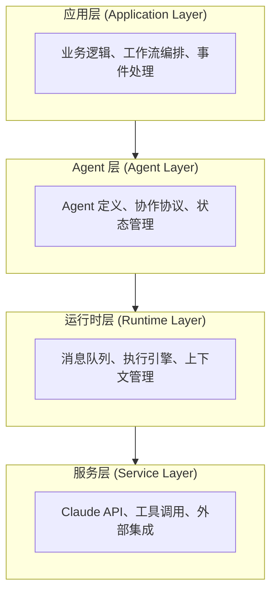
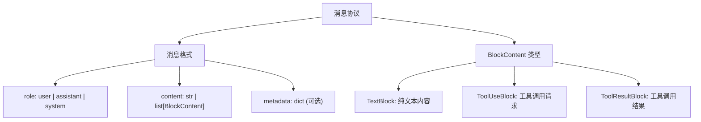
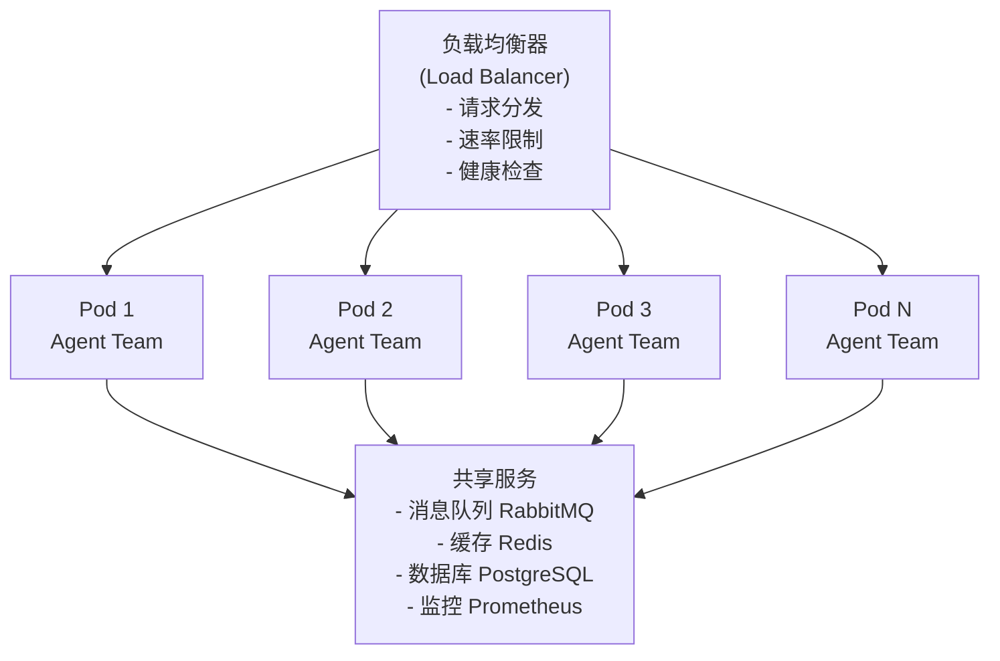

## Agent SDK 深度指南：构建多智能体协作系统

### 前言

第 8.5 章介绍了 Agent SDK 的基础知识。本章深入探讨 Claude Agent SDK 的架构设计、高级特性、性能优化和生产部署最佳实践。通过本章的学习，你将能够设计和部署复杂的多 Agent 协作系统。

> 注：本章很多代码用于表达“多 Agent 分层设计思想”，应视为**架构伪代码**，而不是当前公开 Claude Agent SDK 的逐字可运行 API。写作本章时，Anthropic 公开提供的 Python SDK 入口以 `claude_agent_sdk` 为主；若你要直接落地，请优先查阅官方最新 SDK 文档，再把这里的模式映射到真实接口。

### 第一节 Claude Agent SDK 架构深入分析

### 8.6.1 架构的三层设计

Claude Agent SDK 采用了分层架构，每一层都承担不同的职责：



**应用层** - 定义你的业务逻辑

```python
# 伪代码：示意“团队编排层”而非当前公开 SDK 的真实 import 路径
# 若要落地，请以 claude_agent_sdk 官方接口重写
from typing import Any

class DocumentProcessingTeam:
    """文档处理团队应用层"""

    def __init__(self):
        self.parser_agent = self._create_parser_agent()
        self.analyzer_agent = self._create_analyzer_agent()
        self.summarizer_agent = self._create_summarizer_agent()

    def _create_parser_agent(self) -> Any:
        """创建文档解析 Agent"""
        return dict(
            name="parser",
            model="claude-sonnet-4-6",
            system_prompt="You are a document parser. Extract all structured information.",
            description="Parses documents and extracts text and tables"
        )

    def _create_analyzer_agent(self) -> Any:
        """创建分析 Agent"""
        return dict(
            name="analyzer",
            model="claude-sonnet-4-6",
            system_prompt="You are an expert analyzer. Provide deep analysis of extracted content.",
            description="Analyzes parsed content and identifies patterns"
        )

    def _create_summarizer_agent(self) -> Any:
        """创建总结 Agent"""
        return dict(
            name="summarizer",
            model="claude-haiku-4-5-20251001",  # 使用更经济的模型
            system_prompt="You are a concise summarizer. Provide executive summary in 3-5 points.",
            description="Creates concise summaries of analysis"
        )

    async def process_document(self, doc_path: str) -> dict:
        """应用层：处理文档的主要工作流"""
        try:
            # 步骤 1：解析
            parsed = await run_agent(self.parser_agent, {
                "file_path": doc_path
            })

            # 步骤 2：分析
            analysis = await run_agent(self.analyzer_agent, {
                "content": parsed,
                "analysis_type": "comprehensive"
            })

            # 步骤 3：总结
            summary = await run_agent(self.summarizer_agent, {
                "analysis": analysis
            })

            return {
                "status": "success",
                "parsed": parsed,
                "analysis": analysis,
                "summary": summary
            }
        except Exception as e:
            return {
                "status": "error",
                "error": str(e)
            }
```

**Agent 层** - 定义单个 Agent 的行为

```python
# 伪代码：示意“单 Agent 定义层”
from dataclasses import dataclass
from typing import Any

@dataclass
class ToolSpec:
    name: str
    description: str
    schema: dict[str, Any]

class DocumentParserAgent:
    """文档解析 Agent - Agent 层定义"""

    def __init__(self):
        self.config = dict(
            name="document_parser",
            model="claude-sonnet-4-6",
            system_prompt="""You are an expert document parser.
Your task is to extract structured information from documents.""",
            tools=[
                ToolSpec(
                    name="extract_text",
                    description="Extract text from document",
                    schema={
                        "type": "object",
                        "properties": {
                            "file_path": {
                                "type": "string",
                                "description": "Path to document file"
                            }
                        },
                        "required": ["file_path"]
                    }
                ),
                ToolSpec(
                    name="extract_tables",
                    description="Extract tables from document",
                    schema={
                        "type": "object",
                        "properties": {
                            "file_path": {
                                "type": "string",
                                "description": "Path to document file"
                            },
                            "table_format": {
                                "type": "string",
                                "enum": ["csv", "json", "markdown"],
                                "description": "Output format for tables"
                            }
                        },
                        "required": ["file_path"]
                    }
                )
            ]
        )

    def get_instructions(self) -> str:
        """定义 Agent 的行为准则"""
        return """
1. Extract all text content preserving structure
2. Identify and extract tables with column headers
3. Preserve formatting information (bold, italic, lists)
4. Report any extraction errors with specific line numbers
5. Generate structured JSON output with metadata
"""
```

**运行时层** - 管理 Agent 的执行

```python
# 伪代码：示意“运行时层”职责拆分
from typing import Any

class CustomAgentRuntime:
    """自定义运行时 - 运行时层"""

    def __init__(self):
        self.message_queue = []
        self.context_manager = ContextManager()

    async def execute_agent(self, agent: Any, input_data: dict):
        """执行单个 Agent"""
        # 1. 初始化上下文
        context = self.context_manager.create(agent.name)

        # 2. 准备消息
        messages = self._prepare_messages(input_data)

        # 3. 调用 Claude API
        response = await self._call_claude(agent.model, messages)

        # 4. 处理工具调用
        if response.has_tool_use():
            result = await self._handle_tool_calls(response, agent.tools)
            return result

        return response.content
```

**服务层** - 与外部系统集成

```python
from anthropic import Anthropic

class AnthropicService:
    """Anthropic API 服务 - 服务层"""

    def __init__(self, api_key: str):
        self.client = Anthropic(api_key=api_key)

    async def call_claude(self, model: str, messages: list, tools: list = None):
        """调用 Claude API"""
        response = await self.client.messages.create(
            model=model,
            max_tokens=2000,
            messages=messages,
            tools=tools
        )
        return response

    async def batch_call(self, requests: list):
        """批量调用（用于性能优化）"""
        # 使用 Batch API 获得 50% 折扣
        # 这里应改为调用官方 Messages Batch API 或等价批处理接口
        # ...实现批量处理逻辑
```

### 8.6.2 Agent 反馈循环：收集-执行-验证模式

Claude Agent SDK 采用了一个经过实战检验的核心反馈循环：**收集上下文 (Gather Context) → 执行任务 (Take Action) → 验证工作 (Verify Work) → 重复**。这个循环是 Claude Code 等高效 Agent 系统的基础，也是你设计自己 Agent 时应该遵循的核心模式。

**循环的三个关键阶段**

1. **收集上下文 (Gather Context)**

Agent 需要能够主动获取和更新自己的上下文，而不仅仅依赖初始提示。Agent SDK 提供的几个机制支持这一点：

- **文件系统作为索引**：文件夹和文件的结构本身就是一种上下文工程。当 Agent 遇到大型日志文件或用户上传的数据时，它会使用 `grep`、`tail` 等 bash 命令来智能地加载相关部分，而不是一次性将整个文件加载到上下文中。

  例如，一个邮件 Agent 可能存储了 `conversations/` 文件夹中的历史对话。Agent 在被询问时可以搜索这个文件夹来找到相关对话，而不需要将所有对话都保存在内存中。

- **语义搜索 (Semantic Search)**：虽然语义搜索通常比文件系统搜索更快，但准确性较低。建议从文件系统的 Agent 搜索开始，只在需要更快速度或更多变体时才添加语义搜索。

- **Subagents 与上下文隔离**：Claude Agent SDK 原生支持 subagents（子 Agent），这对两个主要原因很重要：

  - **并行化**：可以同时启动多个 subagents 处理不同任务
  - **上下文隔离**：每个 subagent 有自己独立的上下文窗口，只将相关信息返回给主 orchestrator，而不是返回完整的上下文。这对于需要在大量信息中筛选的任务特别有用。

  例如，邮件 Agent 可能会创建多个搜索 subagents，每个在邮件历史上运行不同的查询，然后只返回相关摘录而不是完整的邮件线程。这样可以有效地管理 token 成本并提高响应速度。

- **自动上下文压缩 (Compaction)**：当 Agent 长时间运行时，上下文维护变得至关重要。Claude Agent SDK 的 compact 功能会在上下文接近限制时自动总结之前的消息，确保 Agent 不会用尽上下文。这是 Claude Code 的 `/compact` 命令的基础。

2. **执行任务 (Take Action)**

一旦收集了上下文，Agent 需要灵活的方式来执行任务。Agent SDK 提供了多种执行工具：

- **工具 (Tools)**：是 Agent 执行的主要构建块。工具在 Claude 的上下文中占据重要位置，使其成为 Claude 在决定如何完成任务时优先考虑的主要行动。因此，你应该精心设计工具来最大化上下文效率。对于邮件 Agent，可以定义 `fetchInbox()` 或 `searchEmails()` 这样的主要工具。

- **Bash 与脚本**：Bash 作为通用工具，允许 Agent 使用计算机灵活地工作。例如，邮件 Agent 可能需要下载 PDF 附件、将其转换为文本、搜索相关信息等，这些都可以通过 bash 脚本完成。

- **代码生成**：Claude Agent SDK 在代码生成方面表现出色。代码是精确的、可组合的、无限可重用的，是 Agent 需要可靠地执行复杂操作时的理想输出。例如，Claude 在 claude.ai 上创建 Excel 电子表格、PowerPoint 演示文稿和 Word 文档时完全依赖代码生成，确保格式一致和复杂功能。

- **MCP (Model Context Protocol)**：MCP 提供对外部服务的标准化集成，自动处理身份验证和 API 调用。这意味着你可以将 Agent 连接到 Slack、GitHub、Google Drive 或 Asana，而无需编写自定义集成代码或管理 OAuth 流。不断增长的 MCP 生态系统使你能够快速为 Agent 添加新功能，只需使用预构建的集成，专注于 Agent 行为。

3. **验证工作 (Verify Work)**

Agent 可以检查并改进自己的输出，是更可靠的基础。给 Claude 具体的方式来评估其工作很关键。我们发现的三种有效方法：

- **定义规则 (Rules-based Feedback)**：最好的反馈形式是提供明确定义的规则，然后说明哪些规则失败了以及为什么。代码 lint 是一种极好的基于规则的反馈形式。生成 TypeScript 并对其进行 lint 通常比生成纯 JavaScript 更好，因为它提供了额外的反馈层。

- **视觉反馈 (Visual Feedback)**：当使用 Agent 完成视觉任务（如 UI 生成或测试）时，视觉反馈（截图或渲染形式）很有帮助。例如，发送带有 HTML 格式的邮件时，可以截取生成的邮件并将其提供给模型进行视觉验证和迭代改进。使用 MCP 服务器（如 Playwright）可以自动化这个视觉反馈循环。

- **LLM 作为评判者 (LLM as a Judge)**：也可以让另一个语言模型基于模糊规则“评判”Agent 的输出。这通常不是非常健壮的方法，可能存在重大延迟权衡，但对于性能提升值得付出代价的应用可能有帮助。例如，邮件 Agent 可以有一个单独的 subagent 评判其草稿的语气，确保它与用户之前的邮件相符。

**设计 Agent 时应该问自己的问题**

在评估 Agent 是否有能力完成其工作时：

- 如果 Agent 误解任务，可能是缺少关键信息。能否改变搜索 API 的结构来更容易地找到所需信息？
- 如果 Agent 反复在某个任务失败，能否在工具调用中添加形式化的规则来识别和修复失败？
- 如果 Agent 无法修复自己的错误，能否给它更有用或更有创意的工具来以不同方式处理问题？
- 如果在添加功能时 Agent 的性能变化，为程序化评估（或 evals）构建一个代表性测试集。

**相关资源**：参见本章第 8.1-8.5 节了解 Agent 设计模式的其他方面，以及第 3 章的“工具设计”了解如何优化工具设计以支持这个循环。

---

*融入自 Anthropic 工程团队的《Building agents with the Claude Agent SDK》*

### 8.6.3 消息流与协议

Agent SDK 中的消息流遵循明确的协议：



**消息路由**

```python
class MessageRouter:
    """智能消息路由器"""

    def __init__(self, agents: dict):
        self.agents = agents  # name -> Agent

    async def route_message(self, message: Message) -> Agent:
        """根据内容确定应该由哪个 Agent 处理"""

        # 策略 1：显式指定
        if message.metadata.get("target_agent"):
            return self.agents[message.metadata["target_agent"]]

        # 策略 2：基于内容分类
        category = self._classify_content(message.content)
        return self.agents[category]

        # 策略 3：基于能力匹配
        agent = await self._find_best_match(message)
        return agent

    def _classify_content(self, content: str) -> str:
        """内容分类（简化版本）"""
        keywords = {
            "parser": ["parse", "extract", "read"],
            "analyzer": ["analyze", "evaluate", "assess"],
            "summarizer": ["summarize", "sum up", "brief"]
        }

        for agent_type, keywords_list in keywords.items():
            if any(kw in content.lower() for kw in keywords_list):
                return agent_type

        return "general"
```

### 8.6.4 状态管理与可观测性

在多 Agent 系统中，状态管理和可观测性至关重要。

**Agent 状态机**

```python
from enum import Enum
from dataclasses import dataclass

class AgentState(Enum):
    """Agent 的生命周期状态"""
    IDLE = "idle"                    # 空闲，等待输入
    PROCESSING = "processing"        # 处理中
    WAITING_FOR_TOOL = "waiting"     # 等待工具结果
    COMPLETED = "completed"          # 完成
    FAILED = "failed"                # 失败

@dataclass
class AgentStatus:
    """Agent 状态快照"""
    agent_id: str
    state: AgentState
    current_task: str = None
    progress: float = 0.0  # 0.0 到 1.0
    last_activity: datetime = None
    error: str = None

class StateManager:
    """管理所有 Agent 的状态"""

    def __init__(self):
        self.states = {}  # agent_id -> AgentStatus

    def update_state(self, agent_id: str, new_state: AgentState):
        """更新 Agent 状态"""
        status = self.states.get(agent_id)
        if status:
            status.state = new_state
            status.last_activity = datetime.now()

    def get_team_status(self) -> dict:
        """获取整个团队的状态概览"""
        return {
            "agents": {
                aid: {
                    "state": status.state.value,
                    "progress": status.progress,
                    "last_activity": status.last_activity.isoformat()
                }
                for aid, status in self.states.items()
            },
            "healthy": all(
                status.state != AgentState.FAILED
                for status in self.states.values()
            )
        }
```

**可观测性与监控**

```python
import logging
from datetime import datetime

class AgentObserver:
    """观察 Agent 的执行过程"""

    def __init__(self):
        self.logger = logging.getLogger(__name__)
        self.events = []

    def on_agent_start(self, agent: Agent, input_data: dict):
        """Agent 开始执行"""
        event = {
            "timestamp": datetime.now().isoformat(),
            "type": "agent_start",
            "agent_id": agent.id,
            "input_size": len(str(input_data))
        }
        self.events.append(event)
        self.logger.info(f"Agent {agent.id} started")

    def on_tool_call(self, agent_id: str, tool_name: str, args: dict):
        """Agent 调用工具"""
        event = {
            "timestamp": datetime.now().isoformat(),
            "type": "tool_call",
            "agent_id": agent_id,
            "tool": tool_name,
            "args_size": len(str(args))
        }
        self.events.append(event)

    def on_agent_complete(self, agent: Agent, result: str, duration_ms: int):
        """Agent 完成执行"""
        event = {
            "timestamp": datetime.now().isoformat(),
            "type": "agent_complete",
            "agent_id": agent.id,
            "duration_ms": duration_ms,
            "result_size": len(result)
        }
        self.events.append(event)

    def get_metrics(self) -> dict:
        """获取性能指标"""
        total_events = len(self.events)
        tool_calls = sum(1 for e in self.events if e["type"] == "tool_call")
        avg_duration = sum(
            e.get("duration_ms", 0)
            for e in self.events if e["type"] == "agent_complete"
        ) / max(sum(1 for e in self.events if e["type"] == "agent_complete"), 1)

        return {
            "total_events": total_events,
            "tool_calls": tool_calls,
            "average_duration_ms": avg_duration
        }
```

### 第二节 高级协作模式

### 8.6.5 协作协议详解

在多 Agent 系统中，不同 Agent 之间的交互方式决定了整个系统的效率和可靠性。

**模式 1：顺序处理（Pipeline）**

```python
class PipelineOrchestrator:
    """流水线编排 - Agent 按顺序执行"""

    async def execute_pipeline(self, agents: list, input_data: dict):
        """按顺序执行 Agent 列表"""
        current_data = input_data

        for agent in agents:
            print(f"Executing {agent.name}...")
            result = await agent.process(current_data)
            current_data = result  # 输出成为下一个的输入

        return current_data

    # 使用示例
    async def process_document(self, doc_path: str):
        pipeline = [
            self.parser_agent,
            self.validator_agent,
            self.analyzer_agent,
            self.summarizer_agent
        ]

        result = await self.execute_pipeline(pipeline, {"file": doc_path})
        return result
```

**模式 2：并行处理（Fan-out/Fan-in）**

```python
import asyncio

class ParallelOrchestrator:
    """并行编排 - 多个 Agent 同时执行"""

    async def execute_parallel(self, agents: list, input_data: dict):
        """并行执行多个 Agent"""

        # Fan-out: 发送给所有 Agent
        tasks = [
            agent.process(input_data)
            for agent in agents
        ]

        # 等待所有完成
        results = await asyncio.gather(*tasks)

        # Fan-in: 合并结果
        return self._merge_results(results)

    def _merge_results(self, results: list) -> dict:
        """合并多个 Agent 的结果"""
        return {
            "results": results,
            "merged": "\n".join(str(r) for r in results)
        }

    # 使用示例
    async def analyze_from_multiple_angles(self, query: str):
        """从多个角度分析一个查询"""

        angles_agents = [
            self.technical_agent,
            self.business_agent,
            self.ethical_agent
        ]

        analyses = await self.execute_parallel(
            angles_agents,
            {"query": query}
        )

        return analyses
```

**模式 3：条件分支**

```python
class ConditionalOrchestrator:
    """条件编排 - 基于条件选择 Agent"""

    async def execute_conditional(self, condition: dict, agents: dict):
        """基于条件执行不同的 Agent"""

        if condition.get("type") == "technical":
            agent = agents["technical"]
        elif condition.get("type") == "business":
            agent = agents["business"]
        else:
            agent = agents["general"]

        return await agent.process(condition.get("input"))

    # 使用示例
    async def smart_routing(self, query: str):
        """智能路由查询到合适的 Agent"""

        # 分类查询
        category = await self._classify_query(query)

        agents = {
            "technical": self.tech_agent,
            "business": self.business_agent,
            "general": self.general_agent
        }

        return await self.execute_conditional(
            {"type": category, "input": query},
            agents
        )
```

**模式 4：反馈循环（Iterative Refinement）**

```python
class IterativeOrchestrator:
    """迭代编排 - Agent 循环改进结果"""

    async def execute_iterative(self, agent: Agent, input_data: dict,
                                max_iterations: int = 3) -> str:
        """迭代执行，逐步改进结果"""

        current_output = input_data
        history = []

        for iteration in range(max_iterations):
            print(f"Iteration {iteration + 1}/{max_iterations}")

            # 执行 Agent
            result = await agent.process(current_output)
            history.append(result)

            # 评估是否满足条件
            is_acceptable = await self._evaluate_quality(result)
            if is_acceptable:
                print("Output quality acceptable")
                break

            # 生成反馈以改进下一轮
            feedback = await self._generate_feedback(result)
            current_output = {
                "previous_output": result,
                "feedback": feedback,
                "request": "please improve"
            }

        return current_output

    async def _evaluate_quality(self, output: str) -> bool:
        """评估输出质量"""
        # 简化版本 - 实际应该有更复杂的评估逻辑
        return len(output) > 100 and "good" in output.lower()

    async def _generate_feedback(self, output: str) -> str:
        """为下一次迭代生成反馈"""
        # 实际应该由另一个 Agent 分析
        return f"Previous output was too short: {len(output)} chars"
```

### 8.6.6 Agent 之间的通信

```python
class CommunicationBus:
    """Agent 之间的消息总线"""

    def __init__(self):
        self.subscribers = {}  # topic -> list[callback]
        self.history = []

    def subscribe(self, topic: str, callback):
        """订阅某个话题的消息"""
        if topic not in self.subscribers:
            self.subscribers[topic] = []
        self.subscribers[topic].append(callback)

    async def publish(self, topic: str, message: dict):
        """发布消息到某个话题"""

        # 记录历史
        self.history.append({
            "timestamp": datetime.now().isoformat(),
            "topic": topic,
            "message": message
        })

        # 通知所有订阅者
        if topic in self.subscribers:
            for callback in self.subscribers[topic]:
                await callback(message)

    # 使用示例
    async def setup_collaboration(self):
        """设置 Agent 之间的协作"""

        # Agent A 订阅 Agent B 的输出
        self.subscribe(
            "agent_b:output",
            self.agent_a.on_agent_b_output
        )

        # Agent B 发送输出
        await self.publish(
            "agent_b:output",
            {"result": "...", "timestamp": "..."}
        )
```

### 第三节 性能优化与扩展

### 8.6.7 Token 成本优化

在大规模部署中，token 成本是主要的运营支出。

```python
class CostOptimizer:
    """多 Agent 系统的成本优化"""

    def __init__(self):
        self.token_budget = 1_000_000  # 每月 token 预算
        self.usage_by_agent = {}

    def get_agent_cost_estimate(self, agent_name: str, task_complexity: str) -> dict:
        """估计某个 Agent 完成任务的成本"""

        base_costs = {
            "simple": {"input": 100, "output": 50},
            "moderate": {"input": 500, "output": 200},
            "complex": {"input": 2000, "output": 1000}
        }

        costs = base_costs.get(task_complexity, base_costs["moderate"])

        # 获取模型价格（美元/百万 token）
        model_prices = {
            "claude-haiku-4-5-20251001": (1.0, 5.0),
            "claude-sonnet-4-6": (3.0, 15.0),
            "claude-opus-4-6": (5.0, 25.0),
            "claude-opus-4-7": (5.0, 25.0)
        }

        input_price, output_price = model_prices.get(
            agent_name,
            model_prices["claude-sonnet-4-6"]
        )

        return {
            "input_tokens": costs["input"],
            "output_tokens": costs["output"],
            "input_cost": costs["input"] * input_price / 1_000_000,
            "output_cost": costs["output"] * output_price / 1_000_000,
            "total_cost": (
                costs["input"] * input_price + costs["output"] * output_price
            ) / 1_000_000
        }

    def select_optimal_model(self, task: dict) -> str:
        """为任务选择成本最优的模型"""

        complexity = self._estimate_complexity(task)

        if complexity == "simple" and task.get("latency_sensitive"):
            return "claude-haiku-4-5-20251001"
        elif complexity == "complex":
            return "claude-opus-4-6"
        else:
            return "claude-sonnet-4-6"

    def _estimate_complexity(self, task: dict) -> str:
        """估计任务复杂度"""
        keywords = {
            "complex": ["reason", "analyze", "evaluate", "design"],
            "simple": ["classify", "tag", "extract"]
        }

        for level, kws in keywords.items():
            if any(kw in str(task).lower() for kw in kws):
                return level

        return "moderate"

    def estimate_monthly_cost(self, workload: dict) -> dict:
        """估计月度成本"""
        """
        workload 格式: {
            "task_type": {
                "count": 1000,
                "complexity": "moderate"
            }
        }
        """

        total_cost = 0

        for task_type, specs in workload.items():
            task_cost = self.get_agent_cost_estimate(
                task_type,
                specs["complexity"]
            )
            total_cost += task_cost["total_cost"] * specs["count"]

        return {
            "estimated_monthly_cost": total_cost,
            "cost_per_task": total_cost / sum(
                spec["count"] for spec in workload.values()
            ),
            "budget_remaining": self.token_budget - total_cost
        }
```

### 8.6.8 缓存策略

```python
class CachingStrategy:
    """多 Agent 系统的缓存策略"""

    def __init__(self, cache_backend):
        self.cache = cache_backend
        self.hits = 0
        self.misses = 0

    async def get_or_compute(self, key: str, compute_fn, ttl: int = 3600):
        """获取缓存值或计算新值"""

        cached = await self.cache.get(key)
        if cached:
            self.hits += 1
            return cached

        self.misses += 1
        result = await compute_fn()
        await self.cache.set(key, result, ttl=ttl)

        return result

    def get_cache_stats(self) -> dict:
        """获取缓存统计信息"""
        total = self.hits + self.misses
        hit_rate = self.hits / total if total > 0 else 0

        return {
            "hits": self.hits,
            "misses": self.misses,
            "total": total,
            "hit_rate": f"{hit_rate * 100:.1f}%"
        }

    # 使用示例：缓存常见的 Agent 结果
    async def cached_analysis(self, data: dict) -> str:
        """缓存分析结果"""

        cache_key = f"analysis:{hash(str(data))}"

        return await self.get_or_compute(
            cache_key,
            lambda: self.analysis_agent.process(data),
            ttl=3600  # 1 小时
        )
```

### 8.6.9 监控与告警

在 Agent 系统中，实时监控每个 Agent 的性能指标至关重要。通常需要追踪延迟、吞吐量、错误率、缓存命中率等关键指标。

```python
class AgentMonitoring:
    """Agent 监控和告警系统"""

    def __init__(self, agent_id: str, alert_threshold: dict = None):
        self.agent_id = agent_id
        self.metrics = {
            "latency": [],
            "throughput": 0,
            "error_rate": 0,
            "cache_hit_rate": 0
        }
        self.alert_threshold = alert_threshold or {
            "latency_ms": 5000,
            "error_rate": 0.05,
            "cache_hit_rate_min": 0.7
        }

    def record_metric(self, metric_name: str, value: float):
        """记录监控指标"""
        if metric_name in self.metrics:
            if isinstance(self.metrics[metric_name], list):
                self.metrics[metric_name].append(value)
            else:
                self.metrics[metric_name] = value

            self._check_alerts(metric_name, value)

    def _check_alerts(self, metric_name: str, value: float):
        """检查是否触发告警"""
        if metric_name == "latency" and value > self.alert_threshold["latency_ms"]:
            self._trigger_alert(f"High latency: {value}ms")
        elif metric_name == "error_rate" and value > self.alert_threshold["error_rate"]:
            self._trigger_alert(f"High error rate: {value*100:.1f}%")

    def _trigger_alert(self, message: str):
        """触发告警"""
        print(f"[ALERT] Agent {self.agent_id}: {message}")
```

### 第四节 生产部署最佳实践

### 8.6.10 部署架构参考



### 8.6.11 容器化部署示例

```dockerfile
# Dockerfile for Agent Team

FROM python:3.11-slim

WORKDIR /app

# 安装依赖
COPY requirements.txt .
RUN pip install --no-cache-dir -r requirements.txt

# 复制应用代码
COPY . .

# 运行 Agent Team
CMD ["python", "-m", "agent_team.main"]

# 健康检查
HEALTHCHECK --interval=30s --timeout=3s --start-period=5s --retries=3 \
    CMD python -c "import requests; requests.get('http://localhost:8000/health')"
```

```yaml
# docker-compose.yml

version: '3.8'

services:
  agent-team:
    build: .
    ports:
      - "8000:8000"
    environment:
      ANTHROPIC_API_KEY: ${ANTHROPIC_API_KEY}
      REDIS_URL: redis://redis:6379
      LOG_LEVEL: INFO
    depends_on:
      - redis
      - postgres
    networks:
      - agent-network

  redis:
    image: redis:7-alpine
    networks:
      - agent-network

  postgres:
    image: postgres:15
    environment:
      POSTGRES_PASSWORD: ${DB_PASSWORD}
    networks:
      - agent-network

networks:
  agent-network:
    driver: bridge
```

### 8.6.12 监控与日志

```python
import logging
import json
from datetime import datetime

class AgentTeamLogger:
    """Agent Team 的结构化日志"""

    def __init__(self, team_name: str):
        self.team_name = team_name
        self.logger = logging.getLogger(team_name)

        # 结构化日志处理器
        handler = logging.StreamHandler()
        handler.setFormatter(self._json_formatter)
        self.logger.addHandler(handler)

    def _json_formatter(self, record):
        """JSON 格式的日志"""
        log_obj = {
            "timestamp": datetime.now().isoformat(),
            "team": self.team_name,
            "level": record.levelname,
            "message": record.getMessage(),
            "agent": record.__dict__.get("agent_id"),
            "request_id": record.__dict__.get("request_id")
        }
        return json.dumps(log_obj)

    def log_agent_execution(self, agent_id: str, status: str, duration_ms: int):
        """记录 Agent 执行"""
        self.logger.info(
            f"Agent execution",
            extra={
                "agent_id": agent_id,
                "status": status,
                "duration_ms": duration_ms
            }
        )

    def log_error(self, agent_id: str, error: Exception):
        """记录错误"""
        self.logger.error(
            f"Agent error: {str(error)}",
            extra={"agent_id": agent_id},
            exc_info=True
        )

# Prometheus 指标
from prometheus_client import Counter, Histogram, Gauge

agent_executions = Counter(
    'agent_executions_total',
    'Total agent executions',
    ['agent_name', 'status']
)

execution_duration = Histogram(
    'agent_execution_duration_seconds',
    'Agent execution duration',
    ['agent_name']
)

active_agents = Gauge(
    'active_agents',
    'Number of active agents'
)
```

### 第五节 生产级错误处理最佳实践

在生产环境中，Agent 系统必须应对各种错误场景，包括 API 限流、认证失败、上下文溢出和网络超时。本节提供生产级的错误处理框架。

### 8.6.13 错误类型与处理策略

**错误分类**

```python
from enum import Enum
from dataclasses import dataclass
from datetime import datetime, timedelta
import asyncio
import logging
from typing import Optional, Callable, Any

class ErrorSeverity(Enum):
    """错误严重程度"""
    CRITICAL = "critical"      # 需要立即介入
    HIGH = "high"               # 需要快速处理
    MEDIUM = "medium"           # 可以重试
    LOW = "low"                 # 可以忽略或延迟处理

class ErrorType(Enum):
    """错误类型"""
    RATE_LIMIT = "rate_limit"           # 429 - 频率限制
    AUTHENTICATION = "authentication"   # 401 - 认证失败
    CONTEXT_OVERFLOW = "context_overflow"  # 上下文超限
    TIMEOUT = "timeout"                 # 网络超时
    INVALID_REQUEST = "invalid_request" # 400 - 无效请求
    SERVER_ERROR = "server_error"       # 5xx - 服务器错误
    UNKNOWN = "unknown"                 # 未知错误

@dataclass
class ErrorContext:
    """错误上下文"""
    error_type: ErrorType
    severity: ErrorSeverity
    message: str
    agent_id: str
    request_id: str
    timestamp: datetime
    metadata: dict = None
    retry_count: int = 0
    last_retry_time: Optional[datetime] = None
```

### 8.6.14 生产级 ErrorHandler 类

```python
class ProductionErrorHandler:
    """生产级错误处理器 - 完整实现"""

    def __init__(self, max_retries: int = 3, logger: Optional[logging.Logger] = None):
        self.max_retries = max_retries
        self.logger = logger or logging.getLogger(__name__)
        self.error_history = []
        self.circuit_breaker_state = {}  # 熔断器状态
        self.rate_limit_windows = {}    # 频率限制窗口

    async def handle_error(self, error: Exception, context: ErrorContext,
                          retry_fn: Optional[Callable] = None) -> Any:
        """主错误处理逻辑"""

        # 1. 识别错误类型
        error_type = self._classify_error(error)
        context.error_type = error_type

        # 2. 记录错误
        self._log_error(context)

        # 3. 检查熔断器
        if self._is_circuit_open(context.agent_id):
            self.logger.warning(f"Circuit breaker open for agent {context.agent_id}")
            raise Exception(f"Circuit breaker is open for {context.agent_id}")

        # 4. 根据错误类型处理
        if error_type == ErrorType.RATE_LIMIT:
            return await self._handle_rate_limit(context, retry_fn)
        elif error_type == ErrorType.AUTHENTICATION:
            return await self._handle_authentication_error(context)
        elif error_type == ErrorType.CONTEXT_OVERFLOW:
            return await self._handle_context_overflow(context, retry_fn)
        elif error_type == ErrorType.TIMEOUT:
            return await self._handle_timeout(context, retry_fn)
        elif error_type == ErrorType.SERVER_ERROR:
            return await self._handle_server_error(context, retry_fn)
        else:
            return await self._handle_unknown_error(context, retry_fn)

    def _classify_error(self, error: Exception) -> ErrorType:
        """分类错误"""
        error_str = str(error).lower()

        if "429" in error_str or "rate limit" in error_str:
            return ErrorType.RATE_LIMIT
        elif "401" in error_str or "authentication" in error_str:
            return ErrorType.AUTHENTICATION
        elif "context" in error_str and "overflow" in error_str:
            return ErrorType.CONTEXT_OVERFLOW
        elif "timeout" in error_str or "timed out" in error_str:
            return ErrorType.TIMEOUT
        elif "5" in error_str[0:3]:  # 5xx status code
            return ErrorType.SERVER_ERROR
        else:
            return ErrorType.UNKNOWN

    async def _handle_rate_limit(self, context: ErrorContext,
                                 retry_fn: Optional[Callable]) -> Any:
        """处理频率限制 (429) - 指数退避"""

        context.severity = ErrorSeverity.MEDIUM
        retry_count = context.retry_count

        if retry_count >= self.max_retries:
            self.logger.error(f"Max retries exceeded for rate limit: {context.request_id}")
            raise Exception("Rate limit: max retries exceeded")

        # 指数退避：2^retry_count 秒，加上随机抖动
        import random
        base_delay = 2 ** retry_count
        jitter = random.uniform(0, 0.1 * base_delay)
        wait_time = base_delay + jitter

        self.logger.warning(
            f"Rate limited (429). Retrying in {wait_time:.2f}s "
            f"(attempt {retry_count + 1}/{self.max_retries})"
        )

        await asyncio.sleep(wait_time)

        if retry_fn:
            context.retry_count += 1
            context.last_retry_time = datetime.now()
            return await retry_fn()
        else:
            raise Exception("Rate limit with no retry function provided")

    async def _handle_authentication_error(self, context: ErrorContext) -> Any:
        """处理认证错误 (401) - 立即失败"""

        context.severity = ErrorSeverity.CRITICAL
        self.logger.critical(
            f"Authentication failed for agent {context.agent_id} "
            f"(request {context.request_id})"
        )

        # 认证错误不应该重试 - 立即失败
        raise Exception("Authentication failed: invalid or expired credentials")

    async def _handle_context_overflow(self, context: ErrorContext,
                                       retry_fn: Optional[Callable]) -> Any:
        """处理上下文溢出 - 截断策略"""

        context.severity = ErrorSeverity.HIGH
        self.logger.warning(f"Context overflow detected for {context.agent_id}")

        if context.metadata is None:
            context.metadata = {}

        # 实施上下文截断策略
        truncation_strategy = {
            "strategy": "remove_oldest_messages",  # 移除最老的消息
            "ratio": 0.3,                          # 删除 30% 的消息
            "preserve_system": True,               # 保留 system prompt
            "preserve_recent": 5                   # 保留最近 5 条消息
        }

        context.metadata["truncation_strategy"] = truncation_strategy

        self.logger.info(
            f"Applying truncation strategy: {truncation_strategy['strategy']}"
        )

        if retry_fn:
            context.retry_count += 1
            context.last_retry_time = datetime.now()
            # 调用重试函数时，外部应该已应用截断策略
            return await retry_fn()
        else:
            raise Exception("Context overflow: unable to proceed")

    async def _handle_timeout(self, context: ErrorContext,
                             retry_fn: Optional[Callable]) -> Any:
        """处理网络超时 - 重试逻辑"""

        context.severity = ErrorSeverity.MEDIUM
        retry_count = context.retry_count

        if retry_count >= self.max_retries:
            self.logger.error(f"Timeout max retries exceeded: {context.request_id}")
            raise Exception("Timeout: max retries exceeded")

        # 线性退避：每次增加 5 秒
        wait_time = 5 * (retry_count + 1)

        self.logger.warning(
            f"Timeout detected. Retrying in {wait_time}s "
            f"(attempt {retry_count + 1}/{self.max_retries})"
        )

        await asyncio.sleep(wait_time)

        if retry_fn:
            context.retry_count += 1
            context.last_retry_time = datetime.now()
            return await retry_fn()
        else:
            raise Exception("Timeout with no retry function provided")

    async def _handle_server_error(self, context: ErrorContext,
                                   retry_fn: Optional[Callable]) -> Any:
        """处理服务器错误 (5xx) - 退避重试"""

        context.severity = ErrorSeverity.HIGH
        retry_count = context.retry_count

        if retry_count >= self.max_retries:
            self.logger.error(f"Server error max retries exceeded: {context.request_id}")
            # 打开熔断器
            self._open_circuit_breaker(context.agent_id)
            raise Exception("Server error: max retries exceeded")

        # 指数退避，但较短
        wait_time = 2 ** retry_count

        self.logger.warning(
            f"Server error (5xx). Retrying in {wait_time}s "
            f"(attempt {retry_count + 1}/{self.max_retries})"
        )

        await asyncio.sleep(wait_time)

        if retry_fn:
            context.retry_count += 1
            context.last_retry_time = datetime.now()
            return await retry_fn()
        else:
            raise Exception("Server error with no retry function provided")

    async def _handle_unknown_error(self, context: ErrorContext,
                                    retry_fn: Optional[Callable]) -> Any:
        """处理未知错误 - 保守重试"""

        context.severity = ErrorSeverity.LOW
        retry_count = context.retry_count

        if retry_count >= self.max_retries:
            self.logger.error(f"Unknown error max retries exceeded: {context.request_id}")
            raise Exception("Unknown error: max retries exceeded")

        wait_time = 3 * (retry_count + 1)

        self.logger.warning(
            f"Unknown error occurred. Retrying in {wait_time}s "
            f"(attempt {retry_count + 1}/{self.max_retries})"
        )

        await asyncio.sleep(wait_time)

        if retry_fn:
            context.retry_count += 1
            context.last_retry_time = datetime.now()
            return await retry_fn()
        else:
            raise Exception("Unknown error with no retry function provided")

    def _log_error(self, context: ErrorContext):
        """结构化错误日志"""
        log_entry = {
            "timestamp": context.timestamp.isoformat(),
            "error_type": context.error_type.value,
            "severity": context.severity.value,
            "message": context.message,
            "agent_id": context.agent_id,
            "request_id": context.request_id,
            "retry_count": context.retry_count,
            "metadata": context.metadata or {}
        }

        self.error_history.append(log_entry)

        if context.severity in (ErrorSeverity.CRITICAL, ErrorSeverity.HIGH):
            self.logger.error(f"Error: {log_entry}")
        else:
            self.logger.warning(f"Error: {log_entry}")

    def _is_circuit_open(self, agent_id: str) -> bool:
        """检查熔断器是否打开"""
        if agent_id not in self.circuit_breaker_state:
            return False

        state = self.circuit_breaker_state[agent_id]
        if state["open_time"] and datetime.now() - state["open_time"] > timedelta(minutes=5):
            # 5 分钟后自动尝试半开状态
            self.circuit_breaker_state[agent_id]["status"] = "half_open"
            return False

        return state["status"] == "open"

    def _open_circuit_breaker(self, agent_id: str):
        """打开熔断器"""
        self.circuit_breaker_state[agent_id] = {
            "status": "open",
            "open_time": datetime.now(),
            "failure_count": self.circuit_breaker_state.get(agent_id, {}).get("failure_count", 0) + 1
        }
        self.logger.critical(f"Circuit breaker opened for agent {agent_id}")

    def get_error_stats(self) -> dict:
        """获取错误统计信息"""
        if not self.error_history:
            return {"total_errors": 0}

        errors_by_type = {}
        errors_by_severity = {}

        for error in self.error_history:
            error_type = error["error_type"]
            severity = error["severity"]

            errors_by_type[error_type] = errors_by_type.get(error_type, 0) + 1
            errors_by_severity[severity] = errors_by_severity.get(severity, 0) + 1

        return {
            "total_errors": len(self.error_history),
            "by_type": errors_by_type,
            "by_severity": errors_by_severity,
            "circuit_breakers_open": sum(
                1 for state in self.circuit_breaker_state.values()
                if state["status"] == "open"
            )
        }
```

### 8.6.15 集成到 Agent 中的使用示例

```python
class RobustAgent:
    """带有生产级错误处理的 Agent"""

    def __init__(self, agent_id: str, model: str = "claude-sonnet-4-6"):
        self.agent_id = agent_id
        self.model = model
        self.client = anthropic.Anthropic()
        self.error_handler = ProductionErrorHandler(max_retries=3)

    async def process_with_error_handling(self, input_data: dict) -> dict:
        """带错误处理的处理流程"""

        request_id = str(uuid.uuid4())
        max_attempts = 3
        attempt = 0

        while attempt < max_attempts:
            try:
                return await self._execute_request(input_data, request_id)

            except Exception as e:
                attempt += 1
                context = ErrorContext(
                    error_type=ErrorType.UNKNOWN,
                    severity=ErrorSeverity.MEDIUM,
                    message=str(e),
                    agent_id=self.agent_id,
                    request_id=request_id,
                    timestamp=datetime.now(),
                    retry_count=attempt - 1
                )

                try:
                    # 尝试恢复
                    result = await self.error_handler.handle_error(
                        e, context,
                        retry_fn=lambda: self._execute_request(input_data, request_id)
                    )
                    return result

                except Exception as retry_error:
                    if attempt >= max_attempts:
                        return {
                            "status": "error",
                            "agent_id": self.agent_id,
                            "error": str(retry_error),
                            "request_id": request_id
                        }
                    # 继续下一次重试

        return {
            "status": "error",
            "agent_id": self.agent_id,
            "error": "Max attempts exceeded",
            "request_id": request_id
        }

    async def _execute_request(self, input_data: dict, request_id: str) -> dict:
        """执行 API 请求"""
        try:
            response = self.client.messages.create(
                model=self.model,
                max_tokens=1024,
                messages=[
                    {
                        "role": "user",
                        "content": json.dumps(input_data)
                    }
                ]
            )

            return {
                "status": "success",
                "agent_id": self.agent_id,
                "response": response.content[0].text,
                "request_id": request_id
            }

        except Exception as e:
            raise e

    def get_health_status(self) -> dict:
        """获取 Agent 健康状态"""
        stats = self.error_handler.get_error_stats()
        return {
            "agent_id": self.agent_id,
            "model": self.model,
            "error_stats": stats,
            "circuit_breaker_open": self.error_handler._is_circuit_open(self.agent_id)
        }
```

---

### 第六节 完整案例：文档处理 Agent 团队

本节展示一个**接近真实工程结构的示意案例**，演示如何把“三 Agent 文档处理团队”的职责拆开。为避免把概念性代码误读为官方 SDK 的逐字接口，下面的示例更适合当作架构模板，而不是直接复制运行。

### 8.6.16 项目概述

**需求**：构建一个系统，可以：
1. 解析多种文档格式（PDF、Word、文本）
2. 分析文档内容并识别关键信息
3. 生成执行摘要和见解

**方案**：使用三个专业化的 Agent：
- **Parser Agent**：负责文档解析和内容抽取
- **Analyzer Agent**：负责深度分析和模式识别
- **Summarizer Agent**：负责生成总结和建议

### 8.6.17 完整示意代码

```python
# 导入必需的库
import asyncio
import json
from datetime import datetime
from typing import Optional, Dict, List
from dataclasses import dataclass
import anthropic
from pathlib import Path


@dataclass
class DocumentMetadata:
    """文档元数据"""
    file_path: str
    file_type: str
    upload_time: str
    content_preview: str


class DocumentParserAgent:
    """解析 Agent：提取文档结构和内容"""

    def __init__(self, client: anthropic.Anthropic):
        self.client = client
        self.model = "claude-sonnet-4-6"

    async def parse_document(self, content: str, file_type: str) -> Dict:
        """解析文档内容"""
        prompt = f"""
您是一个文档解析专家。请分析以下{file_type}文档，并提取：
1. 文档标题和作者（如果有）
2. 主要章节/部分的列表
3. 关键统计数据或数字
4. 文档的整体结构

文档内容：
{content[:3000]}  # 前3000字符

请以JSON格式返回结构化数据。
"""

        response = self.client.messages.create(
            model=self.model,
            max_tokens=1500,
            messages=[
                {
                    "role": "user",
                    "content": prompt
                }
            ]
        )

        try:
            return json.loads(response.content[0].text)
        except:
            return {"raw_analysis": response.content[0].text}


class DocumentAnalyzerAgent:
    """分析 Agent：深度分析和见解提取"""

    def __init__(self, client: anthropic.Anthropic):
        self.client = client
        self.model = "claude-sonnet-4-6"

    async def analyze_content(self, parsed_data: Dict, original_content: str) -> Dict:
        """分析文档内容"""
        prompt = f"""
作为文档分析专家，请对以下信息进行深度分析：

解析的文档结构：
{json.dumps(parsed_data, ensure_ascii=False, indent=2)}

原始内容摘要：
{original_content[:2000]}

请提供以下分析：
1. 文档的主要观点和论点
2. 关键结论和建议
3. 潜在的风险或机会
4. 行业背景和相关性
5. 建议的后续行动

以JSON格式返回详细分析。
"""

        response = self.client.messages.create(
            model=self.model,
            max_tokens=2000,
            messages=[
                {
                    "role": "user",
                    "content": prompt
                }
            ]
        )

        try:
            return json.loads(response.content[0].text)
        except:
            return {"analysis": response.content[0].text}


class DocumentSummarizerAgent:
    """总结 Agent：生成高效的执行摘要"""

    def __init__(self, client: anthropic.Anthropic):
        self.client = client
        self.model = "claude-haiku-4-5-20251001"  # 使用更经济的模型

    async def create_summary(self, analysis: Dict, original_content: str) -> str:
        """创建执行摘要"""
        prompt = f"""
基于以下分析，生成一个简洁的执行摘要（3-5 点）：

分析结果：
{json.dumps(analysis, ensure_ascii=False, indent=2)[:1500]}

原始内容关键部分：
{original_content[:1500]}

摘要应该包括：
- 核心发现
- 主要建议
- 优先行动项
"""

        response = self.client.messages.create(
            model=self.model,
            max_tokens=800,
            messages=[
                {
                    "role": "user",
                    "content": prompt
                }
            ]
        )

        return response.content[0].text


class DocumentProcessingTeam:
    """文档处理团队：协调三个 Agent 的工作"""

    def __init__(self):
        self.client = anthropic.Anthropic()
        self.parser = DocumentParserAgent(self.client)
        self.analyzer = DocumentAnalyzerAgent(self.client)
        self.summarizer = DocumentSummarizerAgent(self.client)
        self.processing_history = []

    async def process_document(self, file_path: str) -> Dict:
        """处理单个文档的完整流程"""
        print(f"\n开始处理文档: {file_path}")

        # 读取文件
        try:
            with open(file_path, 'r', encoding='utf-8') as f:
                content = f.read()
        except Exception as e:
            return {
                "status": "error",
                "error": f"无法读取文件: {str(e)}"
            }

        file_type = Path(file_path).suffix[1:] or "text"
        metadata = DocumentMetadata(
            file_path=file_path,
            file_type=file_type,
            upload_time=datetime.now().isoformat(),
            content_preview=content[:200]
        )

        try:
            # 步骤 1: 解析
            print("→ Agent 1: 正在解析文档...")
            parsed = await self.parser.parse_document(content, file_type)
            print("  ✓ 解析完成")

            # 步骤 2: 分析
            print("→ Agent 2: 正在分析内容...")
            analysis = await self.analyzer.analyze_content(parsed, content)
            print("  ✓ 分析完成")

            # 步骤 3: 总结
            print("→ Agent 3: 正在生成摘要...")
            summary = await self.summarizer.create_summary(analysis, content)
            print("  ✓ 摘要完成")

            # 组织结果
            result = {
                "status": "success",
                "metadata": {
                    "file_path": metadata.file_path,
                    "file_type": metadata.file_type,
                    "upload_time": metadata.upload_time
                },
                "parsed_structure": parsed,
                "analysis": analysis,
                "executive_summary": summary,
                "processing_timestamp": datetime.now().isoformat()
            }

            # 记录历史
            self.processing_history.append(result)

            return result

        except Exception as e:
            return {
                "status": "error",
                "error": str(e),
                "file_path": file_path
            }

    async def process_batch(self, file_paths: List[str]) -> List[Dict]:
        """批量处理多个文档"""
        print(f"\n开始批量处理 {len(file_paths)} 个文档...")
        results = []

        for file_path in file_paths:
            result = await self.process_document(file_path)
            results.append(result)

        return results

    def generate_report(self, results: List[Dict]) -> str:
        """生成处理报告"""
        report = "# 文档处理报告\n\n"
        report += f"处理时间: {datetime.now().isoformat()}\n"
        report += f"处理文档数: {len(results)}\n"
        report += f"成功: {len([r for r in results if r.get('status') == 'success'])}\n"
        report += f"失败: {len([r for r in results if r.get('status') == 'error'])}\n\n"

        for i, result in enumerate(results, 1):
            if result.get("status") == "success":
                report += f"## 文档 {i}: {result['metadata']['file_path']}\n\n"
                report += f"### 执行摘要\n{result['executive_summary']}\n\n"

        return report


# 使用示例
async def main():
    """主函数：演示 Agent 团队的使用"""

    # 初始化 Agent 团队
    team = DocumentProcessingTeam()

    # 示例 1：处理单个文档
    # 创建一个测试文档
    test_doc = "/tmp/test_document.txt"
    with open(test_doc, 'w', encoding='utf-8') as f:
        f.write("""
企业数字化转型报告 2025

执行摘要
本报告分析了全球 500 家企业的数字化转型进展情况。

关键发现：
1. 75% 的企业已启动数字化转型项目
2. 平均投资额增长 35% 年同比
3. 云计算采用率达到 68%

主要挑战：
- 技术人才短缺（42%）
- 遗留系统集成复杂性（38%）
- 安全和合规问题（35%）

建议：
1. 制定长期数字化战略
2. 投资员工培训和发展
3. 采用云原生架构
4. 建立创新文化
""")

    result = await team.process_document(test_doc)
    print("\n处理结果:")
    print(json.dumps(result, ensure_ascii=False, indent=2))

    # 示例 2：生成报告
    report = team.generate_report([result])
    print("\n" + report)

    # 清理
    Path(test_doc).unlink()


if __name__ == "__main__":
    asyncio.run(main())
```

### 8.6.18 运行和输出

运行上述代码的预期输出：

```text
开始处理文档: /tmp/test_document.txt

→ Agent 1: 正在解析文档...
  ✓ 解析完成
→ Agent 2: 正在分析内容...
  ✓ 分析完成
→ Agent 3: 正在生成摘要...
  ✓ 摘要完成

处理结果:
{
  "status": "success",
  "metadata": {...},
  "parsed_structure": {...},
  "analysis": {...},
  "executive_summary": "...",
  "processing_timestamp": "..."
}
```

### 8.6.19 扩展建议

这个基础框架可以扩展为：

1. **多语言支持**：使用 Claude 的多语言能力处理任何语言的文档
2. **并行处理**：使用 asyncio 并发处理多个文档
3. **持久化存储**：将结果存储到数据库
4. **Web API**：将其包装成 REST API 供外部使用
5. **持续学习**：收集用户反馈以改进 Agent 提示词

### 第七节 总结与最佳实践

### 核心要点

1. **分层架构**：应用层、Agent 层、运行时层、服务层的清晰分离
2. **灵活的协作模式**：顺序、并行、条件、迭代等多种模式组合
3. **成本意识**：在设计和优化时考虑 token 成本
4. **可观测性**：完整的日志、监控和性能指标

### 部署检查清单

- [ ] 定义清晰的 Agent 边界和职责
- [ ] 实现完整的状态管理和错误处理
- [ ] 建立监控和告警系统
- [ ] 进行负载测试和成本估算
- [ ] 实现灰度发布策略
- [ ] 建立回滚和故障恢复机制

---

通过遵循本章的架构原则和最佳实践，你可以构建可扩展、可靠、成本高效的多 Agent 系统。
