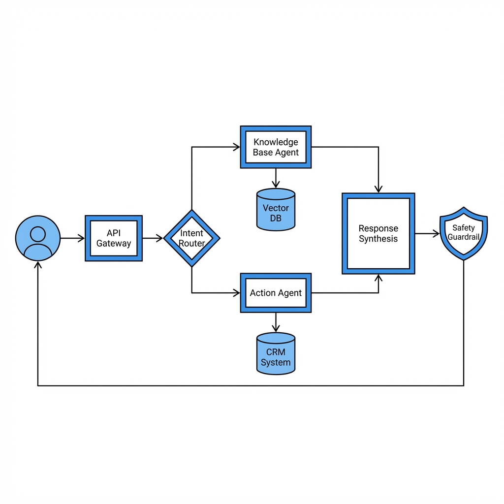
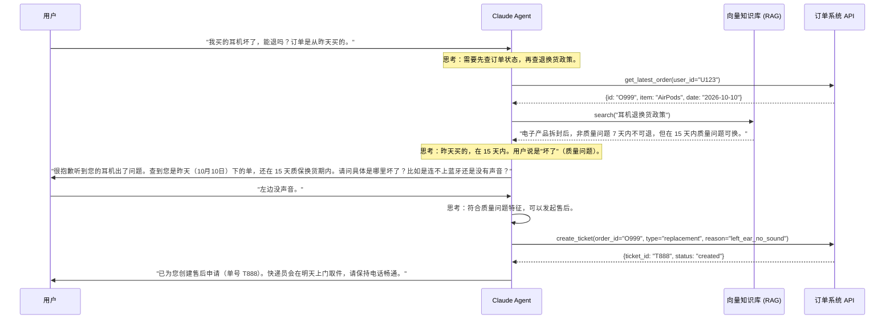

## 9.1 智能客服系统：从“人工智障”到“金牌销售”

在企业应用中，客服系统往往是 AI 落地的第一站。
但大多数现有的 AI 客服只是简单的关键词匹配，体验极差。基于 Claude 构建的下一代客服 Agent，不仅能回答问题，还能**解决问题**。

### 9.1.1 痛点与解决方案

| 传统 Chatbot 痛点 | Claude Agent 解决方案 |
| :--- | :--- |
| **车轱辘话**：反复确认同样的信息。 | **Memory**: 记住用户说过的每一个字，跨会话记忆。 |
| **答非所问**：只能匹配预设的 FAQ。 | **RAG**: 动态检索最新的知识库（如 PDF 手册、Wiki）。 |
| **只能看不能动**：告诉用户怎么退款，但不能帮用户退。 | **Tool Use**: 直接调用 `refund_api` 帮用户操作。 |
| **没有情商**：语气生硬，不懂安抚。 | **Persona**: 设置高情商 System Prompt，甚至能在合适时候发表情包。 |

### 9.1.2 架构设计图谱

这是一个经典的 **RAG + Tool Use** 混合架构。





### 9.1.3 关键实现细节

#### 1. 动态知识库 (RAG) 的精细化切片
客户的问题千奇百怪，简单的切片（Chunking）往往不够。
*   **挑战**: 用户问 "红色款掉色吗？"，但手册里写的是 "Scarlet Red 采用阳极氧化工艺"。
*   **优化**:
    *   **元数据增强**: 在存入向量库时，给段落打上 `{"color": ["red", "scarlet"], "issue": ["fading", "durability"]}` 标签。
    *   **查询改写**: 先让 Claude 把 "掉色" 改写为 "耐久性、表面工艺"，再去检索。

#### 2. 权限鉴权与敏感操作
涉及到 "退款"、"改密码" 等敏感操作时，不能仅靠 System Prompt。
*   **方案**:
    *   **Human-in-the-Loop**: 定义工具时，设置 `risk_level: high`。当 Claude 调用此类工具时，后端拦截并向用户前端发送二次确认弹窗。
    *   **参数校验**: 在 Tool Definition 中，`refund_order` 工具必须要求提供 `user_otp` (验证码)。如果用户没提供，Claude 会收到 `MissingParameter` 错误，并自动反问用户索要验证码。

#### 3. 情绪智能与人工接管
AI 不应死磕。
*   **触发条件**:
    1.  **情绪分析**: 每轮对话并行调用一个小模型 (如 Haiku) 评分 (1-10)。如果愤怒值 > 7，立即触发接管。
    2.  **死循环检测**: 如果 Claude 连续 2 次调用同一个查询工具且参数相同，说明它卡住了。
*   **平滑切换**: Claude 生成一份 `Summary` (摘要)，发送给人工客服系统："用户张三，遇到耳机单侧无声问题，已尝试重置但无效，目前情绪较为激动。" —— 真人客服接手时能直接说："张先生您好，我看过记录了，别着急..."

### 9.1.4 真实案例：生产级 System Prompt

一个好的 System Prompt 是客服 Agent 的灵魂。

```xml
<system_prompt>
<role>
你是由 TechGear 及其 AI 实验室开发的高级技术支持专家。你的名字叫 "TG 助手"。
你的目标是高效、专业且富有同理心地解决用户的硬件产品问题。
</role>

<tone_style>
1. **同理心优先**: 永远先安抚用户情绪。例："很抱歉给您带来不便..."
2. **专业简洁**: 不要堆砌技术术语，用通俗易懂的语言解释。
3. **拒绝废话**: 不要每次都说 "我明白了"，直接进入解决步骤。
</tone_style>

<guidelines>
1. **先查后说**: 在回答任何关于订单、物流、政策的问题前，必须先调用工具查询。严禁编造信息。
2. **多步引导**: 如果问题复杂（如排查故障），请一步一步引导用户，不要一次性甩出 10 个步骤。
3. **退款流程**: 
   - 必须先通过 `check_eligibility` 检查资格。
   - 如果不符合政策，委婉拒绝并提供替代方案（如维修券）。
</guidelines>

<tools_instruction>
- 使用 `search_kb` 查询产品说明书。
- 使用 `get_order` 查询订单状态。
- 使用 `create_ticket` 创建工单。
- 如果工具返回 Error，请根据 Error Message 调整参数重试，或者询问用户更多信息。
</tools_instruction>
</system_prompt>
```

---

客服只是冰山一角。在企业的后台，有着海量的文档——合同、发票、简历——正在等待被数字化。
下一节将介绍 Claude 如何成为一名不知疲倦的**文档处理专员**。

➡️ [文档处理与知识库](9.2_doc_processing.md)
