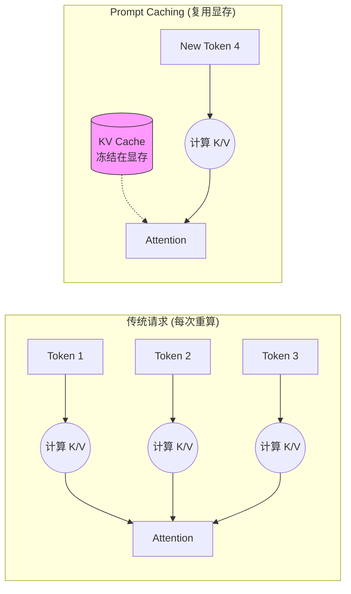
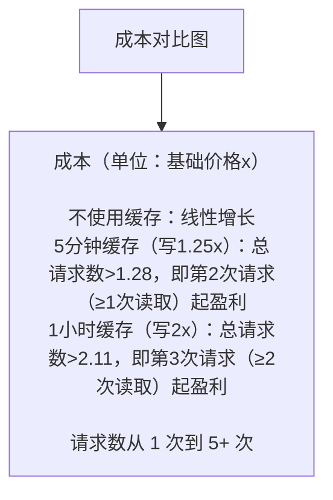

## 10.2 提示缓存

Prompt Caching 是 2024 年 LLM 架构层面最大的创新之一。
它打破了“无状态 API”的魔咒，让长上下文应用变得既 **便宜** 又 **快速**。

### 10.2.1 什么是 Prompt Caching？

#### 通俗类比：图书馆模式

*   **没有缓存 (No Cache)**：每次你去图书馆（Claude），都让你带一整车书（Context）过去。图书管理员必须一本本读完这些书，才能回答你的问题。这既费时（Token 计算慢）又费运费（Token 计费贵）。
*   **有了缓存 (With Cache)**：你只需要第一次把车开过去，告诉管理员：“这车书先放你这儿存 5 分钟”。接下来 5 分钟内，你再来问问题，只要报个书名，管理员直接就能回答，因为书已经在架子上了。

#### 技术原理：KV Cache 重用

要理解缓存为什么能省钱，必须深入到 **Transformer** 架构的底层。

1.  **注意力机制 (Self-Attention)**:
    LLM 在处理每一个 Token 时，都需要“回头看”之前所有的 Token，以理解上下文关系。这个“回头看”的过程，在数学上就是计算 **Attention 矩阵**。

    $$ Attention(Q, K, V) = \text{softmax}(\frac{QK^T}{\sqrt{d_k}})V $$

    其中：
    *   **Q (Query)**: 当前 Token 的查询向量（“我在找什么？”）。
    *   **K (Key)**: 历史 Token 的索引向量（“我有这个特征”）。
    *   **V (Value)**: 历史 Token 的内容向量（“这是我的具体信息”）。

2.  **Prefill (预填充) 的代价**:
    当我们发送一段 10k 字的 Prompt 给模型时，模型必须计算这 10k 个 Token 每一层的 Q、K、V 向量。这个过程被称为 **Prefill**。
    *   **计算量巨大**: 随着长度增加，计算量呈 $O(N^2)$ 或 $O(N)$ 增长（取决于实现），消耗大量的 GPU 算力。
    *   **显存占用**: 计算出的 Q, K, V 矩阵需要存放在 GPU 显存（VRAM）中。

3.  **Cache Hit (缓存命中)**:
    Prompt Caching 的核心逻辑是：**“只要前缀（Prefix）不变，K 和 V 矩阵就不变。”**

    *   **无缓存**: 每次请求，GPU 都要重新把 10k 字算一遍矩阵。
    *   **有缓存**: 第一次算完后，我们将这 10k 字对应的 **K 矩阵和 V 矩阵** (即 KV Cache) 直接“冻结”在显存里。
    *   **复用**: 下次请求如果前缀相同，直接把显存里的 KV Cache 拿来用，GPU 只需要从第 10,001 个 Token 开始计算。这不仅节省了算力（Write Cost），更极大地减少了内存搬运时间（Latency）。



### 10.2.2 缓存计费模型

Prompt Caching 的定价策略非常激进，旨在鼓励长 Context 复用。

下表以 **Sonnet 4.6** 为例（基础输入价 $3.00/MTok）：

| 状态 | 写入成本 (Write) | 读取成本 (Read) | 只有在...时发生 |
| :--- | :--- | :--- | :--- |
| **Cache Write** | $3.75 / MTok | - | 第一次请求，或缓存过期后重新写入。比普通 Input 贵 25%。 |
| **Cache Read**| - |**$0.30 / MTok**| 后续请求命中缓存。**比普通 Input 便宜 90%！** |

**划算临界点**:
5 分钟缓存写入比普通输入贵 25%，缓存命中读取按普通输入的 10% 计费，因此 **1 次缓存读取后**总成本就低于两次普通请求。复用次数越多，边际成本越接近 $0.30/MTok。

### 10.2.3 如何使用：代码实战

在 API 中，最简单的方式是在请求顶层启用 `cache_control`，由 Claude 自动检查可缓存前缀；如果需要精确控制大型上下文的切分位置，再显式标记 **断点 (Checkpoints)**。目前 Claude 支持最多 **4 个** cache breakpoints。

#### SDK 示例

```python
import anthropic

client = anthropic.Anthropic()

response = client.messages.create(
    model="claude-sonnet-4-6",
    max_tokens=1024,
    system=[
        {
            "type": "text",
            "text": "你是一个资深法律顾问，熟悉以下 500 页的民法典内容...",
            "cache_control": {"type": "ephemeral"} # 🔴 标记点 1：System Prompt
        }
    ],
    messages=[
        {
            "role": "user",
            "content": [
                {
                    "type": "text",
                    "text": "<book_content>...这里是 5万字的书籍原文...</book_content>",
                    "cache_control": {"type": "ephemeral"} # 🔴 标记点 2：长文档
                },
                {
                    "type": "text",
                    "text": "书里关于'不可抗力'是怎么定义的？" # 🟢 动态内容（不缓存）
                }
            ]
        }
    ]
)
```

**关键点**: `cache_control: {"type": "ephemeral"}` 就是告诉 Claude：“到这里为止，前面的内容帮我存起来。”

### 10.2.4 最佳实践：结构化缓存

为了最大化命中率，必须遵循 **“静态在前，动态在后”** 的原则。因为缓存是基于 **前缀匹配 (Prefix Matching)** 的。

#### 推荐结构

1.  **System Prompt (Base)** `[Cache 1]`
    *   *内容*: 角色定义、稳定工具定义（在同一 workspace / 平台隔离边界内复用，不跨组织共享）。
2.  **Huge Context (Docs/Code)** `[Cache 2]`
    *   *内容*: RAG 检索到的文档、整个代码库文件（相对稳定）。
3.  **Conversation History (Turns)** `[Cache 3]`
    *   *内容*: 之前的多轮对话历史。
4.  **User Query** `[No Cache]`
    *   *内容*: 用户当前最新的提问（完全动态）。

#### 图解命中逻辑

```text
Request A: [System] -> [Docs] -> [History A] -> [Query A]
             |           |
             V           V
Cache:       Hit         Hit (Cache Read: $0.30)

Request B: [System] -> [Docs] -> [History B] -> [Query B]
             |           |          |
             V           V          X
Cache:       Hit         Hit       Miss (Cache Write for History B)
```

即使 Request B 的历史记录变了，但前面的 System 和 Docs 依然能命中缓存，依然能省大钱。

### 10.2.5 生命周期与驱逐

Claude 支持两种缓存 TTL 选项，对应不同的使用场景：

> **当前官方口径**：默认缓存 TTL 为 5 分钟；如需使用 1 小时缓存，可在 `cache_control` 中显式指定 `"ttl": "1h"`，并按官方价格承担额外成本。不要假设默认 TTL 曾经或仍然是 1 小时。

#### 5 分钟缓存

*   **TTL**: 5 分钟
*   **写入成本**: 1.25x （比普通输入贵 25%）
*   **读取成本**: 0.1x （比普通输入便宜 90%）
*   **自动续期**: 每次 Cache Hit，TTL 会自动重置为 5 分钟
*   **场景**: 高频对话、快速迭代开发、用户在短时间内多次询问同一份文档
*   **只要请求不断**（比如高频对话），缓存就可以一直存活

#### 1 小时缓存

*   **TTL**: 1 小时（3600 秒）
*   **写入成本**: 2x （比普通输入贵 100%）
*   **读取成本**: 0.1x （比普通输入便宜 90%）
*   **自动续期**: 每次 Cache Hit，TTL 会自动重置为 1 小时
*   **场景**: 调用间隔可能超过 5 分钟、但一小时内仍可能复用的长上下文；高频系统 Prompt 应优先继续用 5 分钟缓存
*   **长期复用**: 适合一小时内回访同一份稳定 Context，但不要把它当作所有稳定 Prompt 的默认选择

**缓存 TTL 对比表**

| 维度 | 5 分钟缓存 | 1 小时缓存 |
|------|----------|----------|
| **TTL 时长** | 5 分钟 | 1 小时 |
| **写入成本** | 1.25x | 2x |
| **读取成本** | 0.1x | 0.1x |
| **损益平衡点** | 1 次读取 | 2 次读取 |
| **推荐场景** | 开发者迭代、聊天机器人、高频系统 Prompt | 低频回访的长对话、长上下文 Agent |
| **命中概率** | 高（5分钟内高频） | 中等（1小时跨度） |

#### 驱逐策略

*   **自动驱逐**: TTL 过期后缓存自动删除
*   **显式驱逐**: 可以通过不再引用来让其自然过期（API 目前不支持显式 delete）
*   **防止羊群效应**: 冷启动放量前先用单个请求预热缓存（TTL 仅 5 分钟/1 小时两档且命中自动续期，无法自定义抖动，见 10.2.8）

**缓存续期与扩展机制**

```python
import anthropic

client = anthropic.Anthropic()

# 方案 A：让缓存通过 Cache Hit 自动续期
def query_with_auto_renewal(query: str, context: str):
    """
    只要在 TTL 内继续发送请求，缓存会自动续期
    """
    response = client.messages.create(
        model="claude-opus-4-8",
        max_tokens=1024,
        system=[
            {
                "type": "text",
                "text": context,
                "cache_control": {"type": "ephemeral"}  # 5 分钟缓存
            }
        ],
        messages=[
            {"role": "user", "content": query}
        ]
    )
    return response

# 方案 B：显式设置 1 小时缓存用于稳定 Context
def query_with_persistent_cache(query: str, stable_system_prompt: str):
    """
    用于系统 Prompt 不变的场景
    1 小时 TTL 更适合
    """
    response = client.messages.create(
        model="claude-opus-4-8",
        max_tokens=1024,
        system=[
            {
                "type": "text",
                "text": stable_system_prompt,
                "cache_control": {
                    "type": "ephemeral",
                    "ttl": "1h"  # 显式指定 1 小时
                }
            }
        ],
        messages=[
            {"role": "user", "content": query}
        ]
    )
    return response
```

### 10.2.6 适用场景 checklist

| ✅ 适合用缓存 | ❌ 不适合用缓存 |
| :--- | :--- |
| **长文档问答**: 针对同一本书问 10 个问题。 | **一次性任务**: 传一本书总结一下，然后就再也不问了。 |
| **代码助手**: 整个仓库代码作为 Context，反复修改。 | **低频客服**: 凌晨 3 点，每小时只有 1 个用户来访（TTL 会过期）。 |
| **Few-Shot**: 带 100 个 示例的 Prompt。 |**短文本**: 总共才 500 token，低于最小可缓存长度，加了 `cache_control` 也不会生效。 |
| **Agent**: 工具定义特别多、System Prompt 特别长。 | |

> **最小可缓存长度**：缓存前缀必须达到模型的最小可缓存长度才会真正建缓存，按模型为 512–4,096 tokens 不等（如 Fable 5 为 512，Sonnet 4.6、Opus 4.8 为 1,024，Opus 4.7 为 2,048，Haiku 4.5 为 4,096）。低于阈值的请求即使标记了 `cache_control` 也会按普通输入处理且不报错——表现为响应里 `cache_creation_input_tokens` 与 `cache_read_input_tokens` 均为 0（见 10.2.10 的监控指标）。

### 10.2.7 缓存冷启动成本分析

Prompt Caching 虽然省钱，但 **第一次请求要付出代价**。理解成本结构对选择缓存策略至关重要。

#### 冷启动的三层成本

**第 1 次请求**（Cache Write）
- 必须从零开始计算 KV Cache
- 成本 = 1.25x 基础输入价格（比普通请求贵 25%）
- 无法逃脱这个成本

**后续请求**（Cache Read）
- 复用已缓存的 KV Cache
- 成本 = 0.1x 基础输入价格（便宜 90%）
- 前提：5 分钟内至少被访问一次（否则 TTL 过期需要重写）

**总成本分析**

假设基础输入价格为 `1x`，缓存周期内有 `N` 次请求：

```text
场景 A: 5 分钟缓存（最短）
├─ 第 1 次: 1.25x（写入）
├─ 第 2 次: 0.1x（读取）
├─ 第 3 次: 0.1x（读取）
└─ ...第 N 次: 0.1x（读取）

总成本 = 1.25x + (N-1) × 0.1x = 1.25x + 0.1x × (N-1)

场景 B: 1 小时缓存（更长）
├─ 第 1 次: 2x（写入）
├─ 第 2 次: 0.1x（读取）
└─ ...第 N 次: 0.1x（读取）

总成本 = 2x + (N-1) × 0.1x = 2x + 0.1x × (N-1)
```

#### 成本-效益临界点计算

**关键问题**：需要多少次缓存读取才能抵消写入的额外成本？

**对于 5 分钟缓存**（写入成本 1.25x）

```text
不缓存（N 次请求）:
  总成本 = N × 1x = N × 1x

使用缓存（N 次请求）:
  总成本 = 1.25x + (N-1) × 0.1x

何时使用缓存更便宜？
  1.25x + (N-1) × 0.1x < N × 1x
  1.25x + 0.1x·N - 0.1x < N × 1x
  1.15x + 0.1x·N < N × 1x
  1.15x < N × 1x - 0.1x·N
  1.15x < N × 0.9x
  N > 1.15 / 0.9
  N > 1.28

结论：需要至少 2 次请求（1 次写入 + 1 次读取），也就是 1 次缓存读取后，就开始盈利！
```

**对于 1 小时缓存**（写入成本 2x）

```text
使用缓存（N 次请求）:
  总成本 = 2x + (N-1) × 0.1x

何时使用缓存更便宜？
  2x + (N-1) × 0.1x < N × 1x
  2x + 0.1x·N - 0.1x < N × 1x
  1.9x + 0.1x·N < N × 1x
  1.9x < N × 0.9x
  N > 1.9 / 0.9
  N > 2.11

结论：需要至少 3 次请求（1 次写入 + 2 次读取），也就是 2 次缓存读取后，才能盈利！
```

#### 成本对比图表



#### 决策树：何时使用哪种缓存

```python
def choose_cache_strategy(expected_reads_per_minute: float,
                         cache_window_minutes: int,
                         context_size_tokens: int) -> str:
    """
    选择最优的缓存策略

    Args:
        expected_reads_per_minute: 每分钟预期的缓存读取次数
        cache_window_minutes: 缓存窗口大小
        context_size_tokens: 上下文大小（影响写入成本）
    """

    # 计算在缓存窗口内的预期总读取次数
    # （context_size_tokens 不影响盈亏点：写入溢价与读取折扣同比例缩放）
    total_expected_reads = expected_reads_per_minute * cache_window_minutes

    # 5 分钟缓存：理论上 ≥1 次读取即盈利（总请求数 > 1.28），此处保守要求 ≥2
    if cache_window_minutes == 5 and total_expected_reads >= 2:
        return "USE_5MIN_CACHE"

    # 1 小时缓存：理论上 ≥2 次读取即盈利（总请求数 > 2.11），此处保守要求 ≥3
    if cache_window_minutes == 60 and total_expected_reads >= 3:
        return "USE_1HOUR_CACHE"

    # 预期读取不足，不使用缓存
    return "NO_CACHE"


# 使用示例
cache_strategy = choose_cache_strategy(
    expected_reads_per_minute=2,      # 每分钟 2 个请求
    cache_window_minutes=5,            # 使用 5 分钟缓存
    context_size_tokens=10000
)

# 预期 5 分钟内 10 次读取，超过临界点 1.28，使用缓存
```

#### 现实中的三种场景

**场景 1：高频文档问答（适合缓存）**

```text
用户在 5 分钟内对同一份 5000 token 的合同提出 5 个问题

成本对比：
┌─────────────────────────────────────────┐
│ 不使用缓存：                            │
│  5 次 × (5000 input × $3/M) = $0.075   │
│  5 次 × (200 output × $15/M) = $0.015  │
│  总计 = $0.090                          │
├─────────────────────────────────────────┤
│ 使用 5 分钟缓存：                        │
│  第 1 次写: 5000 × 1.25 × $3/M = $0.019 │
│  后 4 次读: 4 × 5000 × 0.1 × $3/M = $0.006 │
│  5 次 output: 5 × 200 × $15/M = $0.015  │
│  总计 = $0.040                          │
└─────────────────────────────────────────┘

节省成本：56%（$0.090 → $0.040）
```

**场景 2：低频 API 集成（不适合缓存）**

```text
系统每小时只调用一次 API，context 10000 token

间隔 1 小时的调用意味着：
┌──────────────────────────────────────────┐
│ 用 5 分钟缓存：下次调用到来时缓存早已过期 │
│  每次都按写入价: 10000 × 1.25 × $3/M     │
│  = $0.038/次，比不缓存（$0.030）贵 25%   │
├──────────────────────────────────────────┤
│ 用 1 小时缓存：TTL 恰好压线，能否命中    │
│  取决于毫秒级时序，不可依赖；且写入价 2x │
│  需要 ≥2 次命中才回本（见上文损益分析）  │
└──────────────────────────────────────────┘

低频且间隔≥TTL 的调用，缓存只会更贵
→ 不应该使用缓存
```

**场景 3：批处理工作流（谨慎使用缓存）**

```text
RAG 系统每次索引检索 20000 token 的文档库
一天内用户进行 50 次查询，分布在 3 个小时内

使用 1 小时缓存的成本：
┌──────────────────────────────────────────┐
│ 50 次查询均匀分布在 3 小时内              │
│ ≈ 每 3.6 分钟一次命中                     │
│ 每次命中都会把 1 小时 TTL 重置，          │
│ 因此整个时段只需要写入一次：              │
│                                          │
│  写 (1 次): 20000 × 2 × $3/M = $0.120    │
│  读 (49 次): 49 × 20000 × 0.1 × $3/M     │
│            = $0.294                      │
│  总计 = $0.414                           │
└──────────────────────────────────────────┘

不使用缓存：
  50 × (20000 × $3/M) = $3.000

节省成本：86%（$3.000 → $0.414）
（若查询有长间隔断档导致缓存过期，需补一次 2x 写入，节省比例略降）
```

### 10.2.8 缓存失效与雷鸣羊群问题

**缓存驱逐**

当 TTL 过期后，缓存会被自动清除。下一个请求将触发新的 Cache Write：

```text
时间轴（注意：每次命中都会把 TTL 重置）：
  0:00  写入缓存（成本 1.25x）
  0:01  读取 (✓ Hit) → TTL 重置，存活至 0:06
  0:03  读取 (✓ Hit) → TTL 重置，存活至 0:08
  0:08  连续 5 分钟无请求，缓存过期
  0:15  新请求 → 新写入（成本 1.25x）← 需要再次支付写入成本
```

**防止“雷鸣羊群”**

Anthropic 缓存的 TTL 只有 5 分钟和 1 小时两档、且每次命中自动续期——既不能为单个缓存自定义 TTL，也就不存在 Redis 式“随机抖动 TTL”的做法。真正的羊群风险发生在**冷启动**：缓存尚不存在（或刚过期）时，大量并发请求同时未命中，每个都按写入价计费：

```python
# ❌ 问题代码：冷启动时 1000 个并发请求同时未命中，全部按 1.25x 写入价计费
results = await asyncio.gather(
    *[call_claude(q) for q in queries]
)

# ✅ 解决方案：先用一个请求“预热”缓存，命中后再放量
await call_claude(queries[0])      # 理想情况下由这一次完成 Cache Write
results = await asyncio.gather(    # 其余请求全部按 0.1x 读取价命中
    *[call_claude(q) for q in queries[1:]]
)
```

持续有流量的场景通常不容易“集中过期”——命中即续期；放量前仍应确认缓存已被预热，并监控实际 `cache_read_input_tokens`。

官方还提供了零输出的预热姿势：发送 `max_tokens: 0` 的请求，API 会读入提示并在 `cache_control` 断点处建好缓存后立即返回（响应的 `content` 为空、`stop_reason` 为 `max_tokens`；首次建缓存照常收缓存写入费，输出 0 计费，可通过 `usage.cache_creation_input_tokens` 确认写入发生）。注意该用法在 Message Batches 中不受支持。

#### 最佳实践总结

| 场景 | 推荐策略 | 理由 |
|------|---------|------|
| **高频文档问答** | 5 分钟缓存 | 临界点低（1 次读即回本），高频访问更容易保持命中 |
| **代码助手开发** | 5 分钟缓存 | 开发者通常 5 分钟内多次迭代 |
| **个人知识库** | 1 小时缓存 | 用户可能一小时内回头查阅 |
| **API 集成** | 条件缓存 | 仅当日均调用 >1000 次时 |
| **一次性任务** | 不缓存 | 成本不划算 |
| **RAG 检索** | 1 小时缓存 | 文档库相对稳定，用户集中访问 |

### 10.2.9 实战案例：Claude Code 的缓存架构

Claude Code 是 Prompt Caching 大规模应用的最佳范例。其系统提示词的静态部分约占 70%，意味着大多数请求能缓存约 70% 的系统提示词 Token，显著降低了长会话的成本。理解它的缓存架构，对构建任何长会话智能体都有借鉴意义。

#### “上下文税”：你看不见的最大支出

每当 AI 智能体执行一个步骤时，它都必须重新阅读所有内容：系统指令、工具定义、以及之前已经加载过的项目上下文。这种重复计算被称为 **上下文税（Context Tax）**。

算一笔账：一个包含 20,000 Token 的系统提示词，如果运行 50 个回合，意味着有 **100 万 Token 的冗余计算** 在按全价计费，却不产生任何新价值。Prompt Caching 正是消除上下文税的核心手段。

**关键数据**：Claude Code 中定义了一个 `DANGEROUS_uncachedSystemPromptSection()` 函数，用于显式声明某段内容会破坏缓存前缀。`DANGEROUS_` 前缀是代码级警告——提醒开发者将易变内容放入静态区域会导致每次 API 调用都重新创建缓存，使输入 Token 成本从 cache_read 的 $0.30/MTok 上升到 cache_creation 的 $3.75/MTok（以 Sonnet 为例，差距达 12.5 倍）。

#### 30 分钟编程会话拆解

以一个典型的 Claude Code 编程会话为例，观察缓存如何逐步发挥作用：

```text
第 0 分钟：会话启动
├── 加载 System Prompt + 工具定义 + CLAUDE.md → ~20,000 tokens
├── 这是整个会话中最昂贵的时刻（Cache Write: 1.25x）
└── 但你只需支付一次

第 1~5 分钟：首个指令
├── 用户输入任务，Explore 子代理遍历代码库
├── 20,000 token 静态前缀已在缓存中（Cache Read: 0.1x）
└── 只有新的工具输出和用户消息按全价计费

第 6~15 分钟：深入工作
├── Plan 子代理接收精简摘要（避免动态尾部爆炸）
├── 实施代码修改的每一轮都复用缓存前缀
└── 每次 Cache Hit 自动重置 TTL，保持缓存热度

第 16~25 分钟：迭代调整
├── 用户要求修改，更多工具调用和终端输出
├── 动态尾部增长，但它只占本次会话的新增内容
└── 20,000 token 的基础内容始终从缓存读取

第 28 分钟：运行 /cost
├── 无缓存成本估算：~$6.00（超过 200 万 token，全价计费）
├── 有缓存实际成本：~$1.14（绝大部分 token 以 $0.30/MTok 读取）
└── 节省：约 81%
```

#### 缓存成本模型深度分析

Claude Code 实现了分层的成本追踪系统，每个模型都有精确的定价表：

| 模型 | 输入 ($/MTok) | 输出 ($/MTok) | 缓存读取 | 缓存写入 |
| :--- | ---: | ---: | ---: | ---: |
| Haiku 4.5 | $1.00 | $5.00 | $0.10 | $1.25 |
| Sonnet 4.6 | $3.00 | $15.00 | $0.30 | $3.75 |
| Opus 4 / 4.1 | $15.00 | $75.00 | $1.50 | $18.75 |
| Opus 4.5 / 4.6 / 4.7 / 4.8 | $5.00 | $25.00 | $0.50 | $6.25 |

**核心成本对比**（针对 Sonnet）：
- 缓存写入 vs 正常输入：$3.75 / MTok vs $3.00 / MTok = **+25%**
- 缓存读取 vs 正常输入：$0.30 / MTok vs $3.00 / MTok = **-90%**
- 比值：读取成本仅为写入的 1/12.5

#### 分类器与缓存复用

Claude Code 和自建 Agent 常会把权限分类、意图识别和主对话拆成不同步骤。只要这些步骤使用相同的稳定前缀，提示缓存就可能复用该前缀；实际能否命中取决于模型、workspace、请求顺序、TTL 和宿主实现，不应假设存在跨用户的全局共享缓存：

```javascript
// 分类器和对话引擎保持相同的稳定前缀，以提高缓存命中率
class CacheSharing {
  shared_prefix = {
    system_prompt: BASE_SYSTEM,
    tools: ALL_TOOLS,
    context: PROJECT_CONTEXT
  };

  // YOLO 分类器
  classifier = new YOLOClassifier(this.shared_prefix);

  // 主对话引擎
  query_engine = new QueryEngine(this.shared_prefix);

  // 同一个前缀在 TTL 内更容易命中缓存
}
```

这种架构可以降低重复输入成本，但仍要以响应中的缓存 usage 字段确认是否真的命中。

#### 系统提示词的分层缓存架构

> **来源说明**：以下内容是工程化组织提示词的设计模式，不代表官方承诺存在跨用户或跨 workspace 的缓存共享。官方 prompt caching 已按组织与 workspace 隔离；Claude API、Claude Platform on AWS 和 Microsoft Foundry 使用 workspace 级隔离，Bedrock 与 Vertex AI 仍按组织级隔离。

Agent 的系统提示词可以按缓存稳定性分为三层：

**第一层：稳定基础层（Stable Prefix）**

这部分内容在同一应用、同一 workspace 的多数请求间保持不变，因此最适合缓存：
- 角色定义和基本行为准则
- 核心工具的 JSON Schema 定义（只放常用且稳定的工具）
- 安全策略和内容过滤规则

稳定基础层的命中率最高，因为前缀最不容易变化。

**第二层：组织/用户层（Workspace/User Prefix）**

这部分内容在同一 workspace、团队或用户的不同会话间可能共享：
- 企业管理策略（managed policies）
- 用户级 CLAUDE.md 配置
- 经常使用的 MCP 服务器和自定义工具定义

**第三层：会话动态层（Uncached / Volatile）**

每次请求都可能变化，无法缓存：
- 当前工作目录和 Git 状态
- 最近的命令历史
- 会话特定的性能指标

```text
┌─────────────────────────────────────────┐
│ 稳定基础层 (Stable Prefix)               │
│ 角色定义 + 工具 Schema + 安全策略         │
│ → 同一隔离边界内最容易命中                │
├─────────────────────────────────────────┤
│ workspace / 用户层                       │
│ 企业策略 + CLAUDE.md + MCP 配置          │
│ → 同一 workspace / 用户内更可能复用       │
├─────────────────────────────────────────┤
│ 会话动态层 (Volatile)                    │
│ 工作目录 + 命令历史 + 性能指标            │
│ → 每次请求变化，不可缓存                 │
└─────────────────────────────────────────┘
```

这种分层设计的经济意义在于：稳定层越长、越少变化，越容易在 TTL 内复用；workspace / 用户层的变更会使该层及以下前缀失效；动态层通常需要每次按普通输入计费。这也解释了为什么 CLAUDE.md、工具清单或 MCP 配置变更会影响缓存效率。

#### 延迟工具加载优化

Claude Code 实现了 **工具定义的延迟加载（Deferred Tool Loading）**，大幅减少初始化开销：

```javascript
// 不是在启动时加载所有 70+ 工具定义
// 而是按需加载

const TOOL_GROUPS = {
  essential: ['read_file', 'write_file', 'run_bash'],  // 总是加载
  file_ops: ['copy_file', 'delete_file', 'move_file'],
  git_ops: ['git_commit', 'git_push', 'git_branch'],
  advanced: ['computer_use', 'remote_control']
};

// 在第一次使用工具组时加载
function loadToolGroupIfNeeded(tool_name) {
  const group = findToolGroup(tool_name);
  if (!TOOLS[group].loaded) {
    loadToolGroup(group);  // 延迟加载完整的工具描述
    TOOLS[group].loaded = true;
  }
}
```

这个优化 **节省约 60% 的工具描述 token**。初始化时仅需加载 essential 工具，其他工具在用户首次使用对应功能时加载。

#### 毁掉缓存的三条反模式

关于缓存，最反直觉的一点是：**1 + 2 = 3，但 2 + 1 会导致缓存失效**。基础设施对提示词进行哈希处理，如果顺序发生任何变化（即便元素相同），哈希值就会改变。

由此衍生三条关键准则：

| 反模式 | 后果 | 正确做法 |
| :--- | :--- | :--- |
| **在会话中途增删工具** | 前缀改变，相关缓存失效 | 保持稳定基础工具集；大量工具用工具搜索或按需加载 |
| **在中途切换模型** | 缓存是模型特定的，无法跨模型复用 | 一个会话绑定一个模型 |
| **为了改状态修改前缀** | 前缀哈希变化，缓存全部作废 | 在下一条用户消息中追加 `<system-reminder>` 标签 |

#### 缓存安全分叉：压缩时的高级技巧

当达到上下文限制需要压缩历史时，不要截断前缀。正确做法是保持完全相同的系统提示词、工具和对话结构，将压缩请求作为新消息添加：

```python
# ✅ 缓存安全的上下文压缩
compressed_request = {
    "system": original_system_prompt,   # 完全不变 → 缓存命中
    "messages": [
        *original_messages,             # 完全不变 → 缓存命中
        {
            "role": "user",
            "content": "请将以上对话压缩为关键决策和代码变更的摘要。"
            # 只有这条新消息按全价计费
        }
    ]
}
```

这样重组后的请求几乎完全复用了原有的缓存前缀。

### 10.2.10 自动缓存与监控指标

Anthropic 已在 API 中加入了 **自动缓存（Auto-caching）** 功能：在请求**顶层**添加一个 `cache_control` 字段即可启用（这一步不可省略），之后系统会把缓存断点自动落在最后一个可缓存块上并随对话增长前移，无需再在各内容块上手动标记。

无论使用手动还是自动缓存，都应密切关注每个 API 响应中的三个字段：

```python
# 从 API 响应中提取缓存指标
usage = response.usage

# 1. 存入缓存的 token 数（越少越好，说明复用率高）
cache_created = usage.cache_creation_input_tokens

# 2. 从缓存读取的 token 数（越多越好，说明命中率高）
cache_read = usage.cache_read_input_tokens

# 3. 正常处理的 token 数（新增的动态内容）
normal_input = usage.input_tokens

# 缓存效率得分 = 读取 / (读取 + 创建 + 正常)
total = cache_read + cache_created + normal_input
efficiency = cache_read / total if total > 0 else 0
print(f"缓存效率: {efficiency:.1%}")  # 目标按业务基线设定
```

像监控系统正常运行时间（uptime）一样去监控缓存效率。若效率低于自己的业务基线，应检查是否存在上述三种反模式。

---

缓存解决了静态上下文的成本问题。但对于不断增长的动态对话历史，我们无法无限期地缓存下去，这就需要更高级的管理策略。

➡️ [上下文窗口管理](10.3_context_mgmt.md)
