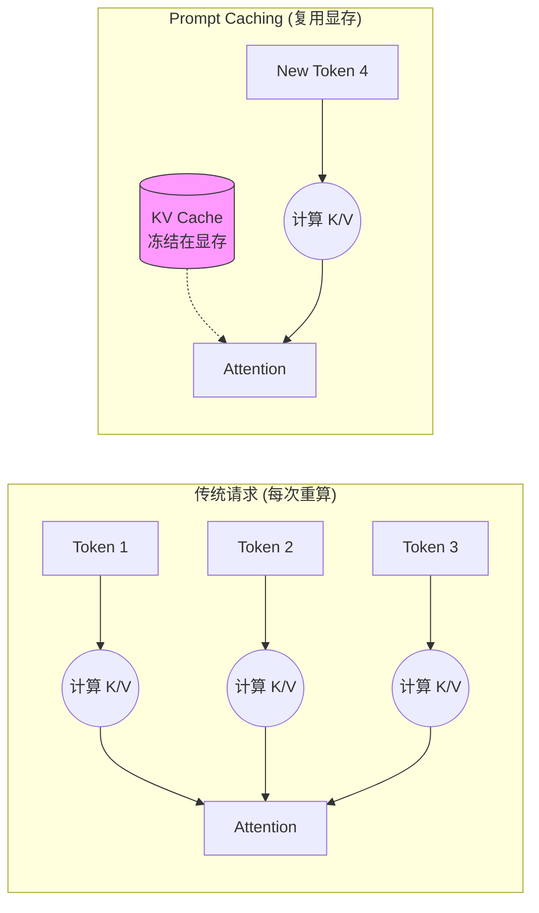

## 10.2 提示缓存

Prompt Caching 是 2024 年 LLM 架构层面最大的创新之一。
它打破了“无状态 API”的魔咒，让长上下文应用变得既 **便宜** 又 **快速**。

### 10.2.1 什么是 Prompt Caching？

#### 通俗类比：图书馆模式

*   **没有缓存 (No Cache)**：每次你去图书馆（Claude），都让你带一整车书（Context）过去。图书管理员必须一本本读完这些书，才能回答你的问题。这既费时（Token 计算慢）又费运费（Token 计费贵）。
*   **有了缓存 (With Cache)**：你只需要第一次把车开过去，告诉管理员：“这车书先放你这儿存 5 分钟”。接下来 5 分钟内，你再来问问题，只要报个书名，管理员直接就能回答，因为书已经在架子上了。

#### 技术原理：KV Cache 重用

要理解缓存为什么能省钱，必须深入到 **Transformer** 架构的底层。

1.  **注意力机制 (Self-Attention)**:
    LLM 在处理每一个 Token 时，都需要“回头看”之前所有的 Token，以理解上下文关系。这个“回头看”的过程，在数学上就是计算 **Attention 矩阵**。
    
    $$ Attention(Q, K, V) = \text{softmax}(\frac{QK^T}{\sqrt{d_k}})V $$
    
    其中：
    *   **Q (Query)**: 当前 Token 的查询向量（“我在找什么？”）。
    *   **K (Key)**: 历史 Token 的索引向量（“我有这个特征”）。
    *   **V (Value)**: 历史 Token 的内容向量（“这是我的具体信息”）。

2.  **Prefill (预填充) 的代价**:
    当我们发送一段 10k 字的 Prompt 给模型时，模型必须计算这 10k 个 Token 每一层的 Q、K、V 向量。这个过程被称为 **Prefill**。
    *   **计算量巨大**: 随着长度增加，计算量呈 $O(N^2)$ 或 $O(N)$ 增长（取决于实现），消耗大量的 GPU 算力。
    *   **显存占用**: 计算出的 Q, K, V 矩阵需要存放在 GPU 显存（VRAM）中。

3.  **Cache Hit (缓存命中)**:
    Prompt Caching 的核心逻辑是：**“只要前缀（Prefix）不变，K 和 V 矩阵就不变。”**
    
    *   **无缓存**: 每次请求，GPU 都要重新把 10k 字算一遍矩阵。
    *   **有缓存**: 第一次算完后，我们将这 10k 字对应的 **K 矩阵和 V 矩阵** (即 KV Cache) 直接“冻结”在显存里。
    *   **复用**: 下次请求如果前缀相同，直接把显存里的 KV Cache 拿来用，GPU 只需要从第 10,001 个 Token 开始计算。这不仅节省了算力（Write Cost），更极大地减少了内存搬运时间（Latency）。



### 10.2.2 缓存计费模型

Prompt Caching 的定价策略非常激进，旨在鼓励长 Context 复用。

| 状态 | 写入成本 (Write) | 读取成本 (Read) | 只有在...时发生 |
| :--- | :--- | :--- | :--- |
| **Cache Write** | $3.75 / MTok | - | 第一次请求，或缓存过期后重新写入。比普通 Input 贵 25%。 |
| **Cache Read**| - |**$0.30 / MTok**| 后续请求命中缓存。**比普通 Input 便宜 90%！** |

**划算临界点**:
由于写入比普通请求贵 25%，通过简单计算可知，你需要 **至少复用 2 次**（1次写入 + 1次读取），总成本才会低于普通请求。复用次数越多，边际成本越接近 $0.30。

### 10.2.3 如何使用：代码实战

在 API 中，缓存不是自动的，你需要显式地标记 **断点 (Checkpoints)**。目前 Claude 支持最多 **4 个** cache breakpoints。

#### SDK 示例

```python
import anthropic

client = anthropic.Anthropic()

response = client.messages.create(
    model="claude-sonnet-4-5-20250929",
    max_tokens=1024,
    system=[
        {
            "type": "text", 
            "text": "你是一个资深法律顾问，熟悉以下 500 页的民法典内容...",
            "cache_control": {"type": "ephemeral"} # 🔴 标记点 1：System Prompt
        }
    ],
    messages=[
        {
            "role": "user", 
            "content": [
                {
                    "type": "text",
                    "text": "<book_content>...这里是 5万字的书籍原文...</book_content>",
                    "cache_control": {"type": "ephemeral"} # 🔴 标记点 2：长文档
                },
                {
                    "type": "text",
                    "text": "书里关于'不可抗力'是怎么定义的？" # 🟢 动态内容（不缓存）
                }
            ]
        }
    ]
)
```

**关键点**: `cache_control: {"type": "ephemeral"}` 就是告诉 Claude：“到这里为止，前面的内容帮我存起来。”

### 10.2.4 最佳实践：结构化缓存

为了最大化命中率，必须遵循 **“静态在前，动态在后”** 的原则。因为缓存是基于 **前缀匹配 (Prefix Matching)** 的。

#### 推荐结构

1.  **System Prompt (Base)** `[Cache 1]`
    *   *内容*: 角色定义、Tool Definition（这是最稳定的，所有用户共用）。
2.  **Huge Context (Docs/Code)** `[Cache 2]`
    *   *内容*: RAG 检索到的文档、整个代码库文件（相对稳定）。
3.  **Conversation History (Turns)** `[Cache 3]`
    *   *内容*: 之前的多轮对话历史。
4.  **User Query** `[No Cache]`
    *   *内容*: 用户当前最新的提问（完全动态）。

#### 图解命中逻辑

```text
Request A: [System] -> [Docs] -> [History A] -> [Query A]
             |           |
             V           V
Cache:       Hit         Hit (Cache Read: $0.30)

Request B: [System] -> [Docs] -> [History B] -> [Query B]
             |           |          |
             V           V          X
Cache:       Hit         Hit       Miss (Cache Write for History B)
```

即使 Request B 的历史记录变了，但前面的 System 和 Docs 依然能命中缓存，依然能省大钱。

### 10.2.5 生命周期 与驱逐

Claude 支持两种缓存 TTL 选项，对应不同的使用场景：

#### 5 分钟缓存

*   **TTL**: 5 分钟
*   **写入成本**: 1.25x （比普通输入贵 25%）
*   **读取成本**: 0.1x （比普通输入便宜 90%）
*   **自动续期**: 每次 Cache Hit，TTL 会自动重置为 5 分钟
*   **场景**: 高频对话、快速迭代开发、用户在短时间内多次询问同一份文档
*   **只要请求不断**（比如高频对话），缓存就可以一直存活

#### 1 小时缓存

*   **TTL**: 1 小时（3600 秒）
*   **写入成本**: 2x （比普通输入贵 100%）
*   **读取成本**: 0.1x （比普通输入便宜 90%）
*   **自动续期**: 每次 Cache Hit，TTL 会自动重置为 1 小时
*   **场景**: 系统 Prompt 稳定的应用、知识库 RAG、企业内部 API 集成
*   **长期复用**: 适合一小时内多次调用同一份稳定的 Context

**缓存 TTL 对比表**

| 维度 | 5 分钟缓存 | 1 小时缓存 |
|------|----------|----------|
| **TTL 时长** | 5 分钟 | 1 小时 |
| **写入成本** | 1.25x | 2x |
| **读取成本** | 0.1x | 0.1x |
| **损益平衡点** | 2 次读取 | 3 次读取 |
| **推荐场景** | 开发者迭代、聊天机器人 | RAG 系统、企业 API |
| **命中概率** | 高（5分钟内高频） | 中等（1小时跨度） |

#### 驱逐策略

*   **自动驱逐**: TTL 过期后缓存自动删除
*   **显式驱逐**: 可以通过不再引用来让其自然过期（API 目前不支持显式 delete）
*   **防止羊群效应**: 当缓存在高流量场景下同时过期时，应使用随机抖动分散 TTL 重置时间

**缓存续期与扩展机制**

```python
import anthropic

client = anthropic.Anthropic()

# 方案 A：让缓存通过 Cache Hit 自动续期
def query_with_auto_renewal(query: str, context: str):
    """
    只要在 TTL 内继续发送请求，缓存会自动续期
    """
    response = client.messages.create(
        model="claude-opus-4-6-20251101",
        max_tokens=1024,
        system=[
            {
                "type": "text",
                "text": context,
                "cache_control": {"type": "ephemeral"}  # 5 分钟缓存
            }
        ],
        messages=[
            {"role": "user", "content": query}
        ]
    )
    return response

# 方案 B：显式设置 1 小时缓存用于稳定 Context
def query_with_persistent_cache(query: str, stable_system_prompt: str):
    """
    用于系统 Prompt 不变的场景
    1 小时 TTL 更适合
    """
    response = client.messages.create(
        model="claude-opus-4-6-20251101",
        max_tokens=1024,
        system=[
            {
                "type": "text",
                "text": stable_system_prompt,
                "cache_control": {
                    "type": "ephemeral",
                    "ttl_seconds": 3600  # 显式指定 1 小时
                }
            }
        ],
        messages=[
            {"role": "user", "content": query}
        ]
    )
    return response
```

### 10.2.6 适用场景 checklist

| ✅ 适合用缓存 | ❌ 不适合用缓存 |
| :--- | :--- |
| **长文档问答**: 针对同一本书问 10 个问题。 | **一次性任务**: 传一本书总结一下，然后就再也不问了。 |
| **代码助手**: 整个仓库代码作为 Context，反复修改。 | **低频客服**: 凌晨 3 点，每小时只有 1 个用户来访（TTL 会过期）。 |
| **Few-Shot**: 带 100 个 示例的 Prompt。 |**短文本**: 总共才 500 token，没必要缓存。 |
| **Agent**: 工具定义特别多、System Prompt 特别长。 | |

### 10.2.7 缓存冷启动成本分析

Prompt Caching 虽然省钱，但 **第一次请求要付出代价**。理解成本结构对选择缓存策略至关重要。

#### 冷启动的三层成本

**第 1 次请求**（Cache Write）
- 必须从零开始计算 KV Cache
- 成本 = 1.25x 基础输入价格（比普通请求贵 25%）
- 无法逃脱这个成本

**后续请求**（Cache Read）
- 复用已缓存的 KV Cache
- 成本 = 0.1x 基础输入价格（便宜 90%）
- 前提：5 分钟内至少被访问一次（否则 TTL 过期需要重写）

**总成本分析**

假设基础输入价格为 `1x`，缓存周期内有 `N` 次请求：

```
场景 A: 5 分钟缓存（最短）
├─ 第 1 次: 1.25x（写入）
├─ 第 2 次: 0.1x（读取）
├─ 第 3 次: 0.1x（读取）
└─ ...第 N 次: 0.1x（读取）

总成本 = 1.25x + (N-1) × 0.1x = 1.25x + 0.1x × (N-1)

场景 B: 1 小时缓存（更长）
├─ 第 1 次: 2x（写入）
├─ 第 2 次: 0.1x（读取）
└─ ...第 N 次: 0.1x（读取）

总成本 = 2x + (N-1) × 0.1x = 2x + 0.1x × (N-1)
```

#### 成本-效益临界点计算

**关键问题**：需要多少次缓存读取才能抵消写入的额外成本？

**对于 5 分钟缓存**（写入成本 1.25x）

```
不缓存（N 次请求）:
  总成本 = N × 1x = N × 1x

使用缓存（N 次请求）:
  总成本 = 1.25x + (N-1) × 0.1x

何时使用缓存更便宜？
  1.25x + (N-1) × 0.1x < N × 1x
  1.25x + 0.1x·N - 0.1x < N × 1x
  1.15x + 0.1x·N < N × 1x
  1.15x < N × 1x - 0.1x·N
  1.15x < N × 0.9x
  N > 1.15 / 0.9
  N > 1.28

结论：需要至少 2 次读取（1 次写 + 1 次读），就开始盈利！
```

**对于 1 小时缓存**（写入成本 2x）

```
使用缓存（N 次请求）:
  总成本 = 2x + (N-1) × 0.1x

何时使用缓存更便宜？
  2x + (N-1) × 0.1x < N × 1x
  2x + 0.1x·N - 0.1x < N × 1x
  1.9x + 0.1x·N < N × 1x
  1.9x < N × 0.9x
  N > 1.9 / 0.9
  N > 2.11

结论：需要至少 3 次读取（1 次写 + 2 次读），才能盈利！
```

#### 成本对比图表

```
成本（单位：基础价格x）

   2.5 ├─────────────────────────────────
       │        ╱ 不使用缓存
   2.0 ├───────╱────────────────────────
       │  ╱╱ 1小时缓存（写2x）
   1.5 ├─╱─────────────────────────────
       │╱╱ 5分钟缓存（写1.25x）
   1.0 ├──────────────────────────────
       │ ↑ 临界点1  ↑ 临界点2
     0.5├──────────────────────────────
       │
     0 └────┴────┴────┴────┴────┴────
       1次  2次  3次  4次  5次  ...
         请求数
```

#### 决策树：何时使用哪种缓存

```python
def choose_cache_strategy(expected_reads_per_minute: float,
                         cache_window_minutes: int,
                         context_size_tokens: int) -> str:
    """
    选择最优的缓存策略

    Args:
        expected_reads_per_minute: 每分钟预期的缓存读取次数
        cache_window_minutes: 缓存窗口大小
        context_size_tokens: 上下文大小（影响写入成本）
    """

    # 计算在缓存窗口内的预期总读取次数
    total_expected_reads = expected_reads_per_minute * cache_window_minutes

    # 5 分钟缓存的临界点是 1.28，舍入到 2
    if cache_window_minutes == 5 and total_expected_reads >= 2:
        return "USE_5MIN_CACHE"

    # 1 小时缓存的临界点是 2.11，舍入到 3
    if cache_window_minutes == 60 and total_expected_reads >= 3:
        return "USE_1HOUR_CACHE"

    # 预期读取不足，不使用缓存
    return "NO_CACHE"


# 使用示例
cache_strategy = choose_cache_strategy(
    expected_reads_per_minute=2,      # 每分钟 2 个请求
    cache_window_minutes=5,            # 使用 5 分钟缓存
    context_size_tokens=10000
)
# 预期 5 分钟内 10 次读取，超过临界点 1.28，使用缓存
```

#### 现实中的三种场景

**场景 1：高频文档问答（适合缓存）**

```
用户在 5 分钟内对同一份 5000 token 的合同提出 5 个问题

成本对比：
┌─────────────────────────────────────────┐
│ 不使用缓存：                            │
│  5 次 × (5000 input × $3/M) = $0.075   │
│  5 次 × (200 output × $15/M) = $0.015  │
│  总计 = $0.090                          │
├─────────────────────────────────────────┤
│ 使用 5 分钟缓存：                        │
│  第 1 次写: 5000 × 1.25 × $3/M = $0.019 │
│  后 4 次读: 4 × 5000 × 0.1 × $3/M = $0.006 │
│  5 次 output: 5 × 200 × $15/M = $0.015  │
│  总计 = $0.040                          │
└─────────────────────────────────────────┘

节省成本：56%（$0.090 → $0.040）
```

**场景 2：低频 API 集成（不适合缓存）**

```
系统每小时只调用一次 API，context 10000 token

成本对比：
┌──────────────────────────────────────────┐
│ 不使用缓存：                             │
│  1 次 × (10000 input × $3/M) = $0.030    │
├──────────────────────────────────────────┤
│ 使用缓存（写 + 读）：                    │
│  写: 10000 × 1.25 × $3/M = $0.038        │
│  读: 10000 × 0.1 × $3/M = $0.003         │
│  总计 = $0.041                           │
└──────────────────────────────────────────┘

因为只有 1 次读取，缓存反而更贵（36% 增加）
→ 不应该使用缓存
```

**场景 3：批处理工作流（谨慎使用缓存）**

```
RAG 系统每次索引检索 20000 token 的文档库
一天内用户进行 50 次查询，分布在 3 个小时内

使用 1 小时缓存的成本：
┌──────────────────────────────────────────┐
│ 第 1 小时（17 个查询）：                  │
│  写: 20000 × 2 × $3/M = $0.120           │
│  读: 16 × 20000 × 0.1 × $3/M = $0.096   │
│  小计 = $0.216                           │
│                                          │
│ 第 2 小时（17 个查询）：                  │
│  写: 20000 × 2 × $3/M = $0.120 (重写)   │
│  读: 16 × 20000 × 0.1 × $3/M = $0.096   │
│  小计 = $0.216                           │
│                                          │
│ 第 3 小时（16 个查询）：                  │
│  读: 16 × 20000 × 0.1 × $3/M = $0.096   │
│  小计 = $0.096                           │
│                                          │
│ 总计 = $0.528                            │
└──────────────────────────────────────────┘

不使用缓存：
  50 × (20000 × $3/M) = $3.000

节省成本：82%（$3.000 → $0.528）
```

#### 缓存失效与雷鸣羊群问题

**缓存驱逐**

当 TTL 过期后，缓存会被自动清除。下一个请求将触发新的 Cache Write：

```
时间轴：
  0:00  写入缓存（成本 1.25x）
  0:01  读取 (✓ Hit)
  0:02  读取 (✓ Hit)
  0:03  读取 (✓ Hit)
  0:04  读取 (✓ Hit)
  0:05  缓存过期！TTL 结束
  0:06  新写入（成本 1.25x）← 需要再次支付写入成本
```

**防止“雷鸣羊群”**

当缓存在高流量场景下突然过期时，可能导致大量并发请求同时尝试重写缓存，造成成本爆炸：

```python
# ❌ 问题代码：缓存集中过期
for i in range(1000):
    # 这 1000 个请求可能在 0:05 时全部触发 Cache Write
    response = client.messages.create(...)

# ✅ 解决方案：分散缓存过期时间
import random

def get_cache_ttl(base_ttl_minutes: int = 5) -> int:
    """
    为每个缓存分配稍微不同的 TTL，防止集中过期
    """
    # 在基础 TTL 的 ±10% 范围内随机
    jitter = random.uniform(0.9, 1.1)
    return int(base_ttl_minutes * jitter)

# 使用
cache_ttl = get_cache_ttl(5)  # 可能是 4.5~5.5 分钟
```

#### 最佳实践总结

| 场景 | 推荐策略 | 理由 |
|------|---------|------|
| **高频文档问答** | 5 分钟缓存 | 临界点低（2 次读），高频访问保证命中 |
| **代码助手开发** | 5 分钟缓存 | 开发者通常 5 分钟内多次迭代 |
| **个人知识库** | 1 小时缓存 | 用户可能一小时内回头查阅 |
| **API 集成** | 条件缓存 | 仅当日均调用 >1000 次时 |
| **一次性任务** | 不缓存 | 成本不划算 |
| **RAG 检索** | 1 小时缓存 | 文档库相对稳定，用户集中访问 |

---

缓存解决了静态上下文的成本问题。但对于不断增长的动态对话历史，我们无法无限期地缓存下去，这就需要更高级的管理策略。

➡️ [上下文窗口管理](10.3_context_mgmt.md)
