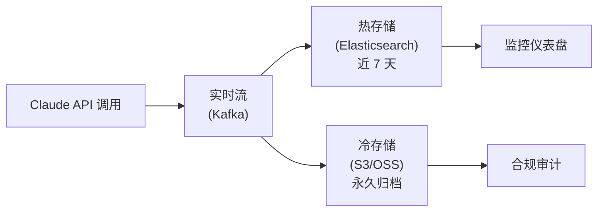

## 11.6 企业级合规与审计

在企业环境中落地 LLM 应用，最大的阻碍往往不是技术，而是合规（Compliance）。本节将梳理数据脱敏、审计日志和隐私保护三大核心领域的实践方案。

### 11.6.1 数据脱敏

在将数据发送给 Claude API 之前，必须剥离任何可识别个人身份信息 (Personal Identifiable Information, PII)。这是满足 GDPR、CCPA 等隐私法规的基本要求。

#### 常见 PII 类型

| 类型 | 示例 | 风险等级 |
| :--- | :--- | :--- |
| 直接标识符 | 姓名、身份证号、手机号 | 🔴 高 |
| 准标识符 | 出生日期、邮编、职位 | 🟡 中 |
| 敏感数据 | 银行卡号、医疗记录、薪资 | 🔴 高 |
| 位置信息 | 具体家庭住址、GPS 坐标 | 🟡 中 |

#### 脱敏方案

根据安全需求，可选择不同级别的脱敏策略：

**方案一：正则替换（轻量级）**

在代码层使用正则表达式将敏感信息替换为占位符：

```python
import re

def sanitize_pii(text: str) -> str:
    # 手机号脱敏
    text = re.sub(r'1[3-9]\d{9}', '[PHONE]', text)
    # 身份证号脱敏
    text = re.sub(r'\d{17}[\dXx]', '[ID_CARD]', text)
    # 邮箱脱敏
    text = re.sub(r'[\w.+-]+@[\w-]+\.[\w.]+', '[EMAIL]', text)
    return text
```

**方案二：Microsoft Presidio（企业级）**

使用开源工具 Microsoft Presidio 自动识别和脱敏文本中的实体：

```python
from presidio_analyzer import AnalyzerEngine
from presidio_anonymizer import AnonymizerEngine

analyzer = AnalyzerEngine()
anonymizer = AnonymizerEngine()

# 分析文本中的 PII
results = analyzer.analyze(text="张三的手机号是13800138000",
                           language="zh", entities=["PHONE_NUMBER", "PERSON"])

# 自动脱敏
anonymized = anonymizer.anonymize(text="张三的手机号是13800138000",
                                   analyzer_results=results)

# 输出: "<PERSON>的手机号是<PHONE_NUMBER>"
```

**方案三：可逆脱敏（高级）**

对于需要在 Claude 处理完毕后还原真实数据的场景，使用映射表进行可逆替换：

```python
import uuid

class ReversibleSanitizer:
    def __init__(self):
        self.mapping = {}

    def sanitize(self, text: str, entity: str) -> str:
        token = f"[{entity}_{uuid.uuid4().hex[:8]}]"
        self.mapping[token] = text
        return token

    def restore(self, text: str) -> str:
        for token, original in self.mapping.items():
            text = text.replace(token, original)
        return text
```

### 11.6.2 审计日志

为了满足 ISO 27001、SOC 2 或等保三级的要求，所有与 AI 的交互都必须留痕。

### 必记字段

设计数据库表结构时，建议包含以下字段：

| 字段名 | 描述 | 用途 |
| :--- | :--- | :--- |
| `request_id` | Anthropic 返回的 `x-request-id` | 向 Anthropic 客服追溯问题 |
| `input_tokens` | 消耗的输入 Token 数 | 成本核算 |
| `output_tokens` | 消耗的输出 Token 数 | 成本核算 |
| `model_version` | 具体模型版本 | 回归分析、合规审计 |
| `prompt_hash` | Prompt 模板的哈希值 | 检测 Prompt 未授权变更 |
| `user_id` | 发起请求的内部用户 ID | 访问追溯 |
| `timestamp` | 精确到毫秒的时间戳 | 时序分析 |
| `tool_calls` | 调用的工具名称和参数 | 操作审计 |
| `response_summary` | 输出内容的摘要或哈希 | 内容合规检查 |

#### 日志存储架构

对于高频调用的生产环境，推荐采用分层存储：



*   **热存储**：最近 7 天的日志存入 Elasticsearch，供实时查询和监控告警。
*   **冷存储**：全部日志以压缩格式归档到对象存储（如 AWS S3），满足法规要求的最低保留期限（通常 3-7 年）。

### 11.6.3 零留存设置

对于极其敏感的金融或医疗场景，企业用户可以与 Anthropic 签署 BAA (Business Associate Agreement) 或申请 Zero Data Retention（ZDR）安排。ZDR 和 HIPAA readiness 都是组织/合同层面的数据处理安排，不应假设可以靠单个请求头临时开启。

在 ZDR 覆盖的 endpoint 上，客户数据在 API 响应返回后不在静态存储中保留，除非法律或反滥用需要。不同功能的覆盖范围不同：Messages API 和 Token Counting 可以覆盖；Batch API、Files API、code execution、Managed Agents 等需要按官方 feature eligibility 表或合同条款单独确认。

#### 启用方式

通过账号和合同配置启用，而不是在业务代码中写一个自定义数据留存请求头。应用侧更应该做两件事：

1.  用独立 workspace / organization 隔离 ZDR、HIPAA 和普通工作负载。
2.  在上线前核对所用 endpoint 和工具是否属于当前组织的 ZDR / HIPAA 覆盖范围。

### 11.6.4 合规自查清单

在正式上线 AI 功能前，使用以下清单进行合规自查：

| 检查项 | 说明 | 状态 |
| :--- | :--- | :--- |
| PII 脱敏 | 所有用户数据在发送给 API 前已脱敏 | ☐ |
| 审计日志 | 所有 API 调用均有完整日志记录 | ☐ |
| 数据留存 | 已确认 Anthropic 侧的数据留存策略 | ☐ |
| 访问控制 | API Key 使用权限最小化原则 | ☐ |
| 内容过滤 | 输出端配置了敏感内容过滤 | ☐ |
| 用户知情 | 用户已被告知其数据将由 AI 处理 | ☐ |
| 应急预案 | 制定了 AI 服务中断或数据泄露的应急方案 | ☐ |
