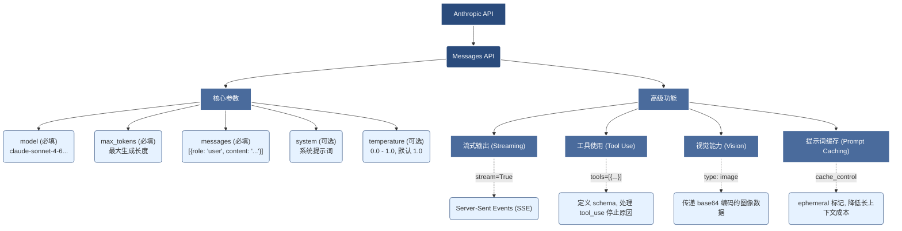

## 附录 A：API 参考手册

本手册涵盖了 Python SDK 和 TypeScript SDK 的高频用法。
完整的 API 文档请参考 [docs.anthropic.com](https://docs.anthropic.com)。



### 12.1.1 基础消息

所有交互的核心。

#### Python

```python
import anthropic

client = anthropic.Anthropic() # 自动读取 ANTHROPIC_API_KEY

message = client.messages.create(
    model="claude-sonnet-4-6",
    max_tokens=1024,
    temperature=0,
    system="You are a helpful assistant.",
    messages=[
        {"role": "user", "content": "Explain quantum computing."}
    ]
)
print(message.content[0].text)
```

#### TypeScript

```typescript
import Anthropic from '@anthropic-ai/sdk';

const client = new Anthropic();

const message = await client.messages.create({
  model: 'claude-sonnet-4-6',
  max_tokens: 1024,
  messages: [{ role: 'user', content: 'Hello, Claude' }],
});
console.log(message.content[0].text);
```

#### 关键参数说明

*   `model`: 模型 ID。当前可用模型：`claude-opus-4-7`、`claude-sonnet-4-6`、`claude-haiku-4-5-20251001`（Haiku 需要日期后缀）。
*   `max_tokens`: 最多生成多少 Token。**必须指定**。
*   `temperature`: 0.0 - 1.0。0 为确定性（编程/提取），1 为创造性（写作）。
*   `system`: 系统提示词。

### 12.1.2 流式输出

提高首字响应速度 (TTFT)。

#### Python

```python
with client.messages.stream(
    max_tokens=1024,
    messages=[{"role": "user", "content": "Write a long story..."}],
    model="claude-sonnet-4-6",
) as stream:
    for text in stream.text_stream:
        print(text, end="", flush=True)
```

### 12.1.3 工具使用

#### Tool Definition

```python
tools = [{
    "name": "get_weather",
    "description": "Get current weather",
    "input_schema": {
        "type": "object",
        "properties": {
            "location": {"type": "string"}
        },
        "required": ["location"]
    }
}]
```

#### Handling Tool Calls

```python
response = client.messages.create(
    model="claude-sonnet-4-6",
    max_tokens=1024,
    tools=tools,
    messages=[{"role": "user", "content": "How is weather in Tokyo?"}]
)

if response.stop_reason == "tool_use":
    tool_use = response.content[-1] # 获取工具调用请求
    tool_name = tool_use.name
    tool_input = tool_use.input
    # ... 执行工具逻辑 ...
    # ... 将结果回传给 Claude (作为 tool_result) ...
```

### 12.1.4 图像理解

支持 JPEG, PNG, GIF, WEBP。单张图片建议压缩在 5MB 以内。

```python
import base64

with open("image.jpg", "rb") as image_file:
    image_data = base64.b64encode(image_file.read()).decode("utf-8")

message = client.messages.create(
    model="claude-sonnet-4-6",
    max_tokens=1024,
    messages=[
        {
            "role": "user",
            "content": [
                {
                    "type": "image",
                    "source": {
                        "type": "base64",
                        "media_type": "image/jpeg",
                        "data": image_data,
                    },
                },
                {"type": "text", "text": "Describe this image."}
            ],
        }
    ],
)
```

### 12.1.5 提示缓存

提示缓存已正式发布（GA），无需额外的 beta header，直接在内容块中添加 `cache_control` 即可。

```python
system_message = [
    {
        "type": "text",
        "text": "Huge context text...",
        "cache_control": {"type": "ephemeral"} # 标记缓存点
    }
]
```

### 12.1.6 错误代码对照表

| Error Code | 含义 | 解决方案 |
| :--- | :--- | :--- |
| `400 invalid_request_error` | 参数错误 | 检查 JSON Schema 或 Token 限制。 |
| `401 authentication_error` | 鉴权失败 | 检查 API Key 是否正确/过期。 |
| `403 permission_error` | 权限不足 | 检查账号是否被封禁或地区限制。 |
| `429 rate_limit_error` | 速率限制 | 实现指数退避重试 (Exponential Backoff)。 |
| `500 api_error` | 服务器错误 | Anthropic 侧故障，稍后重试。 |
| `529 overloaded_error` | 负载过高 | 临时繁忙，稍后重试。 |
