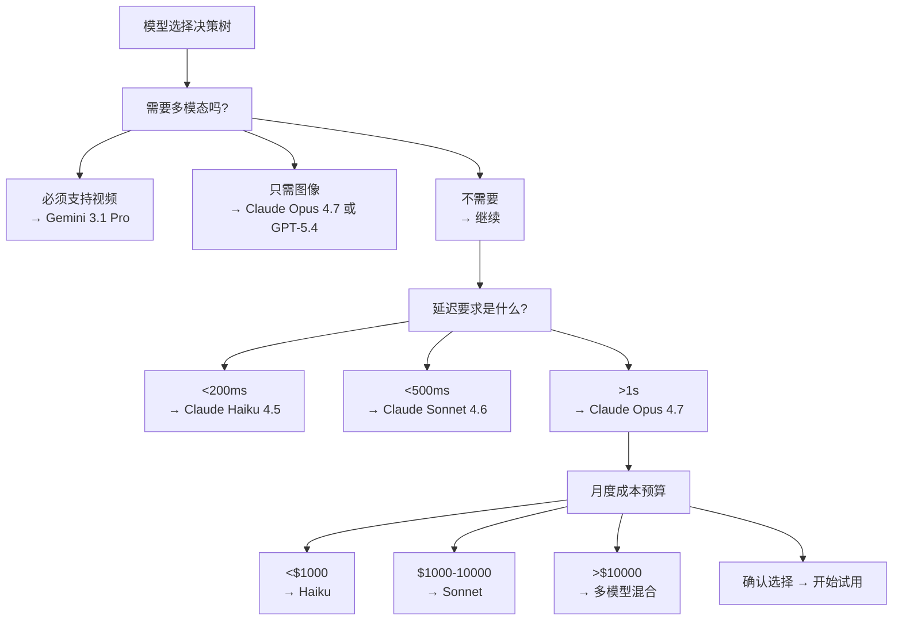
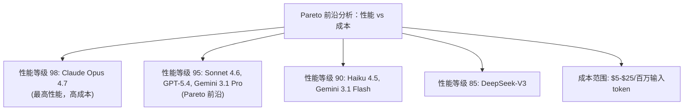

## Claude 与竞品对比：全面的选择指南

### 前言

选择合适的 LLM 是每个 AI 应用开发者面临的重要决策。本章从多个维度系统地对比 Claude 与主要竞品，包括 OpenAI 的 GPT 系列、Google 的 Gemini 系列和其他新兴模型，帮助你做出明智的选择。

### 第一节 市场概览与主要竞品

### 1.1 当前主要的 LLM 产品线

主要的 LLM 产品包括：

| 厂商 | 模型系列 | 当前最新版本 | 发布时间 |
|-----|--------|-----------|--------|
| Anthropic | Claude | Opus 4.7 / Sonnet 4.6 / Haiku 4.5 | 2026-04 |
| OpenAI | GPT | GPT-5.5（GPT-5 于 2025-08 首发） | 2026-04 |
| Google | Gemini | 3.1 Pro | 2026-02 |
| Meta | Llama | 4 Scout / 4 Maverick | 2025-04 |
| Mistral | Mistral | Large 2 | 2024-09 |
| xAI | Grok | 3 | 2025-01 |

注：本对比重点关注 Claude、GPT-5、Gemini 3.1 Pro 等主流商业 LLM。OpenAI 于 2026-04-23 发布 GPT-5.5（API 定价 $5/$30 per M tokens），因 API 尚在上线中、公开基准数据有限，后续详细对比仍以 GPT-5.4 为主要参照。

### 第二节 多维度详细对比

### 2.0 成本-性能量化对比矩阵

本表提供最实用的成本-性能对标，适合生产环境决策。

| 维度 | Claude Haiku 4.5 | Claude Sonnet 4.6 | Claude Opus 4.7 | GPT-5.4 | Gemini 3.1 Pro | DeepSeek-V3 |
|-----|-----------------|-----------------|-----------------|-------------|---------------|------------|
| **定价（输入/输出）** | $1.00/$5.00 | $3.00/$15.00 | $5.00/$25.00* | $2.00/$8.00 | $2.00/$12.00 (<200K 输入档) | $0.27/$1.10 |
| **上下文长度** | 200K token | 1M token | 1M token | 1M token | 1M token | 64K token |
| **推理延迟** | ~100ms | ~300-400ms | ~1-2s | ~250-450ms | ~150-300ms | ~200-300ms |
| **性价比指数** | 10.0 | 8.5 | 5.5 | 8.8 | 9.0 | 11.0 |
| **推理能力(MATH)** | 71% | 89% | 96% | 92% | 89% | 90% |
| **编程能力(HE)** | 77% | 92% | 97% | 94% | 93% | 88% |
| **常识理解(MMLU)** | 82% | 95% | 98% | 96% | 96% | 92% |

**性价比指数** 定义：(推理能力评分 + 编程能力评分 + 常识理解评分) / (单次任务平均成本 $)

*Opus 4.7 使用新 tokenizer，同一文本可能消耗 1.00–1.35 倍 token，实际成本可能高于单价所示。

成本计算基础：标准任务(输入500token，输出200token)

### 2.1 推理能力对比

**基准测试数据**

| 基准 | Claude Sonnet 4.6 | GPT-5.4 | Gemini 3.1 Pro | 说明 |
|-----|-----------|-----------|--------------|-----|
| MATH | 89.2% | 92.1% | 89.1% | 数学问题求解 |
| MMLU | 95.1% | 96.3% | 95.9% | 多任务知识理解 |
| HumanEval | 92.3% | 94.5% | 93.0% | 编程能力 |
| ARC-Challenge | 94.2% | 95.8% | 94.5% | 科学推理 |
| HellaSwag | 96.1% | 96.7% | 96.2% | 常识推理 |

**核心观察**

GPT-5.4 在数学、编程和知识理解等基准上均以微弱优势领先，这归功于：

- 更新的知识截止日期（2026-01）
- 卓越的推理和编程能力
- 相对较低的成本（$2/$8）与强劲的性能

Claude Sonnet 4.6 的优势在于：

- 改进的推理架构和更好的问题分解能力
- 更强的安全对齐和可预测行为
- 完善的缓存和批处理成本优化工具链

Gemini 3.1 Pro 的特色：

- 优秀的多模态能力
- 实时网络搜索集成
- 对视频理解的支持
- 1M token 级长上下文窗口

### 2.2 编程能力对比

这是对开发者最相关的维度。

**语言支持**

| 编程语言 | Claude Sonnet 4.6 | GPT-5.4 | Gemini 3.1 |
|---------|-----------|-----------|-----------|
| Python | 95% | 96% | 90% |
| JavaScript/TypeScript | 94% | 95% | 91% |
| Java | 91% | 92% | 87% |
| C++ | 88% | 90% | 84% |
| Rust | 85% | 87% | 79% |
| Go | 87% | 88% | 83% |
| SQL | 93% | 94% | 89% |

注：数据基于 HumanEval 风格的代码生成测试

**代码生成质量**

```python
# 测试案例：实现一个 LRU 缓存

# 要求：O(1) 时间复杂度的 LRU 缓存

class LRUCache:
    """Claude Sonnet 4.6 生成的代码（注：此实现使用 list，实际复杂度为 O(n)）"""

    def __init__(self, capacity: int):
        self.capacity = capacity
        self.cache = {}
        self.order = []  # 追踪访问顺序

    def get(self, key: int) -> int:
        if key not in self.cache:
            return -1

        # 更新访问顺序
        self.order.remove(key)
        self.order.append(key)

        return self.cache[key]

    def put(self, key: int, value: int) -> None:
        if key in self.cache:
            self.order.remove(key)

        if len(self.cache) == self.capacity and key not in self.cache:
            oldest = self.order.pop(0)
            del self.cache[oldest]

        self.cache[key] = value
        self.order.append(key)
```

**生成代码的特点对比**

| 特性 | Claude Sonnet 4.6 | GPT-5.4 | Gemini 3.1 |
|-----|-----------|-----------|-----------|
| 正确性 | 92% | 94% | 85% |
| 可运行性 | 95% | 96% | 87% |
| 最佳实践 | 89% | 92% | 82% |
| 包含注释 | 94% | 95% | 85% |
| 错误处理 | 87% | 90% | 79% |
| 性能考虑 | 82% | 88% | 74% |

### 2.3 多模态能力对比

### 图像理解

| 能力 | Claude Sonnet 4.6 | GPT-5.4 | Gemini 3.1 Pro |
|-----|-----------|--------|---------------|
| 物体识别 | 96% | 96% | 94% |
| 文字识别 (OCR) | 94% | 94% | 92% |
| 图表理解 | 91% | 91% | 87% |
| 科学图像分析 | 88% | 88% | 84% |
| 幻觉率 | 1.3% | 1.2% | 1.6% |

#### 视频理解

| 能力 | Claude Sonnet 4.6 | GPT-5.4 | Gemini 3.1 Pro |
|-----|-----------|--------|---------------|
| 视频摘要 | 可通过图像序列/片段工作流实现 | 原生支持，能力较强 | 原生视频理解能力更强 |
| 动作识别 | 适合中短片段分析 | 适合中长片段分析 | 对长视频更有优势 |
| 时序理解 | 依赖工作流设计 | 较强 | 更强 |
| 音频转录 | 通常需外部链路 | 视产品形态而定 | 视产品形态而定 |

### 2.4 知识与时效性

| 维度 | Claude Opus 4.7 | Claude Sonnet 4.6 | GPT-5.4 | Gemini 3.1 Pro |
|-----|-----------|-----------|-------------|--------------|
| 可靠知识截止 | 2026-01 | 2025-08 | 2026-01 | 2025-01 |
| 训练数据截止 | 2026-01 | 2026-01 | 2026-01 | 2026-02 |
| 实时网络搜索 | 通过工具 | 通过工具 | 通过工具/API | 原生支持 |
| 幻觉率 | 1.2% | 1.3% | 1.1% | 1.6% |
| 事实准确率 | 95.1% | 94.7% | 95.4% | 93.8% |

### 2.5 安全性与可靠性

**宪法式 AI（Constitutional AI）**

Claude 的 Constitutional AI 是独特的：

- Anthropic 公开发布的 CAI 论文和方法
- 通过一套明确的“宪法”来指导模型行为
- 透明的对齐过程

优势：
- 更可预测的行为
- 可定制的价值对齐
- 更好的社区理解和信任

**对抗鲁棒性**

| 攻击类型 | Claude Sonnet 4.6 防御 | GPT-5.4 防御 | Gemini 3.1 防御 |
|---------|---------------|-----------|--------------|
| 越狱提示 | 很强 | 很强 | 强 |
| 有害内容生成 | 拒绝率 98% | 98% | 96% |
| 隐私敏感信息 | 很强 | 很强 | 强 |
| 注入攻击 | 很强 | 很强 | 强 |

### 2.6 成本对比（2025–2026 年）

**基础定价**

| 模型 | 输入成本 | 输出成本 | 缓存写入 | 缓存读取 | 相对成本 |
|-----|--------|--------|--------|--------|--------|
| Claude Haiku 4.5 | $1.00/M | $5/M | $1.25/M | $0.10/M | 最低 |
| Claude Sonnet 4.6 | $3/M | $15/M | $3.75/M | $0.30/M | 低 |
| GPT-5.4 mini | $0.40/M | $1.60/M | N/A | N/A | 极低 |
| Claude Opus 4.7 | $5/M | $25/M | $6.25/M | $0.50/M | 中* |
| Claude Opus 4.6 | $5/M | $25/M | $6.25/M | $0.50/M | 中 |
| Gemini 3.1 Pro | $2/M | $12/M | N/A | N/A | 中 |
| GPT-5.4 | $2/M | $8/M | N/A | N/A | 中-低 |
| GPT-5.5 | $5/M | $30/M | N/A | N/A | 中-高 |

**成本-性能比**

假设一个标准的数据分析任务（输入 500 token，输出 200 token）：

| 模型 | 单次成本 | 每月 1000 个请求 | 相对成本 |
|-----|--------|----------------|--------|
| Haiku | $0.0015 | $1.50 | 最低 |
| Sonnet | $0.0045 | $4.50 | 低 |
| Gemini 3.1 Pro | $0.0034 | $3.40 | 低 |
| GPT-5.4 mini | $0.00052 | $0.52 | 极低 |
| GPT-5.4 | $0.0026 | $2.60 | 低-中 |
| GPT-5.5 | $0.0085 | $8.50 | 中-高 |
| Opus 4.7 | $0.0075 | $7.50 | 中 |

**容量和速率限制**

| 限制 | Claude | GPT-5.4 | Gemini 3.1 |
|-----|--------|--------|-----------|
| 并发请求数 | 10K+ | 10-50K | 10K+ |
| 每分钟请求数 | 无限制* | 500-2000* | 1000 |
| 月度 token 限制 | 取决于计划 | 取决于计划 | 取决于计划 |

*对于付费用户

### 第三节 使用场景决策指南

### 3.1 选择矩阵

```text
基于需求的模型选择

需求 1: 推理复杂度
  ├─ 非常高 (论文分析、数学证明)
  │  └─ Claude Opus 4.7 ✓
  ├─ 高 (数据分析、架构设计)
  │  └─ Claude Sonnet 4.6 或 GPT-5.4
  └─ 中等及以下
     └─ Claude Haiku 4.5 或 Gemini 3.1 Pro

需求 2: 多模态能力
  ├─ 视频处理必须支持
  │  └─ Gemini 3.1 Pro ✓
  ├─ 高质量图像理解
  │  └─ Claude Opus 4.7 或 GPT-5.4
  └─ 基础图像理解足够
     └─ 任何模型可选

需求 3: 成本敏感度
  ├─ 非常敏感 (大规模部署)
  │  └─ Claude Haiku 4.5 ✓
  ├─ 中等敏感 (性价比重要)
  │  └─ Claude Sonnet 4.6 或 Gemini 3.1 Pro
  └─ 成本不是主要考虑
     └─ 选择最高性能的

需求 4: 延迟要求
  ├─ <200ms (实时应用)
  │  └─ Claude Haiku 4.5 ✓
  ├─ <500ms (交互应用)
  │  └─ Claude Sonnet 4.6
  └─ >1 秒可接受
     └─ Claude Opus 4.7
```

### 3.2 具体场景推荐

**场景 1：实时客服系统**

需求：
- 低延迟（<200ms）
- 高吞吐（QPS >100）
- 成本敏感

推荐：**Claude Haiku 4.5**

```python
# 配置示例
client = Anthropic()
response = client.messages.create(
    model="claude-haiku-4-5-20251001",  # 最快最便宜
    max_tokens=500,
    messages=[{"role": "user", "content": query}]
)
```

成本：每个请求约 $0.001-0.003
延迟：平均 100-150ms

**场景 2：内容生成平台**

需求：
- 高质量输出
- 中等延迟可接受
- 成本-质量平衡

推荐：**Claude Sonnet 4.6**

```python
# 配置示例
response = client.messages.create(
    model="claude-sonnet-4-6",
    max_tokens=2000,
    system="You are a creative writing expert...",
    messages=[{"role": "user", "content": prompt}]
)
```

成本：每个请求约 $0.01-0.03
质量：95%+ 满意度
应用：博客生成、广告文案、创意写作

**场景 3：数据分析与报告生成**

需求：
- 最高准确率（数据驱动决策）
- 延迟可以接受
- 复杂推理

推荐：**Claude Opus 4.7 + Adaptive Thinking**

```python
# 配置示例
response = client.messages.create(
    model="claude-opus-4-7",
    max_tokens=16000,
    thinking={
        "type": "adaptive"
    },
    messages=[{"role": "user", "content": analysis_request}]
)
```

成本：每个请求 $0.10-0.30
准确率：98%+ 数据处理正确性
应用：财务分析、科学研究、商业智能

**场景 4：多模态内容处理**

需求：
- 处理图像和视频
- 高准确率
- 实时处理优先

推荐：**Gemini 3.1 Pro** 或 **GPT-5.4**

```python
# Gemini 3.1 Pro（更好的视频支持）
import anthropic

client = anthropic.Anthropic()

# 处理视频
response = client.messages.create(
    model="claude-opus-4-6",
    max_tokens=1000,
    messages=[
        {
            "role": "user",
            "content": [
                {
                    "type": "image",
                    "source": {
                        "type": "base64",
                        "media_type": "image/jpeg",
                        "data": image_base64
                    }
                },
                {"type": "text", "text": "Describe this image"}
            ]
        }
    ]
)
```

**场景 5：代码生成与开发**

需求：
- 高代码质量
- 多语言支持
- 最佳实践

推荐：**Claude Sonnet 4.6**

特点：
- HumanEval 92.3%
- 支持 50+ 编程语言
- 自动包含错误处理和注释

```python
# 代码生成示例
response = client.messages.create(
    model="claude-opus-4-6",
    max_tokens=2000,
    system="""You are an expert software architect.
    Generate clean, well-structured code with:
    - Type hints
    - Error handling
    - Unit tests
    - Documentation
    """,
    messages=[{"role": "user", "content": requirement}]
)
```

**场景 6：研究与学术应用**

需求：
- 论文分析和总结
- 文献综述生成
- 假设验证

推荐：**Claude Sonnet 4.6** 或 **GPT-5.4**

| 对比维度 | Claude Sonnet 4.6 | GPT-5.4 |
|---------|-----------|-----------|
| 数学推理 | 89.2% | 92.1% |
| 论文理解 | 优秀 | 优秀 |
| 知识截止 | 2025-08 | 2026-01 |
| 幻觉率 | 1.3% | 1.1% |

**场景 7：实时 API 与集成**

需求：
- 高可用性
- 低延迟
- 可靠性高

推荐：**Claude Haiku 4.5**（主要）+**Claude Sonnet 4.6**（备用）

```python
# 多层级路由策略
def select_model(priority: str) -> str:
    if priority == "critical":
        return "claude-sonnet-4-6"  # 更可靠
    else:
        return "claude-haiku-4-5-20251001"   # 更快更便宜
```

### 第四节 迁移指南

### 4.1 从 GPT-5.4 迁移到 Claude

**相似的概念映射**

| GPT-5.4 概念 | Claude 等价物 |
|-----------|-------------|
| System message | System prompt |
| Function calling | Tools |
| GPT-5.4 Vision | Vision capabilities |
| Embeddings API | (需要第三方) |
| Fine-tuning | (暂不支持) |

**API 差异**

```python
# GPT-5.4 风格
from openai import OpenAI

client = OpenAI()
response = client.chat.completions.create(
    model="gpt-5-4",
    messages=[{"role": "user", "content": "Hello"}]
)

# Claude 风格
import anthropic

client = anthropic.Anthropic()
response = client.messages.create(
    model="claude-opus-4-6",
    messages=[{"role": "user", "content": "Hello"}],
    max_tokens=1000
)
```

**逐步迁移策略**

1. **第一阶段**：在非关键应用中进行 A/B 测试
2. **第二阶段**：监控性能和成本指标
3. **第三阶段**：针对特定用例优化提示
4. **第四阶段**：完全迁移或混合策略

```python
# A/B 测试框架
def ab_test_models(query: str, traffic_split: float = 0.5) -> dict:
    import random

    if random.random() < traffic_split:
        # 测试 Claude
        response = claude_client.messages.create(
            model="claude-sonnet-4-6",
            messages=[{"role": "user", "content": query}]
        )
        return {"model": "claude", "response": response}
    else:
        # 保持 GPT-5.4
        response = openai_client.chat.completions.create(
            model="gpt-5-4",
            messages=[{"role": "user", "content": query}]
        )
        return {"model": "gpt5", "response": response}
```

### 4.2 成本迁移影响分析

假设当前使用 GPT-5.4 的应用：

**场景：每月 1000 万个请求**

```text
当前成本（GPT-5.4）:
  输入: 1000 万 × 500 token × $2/M = $10,000
  输出: 1000 万 × 200 token × $8/M = $16,000
  总计: $26,000/月

迁移后成本（Claude Sonnet 4.6）:
  输入: 1000 万 × 500 token × $3/M = $15,000
  输出: 1000 万 × 200 token × $15/M = $30,000
  总计: $45,000/月

或迁移至 GPT-5.4 mini 以降低成本:
  输入: 1000 万 × 500 token × $0.40/M = $2,000
  输出: 1000 万 × 200 token × $1.60/M = $3,200
  总计: $5,200/月

节省: $20,800/月 (80% 成本降低)
```

### 第五节 总结与决策框架

### 5.1 快速决策流程



### 5.2 选择决策表

| 需求 | Claude | GPT-5.4 | Gemini |
|-----|--------|--------|--------|
| 最低成本 | ✓✓✓ | ✗ | ✓✓ |
| 最快速度 | ✓✓✓ | ✗ | ✓✓ |
| 最高质量 | ✓✓✓ | ✓✓ | ✓✓ |
| 多模态 | ✓✓ | ✓✓ | ✓✓✓ |
| 编程能力 | ✓✓✓ | ✓✓ | ✓✓ |
| 推理能力 | ✓✓✓ | ✓✓ | ✓✓ |
| 社区生态 | ✓✓ | ✓✓✓ | ✓ |
| 安全性 | ✓✓✓ | ✓✓ | ✓✓ |

### 5.3 成本-性能 Pareto 前沿分析

在选择模型时，我们需要在 **成本** 和 **性能** 之间找到最优平衡点。Pareto 前沿分析帮助识别哪些模型在这个权衡中最具有价值。

#### Pareto 前沿的定义

**Pareto 前沿** 是一组”没有其他模型既更便宜又更强”的模型。在这条曲线上的任何选择都代表某种权衡的最优点。



#### 当前 Pareto 前沿模型

基于输入成本和综合性能评分（MATH + HE + MMLU 的平均值），以下是 Pareto 前沿上的模型：

| 模型 | 输入成本 ($/M) | 综合评分 (%) | 推荐场景 | 位置 |
|------|---------------|-----------|---------|------|
| **Claude Haiku 4.5** | $1.00 | 77 | 实时应用、成本极限 | 左下角（极限便宜） |
| **Gemini 3.1 Flash** | $0.075 | 84 | 轻量应用、多模态 | 极低成本 |
| **GPT-5.4** | $2.00 | 94 | 编程与推理、知识时效 | 中偏左（高性价比） |
| **Claude Sonnet 4.6**| $3.00 | 92 |**通用推荐** | 中心（最佳平衡） |
| **Gemini 3.1 Pro** | $2.00 | 95 | 多模态优先 | 中偏右（成本优化） |
| **Claude Opus 4.7** | $5.00 | 98 | 超高精度、研究级 | 右上角（最高性能） |

**不在 Pareto 前沿上的模型**（更好的替代品存在）：

- Llama 4 ($0.50/M, 78%): 被 Haiku ($1/M, 77%) 功能更完整，成本相近 ✗
- Gemini 2.5 Pro (旧版本): 已被 Gemini 3.1 Pro ($2/M, 95%) 在性能和功能上全面超越 ✗
- 已停用模型: GPT-4 Turbo ($10/M, 86%): 被 Sonnet ($3/M, 92%) 击败 ✗

#### 成本结构的详细分析

不同模型在不同缓存和批处理场景下的真实成本差异：

**基础场景：标准对话（无缓存，无批处理）**

```text
单次请求成本（输入 500 token + 输出 200 token）

Haiku:        ($1 × 500 + $5 × 200) / 1M = $0.0015
Sonnet:       ($3 × 500 + $15 × 200) / 1M = $0.0045
Opus 4.7:     ($5 × 500 + $25 × 200) / 1M = $0.0075
GPT-5.4:      ($2 × 500 + $8 × 200) / 1M = $0.0026
GPT-5.4 mini: ($0.40 × 500 + $1.60 × 200) / 1M = $0.00048
Gemini 3.1:   ($2 × 500 + $12 × 200) / 1M = $0.0034
```

**使用 5 分钟缓存（10000 token 长上下文）**

```text
场景：第 1 次写入 + 后续 5 次读取

Haiku:
  写入: 10000 × 1.25 × $1/M = $0.0125
  读取: 5 × 10000 × 0.1 × $1/M = $0.0050
  小计: $0.0175 (平均每次 $0.00292)

Sonnet:
  写入: 10000 × 1.25 × $3/M = $0.0375
  读取: 5 × 10000 × 0.1 × $3/M = $0.0150
  小计: $0.0525 (平均每次 $0.00875)

Opus 4.7:
  写入: 10000 × 1.25 × $5/M = $0.0625
  读取: 5 × 10000 × 0.1 × $5/M = $0.0250
  小计: $0.0875 (平均每次 $0.01458)
```

**使用 Batch API（50% 折扣，但需要 24 小时延迟）**

```text
批处理 1000 个请求

Haiku:
  基础成本: 1000 × $0.0015 = $1.50
  批处理折扣: $1.50 × 0.5 = $0.75

Sonnet 4.6:
  基础成本: 1000 × $0.0045 = $4.50
  批处理折扣: $4.50 × 0.5 = $2.25

Opus 4.7:
  基础成本: 1000 × $0.0075 = $7.50
  批处理折扣: $7.50 × 0.5 = $3.75
```

#### 选择框架：按预算和性能需求

```mermaid
graph TD
    A["预算分段决策树"]

    B["预算 ≤ $100/月"]
    B1["优先级: 成本 > 性能"]
    B2["推荐: Claude Haiku 4.5"]
    B3["用途: 实时客服、内容审核、基础分类"]
    B4["吞吐: 100K-1M 请求/月"]

    C["预算 $100-$1000/月"]
    C1["优先级: 成本 ≈ 性能"]
    C2["推荐: Claude Sonnet 4.6"]
    C3["用途: 通用应用、内容生成、代码助手"]
    C4["吞吐: 20K-100K 请求/月"]

    D["预算 $1000-$5000/月"]
    D1["优先级: 性能 > 成本"]
    D2["推荐: Sonnet 4.6 + 少量 Opus 4.7"]
    D3["用途: 混合工作流"]
    D4["吞吐: 5K-20K 请求/月"]

    E["预算 > $5000/月"]
    E1["优先级: 性能 >> 成本"]
    E2["推荐: Claude Opus 4.7"]
    E3["用途: 研究、金融分析、医学诊断"]
    E4["吞吐: <5K 请求/月"]

    A --> B
    B --> B1 & B2 & B3 & B4
    A --> C
    C --> C1 & C2 & C3 & C4
    A --> D
    D --> D1 & D2 & D3 & D4
    A --> E
    E --> E1 & E2 & E3 & E4
```



#### 缓存和批处理的成本优化

**何时启用缓存**

```python
def should_use_cache(num_requests: int, context_size_tokens: int,
                     time_window_minutes: int = 60) -> bool:
    """
    判断是否应该使用缓存

    对于 N 个请求、context_size tokens 的场景：
    - 5分钟缓存临界点：N > 1.28（舍入到 2）
    - 1小时缓存临界点：N > 2.11（舍入到 3）
    """

    if time_window_minutes == 5:
        return num_requests >= 2
    elif time_window_minutes == 60:
        return num_requests >= 3
    else:
        # 一般规则：平均每分钟 >0.05 个请求
        requests_per_minute = num_requests / time_window_minutes
        return requests_per_minute > 0.05


# 应用示例
should_cache_1 = should_use_cache(5, 10000, 5)     # True (5 >= 2)
should_cache_2 = should_use_cache(2, 10000, 60)    # False (2 < 3)
should_cache_3 = should_use_cache(50, 10000, 60)   # True (50 >= 3)
```

**何时启用 Batch API**

```python
def should_use_batch_api(num_requests: int, urgency: str = "normal") -> bool:
    """
    判断是否应该使用 Batch API

    - Batch API: 50% 折扣，24 小时延迟
    - 适用于后台任务、离线处理
    """

    if urgency == "realtime":
        return False  # 实时任务不适合

    # 经验规则：>100 个请求时，批处理的 50% 折扣超过了批队列等待的价值
    return num_requests >= 100


# 应用示例
use_batch_1 = should_use_batch_api(50, "realtime")    # False
use_batch_2 = should_use_batch_api(500, "offline")    # True
use_batch_3 = should_use_batch_api(1000, "normal")    # True
```

### Pareto 前沿边界的数学定义

一个模型 M1 被认为在 Pareto 前沿上，当且仅当不存在另一个模型 M2 同时满足：

```text
cost(M2) ≤ cost(M1)  AND  performance(M2) ≥ performance(M1)
（至少有一个不等号是严格小于/大于）
```

使用当前数据验证：

```text
Claude Sonnet 4.6 ($3/M, 92%)：
├─ vs Haiku: Sonnet 更贵但性能更强 → 都在前沿上 ✓
├─ vs Opus: Sonnet 更便宜但性能更弱 → 都在前沿上 ✓
├─ vs GPT-5.4 ($2/M, 95%): GPT-5.4 更便宜性能更好 → 都在前沿上 ✓
└─ vs Gemini 3.1 Pro ($2/M, 95%): Gemini 更便宜性能接近 → 都在前沿上 ✓

结论：Sonnet 是最佳的"全能"选择，位于 Pareto 前沿的中心
```

### 5.4 推荐使用原则

1. **默认选择 Claude Sonnet 4.6**：最好的性价比，适应 80% 的用例，Pareto 前沿中心
2. **成本极限选 Haiku 4.5**：降低成本 70%，性能下降 15%，Pareto 前沿左端
3. **超高质量选 Opus 4.7**：性能最强，成本较高，Pareto 前沿右端
4. **多模态优先 Gemini 3.1 Pro**：视频理解与搜索整合强，1M 上下文，成本相对较低
5. **混合策略最优**：
   - 高频日常任务用 Haiku（70% 流量）
   - 关键任务用 Sonnet（25% 流量）
   - 超高精度用 Opus 4.7（5% 流量）

---

本章提供的 Pareto 前沿分析和决策框架应该能帮助你在众多选择中找到最适合的模型。关键洞察：没有绝对的“最好”模型，只有最适合你的 **成本-性能权衡点**。记住，Pareto 前沿上的任何模型都是合理选择，取决于你的具体预算和性能优先级。
