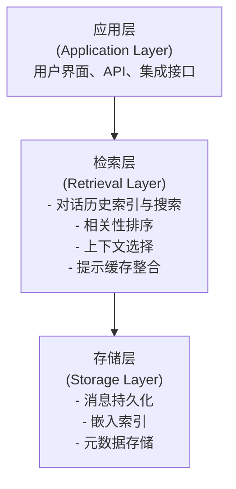
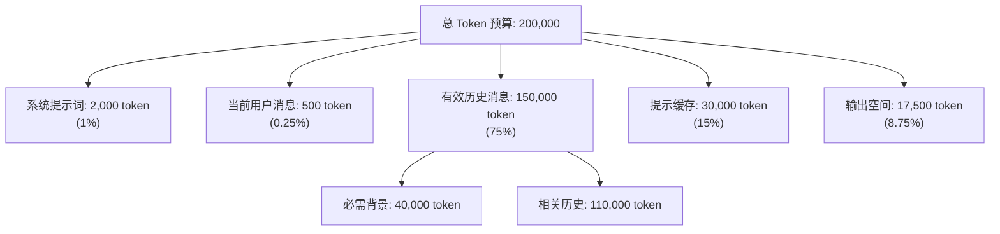

## Infinite Chats 实战指南

## 序言

Infinite Chats 是 Anthropic 在 2024-2025 年推出的一项创新功能，截至 2026 年 3 月仍处于 **Early Access/Beta 阶段**，它致力于改变用户与 Claude 的交互方式。在传统对话模式中，上下文窗口的限制意味着对话长度受限；而 Infinite Chats 旨在突破这个限制，理论上支持无限长度的对话。本章深入探讨 Infinite Chats 的原理、实现、最佳实践和高级用法。

> **重要声明**：Infinite Chats 功能在 2026 年 3 月仍为 Beta/Early Access，可能存在以下限制：
> - 不是所有 Claude 用户都有权限使用
> - 可能存在上下文衰减或检索不完美的情况
> - 功能及定价可能在正式 GA 前发生变更
> - 本章内容为基于当前 Beta 状态的描述，未来可能有显著调整

> 💡 **相关阅读**：本章涉及长对话的上下文管理，与第 13.3 章《Context Engineering》的主题密切相关。建议结合阅读。

## 第一节 Infinite Chats 核心概念与使用限制

### 13.2.1 使用限制与已知问题

Infinite Chats 虽然提供了突破性的功能，但目前（2026 年 3 月）仍存在以下限制：

**功能可用性限制**
- 不是所有 Claude 免费用户都能使用；仅限特定付费计划用户
- 在某些地区的可用性可能受限
- Web 界面支持较好，但 API 支持仍在完善中

**技术限制**
- **上下文衰减**：极长的对话（>500K token）时，早期消息的检索准确度可能下降
- **检索延迟**：在对话长度超过 300K token 后，上下文选择的延迟可能显著增加
- **关键信息丢失风险**：自动上下文选择虽然优化，但仍可能遗漏某些关键信息
- **成本不可预测**：由于检索成本与对话历史大小相关，实际费用可能超过预期

**已知问题**
- 对于代码片段的上下文维持不够稳定（某些编程任务可能需要手动刷新）
- 多语言混合对话的上下文选择效果不如单语言
- 话题转换时，模型有时会遗漏先前讨论的前提条件

**最佳实践应对**
- 对于超关键的信息，建议通过 checkpoints（总结点）明确固化
- 定期生成对话摘要，确保关键上下文被保留
- 对成本敏感的应用，建议监控实际 token 消耗与预估的差异

### 13.2.2 什么是 Infinite Chats

**定义**

Infinite Chats 是一种对话管理模式，它允许用户与 Claude 进行无限长的对话，而不受单个请求上下文窗口大小的限制。通过智能的上下文选择和压缩，Claude 能够维持完整的对话历史和上下文，同时保持低成本和高效率。

**核心特性**

1. **无限对话长度**：理论上支持数百万 token 的对话历史
2. **自动上下文管理**：系统自动选择相关的历史消息，无需用户干预
3. **成本优化**：只有相关的历史被包含在每个请求中，节省成本
4. **一致的交互体验**：用户无需感知到上下文切换的复杂性
5. **完整的历史访问**：支持查询和回溯到任何历史消息

### 13.2.3 Infinite Chats vs 传统对话模式

| 特性 | 传统模式 | Infinite Chats |
|-----|--------|--------------|
| 最大对话长度 | 1M token (~250K 中文字符) | 无限 (M+ token) |
| 上下文管理 | 手动管理，达到限制需重启 | 自动管理 |
| 成本模型 | 每个请求包含全部历史 | 只包含相关历史 |
| 延迟 | 随着历史增长而增长 | 相对稳定 |
| 用户体验 | 需要定期存档和重启 | 无缝连续 |
| API 支持 | 原生支持 | 需要特殊处理 |

### 13.2.4 工作原理：三层架构

Infinite Chats 的实现基于一个三层架构：



**层级说明**

1. **存储层**：保存完整的对话历史和相关元数据
   - 每条消息都被转换为向量嵌入（embedding）
   - 支持语义搜索和相似度计算
   - 存储消息的时间戳、角色、token 数等元数据

2. **检索层**：核心的上下文管理引擎
   - 接收新的用户消息
   - 基于语义相似度搜索相关的历史消息
   - 根据 token 预算动态选择要包含的消息
   - 与提示缓存机制协作，进一步降低成本

3. **应用层**：用户直接交互的界面
   - Claude.com 的聊天界面
   - REST API
   - 第三方集成

## 第二节 API 实现与实际应用示例

### 13.2.5 使用 Claude API 处理长对话

虽然 Infinite Chats 目前主要在 Claude.com Web 界面中可用，但你可以使用 Claude API 和消息 API（Messages API）来实现类似的长对话处理。以下展示了如何使用 Python SDK 实现一个长对话系统。

**基本设置与依赖**

```python

# 必需的导入
import anthropic
import json
from datetime import datetime
from typing import Optional, Union

# 初始化客户端
client = anthropic.Anthropic()

# 定义常数
MAX_CONTEXT_TOKENS = 1_000_000
RESERVED_OUTPUT_TOKENS = 10000
SUMMARY_THRESHOLD = 50  # 每 50 条消息后进行总结
```

**实现基础的长对话管理器**

```python
class LongConversationManager:
    """使用 Claude API 处理长对话的管理器"""

    def __init__(self, model: str = "claude-opus-4-6"):
        self.client = anthropic.Anthropic()
        self.model = model
        self.messages = []
        self.summaries = []
        self.message_count = 0

    def add_user_message(self, content: str) -> None:
        """添加用户消息"""
        self.messages.append({
            "role": "user",
            "content": content,
            "timestamp": datetime.now().isoformat()
        })
        self.message_count += 1

    def add_assistant_message(self, content: str) -> None:
        """添加助手消息"""
        self.messages.append({
            "role": "assistant",
            "content": content,
            "timestamp": datetime.now().isoformat()
        })

    def estimate_tokens(self, text: str) -> int:
        """粗估文本 token 数（简化版）"""
        # 英文：约 1 token 每 4 字符
        # 中文：约 1 token 每 1.3 字符
        english_chars = sum(1 for c in text if ord(c) < 128)
        chinese_chars = len(text) - english_chars
        return int(english_chars / 4 + chinese_chars / 1.3)

    def should_summarize(self) -> bool:
        """检查是否应该进行总结"""
        # 当达到阈值数量的消息时进行总结
        return self.message_count % SUMMARY_THRESHOLD == 0 and self.message_count > 0

    def summarize_recent_messages(self, num_messages: int = 20) -> str:
        """对最近的消息进行总结"""
        recent = self.messages[-num_messages:]
        messages_text = "\n\n".join([
            f"{msg['role'].upper()}: {msg['content'][:300]}"
            for msg in recent
        ])

        response = self.client.messages.create(
            model=self.model,
            max_tokens=500,
            messages=[
                {
                    "role": "user",
                    "content": f"""总结以下对话段落的关键内容：

{messages_text}

请包含：
1. 讨论的主要话题
2. 做出的关键决策
3. 解决的问题
4. 未解决的问题"""
                }
            ]
        )

        summary = response.content[0].text
        self.summaries.append({
            "timestamp": datetime.now().isoformat(),
            "content": summary,
            "message_range": f"{max(0, len(self.messages) - num_messages)}-{len(self.messages)}"
        })

        return summary

    def get_relevant_context(self, current_query: str, max_tokens: int = 800000) -> list:
        """获取与当前查询相关的上下文消息"""
        if not self.messages:
            return []

        # 策略：包含最近的消息和摘要
        context_messages = []
        tokens_used = 0

        # 首先添加最近的 30 条消息（维持最新上下文）
        recent_messages = self.messages[-30:] if len(self.messages) > 30 else self.messages

        for msg in recent_messages:
            msg_tokens = self.estimate_tokens(msg["content"])
            if tokens_used + msg_tokens <= max_tokens:
                # 创建只包含 role 和 content 的消息（API 格式）
                context_messages.append({
                    "role": msg["role"],
                    "content": msg["content"]
                })
                tokens_used += msg_tokens

        # 如果还有 token 预算，添加摘要和相关消息
        if self.summaries and tokens_used < max_tokens * 0.8:
            # 在最开始添加摘要作为背景
            summary_text = "\n\n".join([s["content"] for s in self.summaries[-3:]])
            summary_content = f"[对话历史摘要]\n{summary_text}"
            summary_tokens = self.estimate_tokens(summary_content)

            if tokens_used + summary_tokens <= max_tokens:
                # 插入到最开始
                context_messages.insert(0, {
                    "role": "user",
                    "content": summary_content
                })
                tokens_used += summary_tokens

        return context_messages

    def send_message(self, user_input: str, system_prompt: Optional[str] = None) -> str:
        """发送消息并获得回复"""
        # 添加用户消息
        self.add_user_message(user_input)

        # 检查是否需要总结
        if self.should_summarize():
            self.summarize_recent_messages()

        # 获取相关的上下文
        context_messages = self.get_relevant_context(user_input)

        # 使用 API 获取回复
        response = self.client.messages.create(
            model=self.model,
            max_tokens=2000,
            system=system_prompt or "You are a helpful assistant engaged in a long conversation.",
            messages=context_messages
        )

        assistant_message = response.content[0].text
        self.add_assistant_message(assistant_message)

        return assistant_message

    def export_conversation(self, format: str = "json") -> Union[str, dict]:
        """导出完整的对话"""
        if format == "json":
            return json.dumps({
                "message_count": self.message_count,
                "messages": self.messages,
                "summaries": self.summaries
            }, indent=2, ensure_ascii=False)
        elif format == "markdown":
            md = "# 对话记录\n\n"
            for i, msg in enumerate(self.messages):
                role = "用户" if msg["role"] == "user" else "助手"
                md += f"## {i+1}. {role}\n\n{msg['content']}\n\n"

            if self.summaries:
                md += "## 对话摘要\n\n"
                for summary in self.summaries:
                    md += f"### {summary['timestamp']}\n\n{summary['content']}\n\n"

            return md
        else:
            return self.messages


# 使用示例
if __name__ == "__main__":
    manager = LongConversationManager()

    # 开始一个长对话
    print("初始化长对话管理器...")

    # 第一轮
    response = manager.send_message(
        "我是一个 SaaS 产品的 PM，想为平台集成 AI 功能。我们的目标用户是中小企业，月度预算 $5000。"
    )
    print(f"助手: {response}\n")

    # 继续对话...
    response = manager.send_message(
        "我想从文档自动摘要开始。你能帮我规划一下实现方案吗？"
    )
    print(f"助手: {response}\n")

    # 导出对话
    print("对话消息数:", manager.message_count)
```

**高级用法：使用缓存优化成本**

```python
class CachedLongConversation:
    """使用提示缓存优化的长对话管理器"""

    def __init__(self, model: str = "claude-opus-4-6"):
        self.client = anthropic.Anthropic()
        self.model = model
        self.messages = []
        self.cached_context = None

    def send_message_with_cache(self, user_message: str, cached_documents: Optional[list[str]] = None) -> str:
        """使用缓存发送消息，适合有大量固定上下文的场景（如代码库分析）"""

        # 构建消息
        messages = []

        # 如果有缓存的文档，使用缓存块
        if cached_documents:
            # 将文档作为缓存块
            cached_content = "\n\n".join(cached_documents)

            response = self.client.messages.create(
                model=self.model,
                max_tokens=2000,
                system=[
                    {
                        "type": "text",
                        "text": "You are an expert code reviewer and architect."
                    },
                    {
                        "type": "text",
                        "text": f"Codebase context:\n{cached_content}",
                        "cache_control": {"type": "ephemeral"}  # 标记为缓存块
                    }
                ],
                messages=[
                    {
                        "role": "user",
                        "content": user_message
                    }
                ]
            )
        else:
            # 无缓存的普通请求
            response = self.client.messages.create(
                model=self.model,
                max_tokens=2000,
                messages=[
                    {
                        "role": "user",
                        "content": user_message
                    }
                ]
            )

        return response.content[0].text


# 实际应用示例
def analyze_codebase_with_long_context():
    """使用长上下文分析代码库"""
    import os

    conversation = CachedLongConversation()

    # 收集代码库内容
    codebase_content = []
    for root, dirs, files in os.walk("./my_project"):
        for file in files:
            if file.endswith(".py"):
                filepath = os.path.join(root, file)
                try:
                    with open(filepath, 'r') as f:
                        content = f.read()
                        codebase_content.append(f"# {filepath}\n{content}")
                except:
                    pass

    # 发送分析请求（使用缓存）
    analysis = conversation.send_message_with_cache(
        "请分析这个项目的架构，并提出改进建议。",
        cached_documents=codebase_content
    )

    print("代码库分析:")
    print(analysis)
```

这些示例展示了如何使用 Claude API 实现类似 Infinite Chats 的功能，包括：
- 自动上下文管理
- 消息总结和检索
- 成本优化（通过提示缓存）
- 长对话的维持和导出

### 13.2.6 生产级长对话管理器（含完整错误处理）

```python
import anthropic
import json
import time
from datetime import datetime
from typing import Optional, Dict, List
from dataclasses import dataclass, asdict
import logging

# 配置日志
logging.basicConfig(level=logging.INFO)
logger = logging.getLogger(__name__)

@dataclass
class CostMetrics:
    """成本指标"""
    input_tokens: int = 0
    output_tokens: int = 0
    cache_write_tokens: int = 0
    cache_read_tokens: int = 0
    total_cost: float = 0.0

    def to_dict(self) -> Dict:
        return asdict(self)

class RobustLongConversationManager:
    """生产级长对话管理器，含完整错误处理和成本追踪"""

    def __init__(self, model: str = "claude-opus-4-6",
                 max_retries: int = 3,
                 retry_delay: float = 1.0):
        self.client = anthropic.Anthropic()
        self.model = model
        self.messages = []
        self.summaries = []
        self.message_count = 0
        self.max_retries = max_retries
        self.retry_delay = retry_delay
        self.cost_metrics = CostMetrics()

        # 模型定价（2026年3月）
        self.prices = {
            "claude-opus-4-6": {
                "input": 5.0 / 1_000_000,
                "output": 25.0 / 1_000_000,
                "cache_write": 6.25 / 1_000_000,
                "cache_read": 0.5 / 1_000_000,
            },
            "claude-sonnet-4-6": {
                "input": 3.0 / 1_000_000,
                "output": 15.0 / 1_000_000,
                "cache_write": 3.75 / 1_000_000,
                "cache_read": 0.3 / 1_000_000,
            },
            "claude-haiku-4-5-20251001": {
                "input": 1.00 / 1_000_000,
                "output": 5.0 / 1_000_000,
                "cache_write": 1.25 / 1_000_000,
                "cache_read": 0.10 / 1_000_000,
            }
        }

    def _calculate_cost(self, response) -> float:
        """计算单次请求的成本"""
        try:
            if self.model not in self.prices:
                logger.warning(f"Unknown model {self.model}, using Sonnet pricing")
                prices = self.prices["claude-sonnet-4-6"]
            else:
                prices = self.prices[self.model]

            input_cost = response.usage.input_tokens * prices["input"]
            output_cost = response.usage.output_tokens * prices["output"]

            # 如果使用了缓存，追踪额外信息
            cache_write = getattr(response.usage, 'cache_creation_input_tokens', 0)
            cache_read = getattr(response.usage, 'cache_read_input_tokens', 0)

            cache_write_cost = cache_write * prices["cache_write"]
            cache_read_cost = cache_read * prices["cache_read"]

            total = input_cost + output_cost + cache_write_cost + cache_read_cost

            # 更新指标
            self.cost_metrics.input_tokens += response.usage.input_tokens
            self.cost_metrics.output_tokens += response.usage.output_tokens
            self.cost_metrics.cache_write_tokens += cache_write
            self.cost_metrics.cache_read_tokens += cache_read
            self.cost_metrics.total_cost += total

            return total
        except Exception as e:
            logger.error(f"Error calculating cost: {e}")
            return 0.0

    def send_message_with_retry(self, user_input: str,
                                system_prompt: Optional[str] = None) -> str:
        """发送消息，包含重试逻辑"""

        for attempt in range(self.max_retries):
            try:
                self.add_user_message(user_input)

                # 检查是否需要总结
                if self.message_count > 0 and self.message_count % 50 == 0:
                    logger.info(f"Message count: {self.message_count}, generating summary...")
                    self.summarize_recent_messages()

                # 获取相关上下文
                context_messages = self.get_relevant_context(user_input)

                # 调用 API
                response = self.client.messages.create(
                    model=self.model,
                    max_tokens=2000,
                    system=system_prompt or "You are a helpful assistant engaged in a long conversation.",
                    messages=context_messages,
                    timeout=60.0  # 设置超时
                )

                # 计算成本
                cost = self._calculate_cost(response)
                logger.info(f"Request completed. Cost: ${cost:.4f}. Total: ${self.cost_metrics.total_cost:.2f}")

                assistant_message = response.content[0].text
                self.add_assistant_message(assistant_message)

                return assistant_message

            except anthropic.APIStatusError as e:
                if e.status_code == 429 and attempt < self.max_retries - 1:
                    # 速率限制，等待后重试
                    wait_time = self.retry_delay * (2 ** attempt)  # 指数退避
                    logger.warning(f"Rate limited. Waiting {wait_time}s before retry...")
                    time.sleep(wait_time)
                    continue
                else:
                    logger.error(f"API error: {e.status_code} - {e.message}")
                    raise
            except anthropic.APIConnectionError as e:
                if attempt < self.max_retries - 1:
                    wait_time = self.retry_delay * (2 ** attempt)
                    logger.warning(f"Connection error. Waiting {wait_time}s before retry...")
                    time.sleep(wait_time)
                    continue
                else:
                    logger.error(f"Connection error: {e}")
                    raise
            except Exception as e:
                logger.error(f"Unexpected error: {e}")
                raise

        raise RuntimeError(f"Failed to get response after {self.max_retries} attempts")

    def add_user_message(self, content: str) -> None:
        """添加用户消息"""
        self.messages.append({
            "role": "user",
            "content": content,
            "timestamp": datetime.now().isoformat()
        })
        self.message_count += 1

    def add_assistant_message(self, content: str) -> None:
        """添加助手消息"""
        self.messages.append({
            "role": "assistant",
            "content": content,
            "timestamp": datetime.now().isoformat()
        })

    def estimate_tokens(self, text: str) -> int:
        """粗估文本 token 数"""
        english_chars = sum(1 for c in text if ord(c) < 128)
        chinese_chars = len(text) - english_chars
        return int(english_chars / 4 + chinese_chars / 1.3)

    def summarize_recent_messages(self, num_messages: int = 20) -> str:
        """对最近的消息进行总结"""
        if len(self.messages) < num_messages:
            return ""

        recent = self.messages[-num_messages:]
        messages_text = "\n\n".join([
            f"{msg['role'].upper()}: {msg['content'][:300]}"
            for msg in recent
        ])

        try:
            response = self.client.messages.create(
                model=self.model,
                max_tokens=500,
                messages=[
                    {
                        "role": "user",
                        "content": f"""Summarize this conversation segment:

{messages_text}

Include:
1. Main topics discussed
2. Key decisions made
3. Resolved issues
4. Open questions"""
                    }
                ]
            )

            summary = response.content[0].text
            self.summaries.append({
                "timestamp": datetime.now().isoformat(),
                "content": summary,
                "message_range": f"{max(0, len(self.messages) - num_messages)}-{len(self.messages)}"
            })

            return summary
        except Exception as e:
            logger.error(f"Error generating summary: {e}")
            return ""

    def get_relevant_context(self, current_query: str,
                            max_tokens: int = 150000) -> list:
        """获取与当前查询相关的上下文消息"""
        if not self.messages:
            return []

        context_messages = []
        tokens_used = 0

        # 首先添加最近的消息
        recent_messages = self.messages[-20:] if len(self.messages) > 20 else self.messages

        for msg in recent_messages:
            msg_tokens = self.estimate_tokens(msg["content"])
            if tokens_used + msg_tokens <= max_tokens:
                context_messages.append({
                    "role": msg["role"],
                    "content": msg["content"]
                })
                tokens_used += msg_tokens

        # 如果有摘要，添加最近的几个
        if self.summaries and tokens_used < max_tokens * 0.8:
            summary_text = "\n\n".join([s["content"] for s in self.summaries[-2:]])
            summary_content = f"[Conversation Summary]\n{summary_text}"
            summary_tokens = self.estimate_tokens(summary_content)

            if tokens_used + summary_tokens <= max_tokens:
                context_messages.insert(0, {
                    "role": "user",
                    "content": summary_content
                })
                tokens_used += summary_tokens

        logger.info(f"Context: {len(context_messages)} messages, ~{tokens_used} tokens")
        return context_messages

    def get_cost_report(self) -> Dict:
        """生成成本报告"""
        return {
            "total_messages": self.message_count,
            "input_tokens": self.cost_metrics.input_tokens,
            "output_tokens": self.cost_metrics.output_tokens,
            "cache_write_tokens": self.cost_metrics.cache_write_tokens,
            "cache_read_tokens": self.cost_metrics.cache_read_tokens,
            "total_cost": round(self.cost_metrics.total_cost, 4),
            "average_cost_per_message": round(self.cost_metrics.total_cost / max(1, self.message_count), 4),
            "model": self.model
        }

# 使用示例
if __name__ == "__main__":
    manager = RobustLongConversationManager()

    # 开始对话
    response = manager.send_message_with_retry(
        "I'm building a SaaS platform. What are the key components I need?"
    )
    print(f"Assistant: {response}\n")

    # 继续对话
    response = manager.send_message_with_retry(
        "What about authentication and security?"
    )
    print(f"Assistant: {response}\n")

    # 输出成本报告
    print(json.dumps(manager.get_cost_report(), indent=2))
```

## 第三节 长对话管理策略

### 13.2.7 对话的生命周期

一个典型的 Infinite Chat 会经历以下阶段：

**阶段 1：初始化（0-100 条消息）**

特点：
- 全部消息都被包含在上下文中
- 模型还在学习用户的偏好和背景
- 成本随着消息增长而线性增长
- 延迟可接受（平均 200-500ms）

优化策略：
- 在这个阶段清晰表达需求和背景信息
- 建立一致的交互模式
- 为后续的上下文选择建立“信号”

```python

# 示例：初始化阶段的最佳实践
initial_system_message = """

# 背景信息
- 用户名：Alex
- 用户角色：产品经理
- 对话主题：AI 应用开发
- 期望的沟通风格：直接、数据驱动、重点突出

# 核心目标
帮助用户设计和评估 AI 功能

# 约束条件
- 考虑成本效益
- 平衡功能与简单性
- 关注用户体验
"""

conversation_starter = {
    "role": "user",
    "content": """
我是一个 SaaS 产品的 PM，想为我们的平台集成 AI 功能。
我们的目标用户是中小企业，月度预算大约 $5000。

我想从文档自动摘要开始。你能帮我规划一下吗？
"""
}
```

**阶段 2：成长期（100-1000 条消息）**

特点：
- 对话变得复杂，引入多个子话题
- 模型需要从早期消息中检索背景
- 上下文选择开始变得关键
- 成本优化的价值显现

优化策略：
- 使用“标记”（tagging）来组织话题
- 定期进行“总结检查点”（summary checkpoints）
- 识别和存档不再需要的讨论线程

```python

# 示例：添加话题标记以优化检索
user_message_with_tags = {
    "role": "user",
    "content": """
现在我想讨论定价策略。

基于之前关于文档摘要的讨论，我们的成本模型是这样的：
- 小文档（< 5MB）：$0.10
- 中文档（5-50MB）：$0.50
- 大文档（> 50MB）：按 token 计费

你觉得怎样？
""",
    "tags": ["pricing", "feature:doc-summary", "cost-model"]
}

# 定期总结
def create_summary_checkpoint(conversation_history, last_n_messages=50):
    """创建对话阶段的总结检查点"""
    return {
        "type": "checkpoint_summary",
        "timestamp": "2025-03-05T10:30:00Z",
        "topic": "pricing_strategy",
        "summary": "经过讨论，团队一致同意采用阶梯式定价模型...",
        "decisions_made": [
            "使用 token-based 定价而非文件大小",
            "为企业用户提供量度折扣"
        ],
        "context_tokens_saved": 15000
    }
```

**阶段 3：稳定期（1000+ 条消息）**

特点：
- 对话达到一定深度和复杂度
- 历史信息变得高度相关或完全无关
- 上下文选择的精准度对性能至关重要
- 成本优化最具价值

优化策略：
- 精细的话题分组和索引
- 定期的深度总结
- 关键决策点的文档化
- 考虑对话分叉（conversation branching）

```python

# 示例：高级的对话组织
class InfiniteChatOrganizer:
    def __init__(self):
        self.threads = {}  # 对话线程
        self.summaries = []  # 阶段总结
        self.key_decisions = []  # 关键决策

    def add_message(self, message, thread_id: str = "main"):
        """添加消息到特定线程"""
        if thread_id not in self.threads:
            self.threads[thread_id] = []
        self.threads[thread_id].append(message)

    def branch_conversation(self, from_message_id: str, new_thread_id: str):
        """从某个消息点创建新线程"""
        # 用于探索多个可能的方向
        pass

    def summarize_thread(self, thread_id: str, summary_type="high_level"):
        """总结特定线程"""
        thread = self.threads.get(thread_id, [])
        # 使用 Claude 生成总结
        return f"Thread {thread_id} summary..."

    def recommend_context(self, new_message: str, max_tokens: int = 100000):
        """基于新消息推荐包含哪些历史"""
        # 返回相关的历史消息和总结
        return {
            "summaries": self.summaries,
            "relevant_messages": [],
            "estimated_tokens": 45000
        }
```

### 13.2.8 对话分叉与多线程

在长对话中，经常会出现多个可能的方向。Infinite Chats 支持对话分叉，允许用户在不同的方向进行探索。

**使用场景**

1. **假设分析**：在现有方向基础上，探索“如果怎样”的场景
2. **方案对比**：并行评估多个备选方案
3. **实验性讨论**：在不影响主线程的情况下进行头脑风暴

**实现示例**

```python
class ConversationBranching:
    def __init__(self):
        self.main_thread = []
        self.branches = {}

    def create_branch_from_point(self, message_id: str, branch_name: str):
        """在特定消息点创建分支"""
        # 找到指定消息
        # 复制到该点的全部消息到新分支
        # 后续的消息会被添加到新分支而非主线
        pass

    def merge_branches(self, branch_name: str, merge_strategy: str = "summarize"):
        """将分支合并回主线"""
        if merge_strategy == "summarize":
            # 对分支进行总结后添加到主线
            summary = self._summarize_branch(branch_name)
            self.main_thread.append({
                "role": "assistant",
                "content": f"分支 '{branch_name}' 的总结：{summary}"
            })
        elif merge_strategy == "full":
            # 将所有消息添加到主线
            self.main_thread.extend(self.branches[branch_name])

    def compare_branches(self, branch_names: list[str]):
        """对比多个分支的结果"""
        comparison = {}
        for name in branch_names:
            branch = self.branches.get(name, [])
            # 提取关键决策和结果
            comparison[name] = {
                "final_recommendation": branch[-1]["content"] if branch else "",
                "key_metrics": self._extract_metrics(branch),
                "message_count": len(branch)
            }
        return comparison
```

### 13.2.9 上下文窗口的动态管理

Infinite Chats 不是简单地将所有历史都包含在请求中，而是动态地选择最相关的消息。这个过程涉及几个关键决策：

**相关性评分**

```text
相关性评分 = α × 语义相似度 + β × 时间衰减 + γ × 用户重要性信号

其中：
- 语义相似度：基于向量嵌入计算的余弦相似度 (0-1)
- 时间衰减：较近的消息得分更高，随指数衰减
- 用户重要性信号：用户标记、收藏、明确参考的消息
```

**Token 预算分配**

假设一个请求的总上下文窗口为 200K token，分配策略如下：



## 第四节 百万词元上下文窗口管理

### 13.2.10 1M Token 窗口的现实

从 2024 年中期开始，Claude 的上下文窗口已升至 200K token。到 Claude 4.6，公开规格已提升到 1M token，上下文管理的重点也从“能不能塞进去”逐步转向“如何高质量地利用超长上下文”。

**1M Token 等价于（现实估算）**

换算表（基于实际测试数据，2026 年 3 月）：

| 内容类型 | 数量 | 说明 |
|---------|------|------|
| 中文文本 | 约 300,000-350,000 字 | 基于平均每个中文字符占 3-4 token |
| 英文文本 | 约 250,000-300,000 单词 | 基于平均每个英文单词占 1.3-1.5 token |
| 代码行数 | 约 150,000-200,000 行 | 取决于代码密度和缩进 |
| 文档页数 | 约 2,000-2,500 页 A4 | 单倍行距、11 号字体、包含代码和图表 |
| 电子书数量 | 约 3-5 部 | 标准长篇小说或技术书籍 |
| 对话轮数 | 约 5,000-10,000 条消息 | 平均每条消息 100-200 token |
| 研究论文数 | 约 50-100 篇 | 典型学术论文 15-20 页 |

**实际案例：一次完整的 1M token 对话时间**

以 Claude Sonnet 为例（平均延迟 300-400ms）：
- 首个请求：~400ms（初始处理）
- 后续请求（200K token 输入）：~800-1200ms（包括上下文检索）
- 极端情况（接近 1M token）：可能达到 2-3 秒

**处理 1M Token 的挑战**

1. **检索效率**：在如此庞大的上下文中快速找到相关信息
2. **推理成本**：处理 1M token 的计算成本巨大
3. **延迟控制**：需要智能选择以保持可接受的延迟
4. **精确度**：在大量历史中定位特定信息的准确性

### 13.2.11 1M Token 的最优使用模式

**模式 1：完整项目代码库分析**

将一个完整的中等规模项目代码库加载到上下文中，进行代码审查、优化和重构。

```python

# 示例：分析完整的代码库
import os
from pathlib import Path
import anthropic

def analyze_codebase(repo_path: str) -> str:
    """将整个代码库加载到 Claude 上下文中进行分析"""

    client = anthropic.Anthropic()

    # 收集所有代码文件
    codebase_content = ""
    total_chars = 0
    file_count = 0

    for root, dirs, files in os.walk(repo_path):
        # 跳过常见的非代码目录
        dirs[:] = [d for d in dirs if d not in ['.git', 'node_modules', '__pycache__', 'dist']]

        for file in files:
            # 只包含代码文件
            if file.endswith(('.py', '.js', '.ts', '.go', '.java', '.cpp', '.c', '.md')):
                filepath = os.path.join(root, file)
                try:
                    with open(filepath, 'r', encoding='utf-8') as f:
                        content = f.read()
                        codebase_content += f"\n\n# {filepath}\n```\n{content}\n```\n"
                        total_chars += len(content)
                        file_count += 1
                except Exception as e:
                    print(f"Error reading {filepath}: {e}")

    print(f"Loaded {file_count} files, {total_chars:,} characters")

    # 使用 Claude 进行分析
    response = client.messages.create(
        model="claude-opus-4-6",
        max_tokens=4000,
        system="""You are an expert code reviewer. Analyze the provided codebase and provide:
1. Architecture overview
2. Key design patterns used
3. Potential improvements
4. Code quality assessment
5. Security concerns if any""",
        messages=[
            {
                "role": "user",
                "content": f"""Please analyze this codebase:

{codebase_content}

Provide a comprehensive review."""
            }
        ]
    )

    return response.content[0].text
```

**模式 2：多文档研究合成**

将多个相关的研究论文、文档、报告加载到上下文中，进行综合分析和总结。

```python
def synthesize_research(documents: list[dict]) -> str:
    """综合多个研究文档"""
    """
    documents 格式: [
        {"title": "Paper 1", "content": "..."},
        {"title": "Paper 2", "content": "..."}
    ]
    """

    client = anthropic.Anthropic()

    # 构建文档文本
    doc_text = ""
    for doc in documents:
        doc_text += f"\n\n## {doc['title']}\n{doc['content']}"

    response = client.messages.create(
        model="claude-opus-4-6",
        max_tokens=5000,
        system="""You are a research synthesis expert. Your task is to:
1. Identify common themes and findings
2. Highlight contradictions or different perspectives
3. Synthesize a comprehensive understanding
4. Identify gaps and future research directions""",
        messages=[
            {
                "role": "user",
                "content": f"""Synthesize the following research documents:

{doc_text}

Provide a comprehensive synthesis with key insights."""
            }
        ]
    )

    return response.content[0].text
```

**模式 3：长时间项目的完整上下文**

如果处理一个持续数周的项目，可以将整个项目的所有文档、代码、决策记录加载到上下文中，以获得完整的背景。

```python
class LongProjectContext:
    def __init__(self, project_name: str):
        self.project_name = project_name
        self.context_parts = []
        self.total_tokens = 0

    def add_project_documents(self, doc_paths: list[str]):
        """添加项目文档"""
        for path in doc_paths:
            with open(path, 'r') as f:
                content = f.read()
                self.context_parts.append({
                    "type": "document",
                    "name": os.path.basename(path),
                    "content": content
                })

    def add_decision_log(self, decisions: list[dict]):
        """添加决策记录"""
        log_text = "# Decision Log\n\n"
        for decision in decisions:
            log_text += f"## {decision['date']}: {decision['title']}\n"
            log_text += f"Decision: {decision['decision']}\n"
            log_text += f"Reasoning: {decision['reasoning']}\n\n"
        self.context_parts.append({
            "type": "decision_log",
            "content": log_text
        })

    def add_codebase(self, repo_path: str):
        """添加代码库"""
        codebase_content = ""
        for root, dirs, files in os.walk(repo_path):
            dirs[:] = [d for d in dirs if not d.startswith('.')]
            for file in files:
                if file.endswith(('.py', '.js', '.ts')):
                    filepath = os.path.join(root, file)
                    with open(filepath, 'r') as f:
                        codebase_content += f"\n# {filepath}\n{f.read()}\n"
        self.context_parts.append({
            "type": "codebase",
            "content": codebase_content
        })

    def build_context_string(self) -> str:
        """构建完整的上下文字符串"""
        context = f"# Project Context: {self.project_name}\n\n"
        for part in self.context_parts:
            context += f"\n## {part.get('name', part['type'])}\n{part['content']}\n"
        return context

    def get_analysis(self, question: str) -> str:
        """根据完整的项目上下文回答问题"""
        client = anthropic.Anthropic()

        context_string = self.build_context_string()

        response = client.messages.create(
            model="claude-opus-4-6",
            max_tokens=2000,
            messages=[
                {
                    "role": "user",
                    "content": f"""{context_string}

Question: {question}"""
                }
            ]
        )

        return response.content[0].text
```

### 13.2.12 1M Token 成本分析

使用 1M token 会产生什么样的成本？让我们进行详细计算。

**成本场景分析**

场景 1: 单次 1M token 请求（使用 Claude Opus 4.6）
- 输入：1M token × $5/百万 = $5
- 输出：假设 2000 token = 2000 × $25/百万 = $0.05
- 总成本：约 $5.05

场景 2: 每月 50 个 1M token 请求
- 总输入成本：50 × 1M × $5/百万 = $250/月
- 总输出成本：50 × 2K × $25/百万 = $2.50/月
- 总成本：约 $252.50/月

场景 3: 使用提示缓存优化
- 假设 80% 的 token 是可缓存的系统内容（文档、代码库）
- 缓存输入成本：800K × $6.25/百万 = $5.00（一次性，1.25x × $5）
- 实际请求输入成本：200K × $5/百万 = $1
- 每个请求的节省：$5 - $1 = 节省 80%

```python
def calculate_1m_token_cost(scenario: str = "basic") -> dict:
    """计算 1M token 使用的成本"""

    # Claude Opus 4.6 定价（2026 年）
    input_price = 5 / 1_000_000  # 每 token 成本
    output_price = 25 / 1_000_000
    cache_input_price = 6.25 / 1_000_000  # 缓存写入（1.25x × $5）
    cache_read_price = 0.5 / 1_000_000  # 缓存读取（0.1x × $5）

    scenarios = {
        "no_cache": {
            "single_request_cost": 1_000_000 * input_price + 2000 * output_price,
            "monthly_50_requests": (1_000_000 * input_price + 2000 * output_price) * 50,
        },
        "with_cache": {
            "cache_setup_cost": 800_000 * cache_input_price,
            "per_request_cost": 200_000 * input_price + 1_000_000 * cache_read_price + 2000 * output_price,
            "monthly_50_requests": (
                800_000 * cache_input_price +  # 一次性缓存
                (200_000 * input_price + 1_000_000 * cache_read_price + 2000 * output_price) * 50
            )
        },
        "batch_api": {
            # Batch API 提供 50% 折扣，但处理时间可达 24 小时
            "single_request_cost": (1_000_000 * input_price + 2000 * output_price) * 0.5,
            "monthly_50_requests": ((1_000_000 * input_price + 2000 * output_price) * 0.5) * 50,
        }
    }

    if scenario in scenarios:
        return scenarios[scenario]
    return scenarios["no_cache"]

# 使用示例
print("No cache:", calculate_1m_token_cost("no_cache"))
print("With cache:", calculate_1m_token_cost("with_cache"))
print("Batch API:", calculate_1m_token_cost("batch_api"))
```

**成本优化建议**

1. **使用提示缓存**：如果有固定的、重复使用的 1M token 内容（如代码库、文档集合），使用提示缓存可以节省 80% 的成本
2. **使用 Batch API**：如果不需要实时性，Batch API 提供 50% 折扣
3. **分割请求**：考虑将 1M token 分割成多个 200K token 的请求，虽然成本相同，但延迟更低
4. **定期压缩**：对话长度增长时，定期创建总结，只在后续请求中包含总结而非原始内容

## 第五节 成本分析与优化

### 13.2.13 长对话成本对比分析

使用 Claude Opus 4.6 的实际成本对比：

**场景：持续 10 天的长对话，共 1000 条消息**

假设条件：
- 平均每条消息：输入 200 token，输出 150 token
- 总计：1000 条消息 × 350 token/条 = 350,000 token

**传统模式成本（不使用 Infinite Chats）**
- 每个请求都包含完整的对话历史
- 平均历史大小：175K token（随时间线性增长）
- 总输入：1000 × 175K × $5/M = $875
- 总输出：1000 × 150 × $25/M = $3.75
- **总成本：$878.75**

**使用提示缓存的 Infinite Chats**
- 缓存早期对话内容：200K token
- 缓存写入成本（一次性）：200K × $6.25/M = $1.25
- 每个请求的实际输入（仅新消息）：300 token × $5/M × 1000 = $1.50
- 缓存读取成本：200K × $0.5/M × 1000 = $100
- 总输出：150 token × $25/M × 1000 = $3.75
- **总成本：$106.50**
- **节省：88% ($772.25)**

**使用 Batch API 的长对话（非实时）**
- 采用 Batch API 的 50% 折扣（应用于传统模式全部成本）
- 传统模式成本：$878.75
- 应用 50% 折扣：$878.75 × 0.5 = $439.38
- **总成本（1000 条消息）：$439.38**
- **节省：50% 相比传统模式**

```python
def compare_conversation_costs(model: str, num_messages: int,
                               avg_input_tokens: int = 200,
                               avg_output_tokens: int = 150) -> Dict:
    """对比不同方案的成本"""

    prices = {
        "opus": {"input": 5.0, "output": 25.0, "cache_write": 6.25, "cache_read": 0.5},
        "sonnet": {"input": 3.0, "output": 15.0, "cache_write": 3.75, "cache_read": 0.3},
        "haiku": {"input": 1.0, "output": 5.0, "cache_write": 1.25, "cache_read": 0.1}
    }

    p = prices.get(model, prices["sonnet"])
    cached_history = 200_000  # 200K token 的缓存历史

    # 传统模式：每个请求都包含全部历史
    traditional_input = (cached_history * num_messages + avg_input_tokens * num_messages) * p["input"] / 1_000_000
    traditional_output = avg_output_tokens * num_messages * p["output"] / 1_000_000
    traditional_total = traditional_input + traditional_output

    # 使用缓存的模式
    cached_write = cached_history * p["cache_write"] / 1_000_000
    cached_read = cached_history * p["cache_read"] * num_messages / 1_000_000
    cached_input = avg_input_tokens * num_messages * p["input"] / 1_000_000
    cached_output = avg_output_tokens * num_messages * p["output"] / 1_000_000
    cached_total = cached_write + cached_read + cached_input + cached_output

    # 使用 Batch API 的模式（50% 折扣）
    batch_cost = traditional_total * 0.5

    savings = traditional_total - cached_total
    savings_percent = (savings / traditional_total) * 100

    return {
        "model": model,
        "num_messages": num_messages,
        "traditional_cost": round(traditional_total, 2),
        "cached_cost": round(cached_total, 2),
        "batch_cost": round(batch_cost, 2),
        "savings_with_cache": round(savings, 2),
        "savings_percent": round(savings_percent, 1),
        "breakeven_messages": int(cached_history / (avg_input_tokens + avg_output_tokens))
    }

# 示例
print(compare_conversation_costs("opus", 1000))

# 输出：
# {
#   "model": "opus",
#   "num_messages": 1000,
#   "traditional_cost": 878.75,
#   "cached_cost": 106.50,
#   "batch_cost": 439.38,
#   "savings_with_cache": 772.25,
#   "savings_percent": 87.9,
#   "breakeven_messages": 158
# }
```

### 13.2.14 何时使用不同的成本优化策略

| 场景 | 推荐方案 | 原因 |
|-----|--------|------|
| 实时客服对话 | 传统模式或提示缓存 | 需要低延迟，提示缓存可节省 80-94% 成本 |
| 研究助手（几周）| Infinite Chats + 缓存 | 长期对话，缓存历史文档可实现 90%+ 节省 |
| 批量分析任务 | Batch API | 可以接受 24 小时延迟，50% 折扣 |
| 代码库分析（固定） | 提示缓存 | 代码库内容固定，缓存成本极低 |
| 文档知识库查询 | RAG + Infinite Chats | 动态检索相关内容，避免冗余 |

## 第六节 实际使用技巧和最佳实践

### 13.2.15 初始化 Infinite Chat 的最佳实践

```python

# 必需的导入
import anthropic
from datetime import datetime
from typing import List, Dict, Optional
import re

class InfiniteChatBestPractices:
    """Infinite Chats 最佳实践集合"""

    @staticmethod
    def initialize_chat(topic: str, context: str) -> dict:
        """初始化一个新的 Infinite Chat"""

        # 1. 明确定义话题和目标
        system_message = f"""

# Chat Topic: {topic}

## Context
{context}

## Ground Rules
1. Maintain consistency with previous decisions
2. Reference earlier discussions when relevant
3. Summarize periodically to maintain clarity
4. Use clear section headers for organization
5. Flag when context switching between sub-topics
"""

        # 2. 建立初始话题框架
        initial_structure = {
            "main_thread": [],
            "sub_topics": {},
            "decisions_made": [],
            "open_questions": [],
            "metadata": {
                "created_at": "2025-03-05T10:00:00Z",
                "last_updated": None,
                "message_count": 0,
                "estimated_tokens": 0
            }
        }

        return {
            "system_message": system_message,
            "structure": initial_structure
        }

    @staticmethod
    def tag_message_for_retrieval(message: str, tags: list[str],
                                   importance: str = "normal") -> dict:
        """为消息添加检索标签"""
        return {
            "content": message,
            "tags": tags,
            "importance": importance,  # critical, high, normal, low
            "searchable_terms": extract_key_terms(message)
        }

    @staticmethod
    def create_summary_checkpoint(conversation_history: list,
                                   checkpoint_type: str = "periodic") -> dict:
        """创建总结检查点"""
        """
        checkpoint_type: periodic (定期), decision (决策), transition (转折)
        """
        return {
            "type": checkpoint_type,
            "timestamp": datetime.now().isoformat(),
            "messages_summarized": len(conversation_history),
            "summary": "Generated by Claude...",
            "key_points": [],
            "context_tokens_saved": 0
        }


def extract_key_terms(text: str) -> list[str]:
    """从文本中提取关键术语以改进搜索"""
    # 实现关键词提取（可以使用简单的规则或机器学习）
    import re
    # 简单实现：提取大写短语和引号内的内容
    quoted = re.findall(r'"([^"]+)"', text)
    capital_phrases = re.findall(r'\b[A-Z][a-z]+(?:\s+[A-Z][a-z]+)*\b', text)
    return quoted + capital_phrases
```

### 13.2.16 高效管理长对话的策略

**策略 1：定期生成执行总结**

每 500-1000 条消息生成一次总结，保留细节索引。

```python

# 必需的导入
import anthropic
from datetime import datetime
from typing import List, Dict

class ConversationSummarizer:
    def __init__(self, summarize_every_n_messages: int = 500):
        self.summarize_every_n_messages = summarize_every_n_messages
        self.summaries = []
        self.message_count = 0

    def should_summarize(self) -> bool:
        return self.message_count % self.summarize_every_n_messages == 0

    def generate_summary(self, recent_messages: list[dict], client) -> str:
        """生成对话段落的总结"""

        messages_text = "\n\n".join([
            f"{msg['role'].upper()}: {msg['content'][:500]}"
            for msg in recent_messages[-50:]  # 最后 50 条消息
        ])

        response = client.messages.create(
            model="claude-sonnet-4-6",
            max_tokens=1000,
            messages=[
                {
                    "role": "user",
                    "content": f"""Summarize this conversation segment concisely:

{messages_text}

Focus on:
1. Main topics discussed
2. Key decisions made
3. Questions resolved
4. Open issues"""
                }
            ]
        )

        return response.content[0].text

    def update_with_message(self, message: dict):
        self.message_count += 1

    def log_summary(self, summary: str):
        self.summaries.append({
            "created_at": datetime.now().isoformat(),
            "message_range": f"{max(0, self.message_count - self.summarize_every_n_messages)}-{self.message_count}",
            "content": summary
        })
```

**策略 2：实现上下文预算管理**

```python

# 必需的导入
from typing import List, Dict

class ContextBudgetManager:
    def __init__(self, max_context_tokens: int = 200_000):
        self.max_context_tokens = max_context_tokens
        self.reserved_for_output = int(max_context_tokens * 0.10)  # 预留 10% 用于输出
        self.available_for_input = max_context_tokens - self.reserved_for_output

    def allocate_context(self, required_elements: dict) -> dict:
        """分配上下文 token 预算"""
        """
        required_elements: {
            'system_prompt': token_count,
            'current_message': token_count,
            'history': token_count
        }
        """

        allocation = {
            "system_prompt": required_elements.get("system_prompt", 2000),
            "current_message": required_elements.get("current_message", 500),
            "history": self.available_for_input - required_elements.get("system_prompt", 2000) -
                       required_elements.get("current_message", 500),
            "output": self.reserved_for_output,
            "total": self.max_context_tokens
        }

        return allocation

    def select_history(self, all_messages: list[dict], available_tokens: int) -> list[dict]:
        """从完整历史中选择要包含的消息"""

        # 简单策略：优先包含最近的消息和带有高重要性标签的消息
        selected = []
        current_tokens = 0

        # 首先添加最近的 20 条消息
        recent_messages = all_messages[-20:] if len(all_messages) > 20 else all_messages
        for msg in recent_messages:
            msg_tokens = estimate_tokens(msg["content"])
            if current_tokens + msg_tokens <= available_tokens:
                selected.append(msg)
                current_tokens += msg_tokens

        # 然后添加重要的消息
        important_messages = [m for m in all_messages[:-20] if m.get("importance") in ["critical", "high"]]
        for msg in important_messages:
            msg_tokens = estimate_tokens(msg["content"])
            if current_tokens + msg_tokens <= available_tokens:
                selected.append(msg)
                current_tokens += msg_tokens

        return sorted(selected, key=lambda m: m.get("timestamp", ""))


def estimate_tokens(text: str) -> int:
    """粗估文本的 token 数量"""
    # 简单规则：英文约 1 token/4 字符，中文约 1 token/1.3 字符
    english_chars = sum(1 for c in text if ord(c) < 128)
    chinese_chars = len(text) - english_chars
    return int(english_chars / 4 + chinese_chars / 1.3)
```

### 13.2.17 Infinite Chats 中的特殊技巧

**技巧 1：显式的“历史检查”**

在长对话中，定期让 Claude 回顾和验证它对之前讨论内容的理解。

```python
def ask_history_check(client, conversation_id: str, last_n_messages: int = 20):
    """进行历史检查，确保理解一致"""

    response = client.messages.create(
        model="claude-sonnet-4-6",
        max_tokens=500,
        messages=[
            {
                "role": "user",
                "content": f"""Based on our last {last_n_messages} messages:

1. What are the main topics we discussed?
2. What were the key decisions we made?
3. What questions remain unresolved?
4. Did I misunderstand anything?

Please provide a brief recap."""
            }
        ]
    )

    return response.content[0].text
```

**技巧 2：明确的“话题切换”标记**

当讨论从一个话题切换到另一个时，明确标记这个转换。

```python
def mark_topic_transition(old_topic: str, new_topic: str) -> str:
    return f"""
---

# TOPIC TRANSITION
Switching from: **{old_topic}**
Moving to: **{new_topic}**

[Start of new topic discussion]
---"""
```

**技巧 3：实施“决策持久化”**

确保重要决策被明确记录和确认。

```python
class DecisionPersistence:
    def __init__(self):
        self.decisions = []

    def record_decision(self, decision: str, rationale: str, context: dict = None):
        """记录一个决策"""
        self.decisions.append({
            "id": len(self.decisions),
            "decision": decision,
            "rationale": rationale,
            "timestamp": datetime.now().isoformat(),
            "context": context or {},
            "status": "active"
        })

    def confirm_decision(self, decision_id: int, confirmation: bool = True):
        """确认或撤销一个决策"""
        if 0 <= decision_id < len(self.decisions):
            self.decisions[decision_id]["status"] = "confirmed" if confirmation else "cancelled"

    def get_active_decisions(self) -> list:
        return [d for d in self.decisions if d["status"] == "active"]

    def export_decision_log(self) -> str:
        """生成决策日志"""
        log = "# Decision Log\n\n"
        for d in self.decisions:
            log += f"## Decision #{d['id']}: {d['decision']}\n"
            log += f"**Status**: {d['status']}\n"
            log += f"**Rationale**: {d['rationale']}\n"
            log += f"**Date**: {d['timestamp']}\n\n"
        return log
```

## 第七节 与传统对话模式的对比

### 13.2.18 功能对比表

| 特性 | 传统模式 | Infinite Chats |
|-----|--------|--------------|
| 最大对话长度 | 受上下文窗口限制 (200K) | 无限 |
| 自动上下文管理 | 无 | 是 |
| 成本效益 | 随对话长度线性增长 | 与相关历史成正比 |
| 用户体验 | 需要手动管理对话 | 无缝连续 |
| API 可用性 | 完全支持 | 部分支持（需定制） |
| 适用场景 | 短期、单一话题任务 | 长期、复杂项目 |

### 13.2.19 使用决策矩阵

| 场景 | 推荐模式 | 理由 |
|-----|--------|-----|
| 单次问答 (< 5K token) | 传统模式 | 成本最低 |
| 两人对话 (50-100 条消息) | 传统模式 | 足够处理，管理简单 |
| 产品设计讨论 (500+ 条消息) | Infinite Chats | 需要频繁回顾决策 |
| 编程项目 (1000+ 条消息) | Infinite Chats | 需要完整的代码库上下文 |
| 研究论文分析 | Infinite Chats | 需要跨文档关联 |
| 实时客服 | 传统模式 | 不需要历史关联 |

## 总结

Infinite Chats 代表了 Claude 与用户交互方式的一个重大进步。通过智能的上下文管理和成本优化，它使得长时间、深入的对话成为可能，而不会牺牲性能或成本效益。

关键要点：

1. **自动管理**：用户无需手动管理上下文，系统自动选择相关历史
2. **成本优化**：只有相关内容被包含，显著降低长对话的成本
3. **无缝体验**：用户感受不到上下文的复杂性
4. **灵活性**：支持多种对话模式，从线性讨论到分支探索

随着 Claude 的继续发展和 Infinite Chats 的完善，这一特性将成为长期项目和深度研究的必不可少的工具。
