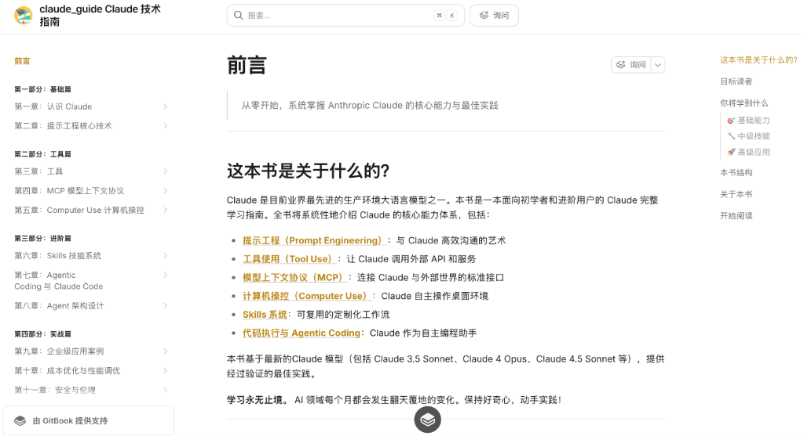

# Claude 技术指南

[](LICENSE)
[](https://github.com/yeasy/claude_guide/stargazers)
[](https://github.com/yeasy/claude_guide/issues)
[](https://github.com/yeasy/claude_guide/pulls)
[](https://github.com/yeasy/claude_guide/commits/master)

> **从零开始，系统掌握 Anthropic Claude 的核心能力与最佳实践**
> 
> **当前版本**: v1.2.0 (持续跟随 Claude 模型迭代)
> 
> *注：本书内容核心侧重于通用的 Prompt 原理与工程化实践，这些原则在 Claude 3/3.5/4/4.5 等各版本中均适用。针对特定模型的差异（如 Compute Use），会特别标注。*



---

## 📖 关于本书 | About

**Claude** 是目前业界最先进的生产环境大语言模型之一。本书是一本面向初学者和进阶用户的 Claude 完整学习指南，旨在帮助读者深入理解并掌握这一强大的 AI 工具。

全书将系统性地介绍 Claude 的核心能力体系，包括：

- **[提示工程（Prompt Engineering）](02_prompt/README.md)**：与 Claude 高效沟通的艺术
- **[工具使用（Tool Use）](03_tools/README.md)**：让 Claude 调用外部 API 和服务
- **[模型上下文协议（MCP）](04_mcp/README.md)**：连接 Claude 与外部世界的标准接口
- **[计算机操控（Computer Use）](05_computer_use/README.md)**：Claude 自主操作桌面环境
- **[Skills 系统](06_skills/README.md)**：可复用的定制化工作流
- **[代码执行与 Agentic Coding](07_coding/README.md)**：Claude 作为自主编程助手

本书基于最新的 **Claude 3.5 / 4.5 Sonnet**、**Claude 4.5 Opus** 及 **Claude 3.5 Haiku** 模型，提供经过验证的最佳实践。

---

## 👥 目标读者 | Target Audience

| 读者类型 | 你将获得什么 |
|---------|-------------|
| **AI 应用开发者** | 掌握 Claude API 的高级用法，构建生产级 AI 应用 |
| **产品经理 / 业务人员** | 理解 Claude 能力边界，规划 AI 产品路线图 |
| **自动化工程师** | 利用 Claude 构建端到端工作流自动化 |
| **AI 研究爱好者** | 深入理解大语言模型的能力演进与设计原理 |
| **Claude 用户** | 提升日常使用效率，解锁高级功能 |

**前置知识要求**：
* 基础计算机操作经验
* 对大语言模型有初步了解（非必需）
* 能够访问 Claude（[claude.ai](https://claude.ai) 或 [API](https://claude.com/platform/api)）

---

## 🚀 快速开始 | Getting Started

### 在线阅读

👉 **[在线阅读 (GitBook)](https://yeasy.gitbook.io/claude_guide/)**

### 本地阅读

本书使用 [HonKit](https://github.com/honkit/honkit) 构建。

```bash
# 1. 克隆仓库
git clone https://github.com/yeasy/claude_guide.git
cd claude_guide

# 2. 安装依赖
npm install

# 3. 启动本地服务器
npx honkit serve
```

启动后，访问 `http://localhost:4000` 即可阅读。

---

## 📚 内容大纲 | Contents

### 🎯 基础能力
- [ ] 理解 Claude 的能力矩阵与模型选择策略
- [ ] 编写高质量的系统提示词（System Prompt）
- [ ] 使用 XML 标签结构化复杂指令
- [ ] 应用少样本学习（Few-shot Learning）和思维链（Chain of Thought）

### 🔧 中级技能
- [ ] 定义并调用自定义工具（Tool Use）
- [ ] 实现多轮对话与上下文管理
- [ ] 使用 Files API 处理文档
- [ ] 配置 MCP 服务器连接外部数据源

### 🚀 高级应用
- [ ] 构建具备 Computer Use 能力的 AI Agent
- [ ] 设计可复用的 Skills 工作流
- [ ] 使用 Claude Code SDK 实现 Agentic Coding
- [ ] 优化 Token 使用与成本控制
- [ ] 部署生产级 Claude 应用架构

### 目录结构
```
第一部分：基础篇
├── Claude 概览与模型选择
└── 提示工程核心技术

第二部分：工具篇
├── Tool Use 工具调用
├── MCP 模型上下文协议
└── Computer Use 计算机操控

第三部分：进阶篇
├── Skills 技能系统
├── Agentic Coding 与 Claude Code
└── Agent 架构设计

第四部分：实战篇
├── 企业级应用案例
├── 成本优化与性能调优
└── 安全与伦理考量
```

> [点击查看详细目录](SUMMARY.md)

---

## 🤝 贡献 | Contributing

欢迎任何形式的贡献！无论是纠正错别字、补充新内容，还是分享你的实践经验。

1. Fork 本仓库
2. 创建你的特性分支 (`git checkout -b feature/AmazingFeature`)
3. 提交你的修改 (`git commit -m 'Add some AmazingFeature'`)
4. 推送到分支 (`git push origin feature/AmazingFeature`)
5. 开启一个 Pull Request

---

## 📜 协议 | License

本书内容遵循 [Create Commons Attribution-NonCommercial-ShareAlike 4.0 International](https://creativecommons.org/licenses/by-nc-sa/4.0/) 协议。

---

## 📈 Star History

[](https://star-history.com/#yeasy/claude_guide&Date)

