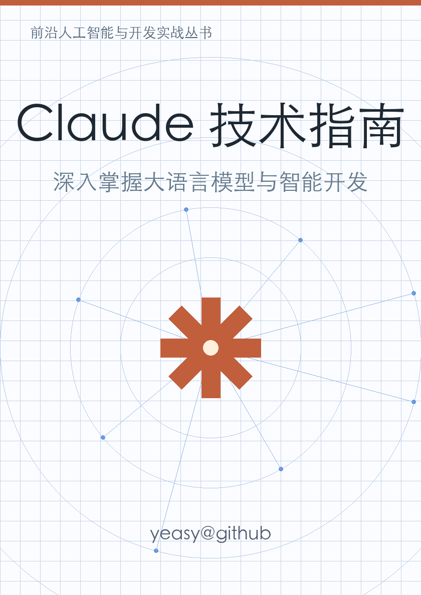
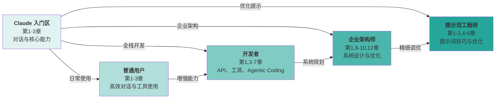

<div align="center">

# Claude 技术指南

[](https://creativecommons.org/licenses/by-nc-sa/4.0/)
[](https://github.com/yeasy/claude_guide)
[](https://yeasy.gitbook.io/claude_guide)
[](https://github.com/yeasy/claude_guide/releases/latest/download/claude_guide.pdf)

> **从零开始，系统掌握 Anthropic Claude 的核心能力与最佳实践**



</div>

---

## 关于本书

**Claude** 是目前业界最先进的生产环境大语言模型之一。本书是一本面向初学者和进阶用户的 Claude 完整学习指南，旨在帮助读者深入理解并掌握这一强大的 AI 工具。

> *注：本书内容核心侧重于通用的 Prompt 原理与工程化实践，这些原则在 Claude 3/4/4.5/4.6 等各版本中均适用。针对特定模型的差异（如 Computer Use），会特别标注。*

全书将系统性地介绍 Claude 的核心能力体系，包括：

- **[提示工程（Prompt Engineering）](02_prompt/README.md)**：与 Claude 高效沟通的艺术
- **[工具使用（Tool Use）](03_tools/README.md)**：让 Claude 调用外部 API 和服务
- **[模型上下文协议（MCP）](04_mcp/README.md)**：连接 Claude 与外部世界的标准接口
- **[计算机操控（Computer Use）](05_computer_use/README.md)**：Claude 自主操作桌面环境
- **[Skills 系统](06_skills/README.md)**：可复用的定制化工作流
- **[代码执行与 Agentic Coding](07_coding/README.md)**：Claude 作为自主编程助手

本书基于最新的 **Claude Sonnet 4.6**、**Claude Opus 4.6** 及 **Claude Haiku 4.5** 模型，提供经过验证的最佳实践。

---

## 目标读者

| 读者类型 | 你将获得什么 |
|---------|-------------|
| **AI 应用开发者** | 掌握 Claude API 的高级用法，构建生产级 AI 应用 |
| **产品经理 / 业务人员** | 理解 Claude 能力边界，规划 AI 产品路线图 |
| **自动化工程师** | 利用 Claude 构建端到端工作流自动化 |
| **AI 研究爱好者** | 深入理解大语言模型的能力演进与设计原理 |
| **Claude 用户** | 提升日常使用效率，解锁高级功能 |

**前置知识要求**：基础计算机操作经验；对大语言模型有初步了解（非必需）；能够访问 Claude（[claude.ai](https://claude.ai) 或 [API](https://claude.com/platform/api)）。

---

## 内容大纲

```text
第一部分：基础篇
├── Claude 概览与模型选择
└── 提示工程核心技术

第二部分：工具篇
├── Tool Use 工具调用
├── MCP 模型上下文协议
└── Computer Use 计算机操控

第三部分：进阶篇
├── Skills 技能系统
├── Agentic Coding 与 Claude Code
└── Agent 架构设计

第四部分：实战篇
├── 企业级应用案例
├── 成本优化与性能调优
└── 安全与伦理考量
```

> [点击从第一章开始阅读](01_intro/README.md)

---

## 阅读方式

**在线阅读**：[GitBook 在线版](https://yeasy.gitbook.io/claude_guide/)

**本地阅读**（先安装 [mdPress](https://github.com/yeasy/mdpress)）：

```bash
brew tap yeasy/tap && brew install mdpress
npm run serve
```

启动本地服务器后，访问 [本地阅读地址](http://localhost:4000)

---

## 五分钟快速上手

5 分钟掌握 Claude 的核心能力，只需这 3 个步骤：

1. **开始 Claude 对话（ch1）**：访问 [claude.ai](https://claude.ai) 或 API，与 Claude 进行第一轮对话，体验其推理与表达能力（2分钟）
2. **使用工具和 MCP（ch3）**：学会为 Claude 赋能，让它能调用 API、访问文件、连接外部服务（2分钟）
3. **体验 Agentic Coding（ch7）**：看 Claude 如何自主编写代码、调试问题，实现端到端的编程任务（1分钟）

完成这 3 步，你将掌握从 Claude 基础到高级应用的完整流程！

## 学习路线图


```mermaid
graph LR
    A["<b>Claude 入门区</b><br/>第1-3章<br/>对话与核心能力"] -->|日常使用| B["<b>普通用户</b><br/>第1-3章<br/>高效对话与工具使用"]
    A -->|全栈开发| C["<b>开发者</b><br/>第1,3-7章<br/>API、工具、Agentic Coding"]
    A -->|企业架构| D["<b>企业架构师</b><br/>第1,8-10,12章<br/>系统设计与优化"]
    A -->|优化提示| E["<b>提示词工程师</b><br/>第1-2,4-6章<br/>提示词技巧与优化"]
    B -->|增强能力| C
    C -->|系统规划| D
    D -->|精细调优| E

    style A fill:#e0f2f1
    style B fill:#b2dfdb
    style C fill:#80cbc4
    style D fill:#4db6ac
    style E fill:#26a69a
```

### 学习角色对比

| 角色 | 推荐章节 | 学习重点 | 预期成果 |
|------|---------|---------|---------|
| **普通用户** | 第1-3章 | Claude 核心能力、对话技巧、日常工具使用 | 高效使用 Claude 完成日常任务 |
| **开发者** | 第1→3-7章 | API 集成、Tool Use、MCP、Agentic Coding | 构建 Claude 驱动的完整应用 |
| **企业架构师** | 第1→8-10→12章 | 系统设计、成本优化、安全部署、最佳实践 | 规划企业级 Claude 应用方案 |
| **提示词工程师** | 第1-2→4-6章 | 提示词结构、高级技巧、多模态设计、优化方法 | 设计高质量的提示词系统 |

---

## 推荐阅读

本书是 AI 技术丛书的一部分。以下书籍与本书形成互补：

| 书名 | 与本书的关系 |
|------|------------|
| [《零基础学 AI》](https://github.com/yeasy/ai_beginner_guide) | AI 零基础入门，适合作为本书的前置阅读 |
| [《大模型提示词工程指南》](https://github.com/yeasy/prompt_engineering_guide) | 深入提示词工程的通用原理与最佳实践 |
| [《大模型上下文工程权威指南》](https://github.com/yeasy/context_engineering_guide) | 系统掌握上下文工程，从提示词到生产级 AI 系统 |
| [《智能体 AI 权威指南》](https://github.com/yeasy/agentic_ai_guide) | 全面掌握智能体架构、多智能体协作与 AgentOps |
| [《大模型安全权威指南》](https://github.com/yeasy/ai_security_guide) | LLM 安全攻防与治理 |
| [《OpenClaw 从入门到精通》](https://github.com/yeasy/openclaw_guide) | 开源自驱型智能体框架的使用与原理 |
| [《大模型原理与架构》](https://github.com/yeasy/llm_internals) | 深入理解大语言模型底层逻辑与架构 |

---

## 贡献与反馈

欢迎提交 [Issue](https://github.com/yeasy/claude_guide/issues) 或 [PR](https://github.com/yeasy/claude_guide/pulls)，尤其欢迎：错别字修正、失效链接修复、实践案例补充。

## 许可证

本书采用 [CC BY-NC-SA 4.0](https://creativecommons.org/licenses/by-nc-sa/4.0/) 授权。
